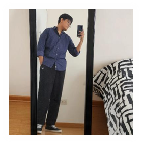

# Capítulo I: Introducción y Perfil de la Solución

## 1.1. Startup Profile

Nexa es una startup de base tecnológica enfocada en el desarrollo de soluciones digitales para optimizar procesos comerciales y operativos en la distribución B2B de productos refrigerados y congelados en el Perú.  
Su origen se vincula con la oportunidad identificada en el apartado anterior: la existencia de brechas persistentes de digitalización en empresas importadoras y distribuidoras del sector, donde la coordinación de ventas, disponibilidad, pedidos y despachos todavía presenta niveles importantes de informalidad y fragmentación.  

Frente a ese contexto, Nexa se concibe como una propuesta especializada orientada a cubrir un tramo crítico del negocio que suele quedar desatendido por soluciones generalistas: la articulación entre la intención de compra del cliente comercial y la ejecución operativa del pedido por parte de la empresa distribuidora.  En lugar de centrarse únicamente en transporte, monitoreo térmico o digitalización comercial aislada, la startup busca integrar en una sola plataforma web la consulta de catálogo, la gestión de pedidos B2B, el control básico de inventario y el seguimiento operativo del despacho, manteniendo como eje la necesidad de mayor orden, trazabilidad y consistencia en operaciones vinculadas con cadena de frío.  

El modelo de negocio propuesto se basa en **Software as a Service (SaaS)**, ya que esta modalidad permite ofrecer una solución accesible, escalable y de adopción progresiva para pymes distribuidoras que no cuentan con sistemas propios robustos ni con capacidad para desarrollar software interno.  
Bajo este enfoque, Nexa no pretende reemplazar de inmediato todas las herramientas del ecosistema logístico ni prometer una automatización total del negocio, sino posicionarse como la capa principal de organización comercial y operativa del proceso de pedidos, capaz de ordenar el flujo central de información mientras la empresa avanza en su madurez digital.  

En términos estratégicos, la startup compite por especialización más que por amplitud funcional. Su diferenciación radica en abordar de manera concreta un dominio donde convergen exigencias comerciales, operativas y de control propias de productos refrigerados y congelados.  
Por ello, la primera apuesta se concentra en un **MVP web**que permita estructurar el flujo principal del sistema —catálogo, pedido, disponibilidad y seguimiento— y que, sobre una base validada, pueda evolucionar en fases posteriores hacia componentes móviles, integraciones con soluciones logísticas complementarias y funcionalidades de trazabilidad térmica apoyadas en tecnologías IoT.  

Síntesis de posicionamiento. Como se desprende de la problemática previamente desarrollada, Nexa no se presenta como una plataforma horizontal para cualquier tipo de abastecimiento, sino como una solución SaaS B2B especializada en ordenar el flujo de pedidos y la coordinación operativa en empresas que distribuyen productos refrigerados y congelados.

## 1.1.1. Descripción del startup

Nexa está orientada al desarrollo de soluciones digitales para la gestión comercial y operativa de empresas importadoras y distribuidoras de productos refrigerados y congelados en el Perú. En coherencia con lo anteriormente expuesto, la propuesta se enfoca en ordenar la interacción principal entre la empresa distribuidora y sus clientes comerciales sin sobredimensionar el alcance del producto en su etapa inicial.

La lógica de construcción del producto responde a un criterio de viabilidad. En lugar de intentar abarcar desde el inicio todo el ecosistema logístico, la propuesta se centra primero en resolver el flujo más crítico del negocio mediante una experiencia web clara y funcional. Por ello, el MVP prioriza cuatro capacidades principales: consulta de catálogo especializado, registro de pedidos B2B, control básico de inventario y seguimiento operativo del estado del pedido. Esta delimitación permite validar la propuesta sobre el núcleo del proceso comercial-operativo, sin depender desde el inicio de infraestructura adicional compleja.

A partir de esa base, la startup proyecta una evolución futura coherente con las necesidades del dominio. En una fase posterior, el producto podrá ampliarse hacia funcionalidades de mayor profundidad operativa, como aplicaciones móviles para trabajo en campo, integraciones con herramientas del ecosistema logístico e incorporación progresiva de componentes de trazabilidad térmica apoyados en IoT. De este modo, Nexa mantiene una identidad clara: no busca abarcar todo el universo logístico desde el primer momento, sino construir una plataforma especializada cuya madurez crezca de forma progresiva y alineada con las necesidades reales del sector.

---**Tabla 3**

*Misión, Visión y valores del equipo*<table border="1" cellspacing="0" cellpadding="5" align="center">
  <tr>
    <th>Misión</th>
    <th>Visión</th>
    <th>Valores</th>
  </tr>
  <tr>
    <td>
      Digitalizar y ordenar el ciclo de pedidos B2B de empresas importadoras y distribuidoras de productos refrigerados, mediante una plataforma web que mejore la visibilidad operativa, reduzca errores y facilite la gestión de catálogo, pedidos, inventario básico y seguimiento del despacho.
    </td>
    <td>
      Convertirse en una solución tecnológica especializada de referencia para la gestión comercial y operativa de la cadena de frío B2B en el Perú y, a futuro, en la región, evolucionando hacia mayores niveles de trazabilidad, movilidad e integración con tecnologías IoT.
    </td>
    <td>
      Especialización, claridad operativa, innovación y colaboración como principios que orientan el diseño del producto, la relación con clientes y la forma de trabajo de la startup.
    </td>
  </tr>
</table>*Nota.*La tabla resume los pilares estratégicos que orientan la identidad, el propósito y la cultura de trabajo de la startup Nexa.*Elaboración propia.*## 1.1.2. Perfiles de integrantes del equipo

Para la correcta ejecución de este proyecto, se requiere un equipo de trabajo con perfiles complementarios que posean habilidades en análisis de sistemas, modelado de datos, programación y gestión de proyectos. A continuación, se presenta un formato estándar para la descripción de los miembros del equipo, el cual debe ser completado por cada integrante:

**Tabla 4**

*Perfiles de integrantes del equipo*<table border="1" cellspacing="0" cellpadding="5" align="center">
  <tr>
    <th>Código</th>
    <th>Nombre</th>
    <th>Rol</th>
    <th>Descripción</th>
  </tr>
  <tr>
    <td>U202323040</td>
    <td>Yucra Sandoval, Diego Sebastian</td>
    <td>Team Leader</td>
    <td>
      

      Soy Diego, estudiante de Ingeniería de Software en quinto ciclo con pasión por la organización y liderazgo de proyectos. He desarrollado la capacidad de guiar iniciativas desde la planificación hasta la verificación final, asegurando calidad en cada detalle. Me enfoco en la responsabilidad y atención al detalle, buscando aplicar mis conocimientos y ganar experiencia práctica. Fuera de lo académico, disfruto del deporte, la música, las series y compartir con amigos.
      

    </td>
  </tr>
  <tr>
    <td>U202411937</td>
    <td>Marín Cueva, César Fernando</td>
    <td>Team Member</td>
    <td>
      

      Hola, soy César, estudiante de cuarto ciclo de Ingeniería de Software. He aprendido mucho sobre trabajo en equipo y me preocupo por mis compañeros, pues si funcionamos como grupo, logramos mejores resultados. Me gusta ayudar en todo lo necesario y disfruto de actividades con familia y amigos. Amo escuchar música y ver películas.
      

    </td>
  </tr>
  <tr>
    <td>U20241A054</td>
    <td>Verde Bueno, Joaquín Francisco</td>
    <td>Team Member</td>
    <td>
      

      Estudiante de cuarto ciclo de Ingeniería de Software, apasionado por la tecnología y el software. Responsable y perfeccionista, siempre busca la máxima calidad en sus proyectos. En su tiempo libre disfruta de videojuegos, música y compartir con amigos.
      

    </td>
  </tr>
  <tr>
    <td>U202416289</td>
    <td>Torrejón De Los Santos, Gino Rodrigo</td>
    <td>Team Member</td>
    <td>
      

      Soy Gino, estudiante de quinto ciclo de Ingeniería de Software en la UPC. Tengo conocimientos en programación orientada a objetos, estructuras de datos, análisis y diseño de sistemas, además de metodologías de gestión de proyectos. He trabajado en proyectos académicos y cuento con habilidades de trabajo en equipo, comunicación y resolución de problemas.
      

    </td>
  </tr>
  <tr>
    <td>U202413142</td>
    <td>Rojas Mancilla, Gerard Gianpier</td>
    <td>Team Member</td>
    <td>
      

      Hola, soy Gerard, estudiante de cuarto ciclo de Ingeniería de Software. Me considero responsable, puntual y con facilidad para el trabajo en equipo. Tengo buenas habilidades de comunicación, capacidades de liderazgo y una mentalidad orientada al negocio. Siempre estoy dispuesto a aprender y asumir nuevos desafíos.
      

    </td>
  </tr>
</table>*Nota.*Se presentan los perfiles de los miembros del equipo, destacando sus habilidades y el rol que desempeñan dentro del proyecto para contextualizar las contribuciones individuales.*Elaboración propia.*
