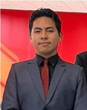

# Capítulo I: Introducción y Perfil de la Solución

## 1.1. Startup Profile

Nexa es una startup de base tecnológica enfocada en el desarrollo de soluciones digitales para optimizar procesos comerciales y operativos en la distribución B2B de productos refrigerados y congelados en el Perú.  
Su origen se vincula con la oportunidad identificada en la sección previa: la existencia de brechas persistentes de digitalización en empresas importadoras y distribuidoras del sector, donde la coordinación de ventas, disponibilidad, pedidos y despachos todavía presenta niveles importantes de informalidad y fragmentación.  

Frente a ese contexto, Nexa se concibe como una propuesta especializada orientada a cubrir un tramo crítico del negocio que suele quedar desatendido por soluciones generalistas: la articulación entre la intención de compra del cliente comercial y la ejecución operativa del pedido por parte de la empresa distribuidora.  En lugar de centrarse únicamente en transporte, monitoreo térmico o digitalización comercial aislada, la startup busca integrar en una sola plataforma web la consulta de catálogo, la gestión de pedidos B2B, el control básico de inventario y el seguimiento operativo del despacho, manteniendo como eje la necesidad de mayor orden, trazabilidad y consistencia en operaciones vinculadas con cadena de frío.  

El modelo de negocio propuesto se basa en **Software as a Service (SaaS)**, ya que esta modalidad permite ofrecer una solución accesible, escalable y de adopción progresiva para pymes distribuidoras que no cuentan con sistemas propios robustos ni con capacidad para desarrollar software interno.  
Bajo este enfoque, Nexa no pretende reemplazar de inmediato todas las herramientas del ecosistema logístico ni prometer una automatización total del negocio, sino posicionarse como la capa principal de organización comercial y operativa del proceso de pedidos, capaz de ordenar el flujo central de información mientras la empresa avanza en su madurez digital.  

En términos estratégicos, la startup compite por especialización más que por amplitud funcional. Su diferenciación radica en abordar de manera concreta un dominio donde convergen exigencias comerciales, operativas y de control propias de productos refrigerados y congelados.  
Por ello, la primera apuesta se concentra en un **MVP web** que permita estructurar el flujo principal del sistema —catálogo, pedido, disponibilidad y seguimiento— y que, sobre una base validada, pueda evolucionar en fases posteriores hacia componentes móviles, integraciones con soluciones logísticas complementarias y funcionalidades de trazabilidad térmica apoyadas en tecnologías IoT.  

Síntesis de posicionamiento. Como se desprende de la problemática previamente desarrollada, Nexa no se presenta como una plataforma horizontal para cualquier tipo de abastecimiento, sino como una solución SaaS B2B especializada en ordenar el flujo de pedidos y la coordinación operativa en empresas que distribuyen productos refrigerados y congelados.

## 1.1.1. Descripción del startup

Nexa está orientada al desarrollo de soluciones digitales para la gestión comercial y operativa de empresas importadoras y distribuidoras de productos refrigerados y congelados en el Perú. En coherencia con lo anteriormente expuesto, la propuesta se enfoca en ordenar la interacción principal entre la empresa distribuidora y sus clientes comerciales sin sobredimensionar el alcance del producto en su etapa inicial.

La lógica de construcción del producto responde a un criterio de viabilidad. En lugar de intentar abarcar desde el inicio todo el ecosistema logístico, la propuesta se centra primero en resolver el flujo más crítico del negocio mediante una experiencia web clara y funcional. Por ello, el MVP prioriza cuatro capacidades principales: consulta de catálogo especializado, registro de pedidos B2B, control básico de inventario y seguimiento operativo del estado del pedido. Esta delimitación permite validar la propuesta sobre el núcleo del proceso comercial-operativo, sin depender desde el inicio de infraestructura adicional compleja.

A partir de esa base, la startup proyecta una evolución futura coherente con las necesidades del dominio. En una fase posterior, el producto podrá ampliarse hacia funcionalidades de mayor profundidad operativa, como aplicaciones móviles para trabajo en campo, integraciones con herramientas del ecosistema logístico e incorporación progresiva de componentes de trazabilidad térmica apoyados en IoT. De este modo, Nexa mantiene una identidad clara: no busca abarcar todo el universo logístico desde el primer momento, sino construir una plataforma especializada cuya madurez crezca de forma progresiva y alineada con las necesidades reales del sector.

---

*Misión, Visión y valores del equipo*

<table border="1" cellspacing="0" cellpadding="5" align="center">
  <tr>
    <th>Misión</th>
    <th>Visión</th>
    <th>Valores</th>
  </tr>
  <tr>
    <td>
      Digitalizar y ordenar el ciclo de pedidos B2B de empresas importadoras y distribuidoras de productos refrigerados, mediante una plataforma web que mejore la visibilidad operativa, reduzca errores y facilite la gestión de catálogo, pedidos, inventario básico y seguimiento del despacho.
    </td>
    <td>
      Convertirse en una solución tecnológica especializada de referencia para la gestión comercial y operativa de la cadena de frío B2B en el Perú y, a futuro, en la región, evolucionando hacia mayores niveles de trazabilidad, movilidad e integración con tecnologías IoT.
    </td>
    <td>
      Especialización, claridad operativa, innovación y colaboración como principios que orientan el diseño del producto, la relación con clientes y la forma de trabajo de la startup.
    </td>
  </tr>
</table>

La tabla resume los pilares estratégicos que orientan la identidad, el propósito y la cultura de trabajo de la startup Nexa. Elaboración propia.

## 1.1.2. Perfiles de integrantes del equipo

Para la correcta ejecución de este proyecto, se requiere un equipo de trabajo con perfiles complementarios que posean habilidades en análisis de sistemas, modelado de datos, programación, documentación técnica, diseño de experiencia de usuario y gestión del trabajo colaborativo. En esta línea, cada integrante aporta fortalezas diferenciadas que permiten cubrir la investigación, la estructuración del informe, el diseño de la solución, la implementación técnica y la coordinación general del proyecto.

*Perfiles de integrantes del equipo*

<table border="1" cellspacing="0" cellpadding="5" align="center">
  <tr>
    <th>Código</th>
    <th>Nombre</th>
    <th>Rol</th>
    <th>Descripción</th>
  </tr>
  <tr>
    <td> U202411937</td>
    <td>Marín Cueva, César Fernando</td>
    <td>Team Member</td>
    <td>
      

      César es estudiante de Ingeniería de Software con interés en el diseño de interfaces, la organización visual de contenido y la documentación estructurada de productos digitales. Dentro del equipo, aporta criterio para transformar información compleja en entregables claros, legibles y consistentes, lo que resulta especialmente útil en la redacción del informe y en la construcción de piezas de soporte orientadas a comunicar valor de negocio. Además, muestra disposición para colaborar transversalmente con otras áreas del proyecto, facilitando la integración entre narrativa, diseño y formalidad académica.
        
      <strong>Fortalezas técnicas y de aporte al proyecto:</strong> 
      • sensibilidad por el diseño visual y la presentación ordenada de información; 
      • apoyo en la redacción y depuración de contenido documental; 
      • capacidad para colaborar en tareas de estructuración de secciones y consistencia editorial; 
      • disposición al trabajo en equipo y a la revisión cruzada de entregables.
      

    </td>
  </tr>
  <tr>
    <td> U202413142</td>
    <td>Rojas Mancilla, Gerard Gianpier</td>
    <td>Team Member</td>
    <td>
      

      Gerard es estudiante de Ingeniería de Software con interés en el análisis técnico, la comunicación de ideas y la comprensión del negocio detrás de una solución digital. Su perfil combina responsabilidad operativa con una orientación clara hacia la arquitectura, la estructuración lógica de componentes y la articulación entre decisiones técnicas y objetivos del producto. Dentro del equipo, puede contribuir tanto en la definición de modelos y diagramas como en la sustentación argumentada de decisiones de diseño e implementación.
        
      <strong>Fortalezas técnicas y de aporte al proyecto:</strong> 
      • pensamiento analítico para modelar procesos y relaciones entre componentes; 
      • facilidad para comunicar decisiones técnicas con claridad; 
      • criterio para alinear la solución con el valor de negocio esperado; 
      • capacidad de coordinación y liderazgo en tareas de arquitectura y documentación.
      

    </td>
  </tr>
  <tr>
    <td> U202416289</td>
    <td>Torrejón De Los Santos, Gino Rodrigo</td>
    <td>Team Member</td>
    <td>
      

      Gino es estudiante de quinto ciclo de Ingeniería de Software y tiene una inclinación marcada por la programación, el trabajo con entornos de desarrollo y la construcción técnica de soluciones. Se siente cómodo implementando en herramientas como Visual Studio Code, organizando lógica de código y aterrizando modelos conceptuales en estructuras más cercanas a la ejecución. Su perfil resulta valioso para conectar análisis, diseño e implementación, especialmente en tareas relacionadas con programación orientada a objetos, estructuras de datos y análisis de sistemas.
        
      <strong>Fortalezas técnicas y de aporte al proyecto:</strong> 
      • afinidad por la programación y el desarrollo en entornos como Visual Studio Code; 
      • conocimientos de programación orientada a objetos, estructuras de datos y análisis de sistemas; 
      • capacidad para traducir requerimientos en lógica técnica y componentes implementables; 
      • aporte en tareas de resolución de problemas y trabajo colaborativo durante la construcción del producto.
      

    </td>
  </tr>
  <tr>
    <td> U20241A054</td>
    <td>Verde Bueno, Joaquín Francisco</td>
    <td>Team Member</td>
    <td>
      

      Joaquín es estudiante de Ingeniería de Software con especial interés por la calidad del producto, el detalle en la ejecución y la mejora continua de entregables. Su perfil combina responsabilidad con una orientación fuerte a revisar, pulir y elevar el nivel de lo que el equipo produce, lo cual resulta útil tanto en artefactos de diseño como en validación de consistencia entre secciones del informe y decisiones de solución. Su manera de trabajar favorece la revisión cuidadosa y la búsqueda de precisión en los resultados.
        
      <strong>Fortalezas técnicas y de aporte al proyecto:</strong> 
      • atención al detalle en revisión de contenido y consistencia de entregables; 
      • enfoque en calidad y mejora progresiva del producto documental y técnico; 
      • disposición para apoyar tareas de validación, ajuste y refinamiento; 
      • compromiso con estándares altos de presentación y coherencia interna.
      

    </td>
  </tr>
  <tr>
    <td> U202323040</td>
    <td>Yucra Sandoval, Diego Sebastian</td>
    <td>Team Leader</td>
    <td>
      

      Diego es estudiante de Ingeniería de Software en quinto ciclo y asume un perfil integral orientado a la organización, la coordinación del trabajo y la supervisión transversal del proyecto. Le interesa mantener ordenados los procesos, distribuir responsabilidades con claridad y asegurar que el avance técnico, documental y de validación conserve coherencia entre sí. Su principal aporte al equipo es funcionar como un perfil todo terreno: puede intervenir en planificación, revisión, integración de artefactos y seguimiento del cumplimiento general, cuidando que el proyecto no pierda estructura ni trazabilidad.
        
      <strong>Fortalezas técnicas y de aporte al proyecto:</strong> 
      • organización y seguimiento global del proyecto desde una lógica de control y orden; 
      • capacidad para articular trabajo técnico, documental y de coordinación en una misma línea de avance; 
      • perfil versátil para apoyar distintas áreas cuando el equipo lo requiere; 
      • liderazgo operativo enfocado en cumplimiento, consistencia y cierre de entregables.
      

    </td>
  </tr>
</table>

Se presentan los perfiles de los miembros del equipo, destacando sus habilidades y el rol que desempeñan dentro del proyecto para contextualizar las contribuciones individuales. Elaboración propia.
