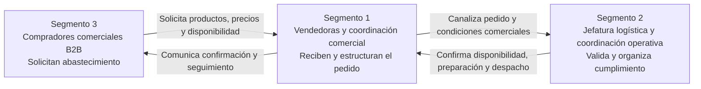
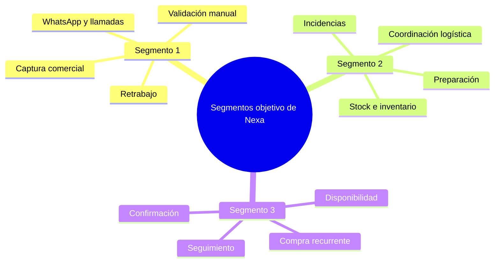
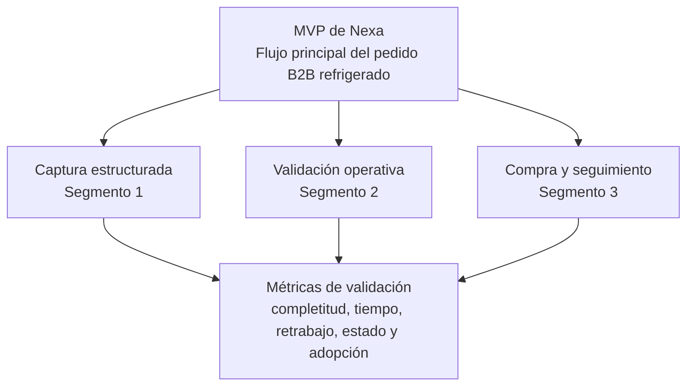

### **1.3. Segmentos Objetivos**

La segmentación de Nexa se define a partir del flujo real del pedido B2B de productos refrigerados. El problema no se concentra en un único usuario, sino en la interacción entre tres actores que participan en la solicitud, captura, validación, preparación y seguimiento del pedido.

En esta sección, los segmentos objetivo funcionan como la base de investigación y diseño del producto. Por ello, no se presentan como módulos del sistema, sino como actores del dominio que concentran fricciones distintas y complementarias.

---

### ***1.3.1. Resumen de Segmentos Objetivo***

Los segmentos se organizan según su posición en el flujo comercial-operativo. El Segmento 1 representa la captura y coordinación comercial del pedido; el Segmento 2 representa la validación y organización logística interna; y el Segmento 3 representa la demanda comercial recurrente de compradores mayoristas y minoristas.

*Tabla. Resumen comparativo de segmentos objetivo de Nexa*
| Segmento objetivo | Actor principal | Rol en el flujo del pedido | Fricción dominante | Valor esperado de Nexa |
|---|---|---|---|---|
| Segmento 1: Vendedoras y coordinación comercial | Vendedoras, asesoras comerciales, mercaderistas o personal que trata directamente con compradores. | Reciben consultas, interpretan pedidos, validan información preliminar y canalizan la solicitud hacia operación. | Pedidos dispersos, doble digitación, validaciones manuales y baja visibilidad inmediata de stock o condiciones. | Captura estructurada, consulta rápida de disponibilidad y menor retrabajo entre ventas y operación. |
| Segmento 2: Jefatura logística y coordinación operativa | Jefas, responsables o coordinadoras de logística, almacén, inventario, despacho y operación interna. | Validan disponibilidad, organizan preparación, coordinan despacho y responden ante incidencias. | Información incompleta desde ventas, stock no siempre confiable, cambios de último minuto y trazabilidad fragmentada. | Control operativo integrado, visibilidad del estado del pedido y menor fricción entre ventas, almacén y despacho. |
| Segmento 3: Compradores comerciales B2B mayoristas y minoristas | Compradores, dueños o encargados de abastecimiento de bodegas, minimarkets, pequeños mayoristas y negocios HORECA. | Solicitan productos, comparan condiciones, esperan confirmación y necesitan continuidad de abastecimiento. | Incertidumbre sobre disponibilidad, precios, confirmación, cambios y tiempo de entrega. | Catálogo claro, pedido más autónomo, confirmación confiable y seguimiento comprensible. |

>*Nota*: La tabla sintetiza la segmentación oficial del proyecto y diferencia el rol, la fricción y el valor esperado de cada actor. Elaboración Propia.

*Figura. Flujo de interacción entre los segmentos objetivo*

>*Nota*: El gráfico representa la circulación de información entre compradores, vendedoras y coordinación logística durante el flujo principal del pedido. Elaboración Propia.

---

### ***1.3.2. Sustento demográfico y estadístico***

El dominio de Nexa se ubica en la distribución B2B de productos refrigerados y congelados, donde la coordinación entre ventas, logística y compradores comerciales todavía depende de canales informales, validaciones manuales y registros dispersos. Esta situación es especialmente crítica porque el pedido no solo contiene una intención de compra: también activa decisiones de disponibilidad, inventario, rotación, preparación, despacho y seguimiento.

El sustento estadístico permite justificar por qué los tres segmentos son relevantes para el proyecto. Según Lucky-Xplora (2022), el 83% de las bodegas del canal tradicional se encuentra en un nivel principiante de madurez digital, mientras que solo alrededor del 28% utiliza algún aplicativo para gestionar tareas del negocio. Este dato refuerza la importancia del Segmento 3, ya que el comprador comercial B2B necesita una experiencia simple, clara y cercana a sus hábitos actuales de compra.

Además, la problemática de cadena de frío exige control operativo. Bravo De la Cruz et al. (2025) reportan 64 incidentes de ruptura de cadena de frío en establecimientos de una microred de salud durante un año, lo que evidencia que la falta de control, trazabilidad y coordinación puede convertirse en un riesgo operativo recurrente. Este punto refuerza la importancia del Segmento 2, porque logística y coordinación operativa deben convertir la solicitud comercial en una operación viable, controlada y trazable.

En paralelo, la captura comercial sigue siendo un punto sensible del flujo. Cuando los pedidos llegan por WhatsApp, llamada, audio o listas informales, la vendedora o coordinadora comercial debe interpretar información incompleta y trasladarla hacia operación. Por ello, el Segmento 1 es crítico: si el pedido nace desordenado, el error se propaga hacia inventario, preparación, despacho y atención posterior.

*Tabla. Indicadores de contexto que sustentan la segmentación*

| Indicador de contexto | Dato o evidencia considerada | Segmento más relacionado | Implicancia para Nexa |
|---|---|---|---|
| Madurez digital del canal tradicional | 83% de bodegas en nivel principiante de madurez digital, según Lucky-Xplora (2022). | Segmento 3 | El portal para compradores debe ser simple, rápido y compatible con hábitos digitales básicos. |
| Uso de aplicativos en bodegas | Alrededor del 28% utiliza algún aplicativo para gestionar tareas del negocio, según Lucky-Xplora (2022). | Segmento 3 | La adopción no puede depender de una experiencia compleja o demasiado alejada del canal informal. |
| Riesgo operativo en cadena de frío | 64 incidentes de ruptura de cadena de frío reportados en microredes de salud, según Bravo De la Cruz et al. (2025). | Segmento 2 | La operación requiere trazabilidad, control de estados y coordinación más confiable entre pedido, inventario y despacho. |
| Dependencia de canales informales | Uso frecuente de WhatsApp, llamadas, audios y listas para coordinar pedidos B2B. | Segmento 1 | La captura debe estructurar la información desde el origen para reducir ambigüedad y retrabajo. |
| Necesidad de trazabilidad del pedido | El pedido pasa por solicitud, captura, validación, preparación, despacho y comunicación de estado. | Los tres segmentos | Nexa debe conectar a los actores sin convertir el flujo en una carga operativa adicional. |

>*Nota*: La tabla organiza evidencia estadística externa y observaciones del dominio para justificar la segmentación. Elaboración propia con base en Lucky-Xplora (2022) y Bravo De la Cruz et al. (2025).

*Figura. Lectura visual del sustento de segmentación*

>*Nota*: El gráfico resume los focos de fricción que justifican cada segmento dentro del dominio comercial-operativo de Nexa. Elaboración Propia.

---

### ***1.3.3. Análisis detallado por segmento***

El análisis de cada segmento se desarrolla en cuatro planos: demográfico y ocupacional, conductual, tecnológico y valor esperado. Esta estructura permite pasar de una descripción general del actor a implicancias concretas para diseño, validación y priorización del producto.

#### **Segmento 1: Vendedoras y coordinación comercial**

Este segmento está conformado por vendedoras, asesoras comerciales, mercaderistas y personal de coordinación comercial que mantiene contacto directo con compradores mayoristas y minoristas. Este segmento representa el primer punto de entrada del pedido dentro del flujo operativo de Nexa.

Su importancia radica en que una parte significativa de los errores posteriores puede originarse en esta etapa. Si el pedido se captura con datos incompletos, productos mal interpretados, cantidades ambiguas o condiciones comerciales no verificadas, el problema se traslada hacia logística, preparación, despacho y atención posterior.

##### Ficha rápida del segmento

- Actor principal: vendedoras, asesoras comerciales, mercaderistas y personal de coordinación comercial.
- Contexto dominante: atención rápida a compradores B2B mediante llamadas, WhatsApp, listas de productos, notas de voz o mensajes dispersos.
- Responsabilidad principal: recibir, interpretar, ordenar y canalizar pedidos hacia operación.
- Dolor principal: retrabajo por pedidos incompletos, validaciones manuales y falta de visibilidad inmediata de stock o condiciones.
- Valor esperado: capturar pedidos de forma más clara, reducir errores y responder al comprador con mayor seguridad.

##### Plano demográfico y ocupacional

El Segmento 1 suele ubicarse en roles comerciales u operativos de primera línea. Su trabajo exige comunicación constante, rapidez para responder y capacidad para coordinar con varias áreas internas. Puede tratar directamente con compradores recurrentes, clientes de alto volumen o negocios pequeños que esperan atención inmediata.

A nivel ocupacional, este segmento no necesariamente cuenta con poder de decisión estratégico sobre la empresa, pero sí influye directamente en la calidad del pedido. Su desempeño afecta el tiempo de respuesta, la satisfacción del cliente y la cantidad de errores que llegan a operación.

*Tabla. Caracterización ocupacional del Segmento 1*

| Variable | Caracterización esperada |
|---|---|
| Rango ocupacional | Personal comercial, ventas internas, mercaderistas, coordinadoras comerciales o asistentes de pedidos. |
| Relación con el cliente | Alta: mantiene contacto frecuente con compradores mayoristas y minoristas. |
| Nivel de decisión | Medio u operativo: puede registrar, canalizar y consultar, pero no siempre aprobar excepciones. |
| Presión del rol | Alta: debe responder rápido sin perder precisión. |
| Entorno de trabajo | Oficina, punto de venta, almacén administrativo o trabajo móvil mediante celular. |

>*Nota*: Caracteriza el rol ocupacional del Segmento 1 para ubicarlo dentro del proceso de captura y atención comercial. Elaboración Propia.

##### Plano conductual

El comportamiento del Segmento 1 está marcado por la necesidad de resolver pedidos con rapidez. En la práctica, esto suele implicar alternar entre conversaciones, hojas de cálculo, catálogos, consultas internas y validaciones con logística o almacén. Esta fragmentación genera dependencia de memoria, experiencia personal y coordinación informal.

Debe responder rápido al comprador, pero la información que necesita para responder correctamente no siempre está centralizada.

*Tabla. Comportamientos actuales del Segmento 1 y sus consecuencias*

| Comportamiento actual | Consecuencia |
|---|---|
| Recibe pedidos por WhatsApp, llamada, audio o listas escritas. | El pedido puede llegar incompleto, desordenado o difícil de interpretar. |
| Consulta stock o condiciones en más de una fuente. | Aumenta el tiempo de respuesta y el riesgo de información desactualizada. |
| Reenvía información a logística o almacén. | Aparece doble digitación o pérdida de detalle. |
| Aclara dudas con el comprador durante el proceso. | Se generan interrupciones y retrasos. |
| Depende de experiencia personal para interpretar pedidos recurrentes. | El proceso se vuelve poco escalable y vulnerable a errores humanos. |

>*Nota*: Resume las prácticas actuales del Segmento 1 y las consecuencias que justifican una captura más estructurada. Elaboración Propia.

##### Plano tecnológico

El Segmento 1 suele tener familiaridad práctica con herramientas digitales básicas, especialmente mensajería instantánea, llamadas, hojas de cálculo y sistemas internos simples. Sin embargo, esa familiaridad no significa que trabaje en un flujo integrado. El problema no es la ausencia total de tecnología, sino el uso de herramientas dispersas que no aseguran trazabilidad.

Para este segmento, Nexa debe sentirse más rápida que el proceso informal. Si el sistema añade pasos innecesarios, formularios extensos o validaciones lentas, la adopción puede verse afectada.

*Tabla. Implicancias tecnológicas para el Segmento 1*

| Aspecto tecnológico | Implicancia para Nexa |
|---|---|
| Uso frecuente de celular y WhatsApp. | La experiencia debe ser responsive y permitir acciones rápidas. |
| Alternancia entre varias fuentes de información. | El sistema debe centralizar cliente, catálogo, disponibilidad y pedido. |
| Baja tolerancia a flujos lentos. | La captura debe ser guiada, pero no rígida. |
| Necesidad de historial y trazabilidad. | Cada pedido debe conservar información clara para seguimiento posterior. |

>*Nota*: Relaciona el uso actual de herramientas digitales del Segmento 1 con decisiones de diseño para Nexa. Elaboración Propia.

##### Plano de valor esperado

El valor esperado para el Segmento 1 se concentra en reducir retrabajo y aumentar seguridad al responder. Nexa debe permitir que la vendedora o coordinadora comercial registre pedidos de manera estructurada, consulte disponibilidad, visualice condiciones relevantes y evite depender de conversaciones dispersas para reconstruir lo solicitado.

*Tabla. Dolores, respuesta esperada y métricas sugeridas para el Segmento 1*

| Dolor del segmento | Respuesta esperada de Nexa | Métrica de validación sugerida |
|---|---|---|
| El pedido llega incompleto o ambiguo. | Flujo de captura con productos, cantidades, cliente y condiciones registradas. | Porcentaje de pedidos registrados con información completa. |
| El stock no se confirma con rapidez. | Consulta de disponibilidad básica desde el flujo comercial. | Tiempo promedio para confirmar disponibilidad al comprador. |
| Hay doble digitación entre ventas y operación. | Pedido estructurado compartido con logística. | Número de pasos manuales entre captura y preparación. |
| Se repiten aclaraciones por WhatsApp o llamada. | Historial y detalle del pedido disponible para seguimiento. | Cantidad de aclaraciones por pedido antes de confirmación. |

>*Nota*: Conecta los principales dolores del Segmento 1 con respuestas funcionales y métricas futuras de validación. Elaboración Propia.

---

#### **Segmento 2: Jefatura logística y coordinación operativa**

El segmento 2 está conformado por jefas, responsables o coordinadoras de logística, almacén, inventario, despacho y operación interna. Este segmento se ubica por encima del flujo comercial directo y tiene una visión más amplia del cumplimiento del pedido. Su responsabilidad principal es convertir la solicitud comercial en una operación ejecutable.

Este segmento clave porque concentra la validación operativa. Aunque no siempre inicia la relación con el comprador, sí debe asegurar que el pedido pueda cumplirse con stock disponible, preparación adecuada, coordinación de despacho y control de incidencias.

##### Ficha rápida del segmento

- Actor principal: jefatura logística, responsable de almacén, coordinadora operativa, encargada de inventario o despacho.
- Contexto dominante: coordinación entre ventas, almacén, inventario, preparación, despacho y resolución de incidencias.
- Responsabilidad principal: validar disponibilidad, organizar preparación, priorizar pedidos, coordinar despacho y controlar cumplimiento.
- Dolor principal: información dispersa entre áreas, falta de trazabilidad, cambios de último minuto y presión por resolver errores originados antes.
- Valor esperado: mayor visibilidad operativa, mejor control del pedido y reducción de fricciones entre ventas, inventario y despacho.

##### Plano demográfico y ocupacional

El Segmento 2 representa perfiles con mayor responsabilidad interna que el Segmento 1. Suelen ser personas encargadas de coordinar equipos, revisar disponibilidad, controlar salidas, organizar prioridades y responder ante problemas operativos. Su rol exige criterio, experiencia y capacidad para decidir bajo presión.

A diferencia del Segmento 1, este segmento no solo necesita rapidez, sino control. Su interés principal no es vender más en el momento, sino asegurar que lo vendido pueda prepararse, despacharse y cumplirse sin generar pérdidas, reclamos o desorden interno.

*Tabla. Caracterización ocupacional del Segmento 2*

| Variable | Caracterización esperada |
|---|---|
| Rango ocupacional | Jefatura, coordinación o responsabilidad operativa en logística, almacén, inventario o despacho. |
| Relación con el cliente | Indirecta: normalmente recibe presión a través de ventas o atención comercial. |
| Nivel de decisión | Medio o alto operativo: puede priorizar pedidos, validar disponibilidad y coordinar recursos. |
| Presión del rol | Alta: debe resolver problemas que impactan cumplimiento, costos y satisfacción del cliente. |
| Entorno de trabajo | Almacén, oficina operativa, centro de distribución o coordinación híbrida entre áreas. |

>*Nota*: Caracteriza el rol ocupacional del Segmento 2 para ubicarlo dentro de la coordinación logística y operativa. Elaboración Propia.

##### Plano conductual

El Segmento 2 opera en un entorno donde la información debe transformarse en acción. Recibe pedidos ya capturados o comunicados por ventas, revisa si se pueden cumplir, organiza preparación, coordina despacho y gestiona incidencias. Cuando la información llega incompleta o tarde, logística termina absorbiendo el error.

Debe garantizar cumplimiento operativo, pero muchas veces recibe información comercial que no está suficientemente validada ni estructurada.

*Tabla. Comportamientos actuales del Segmento 2 y sus consecuencias*

| Comportamiento actual | Consecuencia |
|---|---|
| Revisa disponibilidad con base en registros internos, conteos o coordinación verbal. | Puede haber diferencias entre stock percibido y stock real. |
| Organiza preparación según urgencia, cliente o disponibilidad. | La priorización puede depender de criterio manual. |
| Coordina con ventas ante cambios o faltantes. | Se generan demoras y retrabajo antes de despacho. |
| Supervisa incidencias de preparación o entrega. | Debe resolver problemas que pudieron originarse en captura o validación. |
| Controla documentación, salidas o evidencias. | La trazabilidad puede quedar fragmentada si depende de papeles o mensajes. |

>*Nota*: Resume las prácticas actuales del Segmento 2 y las consecuencias que justifican mayor visibilidad operativa. Elaboración Propia.

##### Plano tecnológico

El Segmento 2 necesita herramientas que ofrezcan visibilidad y control. Puede usar hojas de cálculo, sistemas internos, registros de inventario, grupos de mensajería y documentación física o digital. Sin embargo, cuando estos recursos no están conectados, el seguimiento del pedido se vuelve manual.

Para este segmento, Nexa debe funcionar como una capa de coordinación operativa. No basta con mostrar pedidos: debe ayudar a entender qué está pendiente, qué se puede preparar, qué requiere validación y qué incidencias deben atenderse.

*Tabla. Implicancias tecnológicas para el Segmento 2*

| Aspecto tecnológico | Implicancia para Nexa |
|---|---|
| Necesidad de visibilidad sobre pedidos y stock. | Debe existir una vista operativa clara por estado, prioridad y disponibilidad. |
| Uso de registros internos o documentos separados. | El sistema debe reducir dependencia de archivos dispersos. |
| Coordinación con varias áreas. | Los estados del pedido deben ser compartidos y entendibles. |
| Control de incidencias. | Las incidencias deben registrarse para evitar pérdida de información. |

>*Nota*: Relaciona las necesidades tecnológicas del Segmento 2 con decisiones de diseño orientadas al control operativo. Elaboración Propia.

##### Plano de valor esperado

El valor esperado para el Segmento 2 se relaciona con control operativo. Nexa debe permitir que la jefatura logística vea pedidos pendientes, valide disponibilidad, organice preparación, identifique incidencias y mantenga trazabilidad entre lo solicitado, lo preparado y lo comunicado.

*Tabla. Dolores, respuesta esperada y métricas sugeridas para el Segmento 2*

| Dolor del segmento | Respuesta esperada de Nexa | Métrica de validación sugerida |
|---|---|---|
| La información comercial llega incompleta. | Pedido estructurado antes de entrar a preparación. | Porcentaje de pedidos que no requieren devolución a ventas. |
| El stock no está conectado con el pedido. | Consulta de disponibilidad e inventario básico. | Porcentaje de pedidos validados sin ajuste manual. |
| Hay cambios de último minuto. | Estados e incidencias visibles para ventas y operación. | Número de incidencias registradas por pedido. |
| La trazabilidad depende de mensajes o papeles. | Historial operativo del pedido. | Porcentaje de pedidos con estado actualizado. |

>*Nota*: Conecta los principales dolores del Segmento 2 con respuestas funcionales y métricas futuras de validación. Elaboración Propia.

---

#### **Segmento 3: Compradores comerciales B2B mayoristas y minoristas**

El Segmento 3 está conformado por compradores comerciales B2B mayoristas y minoristas, incluyendo bodegas, minimarkets, pequeños mayoristas, negocios HORECA y otros clientes recurrentes que compran productos refrigerados para sostener su operación comercial.

Este segmento representa el origen de la demanda. Su interés principal no es usar una plataforma por novedad tecnológica, sino abastecerse con menor incertidumbre. Para este actor, la utilidad de Nexa depende de que pueda consultar productos, entender disponibilidad, registrar pedidos y recibir confirmación o seguimiento sin perder la sensación de respaldo humano.

##### Ficha rápida del segmento

- Actor principal: compradores mayoristas, minoristas, bodegas, minimarkets, pequeños mayoristas y negocios HORECA.
- Contexto dominante: compra recurrente de productos refrigerados para mantener stock, ventas y continuidad operativa.
- Responsabilidad principal: solicitar productos, comparar condiciones, registrar pedidos y coordinar recepción.
- Dolor principal: incertidumbre sobre disponibilidad, precios, confirmación, cambios de último minuto y tiempo de entrega.
- Valor esperado: catálogo claro, pedido autónomo, confirmación confiable y seguimiento comprensible.

##### Plano demográfico y ocupacional

El Segmento 3 agrupa a personas que compran para sostener una actividad comercial. Pueden ser dueños de negocio, encargados de compras, administradores de local o responsables de reposición. Su toma de decisión suele estar asociada a continuidad de stock, margen, confianza en el proveedor y rapidez de atención.

A diferencia de un consumidor final, este comprador no adquiere productos para consumo personal, sino para mantener la operación de su propio negocio. Por ello, la falta de confirmación, los cambios inesperados o la demora en entrega pueden afectar sus ventas, su flujo de caja y su relación con clientes finales.

*Tabla. Caracterización ocupacional del Segmento 3*

| Variable | Caracterización esperada |
|---|---|
| Rango ocupacional | Dueños de negocio, compradores, encargados de tienda, administradores o responsables de reposición. |
| Relación con el proveedor | Alta: depende de proveedores recurrentes para mantener inventario. |
| Nivel de decisión | Medio o alto en su negocio: decide qué comprar, cuándo comprar y a quién comprar. |
| Presión del rol | Alta: debe evitar quiebres de stock y responder a demanda de sus clientes. |
| Entorno de trabajo | Bodega, minimarket, local comercial, pequeño almacén, restaurante u operación HORECA. |

>*Nota*: Caracteriza el rol ocupacional del Segmento 3 para ubicarlo dentro de la demanda recurrente B2B. Elaboración Propia.

##### Plano conductual

El Segmento 3 compra bajo presión de continuidad. Su comportamiento está determinado por la necesidad de abastecerse a tiempo, conseguir productos disponibles y evitar faltantes que afecten sus ventas. Actualmente puede depender de llamadas, mensajes de WhatsApp, listas enviadas por vendedores o acuerdos informales con proveedores conocidos.

No busca "digitalizarse" por sí mismo; busca comprar con menos incertidumbre y mantener su negocio abastecido.

*Tabla. Comportamientos actuales del Segmento 3 y sus consecuencias*

| Comportamiento actual | Consecuencia |
|---|---|
| Solicita productos por WhatsApp, llamada o contacto directo con la vendedora. | La información del pedido puede quedar dispersa. |
| Pregunta por disponibilidad antes de decidir. | Si la respuesta demora, puede buscar otro proveedor. |
| Espera confirmación manual del pedido. | Se genera incertidumbre hasta que alguien responde. |
| Coordina recepción según horarios y capacidad del negocio. | Los retrasos afectan atención y organización interna. |
| Mantiene confianza en proveedores conocidos. | La adopción digital depende de no perder respaldo humano. |

>*Nota*: Resume las prácticas actuales del Segmento 3 y las consecuencias que justifican un portal de compra más claro. Elaboración Propia.

##### Plano tecnológico

El Segmento 3 puede usar herramientas digitales cotidianas, pero su nivel de madurez digital puede variar bastante. Algunos compradores pueden estar familiarizados con aplicaciones móviles, pagos digitales o catálogos en línea; otros pueden seguir dependiendo casi por completo de WhatsApp y llamadas.

Por ello, Nexa debe ofrecer una experiencia clara, con bajo esfuerzo de aprendizaje y con información útil desde el primer uso. El portal no debe sentirse como una carga administrativa adicional, sino como una forma más ordenada de hacer algo que el comprador ya realiza: consultar, pedir y confirmar.

*Tabla. Implicancias tecnológicas para el Segmento 3*

| Aspecto tecnológico | Implicancia para Nexa |
|---|---|
| Uso habitual de celular. | El portal debe funcionar bien en pantallas pequeñas. |
| Familiaridad variable con aplicaciones. | La navegación debe ser simple, directa y tolerante a errores. |
| Dependencia de WhatsApp o llamadas. | El sistema debe ofrecer claridad sin eliminar soporte humano. |
| Necesidad de confianza. | Confirmaciones, estados e historial deben ser visibles y comprensibles. |

>*Nota*: Relaciona la madurez digital variable del Segmento 3 con decisiones de diseño orientadas a simplicidad y confianza. Elaboración Propia.

##### Plano de valor esperado

El valor esperado para el Segmento 3 se relaciona con autonomía y confianza. Nexa debe permitir que el comprador revise productos, registre pedidos, confirme información relevante y consulte el estado sin depender completamente de una conversación informal.

*Tabla. Dolores, respuesta esperada y métricas sugeridas para el Segmento 3*

| Dolor del segmento | Respuesta esperada de Nexa | Métrica de validación sugerida |
|---|---|---|
| No sabe con certeza qué productos están disponibles. | Catálogo con disponibilidad o confirmación clara. | Porcentaje de productos consultados antes del pedido. |
| Debe esperar respuesta manual. | Pedido autónomo con confirmación posterior visible. | Tiempo entre solicitud y confirmación. |
| No tiene seguimiento claro. | Estado del pedido entendible para el comprador. | Número de consultas de estado realizadas desde el portal. |
| Puede desconfiar de un canal impersonal. | Soporte o contacto humano complementario. | Porcentaje de pedidos digitales que no requieren llamada adicional. |

>*Nota*: Conecta los principales dolores del Segmento 3 con respuestas funcionales y métricas futuras de validación. Elaboración Propia.

---

### 1.3.4. Agrupaciones comerciales del sitio público

Los segmentos objetivo anteriores corresponden a actores de investigación, diseño y validación del producto. Sin embargo, el sitio público de Nexa puede utilizar agrupaciones comerciales para comunicar la propuesta de valor a empresas compradoras del SaaS.

Esto significa que las agrupaciones comerciales del landing page no reemplazan al Segmento 1, al Segmento 2 ni al Segmento 3. Su función es ordenar el discurso de adquisición comercial, mientras que los segmentos objetivo organizan la investigación, UX, requisitos y backlog.

*Tabla. Agrupaciones comerciales del sitio público*

| Agrupación comercial del sitio público | Rol comercial | Relación con los segmentos objetivo | Nivel de prioridad |
|---|---|---|---|
| Distribuidores refrigerados | Cliente pagador principal de la plataforma SaaS. | Contienen internamente roles equivalentes al Segmento 1 y al Segmento 2, y atienden clientes como el Segmento 3. | Principal |
| Importadores y mayoristas | Empresas con problemas similares de catálogo, stock, pedidos y coordinación comercial. | Pueden operar con equipos comerciales y logísticos similares, además de compradores recurrentes. | Adyacente |
| Operadores de cámaras frías | Actores relacionados con almacenamiento, inventario y trazabilidad del frío. | Se relacionan principalmente con necesidades operativas similares a las del Segmento 2. | Expansión |

>*Nota*: Diferencia los segmentos objetivo usados para investigación de las agrupaciones comerciales utilizadas en el landing page. Elaboración Propia.

Esta separación permite mantener coherencia entre investigación y comunicación comercial:

- El Segmento 1, el Segmento 2 y el Segmento 3 son segmentos objetivo para entender usuarios, necesidades, flujos y requisitos.
- Los distribuidores, importadores y operadores de cámaras frías son agrupaciones comerciales para explicar a qué tipo de empresa puede venderse Nexa.
- El MVP debe priorizar los flujos donde los tres segmentos interactúan: pedido, validación, disponibilidad, preparación y seguimiento.

---

### ***1.3.5. Impacto en el MVP y Métricas de Validación***

Los tres segmentos validan el núcleo inicial del producto porque cubren el recorrido mínimo que Nexa necesita ordenar: solicitud del comprador, captura comercial, validación operativa, preparación, despacho y seguimiento. En consecuencia, el MVP no debe evaluarse solo por la cantidad de pantallas implementadas, sino por su capacidad para reducir fricción entre estos actores.

El Segmento 1 valida si el pedido puede nacer estructurado desde la atención comercial. El Segmento 2 valida si esa información permite organizar disponibilidad, preparación y despacho con mayor control. El Segmento 3 valida si el comprador puede abastecerse con más claridad, autonomía y confianza.

*Tabla. Impacto de los segmentos en el MVP y métricas de validación*

| Segmento objetivo | Función dentro del MVP | Funcionalidades relacionadas | Métricas de validación sugeridas |
|---|---|---|---|
| Segmento 1: Vendedoras y coordinación comercial | Validar la captura estructurada del pedido y la reducción de retrabajo comercial. | Registro de pedido, consulta de cliente, catálogo, disponibilidad básica, condiciones comerciales e historial. | Porcentaje de pedidos completos, tiempo de confirmación de disponibilidad y número de aclaraciones por pedido. |
| Segmento 2: Jefatura logística y coordinación operativa | Validar la conexión entre pedido, inventario, preparación, incidencias y despacho. | Vista operativa de pedidos, control básico de inventario, estados, priorización e incidencias. | Porcentaje de pedidos que no regresan a ventas, pedidos con estado actualizado y número de incidencias registradas. |
| Segmento 3: Compradores comerciales B2B | Validar la utilidad del portal para compra recurrente y seguimiento del abastecimiento. | Catálogo B2B, pedido autónomo, confirmación, historial y seguimiento del estado. | Tiempo entre solicitud y confirmación, pedidos que no requieren llamada adicional y consultas de estado desde el portal. |

>*Nota*: La tabla conecta cada segmento con el alcance inicial del MVP y propone métricas futuras para validar si Nexa reduce fricción en el flujo principal del pedido. Elaboración Propia.

*Figura. Relación entre segmentos, MVP y validación*

>*Nota*: El gráfico muestra cómo el MVP se valida a través de la interacción entre captura comercial, coordinación operativa y compra recurrente. Elaboración Propia.
