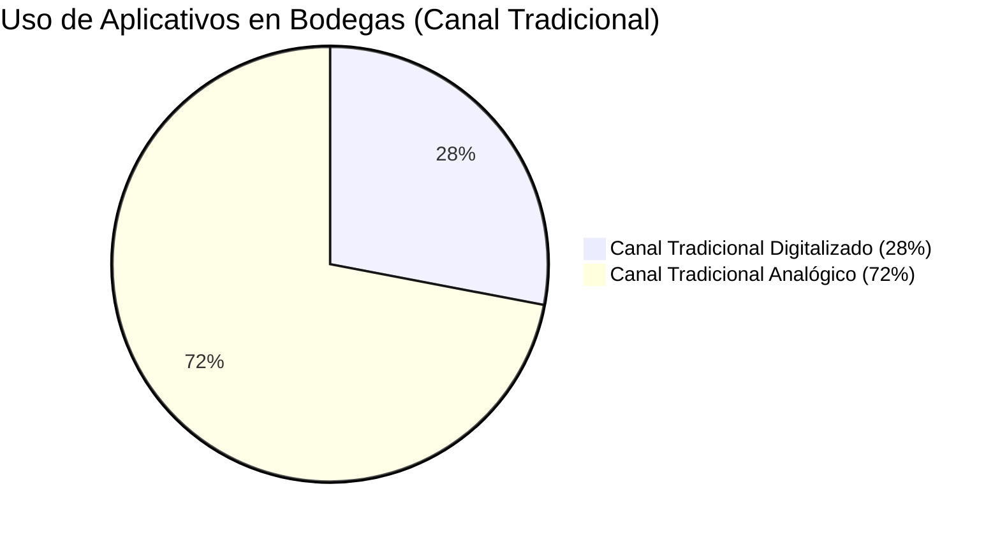

### 1.3. Segmentos Objetivos

La solución Nexa se dirige a un ecosistema B2B donde conviven actores operativos, comerciales y logísticos con responsabilidades distintas. Para mantener consistencia metodológica entre el capítulo 1, el needfinding y el backlog, el proyecto utilizará dos capas de segmentación complementarias y no competitivas. La primera capa corresponde a los <strong>segmentos operativos primarios</strong>, que son la base canónica del informe porque ya fueron materializados en las user personas, los journey maps y los empathy maps. La segunda capa corresponde a los <strong>segmentos comerciales del sitio público</strong>, utilizados para comunicar la propuesta de valor del producto en el landing page sin alterar la estructura principal de la investigación.

Bajo esta lógica, los segmentos S1, S2 y S3 no representan tipos de empresa, sino puntos críticos del flujo del pedido: captura comercial, abastecimiento del cliente y ejecución de la entrega. En paralelo, el landing page comunica el mismo dominio desde una óptica comercial, priorizando distribuidores refrigerados y ampliando el discurso hacia importadores/mayoristas y operadores de cámaras frías como extensiones estratégicas del mismo problema.

**Tabla 10**

*Resumen de segmentos operativos primarios*

| **Segmento** | **Arquetipo canónico** | **Rol en el ecosistema** | **Necesidad dominante** | **Valor esperado de Nexa** |
|--------------|-------------------------|---------------------------|--------------------------|-----------------------------|
| **S1** | Valeria, coordinadora comercial / mercaderista | Recibe, interpreta, valida y canaliza pedidos hacia la operación | Reducir retrabajo, ambigüedad y pasos manuales en la toma del pedido | Flujo de captura estructurado, visibilidad inmediata de stock y menor dependencia de WhatsApp |
| **S2** | Hilda, cliente comercial B2B / administradora de minimarket | Compra, repone stock y necesita predictibilidad para atender su negocio | Abastecerse con autonomía, certeza de disponibilidad y seguimiento confiable | Catálogo claro, pedido autónomo y entregas más previsibles |
| **S3** | Pedro, chofer de reparto / despacho | Ejecuta la entrega física y sufre interrupciones, demoras y problemas de cierre | Cumplir la ruta con menos interrupciones y evidencia clara de entrega | Seguimiento compartido, reducción de llamadas y cierre digital del despacho |

*Nota.* Los segmentos operativos primarios son la referencia oficial para personas, journeys, empathy maps, user stories y backlog. Elaboración propia.

#### Caracterización demográfica y estadística de los segmentos

La siguiente caracterización complementa los perfiles cualitativos con evidencia cuantitativa del mercado, sustentando la representatividad de cada segmento en el contexto de la distribución B2B de productos refrigerados y congelados en el Perú.

**Segmento 1 (S1) — Coordinación comercial y captura del pedido**

El personal dedicado a la coordinación comercial y captura de pedidos en empresas distribuidoras de alimentos en el Perú se concentra predominantemente en el rango etario de 25 a 40 años, con acceso habitual a dispositivos móviles y conectividad básica. Este perfil corresponde a trabajadores del sector comercio mayorista y distribución, categoría cuya fuerza laboral femenina representa una proporción significativa en roles administrativos y de ventas internas (Instituto Nacional de Estadística e Informática [INEI], 2023). El contexto tecnológico del segmento es determinante: la evidencia muestra que el canal informal (WhatsApp, llamadas) sigue siendo la herramienta principal de coordinación en pequeñas y medianas empresas distribuidoras, pese a la disponibilidad de alternativas digitales (Grupo Lucky, 2022). Esto posiciona a este segmento como el punto de mayor fricción en el flujo del pedido y, al mismo tiempo, como el de mayor impacto potencial ante la adopción de una plataforma estructurada.

**Segmento 2 (S2) — Cliente comercial B2B y abastecimiento recurrente**

El segmento de clientes comerciales B2B del canal tradicional peruano —bodegas, minimarkets, distribuidores pequeños y establecimientos HORECA— representa un universo de aproximadamente 414,000 bodegas activas a nivel nacional, con una concentración mayor en Lima Metropolitana (Asociación de Bodegueros del Perú, 2022). En términos de madurez digital, el Índice de Madurez Digital del Canal Tradicional elaborado por Xplora/Grupo Lucky reporta que solo alrededor del 28% de bodegas utiliza algún aplicativo para gestionar tareas del negocio, mientras que el 83% se ubica todavía en nivel "principiante" de transformación digital (Grupo Lucky, 2022). Complementariamente, un estudio sobre pagos digitales en pequeños comercios muestra que la adopción de herramientas digitales es incipiente y depende de la simplicidad percibida de la herramienta (Taipe Quispe, 2025). Esto confirma que la adopción del portal B2B de Nexa está condicionada a una experiencia de uso sin fricción que equipare o supere la velocidad percibida del canal informal.

**Ilustración 2**

*Madurez Digital del Canal Tradicional en el Perú*

*Nota.* Fuente: Elaboración propia en base a datos de Grupo Lucky (2022).

**Segmento 3 (S3) — Despacho, transporte y cierre de entrega**

El personal de reparto y despacho en empresas distribuidoras de alimentos refrigerados opera en rutas urbanas de alta rotación, con jornadas que pueden extenderse entre 8 y 12 horas diarias. Según datos del sector transporte y almacenamiento en el Perú, este segmento tiene una participación mayoritariamente masculina y se concentra en el rango etario de 25 a 45 años (INEI, 2023). Desde una perspectiva operativa, la evidencia recogida en el needfinding y en estudios de trazabilidad en cadena de frío indica que las rupturas de temperatura durante el transporte —64 rupturas registradas en una sola microred de salud en un año (Bravo De la Cruz et al., 2025)— son en parte atribuibles a la descoordinación entre el envío del pedido, la ruta física y la notificación al punto de entrega. El segmento de despacho no adopta tecnología por iniciativa propia, sino cuando esta reduce directamente las interrupciones durante la ruta: llamadas, esperas en cliente y reclamos al cierre de entrega.

#### Segmento 1: Coordinación comercial y captura del pedido

Este segmento agrupa al personal que recibe pedidos desde múltiples canales, valida productos, consulta stock, corrige inconsistencias y traduce la intención del cliente a un formato operable por la empresa. Incluye mercaderistas, coordinadoras comerciales, ventas internas y personal que trabaja entre clientes, facturación, almacén y despacho. El arquetipo canónico es <strong>Valeria</strong>, porque sintetiza la fricción cotidiana del proceso: mensajes ambiguos, doble validación, presión por responder rápido y necesidad de trabajar desde herramientas simples.

Su valor esperado no está en funciones complejas, sino en la reducción de pasos innecesarios. Nexa debe ayudarle a identificar rápidamente al cliente, cargar sus condiciones comerciales, consultar disponibilidad real, registrar el pedido sin reinterpretaciones y dejar trazabilidad visible para el resto de áreas. Si este segmento no percibe simplicidad y velocidad, el producto no resuelve el núcleo del problema.

**Necesidades principales**

- Recibir pedidos en un flujo estructurado y consistente.
- Validar stock, crédito y condiciones comerciales sin saltar entre varias herramientas.
- Registrar pedidos desde celular, tablet o escritorio sin retrabajo posterior.
- Tener evidencia clara del estado del pedido para responder al cliente sin depender de llamadas constantes.

**Puntos de dolor**

- Los pedidos llegan por audios, listas o mensajes libres y requieren interpretación manual.
- La disponibilidad real de stock no siempre coincide con lo que muestran los sistemas existentes.
- La revisión de morosidad o crédito sigue siendo manual y lenta.
- Los errores de digitación y de especificaciones terminan trasladándose a almacén, despacho y devoluciones.

#### Segmento 2: Cliente comercial B2B y abastecimiento recurrente

Este segmento representa a los negocios que dependen del distribuidor para mantener abastecida su operación: minimarkets, bodegas, pequeños mayoristas y cuentas del canal HORECA. El arquetipo canónico es <strong>Hilda</strong>, sintetizada como administradora de minimarket que compra con frecuencia, necesita rapidez y no puede detener su negocio para perseguir confirmaciones o esperar respuestas por WhatsApp.

Desde su perspectiva, el problema no es “usar más tecnología”, sino comprar con menos incertidumbre. Nexa debe permitirle revisar un catálogo comprensible, conocer disponibilidad y condiciones comerciales, registrar pedidos por sí misma, recibir confirmación clara y entender si la entrega llegará a tiempo. La adopción depende de que la herramienta mantenga la inmediatez esperada y complemente la relación humana cuando se necesite soporte.

**Necesidades principales**

- Consultar productos, formatos y fichas técnicas sin esperar respuesta manual.
- Saber si el producto está disponible antes de confirmar el pedido.
- Conocer el estado del pedido y una ventana estimada de entrega.
- Resolver dudas o incidencias sin perder el componente humano de la relación comercial.

**Puntos de dolor**

- La compra por llamada o WhatsApp no deja trazabilidad clara del pedido.
- La falta de disponibilidad o los cambios de último minuto afectan ventas y caja.
- Las demoras de entrega generan desorden en el local y pérdida de confianza.
- La complejidad excesiva haría que el usuario vuelva al canal informal.

#### Segmento 3: Despacho, transporte y cierre de entrega

Este segmento reúne a quienes ejecutan la entrega física y cargan con las consecuencias de una mala coordinación previa. El arquetipo canónico es <strong>Pedro</strong>, chofer de reparto que necesita avanzar en ruta sin responder llamadas constantes, llegar con información correcta y cerrar la entrega con evidencia suficiente para evitar reclamos posteriores.

Aunque en esta etapa la validación se apoya más en los artefactos de needfinding y en evidencia indirecta del resto de entrevistas, el segmento sigue siendo esencial porque representa el punto donde la promesa comercial se vuelve servicio real. Nexa debe permitirle contar con estados claros, visibilidad compartida de la entrega, alertas tempranas al cliente y una prueba de entrega que reduzca el uso de papeles y las discusiones al cierre.

**Necesidades principales**

- Ejecutar la ruta con menos llamadas e interrupciones.
- Llegar a puntos de entrega mejor preparados para recibir la mercadería.
- Registrar el despacho y la entrega con evidencia simple y confiable.
- Disminuir reclamos injustos provocados por errores previos del flujo comercial.

**Puntos de dolor**

- El cliente muchas veces no está listo para recibir ni pagar cuando el camión llega.
- Los retrasos se comunican tarde y generan más llamadas durante la conducción.
- Las guías físicas y el cierre manual aumentan el riesgo de pérdida o inconsistencia.
- El transportista termina cargando reclamos originados por falta de stock o errores de pedido.

#### Stakeholder secundario: Jefatura y responsables de logística, abastecimiento y operación

La jefatura de logística, abastecimiento y operación se mantiene como <strong>stakeholder secundario</strong> del proyecto. Este perfil no reemplaza a las personas primarias, pero sí alimenta reglas de negocio, restricciones operativas, criterios de aceptación y decisiones de roadmap. Sus entrevistas son especialmente valiosas para entender visibilidad end-to-end, trazabilidad, control de vencimientos, bloqueo por crédito, manejo de incidencias, temperatura y coordinación inter-áreas.

En términos estratégicos, este stakeholder ayuda a evitar que Nexa se diseñe solo desde la comodidad del front comercial. Su función en el informe es complementar la validación del dominio, no redefinir la columna vertebral de personas que ya fue consolidada en el capítulo 2.

#### Segmentos comerciales del sitio público

El landing page utiliza una capa comercial adicional para orientar la propuesta de valor hacia tipos de empresa compradoras del producto. Esta segmentación no sustituye a S1, S2 y S3; simplemente organiza el discurso público del sitio para adquisición y posicionamiento comercial.

| **Segmento comercial del sitio** | **Rol comercial** | **Relación con los segmentos operativos** | **Nivel de prioridad** |
|----------------------------------|-------------------|--------------------------------------------|------------------------|
| **Distribuidores refrigerados** | Cliente pagador principal de la plataforma SaaS | Conecta directamente con Valeria, Hilda, Pedro y el stakeholder logístico | Principal |
| **Importadores y mayoristas** | Segmento adyacente con problemas similares de catálogo, stock y coordinación | Se apoya sobre todo en reglas y visibilidad operativa aportadas por coordinación comercial y jefatura | Adyacente |
| **Operadores de cámaras frías** | Extensión estratégica del dominio hacia almacenamiento y trazabilidad | Se relaciona con necesidades de inventario, vencimientos y control de cadena de frío | Expansión |

Esta doble capa de segmentación permite mantener coherencia entre investigación y comunicación comercial: el informe trabaja con arquetipos operativos concretos, mientras que el sitio público presenta el mismo problema en términos comprensibles para los tipos de empresa que podrían comprar la solución.

