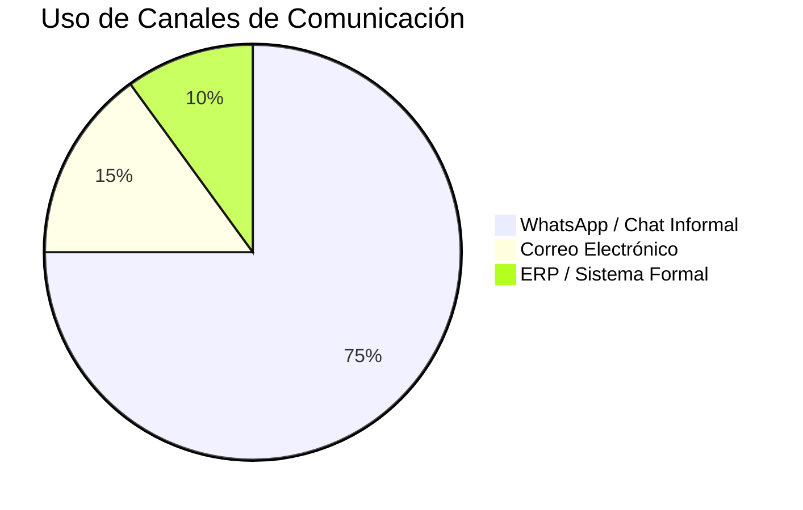
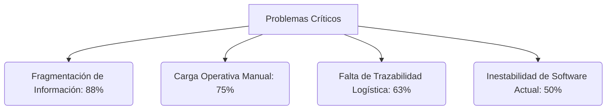

## **2.2. Entrevistas**

Las entrevistas se organizaron para entender cómo el problema aparece en esos tres tramos del flujo. Cuando fue necesario, también se recogió información operativa del dominio para aclarar reglas, restricciones y puntos de quiebre del proceso, sin alterar la segmentación oficial del proyecto.

### ***2.2.1. Diseño de entrevistas***

**Apertura sugerida para cualquier segmento**

“Hola, gracias por darte este tiempo. Somos estudiantes de Ingeniería de Software y estamos investigando cómo se gestionan actualmente los pedidos y la coordinación operativa en la distribución de productos refrigerados. La idea no es evaluarte a ti ni a tu empresa, sino entender cómo trabajan hoy, qué dificultades aparecen y qué cosas les generan más carga o incertidumbre. La conversación durará aproximadamente entre 15 y 25 minutos; en algunos casos podría extenderse un poco más si aparece información valiosa. ¿Te parece bien si la grabamos solo para revisar luego la información y no perder detalles?”

**Guion por segmento**

**Segmento 1: Vendedoras y coordinación comercial**

**Segmento:** Personal que recibe, interpreta y canaliza pedidos hacia facturación, almacén o despacho

**Objetivo de investigación:** Entender cómo se recibe, interpreta y coordina el pedido en el día a día; identificar fricciones de comunicación, visibilidad y carga operativa.

**Duración sugerida:** 15 a 25 minutos.

**Tipo de entrevistado buscado:** 2 a 3 entrevistados que trabajen directamente con pedidos, clientes, vendedores o coordinación comercial.

**Foco principal:** Canales usados, pasos reales del proceso, ambigüedad de pedidos, retrabajo, presión operativa y criterios de adopción de una herramienta digital.

**Warm-up y contexto del rol**
Conviene arrancar por la rutina del trabajo, no por la solución.
- Cuéntame un poco cuál es tu rol y qué parte del proceso te toca manejar más seguido.  
- ¿Desde hace cuánto haces este trabajo y con qué tipo de clientes o puntos de venta coordinas más?  
- En tu día a día, ¿qué canales usas más para comunicarte con vendedores, clientes o el equipo interno?  
- ¿Qué dispositivo usas más cuando trabajas y con cuál te sientes más cómodo para resolver pedidos o consultas rápidas?  

**Flujo actual de coordinación de pedidos**

Aquí interesa entender el proceso tal como ocurre hoy, paso a paso.
- Cuando un cliente necesita hacer un pedido o consultar disponibilidad, ¿cómo suele empezar todo?  
- ¿Qué tipo de mensajes recibes normalmente: texto, audio, foto, captura, lista, llamada?  
- Después de que llega el pedido, ¿qué haces tú paso a paso hasta dejarlo encaminado?  
- ¿En qué momento revisas stock, precios o condiciones y con quién validas antes de continuar?  

**Fricciones, errores y retrabajo**

Aquí no basta con identificar el problema; hay que hacer que la persona recuerde casos reales.

- ¿Qué parte del proceso te hace perder más tiempo o te complica más?  
- ¿Te ha pasado que el pedido llegue mal armado, incompleto o con productos que no correspondían? ¿Qué pasó exactamente?  
- ¿Qué tan frecuente es tener que volver a escribir, confirmar o corregir algo que ya se había coordinado?  
- Cuando almacén o despacho detecta inconsistencias, ¿cómo te enteras y cómo se corrige eso?  

**Visibilidad y seguimiento**
La meta es saber qué tan ciego o visible es el proceso una vez que el pedido ya avanzó.

- Una vez que el pedido ya fue enviado o quedó en proceso, ¿cómo haces el seguimiento?  
- ¿Puedes saber fácilmente si ya salió, si se retrasó o si hubo algún problema?  
- Cuando hay cambios o reclamos, ¿la información queda clara o termina dispersa entre mensajes y llamadas?  

**Expectativas sobre una herramienta digital**
Aquí todavía no se vende la solución; se explora el mínimo valor esperado.
- Si existiera una herramienta digital para ordenar este proceso, ¿qué tendría que resolver sí o sí para que te sirva de verdad?  
- ¿Qué información te gustaría tener más visible y qué tarea manual te gustaría dejar de hacer?  
- ¿Qué te haría desconfiar o rechazar una herramienta nueva: complejidad, tiempo, costumbre, mala experiencia previa u otra cosa?  

**Cierre**
- Si pudieras cambiar una sola cosa del proceso actual, ¿qué cambiarías primero y por qué?  
- ¿Hay algo importante sobre tu trabajo o sobre este proceso que no te haya preguntado y creas que debería entender?  

**Segmento 2: Jefatura logística y coordinación operativa**

**Perfiles entrevistados:** Personas con responsabilidad de supervisión o decisión sobre importación, abastecimiento, almacén, inventario, despacho y coordinación logística.

**Objetivo de investigación:** Comprender el flujo end-to-end del pedido, sus puntos críticos, riesgos de escalabilidad y criterios de valor para una primera solución digital.

**Duración sugerida:** 20 a 30 minutos.

**Tipo de entrevistado buscado:** 2 a 3 entrevistados de jefatura, supervisión o coordinación operativa con visión amplia del proceso.

**Foco principal:** Trazabilidad, puntos de quiebre, visibilidad interna, coordinación entre áreas, prioridades del MVP y evolución futura.

**Uso dentro del informe:** Este segmento aporta la perspectiva de coordinación logística y validación operativa. Su función es complementar la investigación con una visión de dominio y restricciones operativas que luego alimentan el diseño, el EventStorming y la delimitación del alcance.

**Warm-up y alcance del cargo**
La idea es ubicar rápido desde qué parte del proceso mira la operación.

- Cuéntame cuál es tu cargo y qué responsabilidad tienes dentro de la operación logística o de distribución.  
- ¿Tu enfoque está más en almacén, despacho, planificación, control o supervisión?  
- ¿Qué indicadores o preocupaciones tienes más presentes en tu trabajo: tiempos, stock, devoluciones, cumplimiento, mermas, incidencias?  

**Flujo operativo actual**

Aquí debe salir el recorrido real del pedido de extremo a extremo.

- Mirando el proceso completo desde que entra un pedido hasta que se entrega, ¿cómo funciona hoy en la práctica?  
- ¿Qué áreas intervienen y dónde se rompe más seguido el flujo?  
- ¿Cómo se conecta hoy la información comercial con la preparación, el stock y el despacho?  
- ¿Qué partes están integradas y cuáles siguen dependiendo de doble digitación o validaciones manuales?  

**Riesgos y puntos críticos**

Busca hechos, no opiniones generales.

- ¿Cuáles son los errores o incidencias que más afectan la operación logística?  
- En productos refrigerados, ¿qué variables son más delicadas y no se pueden perder de vista?  
- Cuando ocurre un problema, ¿qué tan fácil es rastrear qué pasó y en qué parte del proceso se originó?  
- ¿Qué parte del flujo se vuelve más vulnerable cuando sube el volumen de pedidos?  

**Gestión, control y decisiones**
Acá importa entender cómo decide y con qué información lo hace.
- ¿Qué tan visible es hoy el estado real de cada pedido para el equipo interno?  
- ¿Con qué información priorizan, corrigen o reprograman la operación?  
- ¿Qué decisiones hoy dependen demasiado de personas específicas y no de un sistema claro?  
- ¿Qué pasa cuando falta alguien del equipo o cuando entran muchos pedidos a la vez?  

**Valor esperado de una solución**
La meta es priorizar el valor real, no pedir features sueltas.

- Si pudieras ordenar el proceso con una sola mejora digital en esta etapa, ¿qué priorizarías?  
- ¿Qué sería suficiente para generar valor real desde una primera versión web?  
- ¿Qué cosas sí ves más para una fase futura y no como necesidad inmediata: mobile, sensores, integraciones complejas, automatizaciones avanzadas?  

**Cierre**

- Si pudieras cambiar una sola cosa del proceso actual, ¿qué cambiarías primero y por qué?  
- ¿Hay algo importante sobre la operación que no te haya preguntado y que consideres clave mencionar?  

**Nota para el moderador**. No es necesario formular todas las preguntas literalmente. Lo importante es mantener el foco, pedir ejemplos recientes, repreguntar “por qué” cuando aparezca un problema y no interrumpir silencios útiles.

**Segmento 3: Compradores comerciales B2B mayoristas y minoristas**

**Segmento:** Bodegas, minimarkets, pequeños mayoristas y negocios HORECA que compran productos refrigerados o congelados a distribuidores.

**Objetivo de investigación:** Entender cómo compra hoy el cliente comercial, qué fricciones vive al abastecerse y qué condiciones debería cumplir una plataforma para que realmente la adopte.

**Duración sugerida:** 15 a 25 minutos.

**Tipo de entrevistado buscado:** 3 a 5 entrevistados de clientes comerciales que compran a distribuidores de productos refrigerados o perecibles.

**Foco principal:** Abastecimiento, visibilidad de catálogo y stock, seguimiento del pedido, pérdidas por mala coordinación y condiciones reales de adopción digital.

**Warm-up y contexto del negocio**

El foco es ubicar frecuencia de compra y lógica de abastecimiento.

- Cuéntame un poco sobre tu negocio y tu rol cuando haces compras o reabastecimiento.  
- ¿Cada cuánto haces pedidos y qué tipo de productos compras con más frecuencia?  
- ¿A qué proveedores o distribuidores les compras normalmente y qué valoras más cuando eliges con quién abastecerte?  

**Forma actual de pedir y abastecerte**

Aquí interesa el flujo real de compra, no la versión ideal.
- Cuando necesitas hacer un pedido, ¿cómo lo haces hoy normalmente?  
- ¿Qué tan fácil o difícil es saber qué productos hay disponibles, a qué precio y en qué condiciones?  
- Después de pedir, ¿cómo haces seguimiento a lo que solicitaste?  
- ¿Sabes fácilmente si ya confirmaron, si falta algo o cuándo llegará?  

**Frustraciones y efectos en el negocio**

Hay que conectar la mala experiencia con consecuencias reales.
- ¿Qué es lo que más te incomoda o te hace perder tiempo cuando haces pedidos a distribuidores?  
- ¿Te ha pasado que pides algo y luego no llega como esperabas? ¿Qué ocurrió y cómo te afectó?  
- ¿Qué tan frecuente te pasa quedarte corto de stock o comprar de más por no tener información clara?  
- ¿Eso te genera pérdida, urgencia o desorden en tu negocio?  

**Tecnología, hábitos y confianza**

No basta saber si usa apps; importa cómo decide confiar en una herramienta.
- ¿Qué herramientas digitales usas hoy para tu negocio y con cuáles te sientes más cómodo?  
- Si un distribuidor te ofreciera una plataforma web para hacer pedidos, ¿qué tendría que tener para que sí la uses?  
- ¿Qué te haría no usarla o volver a WhatsApp: complejidad, lentitud, falta de confianza, costumbre u otra razón?  

**Cierre**
- Si pudieras describir la experiencia ideal de hacer un pedido a un distribuidor, ¿cómo debería ser?  
- ¿Qué pasos deberían simplificarse primero?  
- ¿Hay algo importante sobre tu forma de comprar o abastecerte que no te haya preguntado y consideres clave mencionar?  

### ***2.2.2. Registro de entrevistas***

En esta subsección se preservan los nombres y cargos reales de las personas entrevistadas.

Además de las capturas integradas en el informe, el archivo audiovisual original de las ocho entrevistas se conserva en la carpeta compartida **King Nexa** de OneDrive. Cada ficha incluye su enlace directo para mantener trazabilidad entre la evidencia visual resumida y la grabación completa utilizada en el levantamiento.

**Segmento 1: Vendedoras y coordinación comercial**

**Entrevistado 1**

- **Nombres:** Lorena Vanesa
- **Apellidos:** Silva Leca
- **Edad:** 42 años
- **Ubicación:** Chorrillos

*Evidencia de entrevista: Lorena Silva*

Captura de sesión de entrevista. Elaboración propia.

**Inicio de la entrevista:** 0:00:05  
**Fin de la entrevista:** 0:26:05  
**Enlace de la entrevista:** [Segmento 1 Entrevista 1](https://upcedupe-my.sharepoint.com/:v:/g/personal/u202323040_upc_edu_pe/IQBh49Y9SDAgRZlPLZSquYZRAdC_CjYnFHvBVKZmg3bhzQQ?nav=eyJyZWZlcnJhbEluZm8iOnsicmVmZXJyYWxBcHAiOiJPbmVEcml2ZUZvckJ1c2luZXNzIiwicmVmZXJyYWxBcHBQbGF0Zm9ybSI6IldlYiIsInJlZmVycmFsTW9kZSI6InZpZXciLCJyZWZlcnJhbFZpZXciOiJNeUZpbGVzTGlua0NvcHkifX0&e=xeVLVO)

**Resumen de la Entrevista**

La entrevistada Lorena Silva es una asesora comercial con amplia experiencia en la gestión de carteras de clientes y coordinación logística. Su rol es integral: gestiona pedidos, brinda asesoría técnica sobre presentaciones de productos refrigerados y supervisa condiciones de crédito que llegan hasta los 45 días. Identifica a WhatsApp como su canal operativo crítico por su inmediatez, dejando el correo electrónico solo para formalidades corporativas.

A nivel técnico, reporta fricciones severas con el sistema actual (Fontana), el cual colapsa ante accesos simultáneos, obligando a reinicios que retrasan la operación. Además, destaca la falta de funcionalidades móviles (como el registro de clientes), lo que la obliga a depender de laptops en campo, reduciendo su agilidad. Finalmente, señala inconsistencias en el stock real mostrado por el sistema, lo que genera desconfianza y requiere validaciones manuales constantes con almacén.

**Entrevistado 2**

- **Nombres:** Cinthia Paola
- **Apellidos:** Levano Asca
- **Edad:** 39 años
- **Ubicación:** Lurín

*Evidencia de entrevista: Cinthia Levano*

Captura de sesión de entrevista. Elaboración propia.

**Inicio de la entrevista:** 0:26:06  
**Fin de la entrevista:** 0:47:05  
**Enlace de la entrevista:** [Segmento 1 Entrevista 2](https://upcedupe-my.sharepoint.com/:v:/g/personal/u202323040_upc_edu_pe/IQAyzf03TLfeSbIYrCXh28BxAd8G-WNr_uB1Uu5jS__edvc?nav=eyJyZWZlcnJhbEluZm8iOnsicmVmZXJyYWxBcHAiOiJPbmVEcml2ZUZvckJ1c2luZXNzIiwicmVmZXJyYWxBcHBQbGF0Zm9ybSI6IldlYiIsInJlZmVycmFsTW9kZSI6InZpZXciLCJyZWZlcnJhbFZpZXciOiJNeUZpbGVzTGlua0NvcHkifX0&e=nDmxW2)

**Resumen de la Entrevista**

La entrevistada Cinthia Levano cuenta con dos años de experiencia en la coordinación de ventas de quesos y embutidos. Su proceso es altamente manual y fragmentado; depende de múltiples plataformas (Trello, WhatsApp, Excel) cuya falta de integración dispersa la información. Al igual que otros perfiles del segmento, sufre por la falta de precisión en el stock, lo que la obliga a consultar manualmente a su jefatura para asegurar la viabilidad de los pedidos.

Cinthia enfatiza la necesidad de simplicidad. Describe su flujo actual como una "pérdida de tiempo" debido a la cantidad de clics y ventanas necesarias para registrar una orden. Propone la automatización del control de morosidad y una visualización clara del crédito disponible, permitiendo una toma de decisiones más rápida y autónoma durante la captura del pedido.

**Entrevistado 3**

- **Nombres:** Celia
- **Apellidos:** Pérez Huaman
- **Edad:** 51 años
- **Ubicación:** San Miguel

*Evidencia de entrevista: Celia Pérez*

Captura de sesión de entrevista. Elaboración propia.

**Inicio de la entrevista:** 0:47:06  
**Fin de la entrevista:** 1:04:01  
**Enlace de la entrevista:** [Segmento 1 Entrevista 3](https://upcedupe-my.sharepoint.com/:v:/g/personal/u202323040_upc_edu_pe/IQDmUgpre5wLTJEjeIpKE5gMAR8lhXNb8-aN_5nfkE2mY-8?nav=eyJyZWZlcnJhbEluZm8iOnsicmVmZXJyYWxBcHAiOiJPbmVEcml2ZUZvckJ1c2luZXNzIiwicmVmZXJyYWxBcHBQbGF0Zm9ybSI6IldlYiIsInJlZmVycmFsTW9kZSI6InZpZXciLCJyZWZlcnJhbFZpZXciOiJNeUZpbGVzTGlua0NvcHkifX0&e=cqpqFZ)

**Resumen de la Entrevista**

Celia Pérez, con experiencia previa en ventas de ruta, aporta una perspectiva crítica sobre el uso de herramientas en campo. Utilizó aplicaciones móviles (Rikra) que, aunque eficientes para digitalizar la venta en tiempo real y eliminar el papel, presentaban fallos de rendimiento y lentitud que forzaban el retorno a canales informales. Destaca que la herramienta ideal debe integrar datos del cliente (RUC, saldos, dirección) para evitar la doble digitación.

Su testimonio confirma que, para el personal en ruta, la estabilidad de la conexión y la velocidad de respuesta del sistema son factores determinantes para la adopción tecnológica. Cualquier retraso en el dispositivo móvil se traduce en una atención deficiente al cliente y en una carga operativa innecesaria al final del día.

**Segmento 2: Jefatura logística y coordinación operativa**

**Entrevistado 1**

- **Nombres:** Hilda
- **Apellidos:** Litano Ramos
- **Edad:** 47 años
- **Ubicación:** Villa El Salvador

*Evidencia de entrevista: Hilda Litano*

Captura de sesión de entrevista. Elaboración propia.

**Inicio de la entrevista:** 1:04:07  
**Fin de la entrevista:** 1:19:39  
**Enlace de la entrevista:** [Segmento 2 Entrevista 1](nexa-interview-s2-e1-diego-hilda-litano)

**Resumen de la Entrevista**

Hilda Litano supervisa procesos de importación y cumplimiento sanitario. Su enfoque está en la trazabilidad documental y la consistencia entre la carga física y los certificados de DIGESA/VUCE. Destaca que, aunque existen mecanismos de control, el flujo se entorpece cuando la información de stock no es dinámica, lo que genera riesgos de sobreinventario o quiebres ante una demanda altamente variable en productos perecibles.

**Entrevistado 2**

- **Nombres:** Edith
- **Apellidos:** Taype Peñaloza
- **Edad:** 49 años
- **Ubicación:** Callao

*Evidencia de entrevista: Edith Taype*

Captura de sesión de entrevista. Elaboración propia.

**Inicio de la entrevista:** 1:19:40  
**Fin de la entrevista:** 1:51:08  
**Enlace de la entrevista:** [Segmento 2 Entrevista 2](https://upcedupe-my.sharepoint.com/:v:/g/personal/u202323040_upc_edu_pe/IQA-I6vCEGaNSr22U2cE6mS3AQWy6KV2LrkCrZkvACBGJgw?nav=eyJyZWZlcnJhbEluZm8iOnsicmVmZXJyYWxBcHAiOiJPbmVEcml2ZUZvckJ1c2luZXNzIiwicmVmZXJyYWxBcHBQbGF0Zm9ybSI6IldlYiIsInJlZmVycmFsTW9kZSI6InZpZXciLCJyZWZlcnJhbFZpZXciOiJNeUZpbGVzTGlua0NvcHkifX0&e=TPayIp)

**Resumen de la Entrevista**

Edith Taype opera en el punto de venta (supermercados), donde la manipulación y la cadena de frío (entre -5°C y 0°C) son innegociables. Identifica que el desorden en cámaras de frío y la falta de acceso a sistemas de inventario en tiempo real (reservados para jefes) limitan su capacidad de respuesta ante el cliente. Menciona que la digitalización de etiquetas y la visibilidad de movimientos de stock facilitarían enormemente su labor diaria.

**Entrevistado 3**

- **Nombres:** Jesica Maria
- **Apellidos:** Sandoval Romero
- **Edad:** 48 años
- **Ubicación:** Jesus María

*Evidencia de entrevista: Jesica Sandoval*

Captura de sesión de entrevista. Elaboración propia.

**Inicio de la entrevista:** 1:51:09  
**Fin de la entrevista:** 2:12:02  
**Enlace de la entrevista:** [Segmento 2 Entrevista 3](https://upcedupe-my.sharepoint.com/:v:/g/personal/u202323040_upc_edu_pe/IQBvq5XhZwCRS5Gl-opHnp9-Ac-dkhnzHv_Yd3ET8251hbs?nav=eyJyZWZlcnJhbEluZm8iOnsicmVmZXJyYWxBcHAiOiJPbmVEcml2ZUZvckJ1c2luZXNzIiwicmVmZXJyYWxBcHBQbGF0Zm9ybSI6IldlYiIsInJlZmVycmFsTW9kZSI6InZpZXciLCJyZWZlcnJhbFZpZXciOiJNeUZpbGVzTGlua0NvcHkifX0&e=jDo3F6)

**Resumen de la Entrevista**

Jesica Sandoval, supervisora de ventas Horeca, subraya el riesgo de la transcripción manual de pedidos, donde los errores en cantidades obligan a validaciones individuales de cada orden. Señala que la variable crítica es el control de fechas de vencimiento (FEFO), información que actualmente no está integrada en el sistema central y requiere coordinación verbal constante con almacén.

**Segmento 3: Compradores comerciales B2B mayoristas y minoristas**

**Entrevistado 1**

- **Nombres:** Pedro
- **Apellidos:** Puente Arnao
- **Edad:** 56 años
- **Ubicación:** San Isidro

*Evidencia de entrevista: Pedro Puente*

Captura de sesión de entrevista. Elaboración propia.

**Inicio de la entrevista:** 2:12:08  
**Fin de la entrevista:** 2:24:34  
**Enlace de la entrevista:** [Segmento 3 Entrevista 1](https://upcedupe-my.sharepoint.com/:v:/g/personal/u202323040_upc_edu_pe/IQCYUvW2Mz8eQK0fo9Lddyv3AYFVeaOL7QGRwgePWMtQ99s?nav=eyJyZWZlcnJhbEluZm8iOnsicmVmZXJyYWxBcHAiOiJPbmVEcml2ZUZvckJ1c2luZXNzIiwicmVmZXJyYWxBcHBQbGF0Zm9ybSI6IldlYiIsInJlZmVycmFsTW9kZSI6InZpZXciLCJyZWZlcnJhbFZpZXciOiJNeUZpbGVzTGlua0NvcHkifX0&e=wZjyWp)

**Resumen de la Entrevista**

Pedro Puente es un distribuidor cuya mayor frustración es la incertidumbre logística. Realiza pedidos por WhatsApp, pero la falta de visibilidad sobre la ETA (tiempo estimado de llegada) le impide coordinar con sus propios clientes finales. Reporta que los proveedores suelen priorizar a las grandes cadenas, dejando a los minoristas con quiebres de stock que impactan directamente en su rentabilidad.

**Entrevistado 2**

- **Nombres:** Henrry
- **Apellidos:** García Robles
- **Edad:** 49 años
- **Ubicación:** San Borja

*Evidencia de entrevista: Henrry García*

Captura de sesión de entrevista. Elaboración propia.

**Inicio de la entrevista:** 2:24:35  
**Fin de la entrevista:** 2:40:00  
**Enlace de la entrevista:** [Segmento 3 Entrevista 2](https://upcedupe-my.sharepoint.com/:v:/g/personal/u202323040_upc_edu_pe/IQAH4V2bsaaTRq3LvOpIH7oBAesfDCbmetCKnYA7IjyxJuo?nav=eyJyZWZlcnJhbEluZm8iOnsicmVmZXJyYWxBcHAiOiJPbmVEcml2ZUZvckJ1c2luZXNzIiwicmVmZXJyYWxBcHBQbGF0Zm9ybSI6IldlYiIsInJlZmVycmFsTW9kZSI6InZpZXciLCJyZWZlcnJhbFZpZXciOiJNeUZpbGVzTGlua0NvcHkifX0&e=tOoyGC)

**Resumen de la Entrevista**

Henrry García enfatiza que la confianza es el motor de la relación B2B. Aunque utiliza tecnología con GPS para monitorear sus propios despachos, rechaza que el software reemplace la comunicación humana personalizada. Su visión es que una plataforma ideal debe ser una herramienta de soporte que automatice el inventario y el seguimiento, pero permitiendo siempre una interacción directa para resolver excepciones.

### ***2.2.3. Análisis de entrevistas***

**Análisis del Segmento 1: Vendedoras y coordinación comercial**

El segmento de vendedoras y personal de coordinación comercial, representado en esta muestra por Lorena Silva, Cinthia Levano y Celia Pérez, constituye el punto de captura más sensible del flujo del pedido. En las tres entrevistas aparece la misma tensión operativa: responder con rapidez al cliente y, al mismo tiempo, validar crédito, stock y condiciones comerciales con información que no siempre está integrada. Sobre esa base se identifican los siguientes patrones compartidos.

*Análisis del Segmento 1: Vendedoras y coordinación comercial*

| Variable observada en Segmento 1 | Evidencia recurrente | Lectura analítica | Implicancia de diseño |
| --- | --- | --- | --- |
| Uso intensivo de WhatsApp y canales paralelos | Lorena, Cinthia y Celia describen dependencia de mensajería y validaciones externas | El pedido nace en un entorno rápido, pero con baja estructuración de datos | El flujo inicial debe capturar rapidez sin perder consistencia ni trazabilidad |
| Validación manual de stock y crédito | Lorena y Cinthia reportan consultas adicionales antes de confirmar pedidos | La captura del pedido no está suficientemente conectada con la información crítica del negocio | Conviene unificar stock, crédito y condiciones comerciales en la misma experiencia |
| Necesidad de operar en movilidad | Celia y Lorena describen trabajo fuera del escritorio o en condiciones de campo | La experiencia comercial no puede depender exclusivamente de entornos de oficina | La interfaz debe responder bien en móvil y reducir pasos innecesarios |
> *Nota:* La tabla resume la cadena dato observado → patrón → implicancia de diseño dentro de la muestra analizada. Elaboración propia.

**Características objetivas:**

- **Rol laboral:** 100% de los entrevistados (3 de 3) ejerce funciones directas de captura de pedidos, gestión de créditos y seguimiento de cartera.
- **Uso de herramientas digitales:** 100% interactúa con sistemas ERP (como Fontana) y herramientas de mensajería instantánea simultáneamente.
- **Entorno de trabajo:** 67% (Lorena y Celia) operan o han operado frecuentemente en campo (visitas presenciales), mientras que el 33% (Cinthia) mantiene una base más administrativa/oficina.
- **Experiencia en digitalización:** El 100% reporta que los sistemas actuales son insuficientes para el entorno móvil, obligando a duplicar tareas en papel o laptops.

**Características subjetivas:**

- **Prioridad de agilidad:** Las tres participantes manifiestan frustración ante la lentitud de las plataformas formales y valoran la rapidez de WhatsApp como canal operativo.
- **Apertura tecnológica:** Existe una disposición total (100%) hacia la adopción de nuevas herramientas, siempre que estas simplifiquen el flujo de clics y no añadan capas de complejidad.
- **Percepción de ineficiencia:** Las tres coinciden en que el proceso actual tiene demasiados pasos y una fragmentación que deteriora su productividad cotidiana.

**Problemas más comunes:**

- **Inestabilidad del sistema actual:** Lorena reporta caídas o reinicios del sistema en momentos de concurrencia, lo que sugiere una fragilidad técnica relevante para la operación comercial.
- **Opacidad de Stock:** El 67% (Lorena y Cinthia) reporta que el sistema no refleja el stock real en tiempo real, lo que genera una desconfianza sistémica y obliga a realizar llamadas de validación a almacén.
- **Brecha de Movilidad:** La incapacidad de realizar registros de clientes o pedidos complejos desde un smartphone limita la autonomía del 100% del personal en campo.
- **Carga de re-digitación:** En las tres entrevistas aparece la necesidad de transcribir o revalidar información recibida por canales informales antes de convertirla en un pedido operable. Esto no permite estimar un porcentaje exacto de error, pero sí confirma una fuente recurrente de retrabajo y ambigüedad.

**Hallazgos clave para el Segmento 1:**

- La solución debe acercarse a la rapidez percibida de WhatsApp, pero sin renunciar a una estructura de datos confiable.
- Conviene integrar en la misma interfaz la visibilidad de crédito, cobranzas y disponibilidad para reducir validaciones paralelas.
- La experiencia debe responder bien en móvil, porque parte importante del trabajo ocurre fuera del escritorio o en condiciones de alta urgencia.

**Análisis del Segmento 2: Jefatura logística y coordinación operativa**

El segmento de jefatura logística y coordinación operativa, representado en esta muestra por Hilda Litano, Edith Taype y Jesica Sandoval, aporta una lectura transversal del dominio. Aquí el foco se desplaza desde la rapidez comercial hacia la trazabilidad, el control documental, la rotación y la responsabilidad operativa sobre productos perecederos. Estas entrevistas exponen las restricciones operativas y los criterios de control que este segmento debe sostener para que el pedido se cumpla correctamente.

*Análisis del Segmento 2: Jefatura logística y coordinación operativa*

| Variable observada en Segmento 2 | Evidencia recurrente | Lectura analítica | Implicancia de diseño |
| --- | --- | --- | --- |
| Trazabilidad documental sensible | Hilda y Jesica enfatizan control de documentación, temperatura y vencimientos | La operación necesita respaldo verificable, no solo visibilidad superficial del pedido | El modelo del dominio debe contemplar evidencia, estados y reglas de validación |
| Rotación y vencimientos como restricción real | Jesica y Edith describen dependencia de coordinación manual para FEFO y disponibilidad | La calidad de la entrega depende de decisiones previas sobre inventario y priorización | El sistema debe hacer visible stock, vencimientos y criterios de rotación relevantes |
| Accesos y visibilidad fragmentados | Edith reporta limitaciones de acceso y necesidad de intermediación interna | La operación no comparte la misma información con el mismo nivel de oportunidad | Se requieren roles, permisos y vistas diferenciadas sobre un mismo flujo |
> *Nota:* La tabla sintetiza los patrones de comportamiento, fricciones y consecuencias de diseño del Segmento 2 a partir de la muestra entrevistada. Elaboración propia.

**Características objetivas:**

- **Funciones de supervisión:** 100% (3 de 3) tiene responsabilidad sobre la validación de inventario, cumplimiento de normativas sanitarias y despacho.
- **Control de variables críticas:** 100% monitorea fechas de vencimiento y temperaturas, aunque la forma de registro varía según el nivel operativo.
- **Multitarea sistémica:** El 67% (Hilda y Jesica) debe alternar entre documentos físicos (VUCE/DIGESA) y dashboards digitales fragmentados.

**Características subjetivas:**

- **Prioridad de trazabilidad:** Las tres entrevistadas consideran que la pérdida de trazabilidad posterior a la entrega es uno de los riesgos más sensibles del negocio.
- **Necesidad de autonomía operativa:** Edith resalta que la limitación de acceso a los sistemas de inventario para el personal de piso (33% del segmento analizado) genera cuellos de botella innecesarios.

**Problemas más comunes:**

- **Falta de integración FEFO:** El control de fechas de vencimiento y rotación todavía depende de coordinación manual o verbal en parte del proceso, elevando el riesgo de mermas o mala priorización.
- **Conflictos de responsabilidad:** La rotura de la cadena de frío después de la entrega puede derivar en disputas difíciles de resolver cuando no existe evidencia digital suficiente del estado del producto.
- **Validación manual de datos críticos:** En al menos una entrevista aparece la necesidad de revisar manualmente órdenes sensibles antes de liberarlas a operación, lo que evidencia falta de confianza en la captura inicial.

**Hallazgos clave para el Segmento 2:**

- Se requiere una **herramienta unificada** que centralice la información de stock, vencimientos y estados del pedido con la documentación operativa.
- La **trazabilidad del pedido** debe ser una evidencia inalterable para proteger la responsabilidad de la distribuidora frente a incidencias y reclamos.
- Reducir los **silos de información** permitiendo diferentes niveles de acceso según el rol operativo, sin que la visibilidad dependa de coordinación verbal o papeles.
- El Segmento 2 concentra las reglas, políticas y restricciones operativas que el producto debe respetar para que el flujo del pedido sea ejecutable y trazable.

**Análisis del Segmento 3: Compradores comerciales B2B mayoristas y minoristas**
El análisis de Pedro Puente y Henrry García muestra un patrón consistente: el comprador comercial necesita previsibilidad logística, pero no está dispuesto a adoptarla a costa de complejidad adicional o pérdida de trato humano. Para ambos, el distribuidor no es solo un proveedor, sino un actor del que depende la continuidad operativa del negocio.

*Análisis del Segmento 3: Compradores comerciales B2B mayoristas y minoristas*

| Variable observada en Segmento 3 | Evidencia recurrente | Lectura analítica | Implicancia de diseño |
| --- | --- | --- | --- |
| Dependencia de canales informales para pedir | Pedro y Henrry describen uso de llamadas y WhatsApp para resolver urgencias | La velocidad de respuesta pesa más que la sofisticación funcional | El portal debe ser rápido de usar y fácil de entender desde el primer contacto |
| Necesidad de visibilidad del estado del pedido | Ambos expresan incertidumbre sobre stock, confirmación y entrega | El principal valor esperado no es solo comprar, sino saber qué ocurrirá después del pedido | Conviene priorizar confirmación clara, estados visibles y seguimiento del despacho |
| Confianza como condición de adopción | Henrry enfatiza soporte humano y Pedro asocia servicio con continuidad del negocio | Una digitalización excesivamente impersonal puede afectar adopción | La experiencia debe combinar autoservicio con posibilidad de soporte cuando haga falta |
> *Nota:* La tabla ordena la relación entre evidencia empírica del cliente comercial y decisiones esperadas del portal B2B. Elaboración propia.

**Características objetivas:**

- **Frecuencia de reabastecimiento:** Ambos entrevistados compran productos de alta rotación varias veces por semana.
- **Canales de comunicación:** Ambos utilizan llamadas directas o audios de WhatsApp cuando necesitan resolver urgencias.
- **Dependencia logística:** En ambos casos, la continuidad de ventas depende de la capacidad del distribuidor para confirmar stock y cumplir la entrega.

**Características subjetivas:**

- **Valoración de la cercanía:** La confianza y el soporte humano siguen pesando de forma importante en la decisión de compra y recompra.
- **Incertidumbre logística:** La falta de noticias claras sobre el estado del pedido genera ansiedad operativa y desorden en el abastecimiento.

**Problemas más comunes:**

- **Quiebres de stock inesperados:** Ambos entrevistados reportan haber enfrentado cancelaciones o faltantes por visibilidad insuficiente del stock antes de la entrega.
- **Opacidad del ETA (Estimated Time of Arrival):** La falta de seguimiento de ruta obliga a esperar con alta incertidumbre la llegada del pedido y dificulta preparar la recepción.
- **Asimetría competitiva:** En la muestra aparece la percepción de que los clientes pequeños quedan en desventaja frente a cuentas grandes cuando el stock o la capacidad de entrega se tensionan.

**Hallazgos clave para el Segmento 3:**

- La plataforma debe permitir un pedido rápido y ofrecer seguimiento sin obligar al cliente a perseguir confirmaciones por otros canales.
- El sistema debe digitalizar la operación sin eliminar por completo el soporte humano en casos excepcionales.
- La predictibilidad del despacho aparece como una de las variables de valor más claras para este segmento.

**Implicancias de diseño operativo para el flujo de despacho y entrega**

El tramo final del flujo del pedido —despacho, seguimiento, incidencia y cierre con evidencia— forma parte de las responsabilidades del Segmento 2 (Jefatura logística y coordinación operativa). A partir de los hallazgos sobre visibilidad de entrega, necesidad de ETA comunicable, cierre defendible y carga operativa durante la ruta, se identifican las siguientes implicancias de diseño que complementan la caracterización del Segmento 2.

**Evidencia que sustenta estas implicancias:**

- Desde la evidencia del Segmento 2, aparece la necesidad de contar con trazabilidad documental y cierre defendible frente a incidencias.
- Desde el Segmento 3 (compradores), aparece la necesidad de una ETA comunicable, menor opacidad del despacho y confirmación confiable de entrega.
- Desde el flujo del dominio, el cierre del pedido exige estados claros, registro de incidencias y prueba de entrega, lo que forma parte del alcance operativo que el Segmento 2 debe gestionar.

**Implicancias de diseño para el tramo de despacho y entrega:**

- El producto debe reducir llamadas e interrupciones durante la ruta.
- El estado del pedido debe mantenerse visible para el comprador, la coordinación comercial y la operación.
- El cierre debe registrar una evidencia mínima consistente, suficiente para disminuir reclamos y ambigüedad posterior.

### ***2.2.4. Síntesis Global de Hallazgos***

Tras el análisis detallado de los ocho perfiles levantados y de la lectura conjunta de los tres segmentos del producto, se identifica una **brecha de trazabilidad integral**. Esta brecha se manifiesta en la desconexión entre la promesa comercial capturada por canales informales y la realidad operativa gestionada con sistemas fragmentados, validaciones manuales y visibilidad incompleta del despacho.

*Cuantificación explícita de hallazgos (base: 8 entrevistados)*

- **6 de 8 entrevistados (75%)** mencionan a WhatsApp como canal operativo principal para coordinar pedidos o urgencias logísticas.
- **7 de 8 entrevistados (88%)** reportan fragmentación de información entre sistemas formales (ERP), hojas de cálculo y canales informales.
- **6 de 8 entrevistados (75%)** identifican re-digitación o validaciones manuales como fuente recurrente de retrabajo.
- **5 de 8 entrevistados (63%)** señalan falta de visibilidad logística sobre stock real, ETA o estado del pedido.
- **4 de 8 entrevistados (50%)** describen inestabilidad, lentitud o cierres inesperados del software actualmente usado.
- **8 de 8 entrevistados (100%)** expresan apertura a adoptar una herramienta digital siempre que reduzca pasos, no añada complejidad y responda en entornos móviles.

> *Nota:* Elaboración propia a partir de la codificación temática de las ocho entrevistas.

*Distribución de Canales de Comunicación Identificados*

> *Nota:* Resultados obtenidos de las 8 entrevistas a profundidad realizadas con el Segmento 1 (coordinación comercial), el Segmento 2 (jefatura logística y coordinación operativa) y el Segmento 3 (compradores comerciales B2B). Elaboración propia. 

*Jerarquía de Puntos de Dolor por Incidencia en los Segmentos*

> *Nota:* Mapeo analítico construido a partir de la recurrencia de temas mencionados en las entrevistas; los porcentajes deben leerse como aproximaciones de frecuencia dentro de la muestra, no como mediciones estadísticas del mercado. Elaboración propia.

En conclusión, Nexa no solo debe resolver la toma de pedidos, sino articular de forma consistente los tres segmentos del producto: quien captura y valida el pedido (Segmento 1: Vendedoras y coordinación comercial), quien coordina logística, inventario, preparación y despacho (Segmento 2: Jefatura logística y coordinación operativa), y quien se abastece y necesita previsibilidad (Segmento 3: Compradores comerciales B2B). Las reglas, restricciones y criterios de control del dominio acompañan ese flujo completo, y la segmentación del informe se organiza en esos tres tramos del producto.

