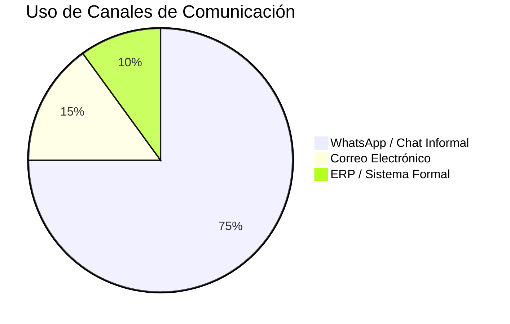
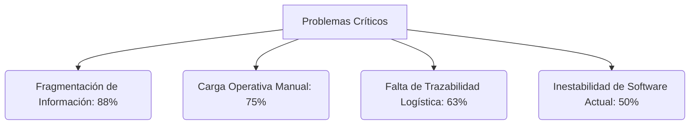

## 2.2.	Entrevistas

### 2.2.1.	Diseño de entrevistas

**Apertura sugerida para cualquier segmento**

“Hola, gracias por darte este tiempo. Somos estudiantes de Ingeniería de Software y estamos investigando cómo se gestionan actualmente los pedidos y la coordinación operativa en la distribución de productos refrigerados. La idea no es evaluarte a ti ni a tu empresa, sino entender cómo trabajan hoy, qué dificultades aparecen y qué cosas les generan más carga o incertidumbre. La conversación durará aproximadamente entre 15 y 25 minutos; en algunos casos podría extenderse un poco más si aparece información valiosa. ¿Te parece bien si la grabamos solo para revisar luego la información y no perder detalles?”

**Guion por segmento**

**Segmento 1: Mercaderistas y personal de coordinación comercial**

**Segmento:** Personal que recibe, interpreta y canaliza pedidos hacia facturación, almacén o despacho

**Objetivo de investigación:** Entender cómo se recibe, interpreta y coordina el pedido en el día a día; identificar fricciones de comunicación, visibilidad y carga operativa.

**Duración sugerida:** 15 a 25 minutos.

**Tipo de entrevistado buscado:** 2 a 3 entrevistados que trabajen directamente con pedidos, clientes, vendedores o coordinación comercial.

**Foco principal:** Canales usados, pasos reales del proceso, ambigüedad de pedidos, retrabajo, presión operativa y criterios de adopción de una herramienta digital.

**Warm-up y contexto del rol**
Conviene arrancar por la rutina del trabajo, no por la solución.
- Cuéntame un poco cuál es tu rol y qué parte del proceso te toca manejar más seguido.  
- ¿Desde hace cuánto haces este trabajo y con qué tipo de clientes o puntos de venta coordinas más?  
- En tu día a día, ¿qué canales usas más para comunicarte con vendedores, clientes o el equipo interno?  
- ¿Qué dispositivo usas más cuando trabajas y con cuál te sientes más cómodo para resolver pedidos o consultas rápidas?  

**Flujo actual de coordinación de pedidos**

Aquí interesa entender el proceso tal como ocurre hoy, paso a paso.
- Cuando un cliente necesita hacer un pedido o consultar disponibilidad, ¿cómo suele empezar todo?  
- ¿Qué tipo de mensajes recibes normalmente: texto, audio, foto, captura, lista, llamada?  
- Después de que llega el pedido, ¿qué haces tú paso a paso hasta dejarlo encaminado?  
- ¿En qué momento revisas stock, precios o condiciones y con quién validas antes de continuar?  

**Fricciones, errores y retrabajo**

Aquí no basta con identificar el problema; hay que hacer que la persona recuerde casos reales.

- ¿Qué parte del proceso te hace perder más tiempo o te complica más?  
- ¿Te ha pasado que el pedido llegue mal armado, incompleto o con productos que no correspondían? ¿Qué pasó exactamente?  
- ¿Qué tan frecuente es tener que volver a escribir, confirmar o corregir algo que ya se había coordinado?  
- Cuando almacén o despacho detecta inconsistencias, ¿cómo te enteras y cómo se corrige eso?  

**Visibilidad y seguimiento**
La meta es saber qué tan ciego o visible es el proceso una vez que el pedido ya avanzó.

- Una vez que el pedido ya fue enviado o quedó en proceso, ¿cómo haces el seguimiento?  
- ¿Puedes saber fácilmente si ya salió, si se retrasó o si hubo algún problema?  
- Cuando hay cambios o reclamos, ¿la información queda clara o termina dispersa entre mensajes y llamadas?  

**Expectativas sobre una herramienta digital**
Aquí todavía no se vende la solución; se explora el mínimo valor esperado.
- Si existiera una herramienta digital para ordenar este proceso, ¿qué tendría que resolver sí o sí para que te sirva de verdad?  
- ¿Qué información te gustaría tener más visible y qué tarea manual te gustaría dejar de hacer?  
- ¿Qué te haría desconfiar o rechazar una herramienta nueva: complejidad, tiempo, costumbre, mala experiencia previa u otra cosa?  

**Cierre**
- Si pudieras cambiar una sola cosa del proceso actual, ¿qué cambiarías primero y por qué?  
- ¿Hay algo importante sobre tu trabajo o sobre este proceso que no te haya preguntado y creas que debería entender?  

**Nota para el moderador.** No es necesario formular todas las preguntas literalmente. Lo importante es mantener el foco, pedir ejemplos recientes, repreguntar “por qué” cuando aparezca un problema y no interrumpir silencios útiles.

**Segmento 2: Jefatura y responsables de logística, abastecimiento y operación**

**Segmento:**  Personas con responsabilidad de supervisión o decisión sobre importación, abastecimiento, almacén, inventario, despacho y coordinación logística.

**Objetivo de investigación:** Comprender el flujo end-to-end del pedido, sus puntos críticos, riesgos de escalabilidad y criterios de valor para una primera solución digital.

**Duración sugerida:** 20 a 30 minutos.

**Tipo de entrevistado buscado:** 2 a 3 entrevistados de jefatura, supervisión o coordinación operativa con visión amplia del proceso.

**Foco principal:** Trazabilidad, puntos de quiebre, visibilidad interna, coordinación entre áreas, prioridades del MVP y evolución futura.

**Warm-up y alcance del cargo**
La idea es ubicar rápido desde qué parte del proceso mira la operación.

- Cuéntame cuál es tu cargo y qué responsabilidad tienes dentro de la operación logística o de distribución.  
- ¿Tu enfoque está más en almacén, despacho, planificación, control o supervisión?  
- ¿Qué indicadores o preocupaciones tienes más presentes en tu trabajo: tiempos, stock, devoluciones, cumplimiento, mermas, incidencias?  

**Flujo operativo actual**

Aquí debe salir el recorrido real del pedido de extremo a extremo.

- Mirando el proceso completo desde que entra un pedido hasta que se entrega, ¿cómo funciona hoy en la práctica?  
- ¿Qué áreas intervienen y dónde se rompe más seguido el flujo?  
- ¿Cómo se conecta hoy la información comercial con la preparación, el stock y el despacho?  
- ¿Qué partes están integradas y cuáles siguen dependiendo de doble digitación o validaciones manuales?  

**Riesgos y puntos críticos**

Busca hechos, no opiniones generales.

- ¿Cuáles son los errores o incidencias que más afectan la operación logística?  
- En productos refrigerados, ¿qué variables son más delicadas y no se pueden perder de vista?  
- Cuando ocurre un problema, ¿qué tan fácil es rastrear qué pasó y en qué parte del proceso se originó?  
- ¿Qué parte del flujo se vuelve más vulnerable cuando sube el volumen de pedidos?  

**Gestión, control y decisiones**
Acá importa entender cómo decide y con qué información lo hace.
- ¿Qué tan visible es hoy el estado real de cada pedido para el equipo interno?  
- ¿Con qué información priorizan, corrigen o reprograman la operación?  
- ¿Qué decisiones hoy dependen demasiado de personas específicas y no de un sistema claro?  
- ¿Qué pasa cuando falta alguien del equipo o cuando entran muchos pedidos a la vez?  

**Valor esperado de una solución**
La meta es priorizar el valor real, no pedir features sueltas.

- Si pudieras ordenar el proceso con una sola mejora digital en esta etapa, ¿qué priorizarías?  
- ¿Qué sería suficiente para generar valor real desde una primera versión web?  
- ¿Qué cosas sí ves más para una fase futura y no como necesidad inmediata: mobile, sensores, integraciones complejas, automatizaciones avanzadas?  

**Cierre**

- Si pudieras cambiar una sola cosa del proceso actual, ¿qué cambiarías primero y por qué?  
- ¿Hay algo importante sobre la operación que no te haya preguntado y que consideres clave mencionar?  

**Nota para el moderador**. No es necesario formular todas las preguntas literalmente. Lo importante es mantener el foco, pedir ejemplos recientes, repreguntar “por qué” cuando aparezca un problema y no interrumpir silencios útiles.

**Segmento 3 · Clientes comerciales B2B minoristas y mayoristas**

**Segmento:** Bodegas, minimarkets, pequeños mayoristas y negocios HORECA que compran productos refrigerados o congelados a distribuidores.

**Objetivo de investigación: ** Entender cómo compra hoy el cliente comercial, qué fricciones vive al abastecerse y qué condiciones debería cumplir una plataforma para que realmente la adopte.

**Duración sugerida:** 15 a 25 minutos.

**Tipo de entrevistado buscado:** 3 a 5 entrevistados de clientes comerciales que compran a distribuidores de productos refrigerados o perecibles.

**Foco principal:** Abastecimiento, visibilidad de catálogo y stock, seguimiento del pedido, pérdidas por mala coordinación y condiciones reales de adopción digital.

**Warm-up y contexto del negocio**

El foco es ubicar frecuencia de compra y lógica de abastecimiento.

- Cuéntame un poco sobre tu negocio y tu rol cuando haces compras o reabastecimiento.  
- ¿Cada cuánto haces pedidos y qué tipo de productos compras con más frecuencia?  
- ¿A qué proveedores o distribuidores les compras normalmente y qué valoras más cuando eliges con quién abastecerte?  

**Forma actual de pedir y abastecerte**

Aquí interesa el flujo real de compra, no la versión ideal.
- Cuando necesitas hacer un pedido, ¿cómo lo haces hoy normalmente?  
- ¿Qué tan fácil o difícil es saber qué productos hay disponibles, a qué precio y en qué condiciones?  
- Después de pedir, ¿cómo haces seguimiento a lo que solicitaste?  
- ¿Sabes fácilmente si ya confirmaron, si falta algo o cuándo llegará?  

**Frustraciones y efectos en el negocio**

Hay que conectar la mala experiencia con consecuencias reales.
- ¿Qué es lo que más te incomoda o te hace perder tiempo cuando haces pedidos a distribuidores?  
- ¿Te ha pasado que pides algo y luego no llega como esperabas? ¿Qué ocurrió y cómo te afectó?  
- ¿Qué tan frecuente te pasa quedarte corto de stock o comprar de más por no tener información clara?  
- ¿Eso te genera pérdida, urgencia o desorden en tu negocio?  

**Tecnología, hábitos y confianza**

No basta saber si usa apps; importa cómo decide confiar en una herramienta.
- ¿Qué herramientas digitales usas hoy para tu negocio y con cuáles te sientes más cómodo?  
- Si un distribuidor te ofreciera una plataforma web para hacer pedidos, ¿qué tendría que tener para que sí la uses?  
- ¿Qué te haría no usarla o volver a WhatsApp: complejidad, lentitud, falta de confianza, costumbre u otra razón?  

**Cierre**
- Si pudieras describir la experiencia ideal de hacer un pedido a un distribuidor, ¿cómo debería ser?  
- ¿Qué pasos deberían simplificarse primero?  
- ¿Hay algo importante sobre tu forma de comprar o abastecerte que no te haya preguntado y consideres clave mencionar?  

**Nota para el moderador**. No es necesario formular todas las preguntas literalmente. Lo importante es mantener el foco, pedir ejemplos recientes, repreguntar “por qué” cuando aparezca un problema y no interrumpir silencios útiles.

### 2.2.2.	Registro de entrevistas

**Segmento 1: Mercaderistas / personal de coordinación comercial**

**Entrevistado 1**

- **Nombres:** Lorena Vanesa
- **Apellidos:** Silva Leca
- **Edad:** 42 años
- **Ubicación:** Chorrillos

**Ilustración 9**

*Evidencia de entrevista: Lorena Silva*

*Nota.* Captura de sesión de validación con el arquetipo. Elaboración propia.

**Resumen de la Entrevista**

La entrevistada Lorena Silva es una asesora comercial con amplia experiencia en la gestión de carteras de clientes y coordinación logística. Su rol es integral: gestiona pedidos, brinda asesoría técnica sobre presentaciones de productos refrigerados y supervisa condiciones de crédito que llegan hasta los 45 días. Identifica a WhatsApp como su canal operativo crítico por su inmediatez, dejando el correo electrónico solo para formalidades corporativas.

A nivel técnico, reporta fricciones severas con el sistema actual (Fontana), el cual colapsa ante accesos simultáneos, obligando a reinicios que retrasan la operación. Además, destaca la falta de funcionalidades móviles (como el registro de clientes), lo que la obliga a depender de laptops en campo, reduciendo su agilidad. Finalmente, señala inconsistencias en el stock real mostrado por el sistema, lo que genera desconfianza y requiere validaciones manuales constantes con almacén.

**Entrevistado 2**

- **Nombres:** Cinthia Paola
- **Apellidos:** Levano Asca
- **Edad:** 39 años
- **Ubicación:** Lurín

**Ilustración 10**

*Evidencia de entrevista: Cinthia Levano*

*Nota.* Captura de sesión de validación con el arquetipo. Elaboración propia.

**Resumen de la Entrevista**

La entrevistada Cinthia Levano cuenta con dos años de experiencia en la coordinación de ventas de quesos y embutidos. Su proceso es altamente manual y fragmentado; depende de múltiples plataformas (Trello, WhatsApp, Excel) cuya falta de integración dispersa la información. Al igual que otros perfiles del segmento, sufre por la falta de precisión en el stock, lo que la obliga a consultar manualmente a su jefatura para asegurar la viabilidad de los pedidos.

Cinthia enfatiza la necesidad de simplicidad. Describe su flujo actual como una "pérdida de tiempo" debido a la cantidad de clics y ventanas necesarias para registrar una orden. Propone la automatización del control de morosidad y una visualización clara del crédito disponible, permitiendo una toma de decisiones más rápida y autónoma durante la captura del pedido.

**Entrevistado 3**

- **Nombres:** Celia
- **Apellidos:** Pérez Huaman
- **Edad:** 51 años
- **Ubicación:** San Miguel

**Ilustración 11**

*Evidencia de entrevista: Celia Pérez*

*Nota.* Captura de sesión de validación con el arquetipo. Elaboración propia.

**Resumen de la Entrevista**

Celia Pérez, con experiencia previa en ventas de ruta, aporta una perspectiva crítica sobre el uso de herramientas en campo. Utilizó aplicativos móviles (Rikra) que, aunque eficientes para digitalizar la venta en tiempo real y eliminar el papel, presentaban fallos de rendimiento y lentitud que forzaban el retorno a canales informales. Destaca que la herramienta ideal debe integrar datos del cliente (RUC, saldos, dirección) para evitar la doble digitación.

Su testimonio confirma que, para el personal en ruta, la estabilidad de la conexión y la velocidad de respuesta del sistema son factores determinantes para la adopción tecnológica. Cualquier retraso en el dispositivo móvil se traduce en una atención deficiente al cliente y en una carga operativa innecesaria al final del día.

**Segmento 2: Jefatura o responsables de logística y operación**

**Entrevistado 1**

- **Nombres:** Hilda
- **Apellidos:** Litano Ramos
- **Edad:** 47 años
- **Ubicación:** Villa El Salvador

**Ilustración 12**

*Evidencia de entrevista: Hilda Litano*

*Nota.* Captura de sesión de validación con el arquetipo. Elaboración propia.

**Resumen de la Entrevista**

Hilda Litano supervisa procesos de importación y cumplimiento sanitario. Su enfoque está en la trazabilidad documental y la consistencia entre la carga física y los certificados de DIGESA/VUCE. Destaca que, aunque existen mecanismos de control, el flujo se entorpece cuando la información de stock no es dinámica, lo que genera riesgos de sobreinventario o quiebres ante una demanda altamente variable en productos perecibles.

**Entrevistado 2**

- **Nombres:** Edith
- **Apellidos:** Taype Peñaloza
- **Edad:** 49 años
- **Ubicación:** Callao

**Ilustración 13**

*Evidencia de entrevista: Edith Taype*

*Nota.* Captura de sesión de validación con el arquetipo. Elaboración propia.

**Resumen de la Entrevista**

Edith Taype opera en el punto de venta (supermercados), donde la manipulación y la cadena de frío (entre -5°C y 0°C) son innegociables. Identifica que el desorden en cámaras de frío y la falta de acceso a sistemas de inventario en tiempo real (reservados para jefes) limitan su capacidad de respuesta ante el cliente. Menciona que la digitalización de etiquetas y la visibilidad de movimientos de stock facilitarían enormemente su labor diaria.

**Entrevistado 3**

- **Nombres:** Jesica Maria
- **Apellidos:** Sandoval Romero
- **Edad:** 48 años
- **Ubicación:** Jesus María

**Ilustración 14**

*Evidencia de entrevista: Jesica Sandoval*

*Nota.* Captura de sesión de validación con el arquetipo. Elaboración propia.

**Resumen de la Entrevista**

Jesica Sandoval, supervisora de ventas Horeca, subraya el riesgo de la transcripción manual de pedidos, donde los errores en cantidades obligan a validaciones individuales de cada orden. Señala que la variable crítica es el control de fechas de vencimiento (FEFO), información que actualmente no está integrada en el sistema central y requiere coordinación verbal constante con almacén.

**Segmento 3: Clientes comerciales B2B (minoristas y mayoristas)**

**Entrevistado 1**

- **Nombres:** Pedro
- **Apellidos:** Puente Arnao
- **Edad:** 56 años
- **Ubicación:** San Isidro

**Ilustración 15**

*Evidencia de entrevista: Pedro Puente*

*Nota.* Captura de sesión de validación con el arquetipo. Elaboración propia.

**Resumen de la Entrevista**

Pedro Puente es un distribuidor cuya mayor frustración es la incertidumbre logística. Realiza pedidos por WhatsApp, pero la falta de visibilidad sobre la ETA (tiempo estimado de llegada) le impide coordinar con sus propios clientes finales. Reporta que los proveedores suelen priorizar a las grandes cadenas, dejando a los minoristas con quiebres de stock que impactan directamente en su rentabilidad.

**Entrevistado 2**

- **Nombres:** Henrry
- **Apellidos:** García Robles
- **Edad:** 49 años
- **Ubicación:** San Borja

**Ilustración 16**

*Evidencia de entrevista: Henrry García*

*Nota.* Captura de sesión de validación con el arquetipo. Elaboración propia.

**Resumen de la Entrevista**

Henrry García enfatiza que la confianza es el motor de la relación B2B. Aunque utiliza tecnología con GPS para monitorear sus propios despachos, rechaza que el software reemplace la comunicación humana personalizada. Su visión es que una plataforma ideal debe ser una herramienta de soporte que automatice el inventario y el seguimiento, pero permitiendo siempre una interacción directa para resolver excepciones.

### 2.2.3.	Análisis de entrevistas

**Análisis del Segmento 1: Mercaderistas / personal de coordinación comercial**

El segmento de mercaderistas y personal de coordinación comercial, representado por Lorena Silva, Cinthia Levano y Celia Pérez, constituye el eslabón crítico de captura de datos en la cadena de distribución. Este perfil operativo actúa bajo una presión constante por la inmediatez, donde la velocidad de respuesta al cliente es el indicador de éxito primario. A partir de las entrevistas a profundidad, se han consolidado los siguientes patrones transversales que definen la problemática del sector.

**Características objetivas:**

- **Rol laboral:** 100% de los entrevistados (3 de 3) ejerce funciones directas de captura de pedidos, gestión de créditos y seguimiento de cartera.
- **Uso de herramientas digitales:** 100% interactúa con sistemas ERP (como Fontana) y herramientas de mensajería instantánea simultáneamente.
- **Entorno de trabajo:** 67% (Lorena y Celia) operan o han operado frecuentemente en campo (visitas presenciales), mientras que el 33% (Cinthia) mantiene una base más administrativa/oficina.
- **Experiencia en digitalización:** El 100% reporta que los sistemas actuales son insuficientes para el entorno móvil, obligando a duplicar tareas en papel o laptops.

**Características subjetivas:**

- **Prioridad de agilidad:** 100% de las participantes manifiesta una frustración elevada ante la lentitud de las plataformas oficiales, priorizando la agilidad de WhatsApp sobre el rigor del sistema formal.
- **Apertura tecnológica:** Existe una disposición total (100%) hacia la adopción de nuevas herramientas, siempre que estas simplifiquen el flujo de clics y no añadan capas de complejidad.
- **Percepción de ineficiencia:** El 100% coincide en que el proceso actual tiene "demasiados pasos" (flujo fragmentado) que impactan en su productividad personal.

**Problemas más comunes:**

- **Inestabilidad Crítica (El "Efecto Fontana"):** Lorena destaca que el sistema colapsa ante accesos concurrentes, lo que representa el 100% de los bloqueos técnicos en momentos de alta demanda comercial.
- **Opacidad de Stock:** El 67% (Lorena y Cinthia) reporta que el sistema no refleja el stock real en tiempo real, lo que genera una desconfianza sistémica y obliga a realizar llamadas de validación a almacén.
- **Brecha de Movilidad:** La incapacidad de realizar registros de clientes o pedidos complejos desde un smartphone limita la autonomía del 100% del personal en campo.
- **Carga de Re-digitación:** El 100% de los pedidos capturados por canales informales debe ser transcrito manualmente al ERP, lo que incrementa el riesgo de error humano en un 20-30% según estimaciones operativas.

**Hallazgos clave para el arquetipo:**

- La solución debe ofrecer la **estabilidad y rapidez de WhatsApp** pero con la estructura de datos de un sistema contable.
- Es imperativo integrar la **visibilidad de créditos y cobranzas** en la misma interfaz de toma de pedidos para dotar de autonomía al asesor comercial.
- El diseño debe ser **Mobile-First**, permitiendo que el 100% de las tareas comerciales se realicen sin necesidad de una computadora.

**Análisis del Segmento 2: Jefatura o responsables de logística y operación**

Este segmento, integrado por Hilda Litano, Edith Taype y Jesica Sandoval, aporta la visión estratégica y de cumplimiento de la cadena de frío. Aquí, el enfoque se desplaza de la rapidez de venta hacia el rigor de la trazabilidad y la preservación del activo (el producto refrigerado). El análisis revela un quiebre importante entre la supervisión y la ejecución operativa.

**Características objetivas:**

- **Funciones de supervisión:** 100% (3 de 3) tiene responsabilidad sobre la validación de inventario, cumplimiento de normativas sanitarias y despacho.
- **Control de variables críticas:** 100% monitorea fechas de vencimiento y temperaturas, aunque la forma de registro varía según el nivel operativo.
- **Multitarea sistémica:** El 67% (Hilda y Jesica) debe alternar entre documentos físicos (VUCE/DIGESA) y dashboards digitales fragmentados.

**Características subjetivas:**

- **Obsesión por la trazabilidad:** 100% de las entrevistadas considera que el mayor riesgo del negocio es la pérdida de trazabilidad post-entrega (en el anaquel del cliente).
- **Necesidad de autonomía operativa:** Edith resalta que la limitación de acceso a los sistemas de inventario para el personal de piso (33% del segmento analizado) genera cuellos de botella innecesarios.

**Problemas más comunes:**

- **Falta de Integración FEFO:** El control de "First Expired, First Out" (FEFO) se gestiona de forma manual o verbal en el 67% de los casos (Jesica), aumentando el riesgo de mermas por vencimiento.
- **Conflictos de Responsabilidad:** La rotura de la cadena de frío tras la entrega en supermercados genera disputas comerciales que el 100% del personal de jefatura atribuye a una falta de evidencia digital de temperatura.
- **Validación Manual de Datos:** La desconfianza en la digitación del Segmento 1 obliga a Jesica a verificar manualmente el 100% de las órdenes críticas, lo que evidencia una falla en la estructura de captura de datos inicial.

**Hallazgos clave para el arquetipo:**

- Se requiere una **herramienta unificada** que centralice la documentación sanitaria con el estado real del stock.
- La **trazabilidad de temperatura** debe ser una evidencia inalterable para proteger la responsabilidad de la distribuidora frente a reclamos de clientes.
- Reducir los **silos de información** permitiendo diferentes niveles de acceso según el rol operativo.

**Análisis del Segmento 3: Clientes comerciales B2B (minoristas y mayoristas)**

El análisis de Pedro Puente y Henrry García revela la paradoja del cliente B2B: una necesidad urgente de predictibilidad logística mezclada con una alta resistencia a sistemas que consideren "robóticos" o que les quiten tiempo de atención a sus propios negocios. Para ellos, el distribuidor no es solo un proveedor, sino un socio de quien dependen para no quebrar stock.

**Características objetivas:**

- **Frecuencia de reabastecimiento:** 100% (2 de 2) compra productos de alta rotación varias veces por semana.
- **Canales de comunicación:** 100% utiliza la llamada directa o el audio de WhatsApp para transmitir urgencias.
- **Dependencia logística:** El 100% reporta que su nivel de ventas está directamente limitado por la capacidad de despacho y stock del distribuidor.

**Características subjetivas:**

- **Valoración de la cercanía:** Henrry subraya que la confianza es el factor determinante del 100% de sus compras; prefiere al vendedor que "conoce su negocio" sobre una plataforma fría.
- **Incertidumbre logística:** Pedro manifiesta que el mayor "punto de dolor" subjetivo es la falta de noticias sobre su pedido, lo que le genera ansiedad operativa.

**Problemas más comunes:**

- **Quiebres de Stock Inesperados:** El 100% de los clientes ha sufrido la cancelación de ítems críticos al momento de la entrega por falta de visibilidad previa de stock.
- **Opacidad del ETA (Estimated Time of Arrival):** La falta de un seguimiento de ruta digital obliga al 100% de estos clientes a esperar "en ciego" la llegada del camión, perdiendo horas hombre en el proceso de recepción.
- **Asimetría Competitiva:** Pedro identifica que los proveedores priorizan a los grandes supermercados, dejando al minorista (100% de este segmento) en una posición de vulnerabilidad logística.

**Hallazgos clave para el arquetipo:**

- La plataforma debe funcionar de forma **asíncrona y rápida**: permitir el pedido en 2 clics y luego ofrecer notificaciones de estado proactivas (Push notifications).
- El sistema debe **humanizar la relación digital**, permitiendo al cliente sentir que tiene un canal directo de soporte ante excepciones.
- La **predictibilidad del despacho** es el valor diferencial más potente para fidelizar a este segmento.

### 2.2.4. Síntesis Global de Hallazgos

Tras el análisis detallado de los ocho perfiles representativos de la cadena de valor de Nexa, se concluye que existe una **Brecha de Trazabilidad Total**. Esta brecha se manifiesta en la desconexión sistémica entre la promesa comercial (tomada por WhatsApp) y la realidad operativa (gestionada en sistemas que colapsan). 

**Ilustración 17**

*Distribución de Canales de Comunicación Identificados*

*Nota. Elaboración propia. Resultados obtenidos de las 8 entrevistas a profundidad de los segmentos 1, 2 y 3.*

**Ilustración 18**

*Jerarquía de Puntos de Dolor por Incidencia en los Segmentos*

*Nota. Elaboración propia. Mapeo de frustraciones reportadas por los entrevistados en base a la repetición sistemática de menciones.*

En conclusión, Nexa no solo debe resolver la toma de pedidos, sino que debe actuar como un **tejido conectivo** que elimine la duplicación de tareas y dote de una visibilidad de stock del 100% a todos los actores involucrados, desde la mercaderista en el punto de venta hasta el bodeguero en su establecimiento minorista.

