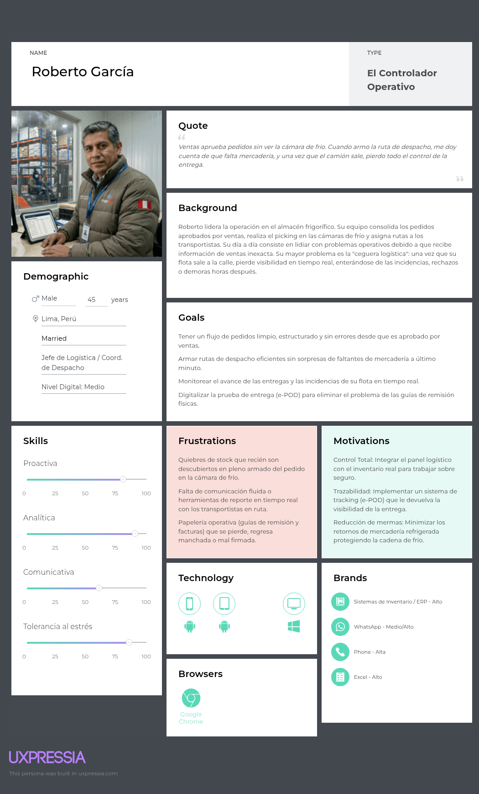
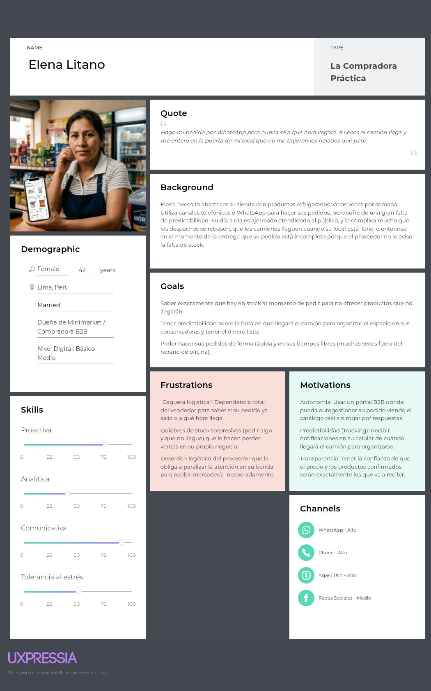
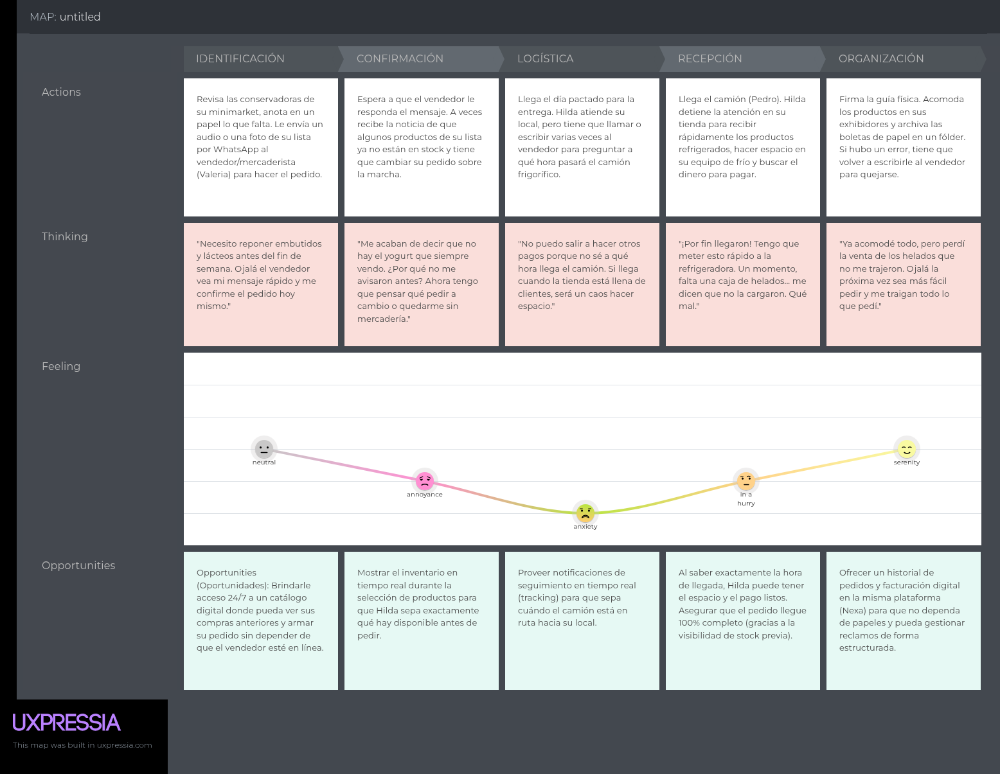
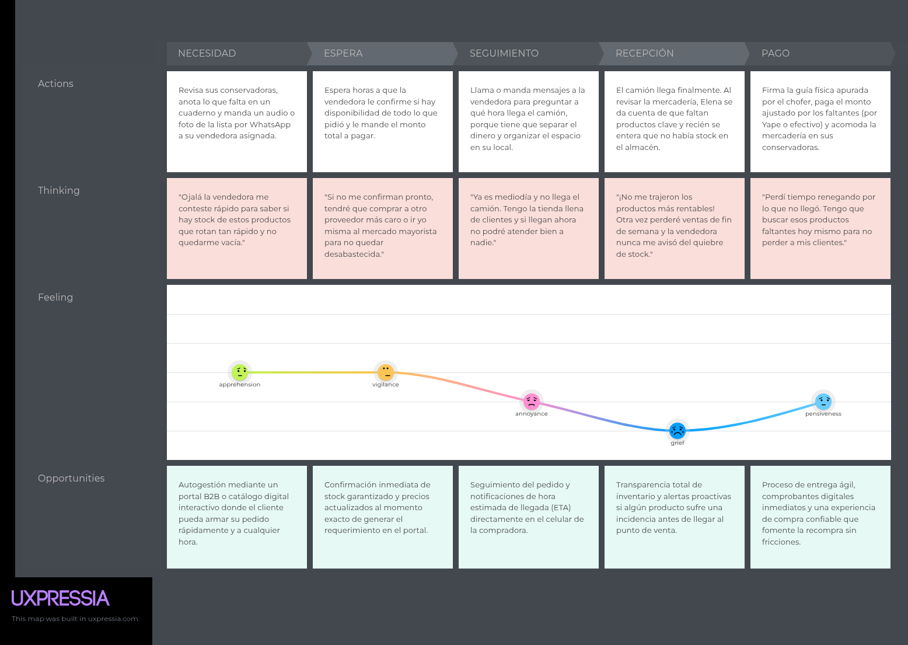
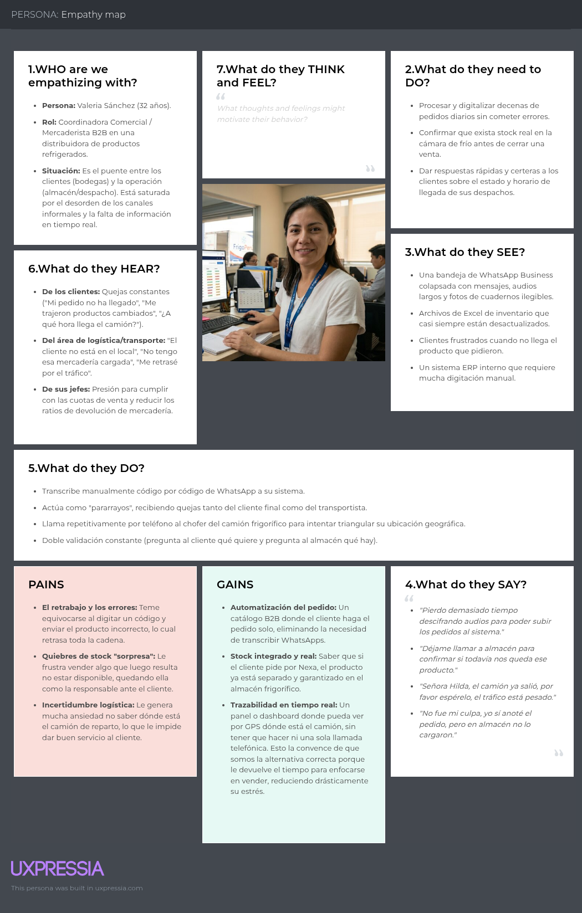
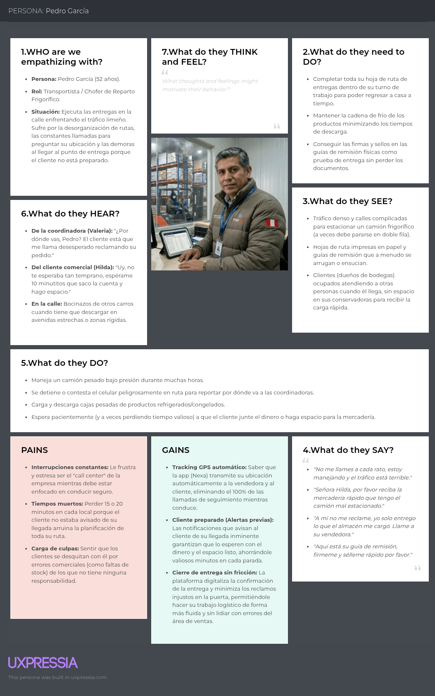

## **2.3. Needfinding**

La construcción de este bloque parte de tres insumos previos. El primero es el análisis de entrevistas del apartado 2.2, que identifica patrones de comportamiento, fricciones recurrentes y expectativas de adopción. El segundo es el análisis competitivo del apartado 2.1, que muestra que las soluciones existentes resuelven fragmentos del problema, pero no articulan con suficiente claridad la continuidad entre captura comercial, abastecimiento del cliente y cierre de entrega. El tercero es la lógica del dominio modelada en el proyecto, que obliga a representar no solo quién usa el sistema, sino en qué momento del flujo su intervención resulta crítica.

Por ello, los artefactos de needfinding no deben interpretarse como piezas visuales aisladas. Su función es traducir evidencia cualitativa en criterios de diseño: quién necesita autonomía, quién necesita visibilidad, quién necesita rapidez, quién necesita trazabilidad y en qué punto del recorrido cada una de esas necesidades se vuelve más sensible. Bajo ese enfoque, el valor del needfinding no está únicamente en mostrar personas, tareas o journeys, sino en demostrar cómo esas representaciones ayudan a delimitar el alcance del MVP y a justificar decisiones posteriores de backlog, arquitectura y experiencia de usuario.

### ***2.3.1. User Personas***

La tabla resume la relación entre evidencia cualitativa, arquetipo sintetizado y función de diseño. Elaboración propia.

*User Persona — Segmento 1: Valeria Sánchez*

> *Nota:* Representación del arquetipo de vendedoras y coordinación comercial, enfocado en reducir la carga administrativa y el retrabajo en la captura del pedido. Elaboración propia.

*User Persona — Segmento 2: Roberto García*

> *Nota:* Representación sintética del arquetipo de coordinación logística y operativa, enfocada en el control del cumplimiento, la visibilidad del despacho y el cierre con evidencia. Su construcción se apoya en hallazgos de trazabilidad, incidencias y coordinación operativa dentro del dominio. Elaboración propia.

*User Persona — Segmento 3: Elena Litano*

> *Nota:* Representación sintética del arquetipo de comprador comercial B2B, construida a partir de entrevistas a compradores minoristas y mayoristas, más evidencia de adopción digital del canal tradicional. Elaboración propia.

### ***2.3.2. User Task Matrix***

Esta Sección resume qué actividades concentran mayor frecuencia e importancia relativa para cada segmento canónico. Su función no es enumerar funcionalidades del sistema, sino identificar qué tareas del trabajo real deben ser mejor soportadas por el producto para reducir fricción y sostener adopción.
| Tareas Identificadas (Tasks)                                                           | Segmento 1: Valeria (Ventas) |           | Segmento 2: Roberto (Logística) |       | Segmento 3: Elena (Comprador) |       |
|:---------------------------------------------------------------------------------------|:-----------------------------|:----------|:--------------------------------|:------|:------------------------------|:------|
| **Evaluar necesidades de abastecimiento e inventario local**                           | -                            | -         | -                               | -     | Alta                          | Alta  |
| **Consultar y validar disponibilidad de stock (Catálogo/Cámara)**                      | Alta                         | Alta      | Alta                            | Alta  | Alta                          | Alta  |
| **Emitir solicitud de pedido / Realizar la compra**                                    | -                            | -         | -                               | -     | Alta                          | Alta  |
| **Recepcionar, interpretar y transcribir el pedido**                                   | Alta                         | Alta      | -                               | -     | -                             | -     |
| **Consolidar pedidos y preparar mercadería (Picking)**                                 | -                            | -         | Alta                            | Alta  | -                             | -     |
| **Asignar rutas y gestionar el despacho de transporte**                                | -                            | -         | Alta                            | Alta  | -                             | -     |
| **Hacer seguimiento al estado de la entrega en ruta (Tracking)**                       | Media                        | Alta      | Altta                           | Alta  | Alta                          | Alta  |
| **Recepcionar la mercadería en el punto de venta y pagar**                             | -                            | -         | -                               | -     | Alta                          | Alta  |
| **Gestionar documentación física (Guías de remisión, facturas)**                       | Baja                         | Media     | Alta                            | Alta  | Media                         | Media |
| **Atender y gestionar incidencias, reclamos o devoluciones**                           | Media                        | Alta      | Media                           | Alta  | Media                         | Alta  |

### ***2.3.3. User Journey Mapping***

*Journey Map — Segmento 1: Coordinación Comercial*

> *Nota:* Mapeo del proceso de captura y gestión de pedidos, identificando puntos de dolor en la transcripción manual. Elaboración propia.

*Journey Map — Segmento 2: Despacho y Entrega*

> *Nota:* Mapeo de la ruta logística, enfatizando los cuellos de botella en la comunicación de incidencias. Elaboración propia.

*Journey Map — Segmento 3: Cliente Comercial B2B*

> *Nota:* Mapeo de la experiencia de abastecimiento del cliente, destacando la incertidumbre en el seguimiento de entrega. Elaboración propia.

El principal valor del bloque no está en describir tres trayectos separados, sino en demostrar que el punto de dolor cambia de forma pero no de origen. En el Segmento 1 el problema aparece como ambigüedad y retrabajo; en el Segmento 3 como opacidad del abastecimiento e incertidumbre; y en el Segmento 2 como incidencias, demoras y cierre sin evidencia suficiente. Dicho de otro modo, los journeys confirman que el problema central no es una sola pantalla mal resuelta, sino una cadena de decisiones y validaciones que hoy pierde continuidad entre actores.

Esta lectura también deja una implicancia directa para diseño: el MVP necesita mejorar no solo la captura del pedido, sino también los momentos de transición entre estados. Si el sistema estructura bien el pedido, pero no comunica con claridad su confirmación, preparación, despacho o entrega, el valor percibido seguirá fragmentado. Por eso los journeys sostienen la prioridad de estados visibles, historial del pedido, confirmación clara y trazabilidad mínima del cierre.

### 2.3.4. As-Is Scenario Map

El recorrido del As-Is Scenario Map se estructura en seis etapas operativas, alineadas estrictamente con los tres segmentos canónicos del producto y representados por sus respectivos User Personas: Segmento 1 (Coordinación Comercial), Segmento 2 (Transportista / Despacho) y Segmento 3 (Compradores B2B).

#### Mapa de Escenario Actual (As-Is)

| Etapa Operativa (As-Is) | Actores | Acciones actuales | Pain points reales | Emociones / Fricciones                                               | Oportunidades de diseño |
|---|---|---|---|----------------------------------------------------------------------|---|
| **1. Necesidad y reabastecimiento** | S3: Compradores B2B | Revisa stock propio en sus conservadoras, estima rotación, arma lista mental o en papel, y consulta por WhatsApp/llamada. | Catálogo desactualizado, sin precios ni disponibilidad visible, sin histórico de compras ágil. | Incertidumbre, urgencia, dependencia del vendedor. | Catálogo vivo con precios, disponibilidad y sugerencias de compra por cliente. |
| **2. Captura del pedido** | S1: Coord. Comercial, S3: Compradores B2B | El pedido entra por WhatsApp, audio, foto de lista o llamada. S1 transcribe e interpreta al ERP/Excel. | Transcripción manual, ambigüedad de códigos, doble digitación, stock no confirmado en tiempo real. | Presión, retrabajo, miedo a equivocarse al transcribir. | Formulario estructurado con validación de SKU, precio, stock y crédito en un solo paso. |
| **3. Validación de stock, crédito y FEFO** | S1: Coord. Comercial, S2: Jefatura Logística (ej. Roberto) | S1 consulta stock en ERP y por teléfono a almacén; revisa crédito en módulo separado. S2 confirma por lote/vencimiento. | Stock desactualizado en ERP, crédito fragmentado, rotación FEFO/FIFO coordinada verbalmente. | Desconfianza del sistema, interrupciones constantes entre áreas.                  | Vista única de stock real, crédito disponible y lotes priorizados por vencimiento. |
| **4. Preparación y picking en almacén** | S2: Almacén y Jefatura Logística | Se imprime guía de remisión, se arman cajas/pallets manualmente, se valida visualmente temperatura y fecha. | Errores de picking, lote incorrecto, ruptura de cadena de frío no registrada, quiebres de stock descubiertos tarde. | Estrés por el tiempo, reclamos posteriores, riesgo de mermas.                      | Lista de picking digital con lote/vencimiento sugerido y checklist de temperatura integrado. |
| **5. Despacho y tránsito** | S2: Coord. de Despacho | Cargan vehículo, salen con guía física, coordinan ruta por teléfono; el cliente llama a ventas para saber ETA. | "Ceguera logística": sin ETA visible para el cliente, sin trazabilidad en ruta, llamadas interrumpen al conductor. | Cansancio, llamadas invasivas cruzadas, ansiedad del cliente final.                  | ETA compartido, seguimiento de ruta ligero y registro mínimo de temperatura |
| **6. Entrega y cierre** | S2: Transportista, S3: Compradores B2B | Descarga, conteo manual, firma en guía física manchada o arrugada; reclamos por cantidades o vencimientos. | Cierre sin evidencia digital, disputas difíciles de resolver sobre quién rompió la cadena de frío, trazabilidad nula. | Frustración, desconfianza, reclamos post-entrega que afectan cobranzas.                     | Prueba de entrega digital (POD) con captura de firma, fotos, registro de temperatura y motivos de rechazo. |

Estos puntos no se presentan como funciones implementadas de Nexa en su primera versión, sino como el mapa general de oportunidades que el producto pretende atacar mediante incrementos. La prioridad inicial será resolver la captura estructurada del pedido y devolver la visibilidad de estado (trazabilidad) entre el Segmento 1 (Ventas), el Segmento 2 (Logística) y el Segmento 3 (Comprador).

### ***2.3.5. Empathy Mapping***

A continuación, se presentan los Empathy Maps desarrollados para cada segmento objetivo.

*Empathy Map — Segmento 1: Coordinación Comercial*

> *Nota:* Análisis de expectativas y temores del personal administrativo respecto a la adopción tecnológica. Elaboración propia.

*Empathy Map — Segmento 2: Despacho y Entrega*

> *Nota:* Exploración del entorno laboral y necesidades de soporte del personal en ruta. Elaboración propia.

*Empathy Map — Segmento 3: Cliente Comercial B2B*

> *Nota:* Identificación de motivadores extrínsecos e intrínsecos para la digitalización del bodeguero. Elaboración propia.

En términos de producto, los empathy maps confirman tres criterios de diseño. Primero, la herramienta debe reducir esfuerzo cognitivo en el Segmento 1, no aumentarlo. Segundo, debe generar confianza en el Segmento 3, no solo eficiencia transaccional. Tercero, debe proteger al Segmento 2 frente a ambigüedades del cierre operativo, ofreciendo visibilidad, trazabilidad y un registro suficiente de la preparación y entrega. Bajo esta lectura, el needfinding deja de ser un conjunto de imágenes explicativas y se convierte en una base argumental para justificar por qué el MVP prioriza captura estructurada, visibilidad compartida y evidencia mínima de entrega.

