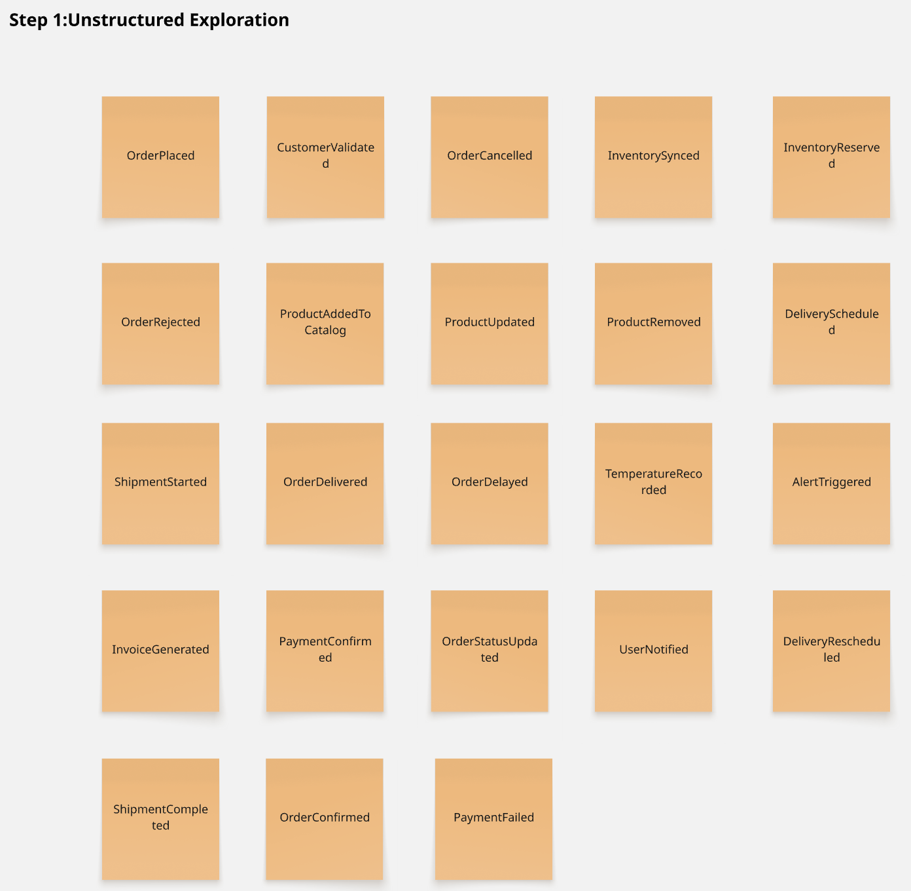
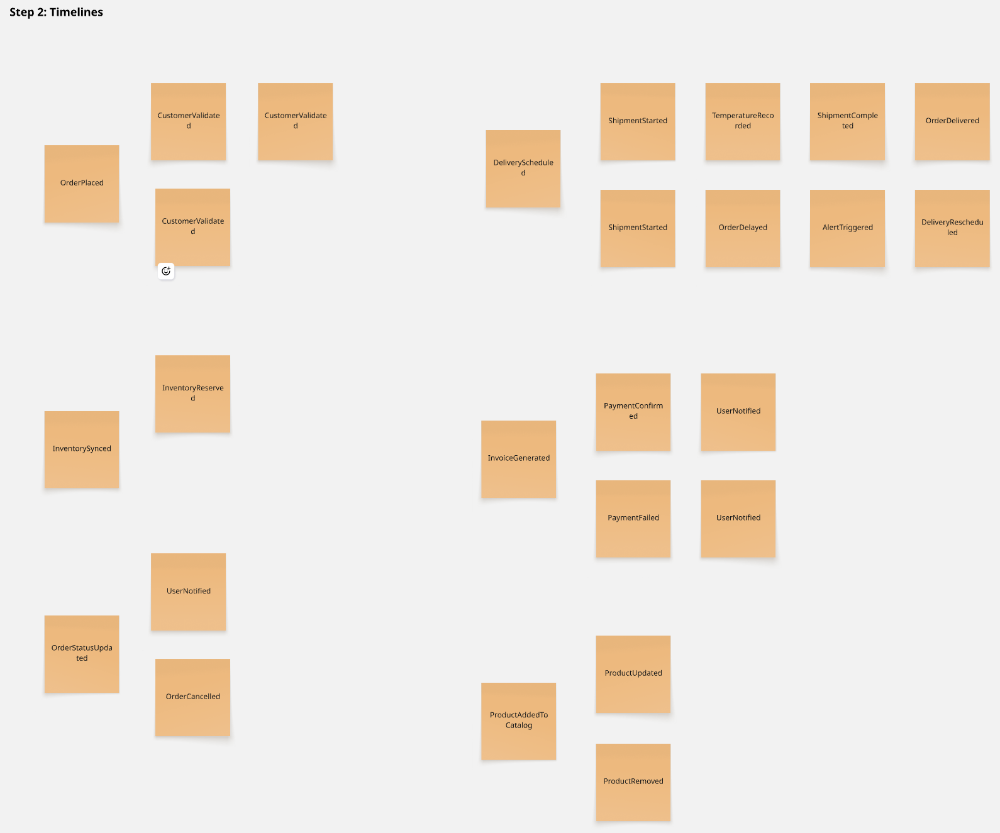
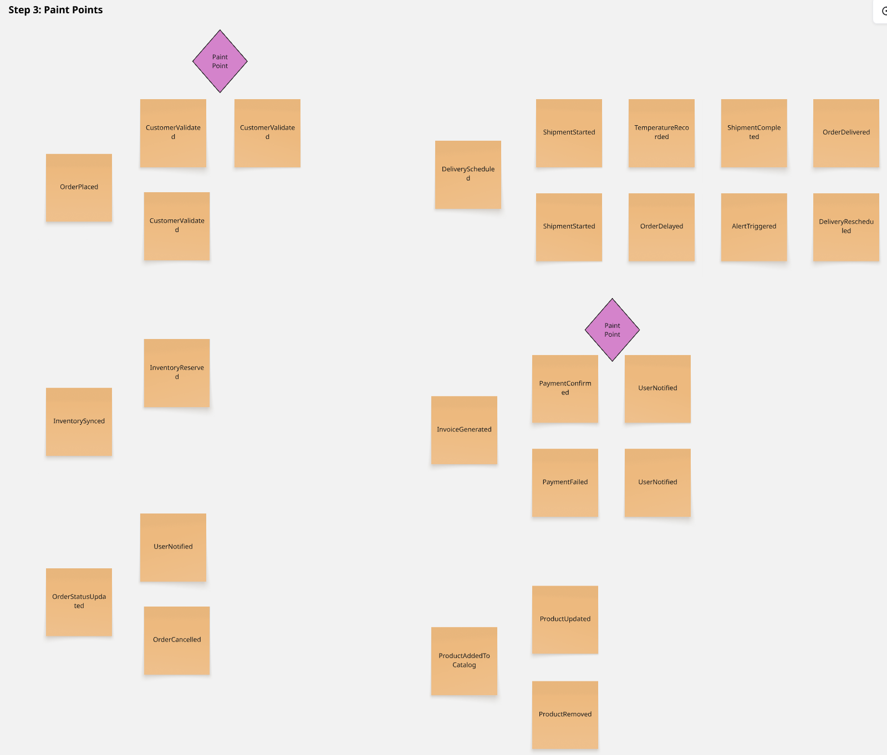

## 2.4. Big Picture Eventstorming

El Big Picture EventStorming de Nexa modela el flujo principal del pedido B2B de productos refrigerados, desde la intención de compra hasta el cierre de la entrega. Su propósito en esta etapa no es diseñar todavía la arquitectura técnica del sistema, sino hacer visible el recorrido del negocio, los actores que intervienen, los eventos más relevantes del dominio y los puntos de fricción que explican por qué el problema persiste.

El modelado mantiene la misma taxonomía canónica definida en el proyecto. En ese marco, <strong>S1</strong> se expresa principalmente en la captura asistida y validación comercial, <strong>S2</strong> en la consulta, envío y seguimiento del pedido por parte del cliente comercial, y <strong>S3</strong> en el despacho, la gestión de incidencias y el cierre de la entrega. Las restricciones operativas del dominio permanecen visibles a lo largo del flujo, pero no redefinen la segmentación del informe.

El EventStorming se construyó como un ejercicio de síntesis del dominio a partir de la evidencia reunida en entrevistas, needfinding y análisis competitivo. En lugar de partir de pantallas o módulos, el equipo ordenó primero los hechos que modifican el estado del pedido y luego examinó qué actores, restricciones y tensiones aparecen en esas transiciones. Este enfoque resulta útil porque evita diseñar el sistema desde una lista de funcionalidades dispersas y obliga a pensar el producto como una secuencia coherente de eventos del negocio.

Como respaldo del trabajo colaborativo, la evidencia visual del modelado presenta las tres primeras etapas (Exploración, Línea de Tiempo y Puntos de Dolor) directamente en esta sección. El detalle técnico completo (desde la definición de Comandos y Políticas hasta los Contextos Delimitados) se documenta en la sección 4.6.1, junto con las evidencias de coordinación del sprint registradas en el anexo.

### 2.4.1. Proceso de construcción del modelado

*Design-Level EventStorming — Step 1: Exploration*

*Design-Level EventStorming — Step 2: Timeline*

*Design-Level EventStorming — Step 3: Pain Points*

*Proceso de construcción del modelado*

| Etapa | Propósito | Resultado obtenido |
| :--- | :--- | :--- |
| **1. Delimitación del flujo** | Definir qué tramo del negocio debía representarse en el MVP | Se acotó el modelado desde la intención de compra hasta el cierre de entrega |
| **2. Identificación de eventos** | Reconocer qué hechos cambian realmente el estado del pedido | Se consolidó la secuencia borrador → envío → validación → confirmación → preparación → despacho → entrega |
| **3. Asociación de actores e intervención** | Vincular cada cambio de estado con los responsables y momentos críticos del flujo | Se clarificó la participación de cliente comercial, coordinación comercial, operación y reparto |
| **4. Identificación de restricciones** | Hacer visibles las fricciones y condiciones operativas que impiden un flujo continuo | Se incorporaron validación comercial tardía, stock incierto, FEFO manual, visibilidad fragmentada y cierre débil de entrega |

La tabla resume el proceso seguido para convertir evidencia cualitativa en un modelo de dominio entendible y útil para el MVP. Elaboración propia.

### 2.4.2. Actores del dominio

*Actores del dominio*

| Actor | Responsabilidad principal |
|-------|----------------------------|
| Cliente comercial | Consulta catálogo, crea pedidos y da seguimiento a la entrega |
| Coordinación comercial | Identifica al cliente, captura pedidos asistidos, valida condiciones y comunica incidencias |
| Supervisión comercial / operación | Configura catálogo, clientes, crédito, reglas y seguimiento |
| Almacén / operación | Prepara el pedido, confirma disponibilidad y controla lotes o vencimientos |
| Chofer de reparto | Ejecuta el despacho y registra el cierre de entrega |
| Administrador autorizado | Gestiona cuentas internas y parámetros base del sistema |

### 2.4.3. Eventos del dominio y puntos de tensión principales

*Eventos del dominio y puntos de tensión principales*

| Evento del dominio | Actores implicados | Tensión o implicancia observada |
|---------|----------------------------|----------------------|
| Cliente consulta disponibilidad o solicita mercadería | Cliente comercial, coordinación comercial | El pedido suele nacer con información incompleta o por canales informales |
| Pedido creado en borrador | Coordinación comercial, cliente comercial | La información todavía puede contener ambigüedades, omisiones o retrabajo |
| Pedido enviado para revisión | Coordinación comercial, operación comercial | Empieza un tramo sensible donde crédito, stock y condiciones frenan la continuidad |
| Pedido validado o bloqueado | Coordinación comercial, supervisión comercial / operación | El problema no es solo aprobar o rechazar, sino hacerlo antes de prometer algo inviable |
| Pedido confirmado | Coordinación comercial, almacén / operación, cliente comercial | La confirmación debe sostener confianza y preparar el cumplimiento operativo real |
| Pedido en preparación | Almacén / operación | Aparecen tensiones de disponibilidad, lote, vencimiento y prioridad FEFO |
| Pedido despachado | Operación, chofer de reparto, cliente comercial | La visibilidad del estado empieza a ser crítica para evitar incertidumbre y reclamos |
| Incidencia de ruta registrada | Chofer de reparto, coordinación comercial, cliente comercial | Si la incidencia no se comparte a tiempo, el problema vuelve a fragmentarse |
| Entrega cerrada con evidencia | Chofer de reparto, cliente comercial, supervisión comercial / operación | El cierre débil deja reclamos abiertos y baja trazabilidad del servicio |
| Pedido cancelado antes de despacho | Coordinación comercial, operación | La cancelación exige recuperar continuidad operativa y evitar compromisos inconsistentes |

### 2.4.4. Pain points y restricciones operativas identificadas

*Pain points y restricciones operativas identificadas*

| Pain point o restricción | Dónde aparece | Efecto sobre el flujo |
|----------|------------|------------------|
| Validación comercial tardía | Entre envío y confirmación del pedido | Se prometen pedidos que luego deben corregirse o bloquearse |
| Stock poco confiable o poco visible | Antes de la confirmación y durante preparación | La disponibilidad percibida no coincide con la realidad operativa |
| Visibilidad fragmentada del estado | Entre confirmación, despacho e incidencia | Cada actor pierde contexto y aumenta la dependencia de llamadas o mensajes |
| Control FEFO manual o disperso | Durante preparación y despacho | El manejo de vencimientos depende de memoria operativa y revisiones paralelas |
| Cierre de entrega con evidencia insuficiente | Al final del flujo | Quedan reclamos, dudas sobre cumplimiento y poca trazabilidad del servicio |
| Dependencia de coordinación humana para destrabar el proceso | En todo el ciclo del pedido | El flujo no escala bien y se vuelve sensible a interrupciones y retrabajo |

### 2.4.5. Comandos, políticas y read models del dominio

A partir de los eventos y los pain points identificados, el Big Picture permite explicitar los <strong>comandos</strong> (intenciones que disparan cambios de estado), las <strong>políticas</strong> (reacciones automáticas del dominio ante ciertos eventos) y los <strong>read models</strong> (vistas de solo lectura que los actores necesitan para decidir). Esta explicitación refuerza la lectura ingenieril del flujo sin introducir artefactos técnicos nuevos: se derivan únicamente de los eventos ya modelados.

| Comando (intención del actor) | Evento(s) que dispara | Política reactiva del dominio | Read Model que habilita la decisión |
|---|---|---|---|
| `SolicitarPedido` (S2) | `PedidoBorradorCreado` | Si el cliente no tiene crédito hábil, el pedido se marca como "a validar" | `CatálogoDisponibleParaCliente` (stock + precio + condiciones) |
| `EnviarPedidoParaValidación` (S1) | `PedidoEnviadoParaRevisión` | Reserva temporal de stock por ventana definida de validación | `ResumenDePedidoPendiente` (ítems, totales, crédito disponible) |
| `ValidarPedido` (S1 / Supervisión) | `PedidoValidado` o `PedidoBloqueado` | Si el stock real difiere del reservado, se notifica a coordinación y se re-valida | `VistaDeCréditoYMorosidad`, `StockRealPorSKU` |
| `ConfirmarPedido` (S1) | `PedidoConfirmado` | Se genera orden de preparación y se notifica al cliente S2 | `EstadoDelPedidoParaCliente` |
| `PrepararPedido` (Almacén) | `PedidoEnPreparación`, `LoteAsignado` | Política FEFO: sugerir lote con vencimiento más próximo apto | `ListaDePickingFEFO` (SKU, lote, vencimiento, ubicación) |
| `DespacharPedido` (Almacén/S3) | `PedidoDespachado` | Se inicia el seguimiento de ruta y se habilita ETA para el cliente | `HojaDeRuta`, `ETAParaCliente` |
| `RegistrarIncidenciaDeRuta` (S3) | `IncidenciaDeRutaRegistrada` | Notificación automática a coordinación comercial y al cliente | `BitácoraDeIncidenciasPorPedido` |
| `CerrarEntrega` (S3) | `EntregaCerradaConEvidencia` | Se cierra el pedido y se archiva la evidencia de entrega (POD) | `PruebaDeEntrega` (firma, foto, temperatura, hora) |
| `CancelarPedido` (S1 / S2) | `PedidoCancelado` | Liberación automática de stock reservado y ajuste de crédito | `EstadoDelPedidoParaCliente` |

Los comandos expresan la intención del actor; los eventos confirman que el estado efectivamente cambió; las políticas capturan las reacciones automáticas que el dominio debe sostener (reservas, validaciones, notificaciones, FEFO, liberación de stock); y los read models son las vistas consolidadas que permiten a S1, S2 y S3 decidir con información consistente. Juntos, cierran la narrativa del Big Picture como una cadena de <em>intención → hecho → reacción → visibilidad</em>, no como pantallas aisladas.

### 2.4.6. Evidencia de colaboración del modelado

  
   <em>Figura: Sesión colaborativa del equipo KING durante la construcción del Big Picture EventStorming. Elaboración propia.</em>

### 2.4.7. Flujo resumido del dominio

1. El cliente consulta el catálogo o la coordinación comercial captura el pedido de forma asistida.
2. Se identifican las condiciones comerciales y la disponibilidad necesarias para revisar el pedido.
3. El pedido pasa de borrador a enviado para validación.
4. La coordinación comercial y la operación revisan crédito, morosidad y disponibilidad básica antes de confirmar.
5. Si la validación es satisfactoria, el pedido se confirma y queda listo para preparación.
6. La operación prepara la salida y coordina el despacho.
7. Durante el despacho pueden registrarse incidencias y actualizarse la comunicación de entrega.
8. La entrega se cierra con evidencia y el pedido queda concluido.

Este modelado refuerza dos ideas centrales del proyecto: el problema principal no está en un único “módulo” aislado, sino en la transición entre captura, validación, disponibilidad, despacho y cierre; y las restricciones operativas del dominio siguen siendo decisivas para definir reglas y criterios de funcionamiento a lo largo del flujo.

La principal contribución del EventStorming al capítulo no es solo ordenar nombres de eventos, sino mostrar que el valor del sistema depende de sostener continuidad entre estados. Si el pedido cambia de mano entre actores, pero el sistema no conserva reglas, evidencia y visibilidad comunes, el problema persiste aunque existan interfaces nuevas. En ese sentido, el modelado confirma que la unidad real de diseño no es una pantalla aislada, sino el tránsito completo del pedido entre S1, S2, S3 y las restricciones definidas por la operación.

