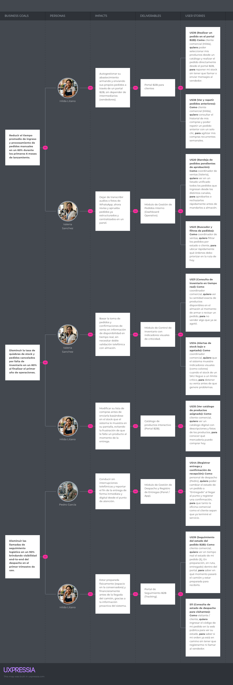

## 3.2. Impact Mapping

El Impact Mapping es una técnica de planificación estratégica propuesta por Gojko Adzic que permite alinear el desarrollo de software con objetivos de negocio explícitos. En lugar de partir de una lista extensa de funcionalidades, el método obliga a responder cuatro preguntas en secuencia: qué meta se persigue, qué actores pueden influir sobre ella, qué cambios de comportamiento son necesarios y qué entregables permiten provocar dichos cambios. En el contexto de Nexa, esta técnica se emplea para convertir la evidencia del Capítulo 2 en un criterio de priorización defendible dentro del backlog.

Su valor dentro del informe es metodológico. El mapa de impactos actúa como puente entre la investigación cualitativa y la especificación funcional: toma los problemas observados en entrevistas, needfinding y EventStorming, los ordena por impacto sobre el negocio y evita que el producto se expanda prematuramente hacia capacidades atractivas pero secundarias. Por ello, el mapa no se limita a ilustrar actores o módulos; su función es justificar por qué el MVP se concentra en el flujo crítico del pedido B2B refrigerado y no en una digitalización total de la empresa desde la primera iteración.

El mapa se estructura en cuatro niveles fundamentales:

1. **Meta (Goal):** resultado de negocio que se desea alcanzar.
2. **Actor:** participante cuyo comportamiento puede acercar o alejar la meta.
3. **Impacto:** cambio observable en la forma de actuar del actor.
4. **Entregable (Deliverable):** componente funcional o técnico que facilita dicho cambio.

*Impact Mapping de Nexa — Alineación de metas, actores e impactos del MVP*

Elaboración propia. El mapa sintetiza la relación entre problemas observados en la investigación, actores priorizados y entregables requeridos para el MVP.

La lectura central del diagrama es que Nexa no persigue una optimización genérica de la cadena de frío, sino una reducción específica de fricción en el pedido y en su trazabilidad posterior. Esa definición es importante porque delimita alcance. El proyecto prioriza visibilidad comercial y operativa donde la investigación encontró mayor densidad de errores: captura informal del pedido, validación tardía de stock o condiciones, incertidumbre sobre la entrega y baja capacidad de cierre con evidencia trazable.

En esta lectura, la supervisión operativa se mantiene como <em>stakeholder secundario</em>. Su presencia es decisiva para definir restricciones, validar estados, controlar lotes y sostener la trazabilidad; sin embargo, el mapa conserva como actores protagónicos a Valeria, Hilda y Pedro porque son ellos quienes concentran la interacción funcional más directa con el flujo del MVP. Esta distinción mantiene consistencia con la taxonomía ya consolidada en el Capítulo 2.

*Lectura analítica del Impact Mapping de Nexa*

| Nivel del mapa | Elemento priorizado | Sustento en Capítulo 2 | Traducción en especificación |
| :--- | :--- | :--- | :--- |
| Meta | Reducir la opacidad del flujo de pedido B2B refrigerado | Entrevistas y needfinding mostraron dependencia de mensajes dispersos, revisión manual y seguimiento poco visible. | Priorización de historias de catálogo, captura asistida, pedido B2B, ETA, POD e inventario. |
| Actor | `Valeria` como frente comercial interno | Necesidad de registrar pedidos sin doble digitación y consultar condiciones del cliente antes de comprometer la operación. | Épicas EP07, EP12 y parte de EP14. |
| Actor | `Hilda` como cliente comercial recurrente | Necesidad de consultar un catálogo confiable, repetir compras y seguir el despacho sin depender de llamadas o WhatsApp. | Épicas EP07, EP08 y EP10. |
| Actor | `Pedro` y el cierre operativo | Necesidad de registrar eventos, documentar la entrega y sostener reclamos con evidencia verificable. | Épicas EP10, EP11 y servicios de tracking/POD. |
| Impacto | Sustituir interacciones informales por flujos estructurados | En el análisis de entrevistas se observaron audios, listas y llamadas como soporte principal del pedido. | Historias de pedido asistido, borradores, confirmación trazable y endpoints de creación de órdenes. |
| Impacto | Anticipar restricciones antes de prometer la entrega | Hallazgos sobre stock incierto, mora, crédito y validación demasiado tardía. | Alertas de validación, bloqueo por crédito, reserva de stock y consulta de saldo. |
| Impacto | Dar visibilidad al estado real del despacho | Needfinding y journey maps mostraron incertidumbre sobre ETA, incidencias y recepción. | Gestión de estados, tracking, incidencias, POD y consulta de cierre. |
| Deliverable | MVP dividido en frente público, núcleo transaccional y capa de integración | La solución necesita comunicar valor, ejecutar el flujo central y sostenerlo con contratos consistentes. | Organización del backlog en EP01-EP14 y release map por bloques funcionales. |

Una consecuencia relevante de esta lectura es que el mapa también justifica exclusiones. Quedan fuera del MVP inicial funcionalidades más amplias como analítica avanzada, optimización de rutas o automatizaciones secundarias porque, aunque puedan ser valiosas en el mediano plazo, no atacan primero el punto de quiebre identificado en la investigación: la discontinuidad entre captura, validación, abastecimiento y entrega. Mantener esa frontera fortalece la coherencia del capítulo, ya que el backlog deja de parecer una acumulación de ideas y se presenta como una secuencia argumentada de decisiones.

Desde la lógica narrativa del informe, el Impact Mapping cumple así una función de bisagra. El Capítulo 2 demuestra dónde está el problema y quiénes lo experimentan con más intensidad; este apartado define qué cambios de comportamiento vale la pena provocar; y el Product Backlog del apartado 3.3 materializa ese razonamiento en un orden de construcción y liberación técnicamente ejecutable. Esa continuidad es la que permite leer el Capítulo 3 como especificación sustentada y no solo como inventario de historias.

