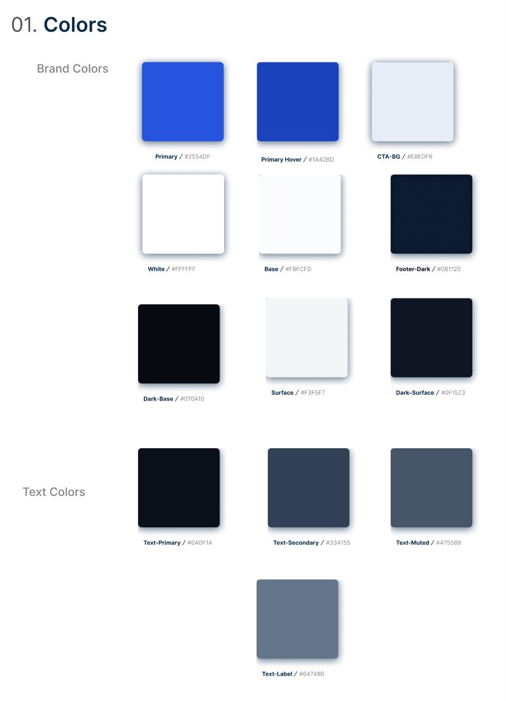
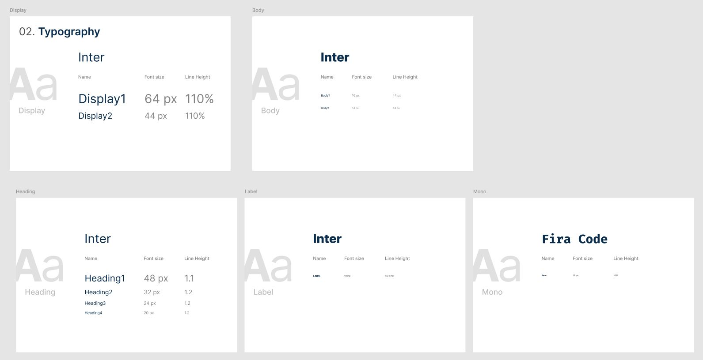
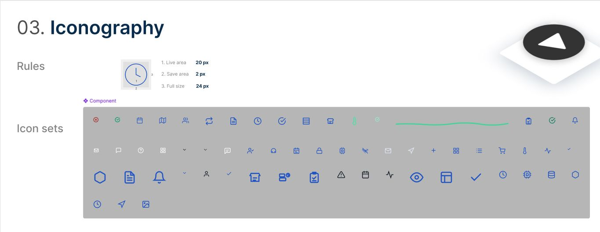

# Capítulo IV: Product Design

El Capítulo IV representa la transición técnica desde la fase de descubrimiento hacia la materialización visual y arquitectónica de la plataforma. En esta sección se documentan los criterios estéticos, las estructuras de información y las decisiones de diseño que permiten transformar los **Bounded Contexts** identificados en el dominio en una solución digital de grado empresarial (Enterprise B2B). Nexa no se construye como una interfaz tradicional, sino como un sistema operativo de decisiones logísticas.

---

## 4.1. Style Guidelines

> *"Estableciendo el lenguaje visual para el control absoluto de la cadena de frío."*

## 4.1.1. General Style Guidelines (Design Ethos)

Nexa se rige por el principio de **"Calm-Tech"**: la interfaz debe actuar como un soporte invisible que facilite el control absoluto sobre la cadena de frío sin generar fatiga cognitiva. En un entorno de distribución primaria, la precisión es más valiosa que la estética decorativa.

> [!IMPORTANT]
> **Filosofía B2B Precision**: La interfaz de Nexa está diseñada para minimizar el error humano mediante la jerarquización estricta de datos críticos (SKU, grados de temperatura, estados de pedido) utilizando el contraste y el espacio en blanco como herramientas de gestión.

- **Percepción Objetivo:** Confiable, Ordenada, Técnica y de grado Enterprise.
- **Lenguaje Visual:** Priorización de densidades de información controladas. El sistema de diseño se aleja de las tendencias efímeras para adoptar una estética que resista el uso intensivo en estaciones de despacho y almacenes.

---

## 4.1.2. Web Style Guidelines

### 01. Colorimetry: El Sistema HSL Dinámico

La paleta se fundamenta en un sistema **HSL (Hue, Saturation, Lightness)** que permite una gestión dinámica del contraste y la adaptabilidad ante diversas condiciones lumínicas en centros logísticos.

*Sistema de Colorimetría Nexa*

Especificación de Brand Colors y Text Colors. Elaboración propia.

| Semaforización | Propósito Operativo | HSL / HEX Baseline |
| --- | --- | --- |
| Primary Blue | Acciones de mando, confirmación y jerarquía de marca. | `221, 72%, 45%` \| `#2554DF` |
| Optimal State | Trazabilidad dentro de parámetros térmicos seguros. | `160, 80%, 32%` \| `#16A34A` |
| Critical Alert | Ruptura de cadena de frío o error en procesamiento. | `2, 70%, 49%` \| `#DC2626` |

#### 02. Typography: Legibilidad en Pantalla

Se ha estandarizado el uso de **Inter** como familia tipográfica universal. Esta decisión técnica (no solo estética) garantiza que la información se mantenga legible incluso en condiciones de baja resolución o alta fatiga ocular.

*Sistema Tipográfico Nexa*

Definición de jerarquías para Display, Headings, Body y Mono. Elaboración propia.

> **Matriz Tipográfica Técnica**
>
> - **Hero Titles:** `clamp(46px, 5.8vw, 84px)` | Letter-spacing: -0.065em (Compresión para impacto visual).
> - **Data Subtitles:** `18px - 21px` | Weight: 600 (Énfasis estructural).
> - **Operational Body:** `16px` | Line-height: 1.68 (Optimizado para lectura prolongada).
> - **Monospace Data:** `12px - 14px` | **Fira Code** (Para lotes, SKUs y telemetría).

#### 03. Iconography: Linealidad y Fluidez

El sistema iconográfico utiliza trazos lineales consistentes para mantener la ligereza visual del portal, evitando que el peso de las imágenes compita con la lectura de los datos operativos.

*Iconografía Nexa*

Biblioteca de iconos vectoriales para navegación y soporte. Elaboración propia.

#### 04. Grid Systems & Technical Layout

Nexa utiliza una rejilla de **12 columnas** con un ancho de contenedor maestro de **1440px**. El diseño responde a la necesidad de visualizar dashboards de control en monitores de almacén, mientras que los flujos de consumo rápido se adaptan a tablets y smartphones.

*Sistema de Rejilla y Breakpoints*

Dimensionamiento para Desktop HD, Desktop y Tablet. Elaboración propia.

#### 05. Spacing & Rhythm System

El ritmo visual se basa en una escala de múltiplos de **4px**, un estándar de la industria que garantiza que cada elemento de la interfaz tenga una separación armónica y predecible.

*Escala de Espaciado Nexa*

Niveles de espaciado desde 4px hasta 96px. Elaboración propia.

---

## 4.1.3. Micro-Interactions & Motion Principles

El movimiento en Nexa está diseñado para dar sensación de **Relatividad Operativa** y fluidez sistémica. No se trata de efectos visuales, sino de retroalimentación de estado.

- **Perception Performance:** Las transiciones de 150ms a 250ms comunican que el sistema es "ligero" y "rápido", factores críticos en la percepción de eficiencia B2B.
- **Easing Curve:** Uso de `cubic-bezier(0.25, 0.46, 0.45, 0.94)`. Esta curva simula el inicio rápido y desaceleración suave, transmitiendo precisión técnica.

---

## 4.1.4. Accessibility & Compliance (WCAG 2.1)

La inclusividad es un requisito funcional. El sistema cumple con el estándar **AA de las WCAG 2.1**, asegurando que cualquier operario pueda utilizar la plataforma sin importar sus capacidades visuales o motrices.

| Criterio WCAG | Implementación Nexa | Estado |
| --- | --- | --- |
| 1.4.3 Contrast (Minimum) | Ratio de contraste 4.5:1 en todos los textos sobre fondos claros y oscuros. | ✓ Pass |
| 2.1.1 Keyboard Accessible | Navegación completa por tabulación en el selector de idiomas y soporte técnico. | ✓ Pass |
| 2.4.4 Link Purpose | Uso de `aria-label` descriptivos en botones de solución y enlaces externos. | ✓ Pass |

---

## 4.1.5. Design Tokens Architecture

La mantenibilidad del diseño se asegura mediante una arquitectura de **Design Tokens** implementada en CSS nativo a través de variables de entorno. Esto facilita la escalabilidad del proyecto, permitiendo cambios globales (como rebranding o ajustes de contraste para visión reducida) modificando una única línea de código en el archivo `tokens.css`.

> [!NOTE]
> **Ventaja de Ingeniería**: Esta arquitectura reduce la carga de archivos CSS redundantes, mejorando la velocidad de carga de la plataforma en redes móviles de almacenes y zonas rurales donde la conectividad puede ser limitada.

## 4.1.6. Mobile-First & Cross-Platform Strategy

Aunque Nexa es una herramienta B2B orientada al escritorio para la gestión masiva de datos, su diseño contempla el **consumo en movilidad** para operarios de campo. Los componentes interactivos cumplen con una altura mínima de **44px** para garantizar una superficie de contacto apta para dedos, anticipando el uso de tabletas rugerizadas en condiciones de baja temperatura (donde el uso de guantes puede dificultar el toque preciso).

