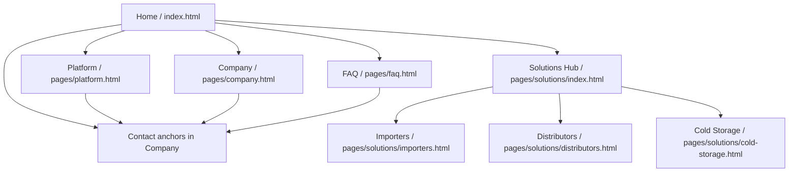

## 4.2. Information Architecture

La arquitectura de información de Nexa se define a partir de la estructura realmente implementada en el repositorio público **`nexa-website`**. En este corte, el sitio no funciona como una aplicación transaccional completa, sino como una experiencia web pública orientada a **explicar la propuesta de valor**, **segmentar a los usuarios por tipo de operación** y **dirigirlos hacia contacto, demostración y comprensión del producto**. Por ello, las decisiones de organización, etiquetado, navegación y SEO responden a una lógica de descubrimiento comercial y reducción de carga cognitiva, no a una lógica de operación interna autenticada.

### 4.2.1. Organization Systems

El sitio de Nexa presenta una arquitectura predominantemente jerárquica con apoyo matricial. El punto de entrada es la página principal, desde la cual el usuario puede desplazarse hacia cuatro áreas troncales: **Platform**, **Solutions**, **Company** y **FAQ**. Dentro de **Solutions** existe un segundo nivel de profundidad que segmenta el contenido por tipo de operador: **Importers & Wholesalers**, **Distributors** y **Cold Storage Operators**. Esta decisión permite que el usuario no tenga que interpretar una lista abstracta de funcionalidades, sino entrar por el nodo operativo que más se parece a su realidad.

*Sitemap del sitio público Nexa*

La profundidad máxima observable es de **dos niveles** desde la página principal. Por ejemplo, un usuario puede seguir la ruta `Home > Solutions > Distributors` sin pasar por capas intermedias innecesarias. Esta baja profundidad favorece rapidez de acceso, simplifica la orientación del usuario y reduce la necesidad de estructuras auxiliares complejas como navegación facetada o árboles extensos de categorías.

*Estructura organizacional observable del sitio público*

| Área del sitio | Páginas incluidas | Rol dentro de la arquitectura |
|---|---|---|
| Núcleo de entrada | `index.html` | Presenta propuesta de valor, pain points, CTA y rutas hacia el resto del ecosistema público |
| Explicación del producto | `pages/platform.html` | Expone módulos, lógica funcional y visión global de la plataforma |
| Segmentación por operador | `pages/solutions/index.html` y subpáginas `importers.html`, `distributors.html`, `cold-storage.html` | Organiza el contenido según tipo de operación y contexto logístico |
| Confianza y contacto | `pages/company.html` | Presenta equipo, enfoque de acompañamiento y formulario de contacto |
| Consulta transversal | `pages/faq.html` | Centraliza preguntas frecuentes y resuelve dudas antes de solicitar una demo |

Esta organización también tiene una dimensión matricial: aunque el sitemap es jerárquico, varias páginas incluyen CTA y atajos cruzados hacia **Company**, **FAQ** y el hub de **Solutions**. En consecuencia, la arquitectura no obliga a una navegación lineal rígida; más bien, combina una base jerárquica clara con accesos laterales que aceleran la conversión y la exploración.

### 4.2.2. Labeling Systems

El sistema de etiquetado de Nexa es consistente con un producto B2B orientado al dominio refrigerado. En la navegación principal se utilizan etiquetas directas y de alta familiaridad: **Inicio**, **Plataforma**, **Soluciones**, **Empresa** y **FAQ**. Estas etiquetas reducen ambigüedad, ya que no recurren a categorías creativas ni a metáforas innecesarias; cada rótulo anticipa con claridad el tipo de contenido al que conduce.

En el caso de la sección **Solutions**, el etiquetado baja a un nivel más específico y mantiene alineación con el lenguaje del dominio: **Importadores y mayoristas**, **Distribuidores** y **Operadores de cámaras frías**. Además, cada etiqueta está acompañada por un micro-copy que contextualiza el caso de uso, por ejemplo “Ingreso portuario para lotes de queso, charcutería y lácteos” o “Cumplimiento de última milla, reposición FEFO y pedidos B2B”. Esta combinación de título corto más descripción breve facilita la discriminación entre segmentos cercanos.

Los llamados a la acción siguen el mismo criterio. Se repiten expresiones consistentes como **Solicitar una demostración**, **Ver la plataforma**, **Agendar recorrido guiado**, **Leer las FAQ** o **Ingresar**. En todos los casos, el verbo comunica una acción concreta y comprensible. Asimismo, el vocabulario de contenido preserva términos del dominio como **inventario**, **pedidos**, **temperatura**, **despacho**, **FEFO**, **POD** y **trazabilidad**, reforzando la coherencia entre hallazgos de dominio y presentación visual del producto.

| Tipo de etiqueta | Ejemplos observables | Función principal |
|---|---|---|
| Navegación global | Inicio, Plataforma, Soluciones, Empresa, FAQ | Orientar al usuario entre áreas troncales |
| Segmentación | Importadores y mayoristas, Distribuidores, Operadores de cámaras frías | Guiar por tipo de operación |
| CTA principales | Solicitar una demostración, Ver la plataforma, Ingresar | Favorecer conversión o siguiente paso |
| Etiquetas del dominio | Inventario, pedidos, FEFO, POD, trazabilidad, monitoreo | Mantener consistencia semántica con el problema real |

### 4.2.3. SEO Tags and Meta Tags

La implementación SEO observable en `nexa-website` se apoya en un conjunto consistente de etiquetas `<title>`, `<meta name="description">`, `<meta name="author">` y propiedades Open Graph (`og:title`, `og:description`, `og:type`). Estas etiquetas están adaptadas al contexto de cada vista y permiten mejorar tanto la indexación del sitio como la forma en que el contenido se presenta al compartirse en plataformas externas.

Es importante señalar dos límites técnicos con honestidad. Primero, el sitio **no implementa** la etiqueta `<meta name="keywords">`; por ello, no conviene afirmar que existe una estrategia basada en keywords explícitas. Segundo, la página `FAQ` tampoco define `<meta name="author">`, por lo que esa ausencia debe reconocerse tal cual. A pesar de ello, el sitio sí demuestra una estrategia SEO on-page moderna basada en títulos descriptivos, meta descriptions específicas y semántica clara por página.

| Página | URL pública esperada | Title | Description | Author | OG Title | OG Description | Keywords |
|---|---|---|---|---|---|---|---|
| Home | `/nexa-website/` | `Nexa — Tu operacion de charcuteria y lacteos, por fin visible` | `Nexa — Un solo lugar para operar tu negocio de charcuteria, quesos y lacteos...` | `Nexa` | `Nexa — Tu operacion de charcuteria y lacteos, por fin visible` | `Deja de perseguir actualizaciones por WhatsApp...` | No implementado |
| Platform | `/nexa-website/pages/platform.html` | `Nexa — What the Platform Does` | `Nexa Platform — One system for charcuterie, cheese, and dairy catalog...` | `Nexa` | `Nexa — What the Platform Actually Does` | `Five operational areas. One system...` | No implementado |
| Company | `/nexa-website/pages/company.html` | `Nexa — Who We Are` | `Nexa — A small team in Lima building the operational system...` | `Nexa` | `Nexa — Who We Are` | `A small team of engineers and operators...` | No implementado |
| FAQ | `/nexa-website/pages/faq.html` | `Nexa FAQ — Everything You Need to Know Before You Decide` | `Nexa FAQ — Answers to the most common questions...` | No implementado | `Nexa FAQ — Everything You Need to Know Before You Decide` | `How long does activation take?...` | No implementado |
| Solutions Hub | `/nexa-website/pages/solutions/` | `Nexa Solutions — Built for the Nodes That Matter Most` | `Nexa Solutions — Purpose-built for charcuterie, cheese, and dairy...` | `Nexa` | `Nexa Solutions — Built for the Nodes That Matter Most` | `Every refrigerated food segment has different demands...` | No implementado |
| Importers | `/nexa-website/pages/solutions/importers.html` | `Nexa Solutions — Importers & Wholesalers` | `Nexa Solutions — Importers & Wholesalers of charcuterie...` | `Nexa` | `Nexa Solutions — Importers & Wholesalers` | `Track container condition...` | No implementado |
| Distributors | `/nexa-website/pages/solutions/distributors.html` | `Nexa Solutions — Charcuterie & Dairy Distribution` | `Nexa Solutions — Distributors for charcuterie, cheese, and dairy...` | `Nexa` | `Nexa Solutions — Charcuterie & Dairy Distribution` | `Replace WhatsApp ordering with B2B ordering...` | No implementado |
| Cold Storage | `/nexa-website/pages/solutions/cold-storage.html` | `Nexa Solutions — Cold Storage Operators` | `Nexa Solutions — Cold Storage Operators for cheese, charcuterie...` | `Nexa` | `Nexa Solutions — Cold Storage Operators` | `Monitor cheese rooms, dairy chambers...` | No implementado |

Además de estas metaetiquetas, todas las páginas incluyen la etiqueta viewport, un encabezado principal visible y una estructura semántica consistente basada en elementos como nav, header, section, aside, main y footer. Esto mejora la legibilidad del contenido tanto para buscadores como para usuarios.

### 4.2.4. Searching Systems

Nexa **no incorpora un motor de búsqueda tradicional**. En el sitio no existe una barra de búsqueda global, tampoco formularios de búsqueda, filtros dinámicos ni páginas de resultados. Por ello, en esta etapa no corresponde describir un search engine como parte del producto público.

La necesidad de descubrimiento se resuelve con navegación directa. El volumen de páginas es reducido, la profundidad del sitio es baja y el dropdown de **Solutions** ya permite llegar rápido al contenido segmentado. Además, varias vistas muestran el acceso “Buscar en el FAQ”; sin embargo, ese recurso funciona como enlace hacia la página de preguntas frecuentes, no como búsqueda interna real.

| Mecanismo de descubrimiento | Implementación observable | Alcance real |
|---|---|---|
| Dropdown de `Solutions` | Menú desplegable con segmentos y descripciones | Descubrimiento de rutas por tipo de operador |
| CTA hacia FAQ | Enlaces como `Leer las FAQ` o `Buscar en el FAQ` | Redirección a respuestas estructuradas |
| Sidebar del FAQ | Navegación por categorías internas | Localización rápida dentro de la página FAQ |
| Atajos de soporte | `support-card` y `support-search` | Acceso rápido a ayuda y contacto |

En consecuencia, el searching system de Nexa en este corte debe entenderse como un mecanismo de descubrimiento apoyado en navegación y accesos directos, no como un buscador autónomo.

### 4.2.5. Navigation Systems

El sistema de navegación de Nexa combina navegación global, navegación contextual, navegación anclada y navegación adaptada a móvil. El elemento central es una **navbar persistente** presente en todas las páginas, compuesta por logo de retorno al inicio, enlaces troncales, dropdown de soluciones, selector de idioma, CTA principal y acceso a FAQ. Esta barra constituye la capa de navegación global del sistema.

En segundo lugar, existe navegación contextual en las subpáginas de soluciones mediante un componente tipo **breadcrumb**, por ejemplo `Soluciones / Distribuidores` o `Soluciones / Importadores y mayoristas`. Aunque el sitio no usa breadcrumbs en todas las páginas, sí los implementa en las vistas de segmento para reforzar orientación dentro de esa rama específica. Esto debe mencionarse con precisión, sin exagerar su alcance a todo el sitio.

En tercer lugar, la página `FAQ` incorpora navegación anclada interna mediante un sidebar con categorías como **Primeros pasos**, **La plataforma**, **Implementación**, **Seguridad y datos** y **Precios y acceso**. Este patrón permite desplazamiento rápido dentro de una única página extensa y funciona como un sistema de navegación local complementario. Asimismo, varias páginas utilizan anclas directas como `company.html#contact` o `faq.html#getting-started`, lo que reduce el número de pasos para alcanzar contenido puntual.

Finalmente, el sitio cuenta con una adaptación móvil clara. El botón `mobile-menu-toggle` abre una navegación colapsada con overlay, manteniendo acceso a links principales, cambio de idioma y CTA. Además, el uso de `skip-to-content` en todas las vistas mejora accesibilidad y acelera la navegación por teclado.

| Capa de navegación | Evidencia en código | Función |
|---|---|---|
| Navegación global | `nav.navbar` en todas las páginas | Acceso consistente a las áreas principales |
| Navegación contextual | `page-hero-breadcrumb` en páginas de soluciones | Orientación dentro de la rama segmentada |
| Navegación local | Sidebar del FAQ con anclas internas | Recorrido rápido en contenido largo |
| Navegación móvil | `mobile-menu-toggle` + `navbar-overlay` | Adaptación a pantallas pequeñas |
| Navegación secundaria | Footer con enlaces por categorías | Refuerzo de rutas frecuentes |
| Navegación de soporte | `support-card` y `support-search` | Atajo a ayuda, contacto y FAQ |

En conjunto, la arquitectura de información de Nexa es coherente con el estado actual del producto. Se trata de un sitio público compacto, con rutas claras, etiquetado consistente, SEO on-page bien resuelto para una landing multipágina y navegación suficiente para orientar al usuario sin recurrir a buscadores complejos ni estructuras sobredimensionadas. Esa proporción entre alcance real e interfaz visible vuelve la sección defendible ante la rúbrica y evita declarar componentes que aún no existen en la implementación.

