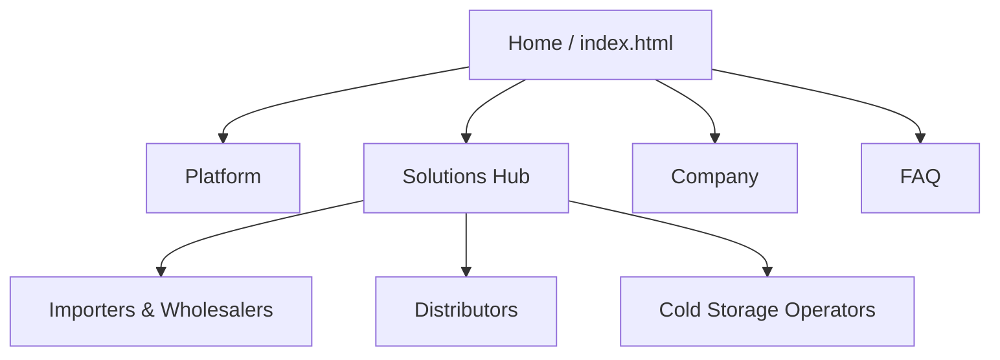

## 4.2. Information Architecture

La arquitectura de información de Nexa se organiza en tres capas que reflejan las tres superficies del producto: el sitio público (landing), la webapp operativa interna (Ops) y el portal de compradores B2B. Cada capa tiene su propia lógica de organización, etiquetado y navegación, pero comparten un vocabulario de dominio común y una progresión coherente desde el descubrimiento hasta la operación.

### 4.2.1. Organization Systems

#### Landing Page — Organización jerárquica con apoyo matricial

El sitio público presenta una arquitectura jerárquica de dos niveles. El punto de entrada es la página principal, desde la cual el usuario accede a cuatro áreas troncales: **Platform**, **Solutions**, **Company** y **FAQ**. Dentro de Solutions existe un segundo nivel que segmenta por tipo de operador: **Importers & Wholesalers**, **Distributors** y **Cold Storage Operators**.

La profundidad máxima es de dos niveles (`Home > Solutions > Distributors`), lo que favorece rapidez de acceso y reduce carga cognitiva. Varias páginas incluyen CTAs cruzados hacia Company, FAQ y el hub de Solutions, combinando la base jerárquica con accesos laterales que aceleran la exploración.

#### Webapp Operativa — Organización funcional por módulo de dominio

La webapp se organiza por módulos de dominio agrupados en un sidebar persistente. La estructura refleja los bounded contexts del negocio: pedidos, inventario, clientes, despacho y reportes. El dashboard funciona como superficie de entrada y lectura rápida del estado general.

#### Portal B2B — Organización transaccional orientada al comprador

El portal ofrece una estructura lineal de catálogo → pedido → seguimiento, diseñada para que el comprador comercial complete su flujo de abastecimiento con autonomía.

### 4.2.2. Route Architecture and Navigation Storytelling

La webapp utiliza Vue Router con hash history (necesario para despliegue en GitHub Pages sin rewrite de rutas). Las rutas se agrupan por experiencia, no por página arbitraria:

| Grupo | Ruta | Significado | Usuarios principales | Propósito |
|---|---|---|---|---|
| Auth | `/auth/login` | Acceso autenticado | Todos | Entrada al sistema con separación por rol |
| Ops | `/ops/dashboard` | Centro de mando operativo | Valeria (S1), Roberto (S2) | Lectura rápida de KPIs y alertas |
| Ops | `/ops/clients` | Gestión de clientes | Valeria (S1) | Ficha, crédito, historial |
| Ops | `/ops/orders/new` | Captura de pedido asistido | Valeria (S1) | Crear pedido con validaciones |
| Ops | `/ops/orders/:id` | Detalle y trazabilidad | Valeria (S1), Roberto (S2) | Historial completo del pedido |
| Ops | `/ops/inventory` | Control de inventario | Roberto (S2) | Disponibilidad, FEFO, riesgo |
| Ops | `/ops/dispatch` | Despacho y asignación | Roberto (S2) | Preparar salidas, asignar flota |
| Ops | `/ops/reports` | Reportes operativos | Valeria (S1), Roberto (S2) | Analítica de negocio |
| Portal | `/portal/catalog` | Catálogo de productos | Lucía (S3) | Explorar y seleccionar productos |
| Portal | `/portal/orders` | Mis pedidos | Lucía (S3) | Historial, seguimiento, recompra |

Las rutas aplican guards basados en scope/rol: un comprador B2B (Lucía) no puede acceder a `/ops/*`, y un operador interno no ve `/portal/*`. Esta separación traduce la segmentación de user personas en restricciones de navegación concretas.

### 4.2.3. Labeling Systems

El sistema de etiquetado mantiene consistencia entre superficies y alineación con el vocabulario del dominio.

**Landing — etiquetas de navegación y conversión:**

| Tipo | Ejemplos | Función |
|---|---|---|
| Navegación global | Inicio, Plataforma, Soluciones, Empresa, FAQ | Orientar entre áreas troncales |
| Segmentación | Importadores y mayoristas, Distribuidores, Operadores de cámaras frías | Guiar por tipo de operación |
| CTA principales | Solicitar una demostración, Ver la plataforma, Ingresar | Favorecer conversión |
| Vocabulario de dominio | Inventario, pedidos, FEFO, POD, trazabilidad | Consistencia semántica |

**Webapp — etiquetas de módulo y acción:**

| Tipo | Ejemplos | Función |
|---|---|---|
| Módulos del sidebar | Dashboard, Catálogo, Pedidos, Inventario, Clientes, Despacho, Reportes | Navegación funcional por dominio |
| Acciones primarias | Nuevo pedido, Despachar, Cerrar entrega, Exportar | Operaciones de comando |
| Estados | Pendiente, Confirmado, En preparación, En ruta, Entregado, Cancelado | Lectura de ciclo de vida |
| Labels técnicos | Lote, SKU, Temperatura, Vencimiento, POD | Datos operativos |

**Portal — etiquetas de compra:**

| Tipo | Ejemplos | Función |
|---|---|---|
| Navegación | Catálogo, Mis pedidos, Mi cuenta | Flujo de comprador |
| Acciones | Agregar al pedido, Confirmar pedido, Ver seguimiento | Transacción B2B |

### 4.2.4. SEO Tags and Meta Tags

La implementación SEO en el sitio público se apoya en etiquetas `<title>`, `<meta name="description">`, `<meta name="author">` y propiedades Open Graph adaptadas por vista. El sitio no implementa `<meta name="keywords">` (estrategia basada en contenido semántico, no en keywords explícitas).

| Página | Title | OG Description (resumen) |
|---|---|---|
| Home | Nexa — Tu operación de charcutería y lácteos, por fin visible | Propuesta de valor principal |
| Platform | Nexa — What the Platform Does | Explicación funcional del sistema |
| Solutions Hub | Nexa Solutions — Built for the Nodes That Matter Most | Segmentación por operador |
| Company | Nexa — Who We Are | Equipo y contexto del proyecto |
| FAQ | Nexa FAQ — Everything You Need to Know | Respuestas antes de la demo |

La webapp y el portal no requieren SEO público porque operan detrás de autenticación.

### 4.2.5. Searching Systems

**Landing**: no incorpora motor de búsqueda. El volumen de páginas es reducido y el descubrimiento se resuelve con navegación directa (dropdown de Solutions, enlaces cruzados, sidebar de FAQ con categorías).

**Webapp**: implementa búsqueda contextual dentro de módulos (filtros en tablas de pedidos, inventario y clientes) y un buscador rápido de productos en la captura de pedido. No existe búsqueda global cross-module en esta etapa.

**Portal**: filtro por categoría y búsqueda dentro del catálogo de productos disponibles.

| Superficie | Mecanismo | Alcance |
|---|---|---|
| Landing | Navegación directa + FAQ sidebar | Descubrimiento por estructura |
| Webapp | Filtros en tabla + búsqueda en captura | Por módulo activo |
| Portal | Filtro de catálogo | Productos disponibles para el comprador |

### 4.2.6. Navigation Systems

#### Landing — navegación global + contextual

El sitio público utiliza una navbar persistente (logo, enlaces troncales, dropdown de Solutions, selector de idioma, CTA). Las subpáginas de Solutions incorporan breadcrumbs (`Soluciones / Distribuidores`). La página FAQ usa sidebar con anclas internas. En móvil, un menú colapsado con overlay mantiene acceso a todas las rutas.

| Capa | Componente | Función |
|---|---|---|
| Global | `nav.navbar` | Acceso a áreas principales |
| Contextual | Breadcrumbs en Solutions | Orientación dentro de la rama |
| Local | FAQ sidebar | Navegación interna en contenido extenso |
| Móvil | `mobile-menu-toggle` + overlay | Adaptación a pantallas pequeñas |

#### Webapp — navegación por rol con sidebar persistente

La webapp presenta un sidebar colapsable con módulos agrupados por dominio. Un top bar muestra identidad de marca, contexto de empresa activa y acciones de cuenta. La navegación es rol-consciente:

- **Valeria (S1)**: ve Dashboard, Pedidos, Clientes, Catálogo, Reportes.
- **Roberto (S2)**: ve Dashboard, Inventario, Despacho, Reportes.
- **Lucía (S3)**: ve Catálogo, Mis pedidos, Seguimiento.

Los módulos internos usan tabs y breadcrumbs para movimiento lateral sin perder contexto (ej. `Pedidos > #ORD-2041 > Trazabilidad`).

#### Portal — navegación lineal de compra

El portal ofrece una estructura de navegación simple: catálogo → detalle → carrito → confirmación → historial. El comprador siempre sabe en qué paso está y puede volver al catálogo sin perder estado.

