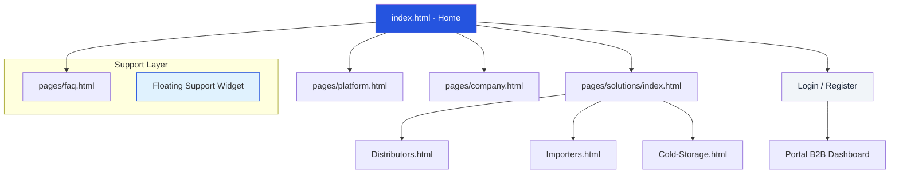

# Capítulo IV: Product Design

---

  <h2 style="margin: 0; color: #1e293b;">4.2. Information Architecture</h2>
  
"Estructurando la complejidad logística en flujos de decisión intuitivos."

### 4.2.1. Organization Systems (Taxonomía y Jerarquía)

La arquitectura de información de Nexa trasciende la simple organización de páginas; se estructura como un ecosistema de dos capas diseñado para reducir la fricción entre la <strong>prospección comercial</strong> y la <strong>operación transaccional</strong>. Esta separación garantiza que el usuario encuentre valor inmediato (Landing) antes de enfrentarse a la densidad de datos de la gestión de pedidos (Portal).

#### Sitemap Jerárquico del Ecosistema

A continuación, se presenta la estructura ramificada del proyecto, detallando la profundidad de navegación y la interconexión entre el núcleo público y las verticales de solución.

#### Taxonomía de URLs y Bounded Contexts

Nexa utiliza una estructura de URLs semántica para mejorar el SEO bilingüe y facilitar la memorización de rutas críticas por parte de los gerentes de logística.

<table style="width: 100%; border-collapse: collapse; margin-top: 15px; font-size: 13px;">
  <thead>
    <tr style="background-color: #f8fafc; border-bottom: 2px solid #e2e8f0;">
      <th style="padding: 12px; text-align: left;">Segmento de URL</th>
      <th style="padding: 12px; text-align: left;">Propósito Arquitectónico</th>
      <th style="padding: 12px; text-align: left;">Actor Primario</th>
    </tr>
  </thead>
  <tbody>
    <tr>
      <td style="padding: 12px; border-bottom: 1px solid #e2e8f0;"><code>/index.html</code></td>
      <td style="padding: 12px; border-bottom: 1px solid #e2e8f0;">Conversión masiva y presentación del "Pain Point" térmico.</td>
      <td style="padding: 12px; border-bottom: 1px solid #e2e8f0;">Stakeholders C-Level</td>
    </tr>
    <tr>
      <td style="padding: 12px; border-bottom: 1px solid #e2e8f0;"><code>/pages/solutions/*</code></td>
      <td style="padding: 12px; border-bottom: 1px solid #e2e8f0;">Verticalización por especialidad (Distribuidores vs Importadores).</td>
      <td style="padding: 12px; border-bottom: 1px solid #e2e8f0;">Directores de Operaciones</td>
    </tr>
    <tr>
      <td style="padding: 12px; border-bottom: 1px solid #e2e8f0;"><code>/pages/faq.html</code></td>
      <td style="padding: 12px; border-bottom: 1px solid #e2e8f0;">Reducción de carga de soporte mediante auto-servicio (Self-help).</td>
      <td style="padding: 12px; border-bottom: 1px solid #e2e8f0;">Todos los segmentos</td>
    </tr>
  </tbody>
</table>

---

### 4.2.2. User Journey Mapping (IA por Persona)

La arquitectura no es estática; muta para adaptarse a los flujos mentales de nuestros arquetipos definidos en el Capítulo II. Cada nodo de navegación está diseñado para responder a una pregunta específica de cada actor.

1.  Valeria (Coordinadora Comercial): Su ruta prioriza el **Dashboard de Pedidos Asistidos**. La IA le permite saltar de una vista de "Cliente" a "Catálogo" en menos de 2 clics para registrar pedidos telefónicos rápidamente.
2.  Hilda (Cliente Externo): Su IA es de **Autoservicio**. El sistema la guía directamente al motor de búsqueda de SKUs y a la visualización de su línea de crédito disponible.
3.  Pedro (Despachador/Transportista): IA enfocada en **Tareas de Campo**. Acceso directo a la hoja de ruta del día y confirmación de POD (Proof of Delivery) con telemetría mínima.

---

### 4.2.3. Labeling Systems (Consistencia y Lenguaje Ubicuo)

El sistema de etiquetado de Nexa evita terminología técnica ambigua ("buzzwords") en favor de términos reales de la industria alimentaria.

> [!NOTE]
> **Consistencia Semántica**: Se utiliza "Stock Comprometido" en lugar de "Inventario Reservado" para alinearse con la jerga contable de los distribuidores de LATAM.

- **Identificación de Lotes:** Etiquetas claras para FEFO (First Expired, First Out) que permiten al operario visualizar qué productos deben salir del almacén de forma inmediata.
- **Micro-copy Bilingüe:** El selector de idiomas (`EN / ES`) no solo traduce, sino que adapta las etiquetas de peso (kg vs lbs) y moneda según la región configurada.

---

### 4.2.4. Searching & Navigation Systems

#### Mecanismos de Descubrimiento (Global & Contextual)

Nexa implementa un sistema de navegación híbrido para garantizar que el usuario nunca pierda el hilo operativo:

- **Navegación Global:** Navbar fija que permite el retorno rápido al Home o el cambio de idioma instantáneo.
- **Navegación Contextual (Breadcrumbs):** Caminos de migajas de pan que permiten al usuario saber exactamente en qué sección de las soluciones se encuentra (ej: `Home > Solutions > Importers`).
- **Support Hub Widget:** Un acelerador de navegación flotante que proporciona acceso directo a las categorías de ayuda del FAQ sin abandonar la pantalla de trabajo actual.

#### SEO Architecture (Taxonomía de Búsqueda)

La jerarquía de encabezados (`H1`, `H2`, `H3`) se ha diseñado para que los motores de búsqueda identifiquen a Nexa como una autoridad en "Cold-Chain SaaS". El uso de etiquetas semánticas HTML5 (`<main>`, `<section>`, `<aside>`) refuerza esta arquitectura de información ante bots de indexación.

---

  <strong>Sustentación de Diseño:</strong> La arquitectura de información presentada cumple con el principio de Miller (7 ± 2 elementos), reduciendo la carga cognitiva al agrupar las soluciones similares bajo el nodo principal de "Solutions" y separando el soporte legal en el footer, manteniendo el flujo principal limpio para la operación b2b intensiva.

