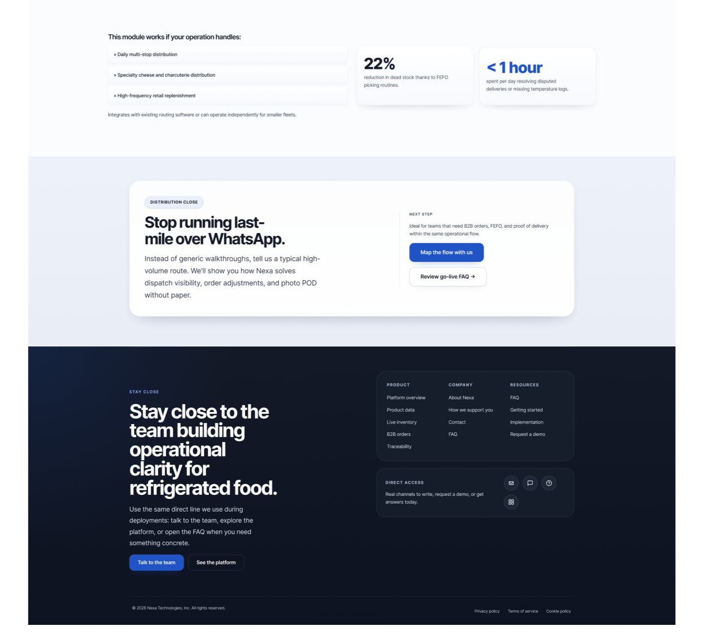
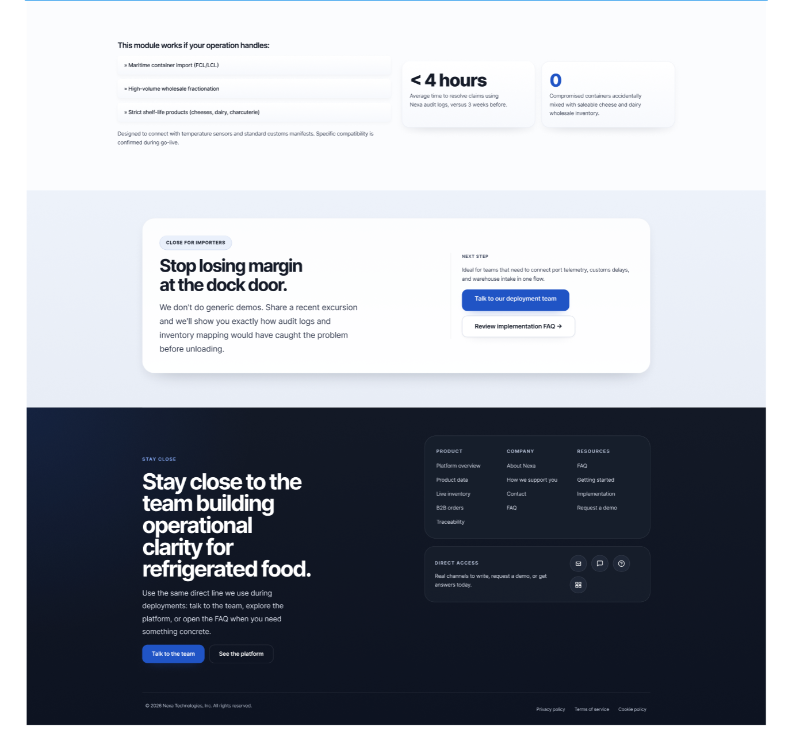
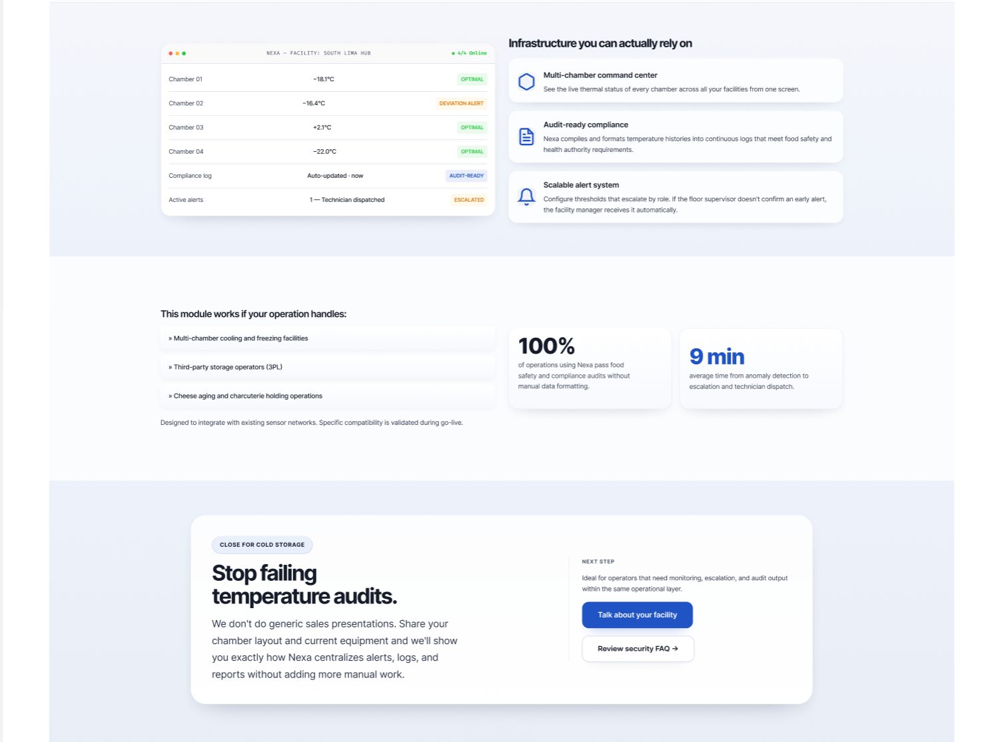
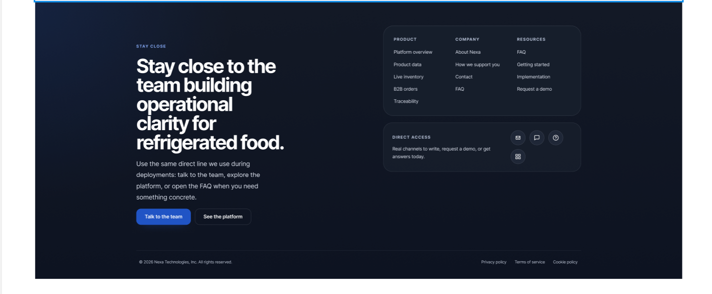
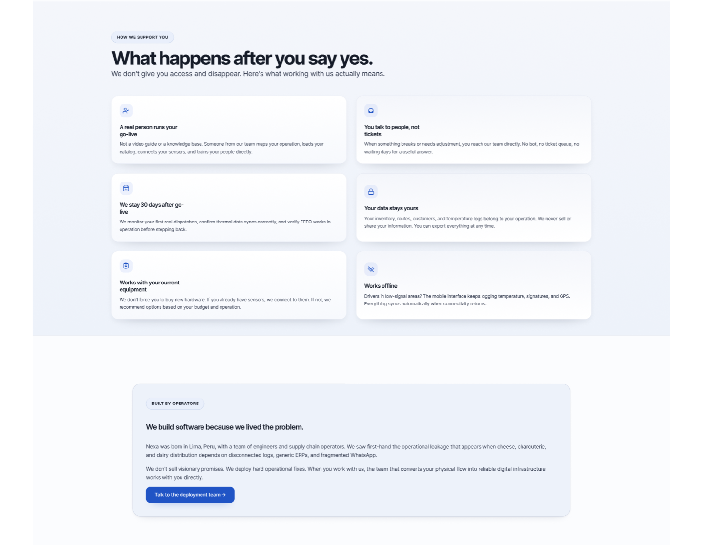
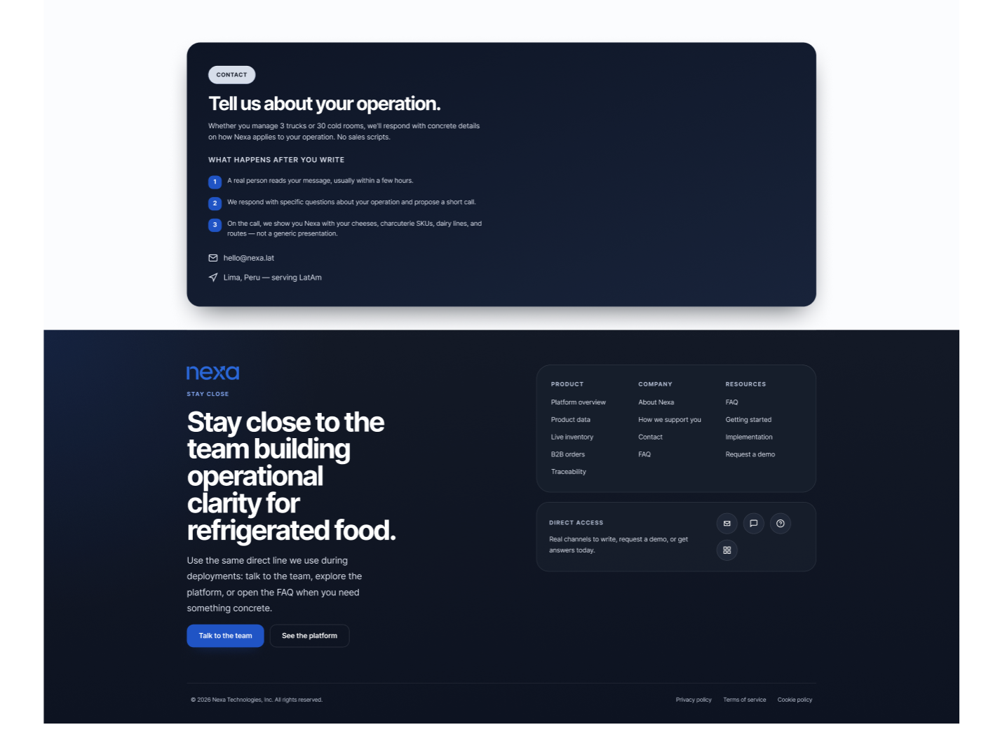
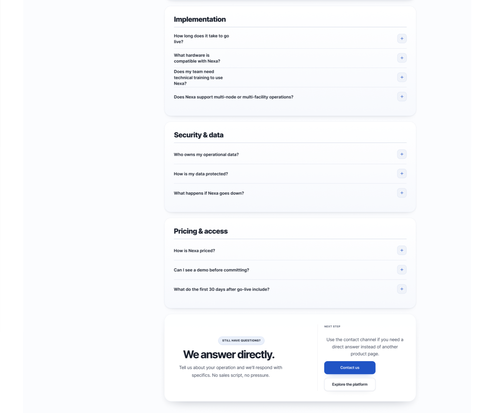
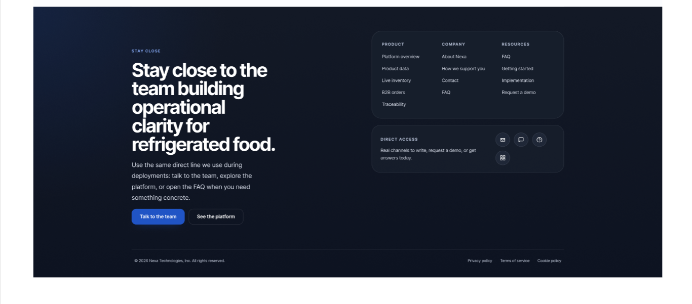

## 4.3. Landing Page UI Design.

### 4.3.1. Landing Page Wireframe.

Previo a la fase de alta fidelidad, se estructuró la Landing Page mediante <em>wireframes</em> de baja fidelidad para definir la jerarquía de información. Se priorizó la visibilidad inmediata de la propuesta de valor (Hero Section) y la navegación intuitiva hacia las soluciones específicas por segmento.

### 4.3.2. Landing Page Mock-up.

El diseño de alta fidelidad de Nexa adopta una estética <strong>B2B Premium</strong>, caracterizada por el uso de una paleta de colores profesional (Azul Cobalto y Gris Pizarra) que evoca confianza y sobriedad. La interfaz ha sido diseñada bajo principios de <em>flat design</em> y minimalismo operativo, eliminando distracciones visuales para centrarse en la claridad de los datos y la eficiencia de la navegación. A continuación, se presenta un recorrido detallado por los componentes de la interfaz.

#### A. Página de Inicio (Home)

La página de inicio actúa como el punto de entrada principal para tomadores de decisiones. Su estructura está diseñada para convertir visitantes en leads mediante una narrativa que escala desde el problema hasta la solución.

<strong>Figura X. Hero Section:</strong> La primera impresión presenta un titular potente centrado en el control operativo. Se utiliza un CTA (Call to Action) claro y contrastado para invitar al registro de demos. El diseño utiliza espacios negativos para resaltar la importancia del mensaje central.

<strong>Figura X. Diferenciales de Servicio:</strong> Esta sección desglosa los tres pilares de Nexa: Visibilidad, Control y Trazabilidad. Se utilizan iconos minimalistas y tipografía <em>Inter</em> para facilitar la lectura rápida de los beneficios tecnológicos.

<strong>Figura X. Validación de Industria:</strong> Se integra una sección de prueba social y métricas de impacto que refuerzan la autoridad de Nexa en el sector de alimentos refrigerados.

<strong>Figura X. Cierre y Navegación:</strong> El pie de página integra enlaces legales y de contacto bajo un esquema de colores oscuros, manteniendo la seriedad institucional hasta el final de la página.

#### B. Módulos de la Plataforma (Platform)

Esta sección detalla las capacidades internas de la plataforma Nexa, permitiendo al usuario visualizar las herramientas que controlarán su operación.

<strong>Figura X. Vista General de la Plataforma:</strong> Introducción a los módulos de gestión. Se explica cómo la plataforma centraliza la data de diversos puntos de la cadena.

<strong>Figura X. Gestión de Inventarios:</strong> Muestra cómo se visualiza el control de stock por lotes y temperaturas, resaltando la simplicidad de la interfaz del dashboard.

<strong>Figura X. Módulo de Trazabilidad:</strong> Detalle técnico sobre el seguimiento en tiempo real de los despachos y la integridad térmica de los productos.

<strong>Figura X. Analítica de Datos:</strong> Presentación de reportes automáticos y KPIs operativos diseñados para la gerencia logística.

#### C. Soluciones por Segmento (Solutions)

Nexa ofrece <em>landing pages</em> especializadas para cada actor de la cadena, abordando sus problemas específicos con un lenguaje técnico alineado a sus necesidades.

<strong>Figura X. Soluciones para Distribuidores:</strong> Enfoque en la eficiencia de despachos y la gestión de pedidos masivos. El diseño utiliza visuales que sugieren movimiento y logística fluida.

<strong>Figura X. Soluciones para Importadores:</strong> Foco en la integración de suministros internacionales y la trazabilidad origen-destino. La narrativa visual enfatiza la escala global de la operación.

<strong>Figura X. Operadores de Frío:</strong> Se resalta el control estricto de temperatura y la ubicación de almacenes. Las imágenes seleccionadas transmiten la atmósfera de almacenamiento profesional y tecnología de refrigeración.

#### D. Identidad y Soporte (Company & FAQ)

Secciones orientadas a la transparencia corporativa y la resolución de dudas técnicas, fundamentales para establecer una relación comercial a largo plazo.

<strong>Figura X. Nuestra Identidad:</strong> Presentación del equipo y la visión de la startup. Se busca humanizar la marca y transmitir la cultura de innovación detrás de Nexa.

<strong>Figura X. Centro de Soporte:</strong> Organización de preguntas frecuentes mediante una interfaz de acordeones limpia, facilitando la auto-resolución de dudas técnico-comerciales.

