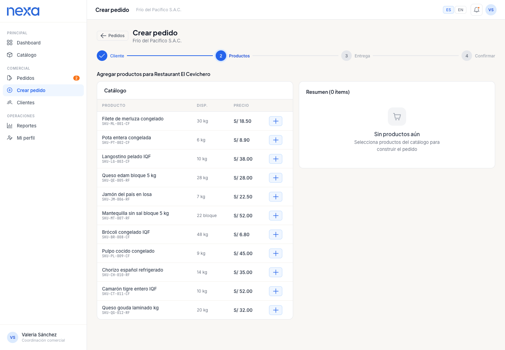
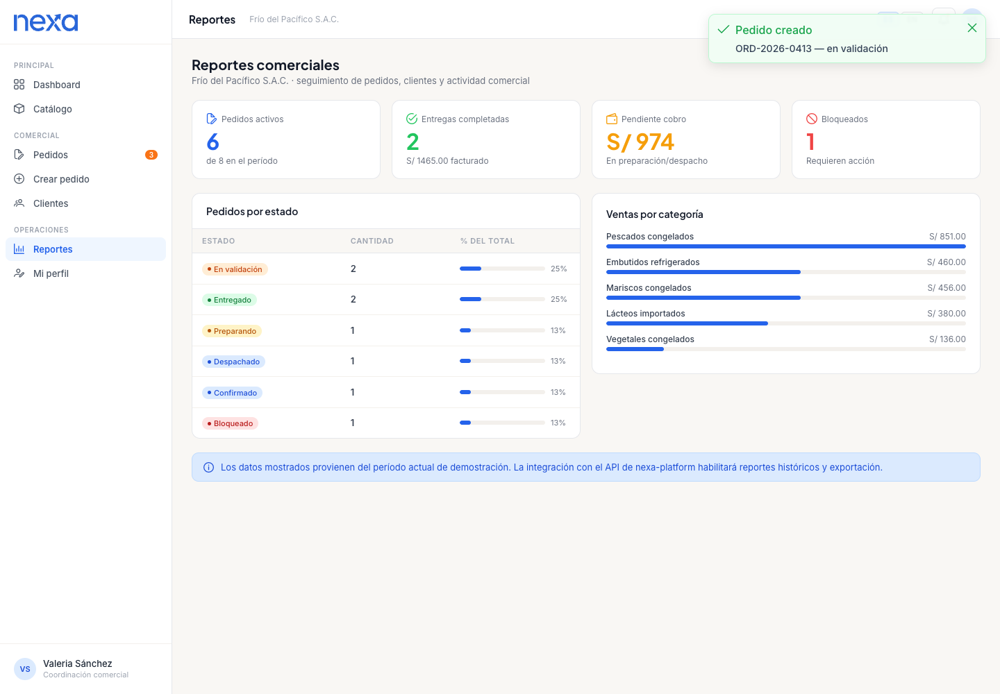

## 4.4. Web Applications UX/UI Design.

Esta sección documenta el diseño UX/UI de las dos superficies autenticadas del producto: la **webapp operativa interna (Ops)** para coordinación comercial (S1) y logística (S2), y el **portal B2B** para compradores comerciales (S3). Ambas superficies comparten el sistema visual definido en 4.1, pero operan con criterios de diseño distintos a la landing: aquí la prioridad es **claridad operativa, lectura rápida del estado del negocio y reducción de fricción en tareas repetitivas**.

Cada pantalla resuelve una pregunta concreta del dominio: qué pedido está en riesgo, qué producto necesita atención, qué validación bloquea la operación, qué unidad está en ruta y qué evidencia respalda el cierre. La documentación se organiza en wireframes, wireflows, mock-ups y user flows. Los artefactos se trabajaron colaborativamente en Figma y se complementan con evidencia de implementación del Sprint 2 (TB1).

### 4.4.1. Web Applications Wireframes.

Los wireframes ordenan la estructura funcional antes de entrar en alta fidelidad. Su valor está en definir jerarquías, zonas de información y rutas de interacción por superficie y persona. La colección se organiza en dos grupos: wireframes de diseño del Sprint 1 (recorrido operativo completo en Figma) y wireframes TB1 (alineados al alcance implementado en Sprint 2).

#### Sprint 1 — Wireframes de diseño

| Wireframe | Persona / Segmento | User goal que habilita |
|---|---|---|
| Dashboard Operativo Total Control | Valeria (S1), Roberto (S2) | Leer KPIs, alertas y accesos directos al iniciar sesión |
| B2B Orders Hub | Valeria (S1) | Revisar bandeja de pedidos y priorizar acción |
| Creación de Pedido Asistido | Valeria (S1) | Capturar un pedido con validación de cliente y stock |
| Inventory Management | Roberto (S2) | Revisar disponibilidad, riesgo FEFO y rotación |
| Confirmación de Despacho & Asignación de Flota | Roberto (S2) | Liberar salida y asignar unidad de transporte |
| FEFO Intelligence & Analytics | Roberto (S2) | Priorizar lotes por vencimiento y riesgo de merma |
| Active Shipments & Routes | Roberto (S2) | Monitorear unidades en tránsito y estado de ruta |
| Cierre de Entrega (POD) & Certificación | Roberto (S2) | Registrar evidencia y cerrar entrega formalmente |
| Inventory Detail | Roberto (S2) | Profundizar en estado de un SKU específico |
| Order Detail & Traceability | Valeria (S1), Roberto (S2) | Reconstruir historial completo de un pedido |

#### Dashboard Operativo Total Control

Este wireframe define la superficie de entrada para usuarios internos que necesitan leer rápidamente el estado del negocio. La composición concentra KPIs, alertas y accesos directos a módulos críticos, evitando que la supervisión tenga que saltar entre pantallas para detectar riesgos. Su función dentro del MVP es convertir una operación fragmentada en una vista centralizada de decisión.

#### B2B Orders Hub

La vista de órdenes organiza el flujo comercial en una bandeja operable, con estados visibles, filtros y acceso al detalle de cada pedido. Aquí la prioridad de diseño no es “mostrar una tabla”, sino permitir lectura rápida de cola de trabajo, excepciones y prioridades. Esto responde directamente al problema de desorden entre pedidos informales, confirmaciones tardías y seguimiento manual.

#### Creación de Pedido Asistido

Este wireframe estructura el momento más sensible del flujo: la captura del pedido por coordinación comercial. El layout reserva zonas claras para identificación del cliente, selección de productos, condiciones comerciales y validaciones visibles, reduciendo el riesgo de doble digitación o ambigüedad. Su aporte es demostrar que la captura puede nacer ordenada desde el origen.

#### Inventory Management

La gestión de inventario fue diseñada como una vista de control y no solo de registro. El wireframe prioriza disponibilidad, riesgo, clasificación y acceso a detalle, porque el inventario en Nexa debe sostener decisiones comerciales y no limitarse a listar cantidades. Por eso la navegación permite pasar de visión agregada a intervención puntual sin romper el contexto.

#### Confirmación de Despacho & Asignación de Flota

Esta pantalla modela la transición entre pedido confirmado y ejecución física. Su estructura visibiliza unidades listas para salir, asignación de transporte y condiciones necesarias para despachar, evitando que ese paso dependa de coordinación verbal dispersa. El wireframe muestra que despacho y planeamiento deben quedar dentro de la misma lógica operativa del sistema.

#### FEFO Intelligence & Analytics

El módulo FEFO fue planteado como una vista analítica especializada para convertir vencimientos y rotación en decisiones visibles. El wireframe ordena señales de riesgo, lotes prioritarios y lectura de tendencias, reforzando que Nexa no solo administra pedidos, sino que también ayuda a prevenir pérdida de producto. Esta pantalla conecta directamente con la necesidad de reducir merma y sostener trazabilidad de inventario perecedero.

#### Active Shipments & Routes

El seguimiento de rutas se diseñó como tablero de operación viva. Aquí la interfaz debe soportar lectura rápida de estado, ETA, incidencias y entregas activas, porque el usuario en esta fase necesita reaccionar y no navegar sin rumbo. La estructura apunta a reducir llamadas y mejorar visibilidad compartida entre operación, coordinación y cliente.

#### Cierre de Entrega (POD) & Certificación

El cierre del pedido no se resolvió como un formulario aislado, sino como una interfaz de certificación de cumplimiento. Este wireframe hace visibles los campos de evidencia, conformidad y validación final, porque el objetivo es reducir reclamos posteriores y sostener un historial trazable. Su diseño responde al problema recurrente de cierres débiles, pruebas dispersas y documentación poco defendible.

#### Inventory Detail

El detalle de inventario baja al nivel de un SKU concreto para mostrar información que no cabe en la vista agregada: estado térmico, disponibilidad, riesgo y contexto del producto. Esta profundidad es importante porque muchos problemas de cadena de frío no se detectan en una vista general, sino al revisar condiciones específicas de un ítem. Por ello, el wireframe fue planteado como apoyo a decisiones finas y no solo como ficha informativa.

#### Order Detail & Traceability

El detalle del pedido organiza la historia completa de una orden en una sola superficie: datos comerciales, estados, eventos logísticos y evidencia asociada. Esta pantalla resulta crítica para reclamos, auditoría interna y seguimiento operativo porque traduce la promesa de trazabilidad en una vista concreta. Su función es evitar que la explicación de “qué pasó con el pedido” vuelva a depender de mensajes sueltos o reconstrucciones manuales.

### 4.4.2. Web Applications Wireflow Diagrams.

Un wireflow conecta pantallas, decisiones y estados de UI según un user goal concreto. En esta sección, los wireflows documentan cambios de pantalla, alternativas y restricciones de rol para las tres superficies principales: S1 comercial, S2 logística y S3 portal B2B.

#### Wireflow consolidado — S1, S2 y S3

El diagrama siguiente muestra la continuidad de pantallas por perfil de usuario desde el acceso inicial hasta el cierre del objetivo principal de cada segmento.

Elaboración propia. Este wireflow es de nivel pantalla. Separa los roles internos Ops del comprador del portal, incluye error de login y estados de protección por rol, y mantiene S1/S2 alineados al tablero FigJam de recorrido operativo. S3 se incorpora como flujo comprador de planificación para la superficie portal.

#### Tabla de wireflows por user goal

| Wireflow | Persona | User goal | Evidencia visual |
|---|---|---|---|
| S1 Commercial Assisted Order | Valeria / Coordinación comercial | Crear y rastrear un pedido asistido validando condición del cliente y disponibilidad de producto | Mermaid en Markdown + mockups S1 seleccionados |
| S2 Logistics Operations | Roberto / Jefatura logística | Monitorear stock y riesgo FEFO, coordinar despacho y cerrar POD mock | Mermaid en Markdown + mockups S2 seleccionados |
| S3 B2B Buyer Portal | Lucía / Comprador B2B | Explorar catálogo, enviar pedido y consultar estado | Mermaid en Markdown como flujo portal de planificación |

La evidencia visual se documenta en Markdown mediante notación `flowchart` y se mantiene en el tablero FigJam como artefacto colaborativo de diseño. El reporte incluye la estructura completa del flujo y mockups representativos; no replica todas las pantallas del tablero como galería.

### 4.4.3. Web Applications Mock-ups.

Los mockups representan pantallas seleccionadas de alta fidelidad para la dirección actual de la webapp. Se agrupan por segmento y user goal para mostrar evidencia visual sin convertir el capítulo en una galería extensa. El tablero completo contiene más pantallas; este reporte incluye solo vistas representativas que sostienen los recorridos S1 y S2, mientras que S3 permanece documentado como flujo portal de planificación en esta iteración.

| Mockup group | Segment | User goal | Included screens | Purpose |
|---|---|---|---|---|
| S1 Commercial assisted order | Valeria / S1 | Crear y seguir un pedido asistido | Login, dashboard, cliente, pedido, detalle, reportes | Evidenciar captura comercial guiada, validaciones y trazabilidad |
| S2 Logistics operations | Roberto / S2 | Controlar inventario, despacho y POD mock | Dashboard, inventario, lote, despacho, POD mock, reportes | Evidenciar monitoreo FEFO, operación logística y cierre simulado |
| S3 Portal buyer flow | Lucía / S3 | Comprar desde portal B2B | Flujo Mermaid de portal | Documentar alcance comprador sin inventar capturas no disponibles |

#### S1 — Commercial assisted order mockups

Elaboración propia. Este grupo muestra el recorrido comercial desde la selección de perfil hasta la evidencia de pedido y reportes. Las pantallas se eligieron porque cubren los puntos decisivos del user goal: acceso por rol, lectura de estado, revisión de cliente, armado de pedido, trazabilidad por creador y análisis comercial.

#### S2 — Logistics operations mockups

Elaboración propia. Este grupo resume el recorrido logístico desde monitoreo hasta cierre simulado de entrega. Las pantallas seleccionadas cubren dashboard, inventario, lote, despacho, POD mock y reportes operativos, que son las evidencias visuales más representativas del flujo S2.

#### S3 — Portal buyer planning flow

El portal B2B se documenta como flujo comprador de planificación. En esta entrega no se agregan capturas S3 porque el ZIP de mockups recibido contiene material S1 y S2, no pantallas portal. Para evitar rutas inventadas, la evidencia visual del portal queda representada por el user flow Mermaid de Lucía y por su separación explícita respecto a los roles internos Ops.

### 4.4.4. Web Applications User Flow Diagrams.

Un user flow se enfoca en las decisiones y caminos que sigue una persona para completar un user goal. Los diagramas siguientes usan notación `flowchart`, declaran persona y meta, e incluyen happy path y rutas alternativas.

#### User Flow S1 — Coordinación comercial: pedido asistido

**User Goal:** As Valeria, a commercial coordinator, the goal is to create and track an assisted B2B order while validating client condition and product availability.

**Persona:** Valeria / Coordinación comercial. Accede a Dashboard, Clientes, Catálogo, Pedidos y Reportes. La ruta guard bloquea el acceso directo a Inventario y Despacho.

```mermaid
flowchart LR
    A["Start"] --> B["Login — choose Valeria profile"]
    B --> C["S1 Commercial dashboard"]
    C --> D["Open clients screen"]
    D --> E["Review client list"]
    E --> F["Open client detail drawer<br/>RUC, contact, address, condition"]
    F --> G["Create assisted order"]
    G --> H["Select client"]
    H --> I{"Client condition valid?"}
    I -- "No" --> J["Show restriction or credit warning"]
    J --> H
    I -- "Yes" --> K["Select products from catalog"]
    K --> L{"Quantity available?"}
    L -- "No" --> M["Adjust quantity"]
    M --> K
    L -- "Yes" --> N["Enter delivery information"]
    N --> O["Confirm order"]
    O --> P["Order detail — createdBy Valeria"]
    P --> Q["Orders follow-up"]
    Q --> R["Commercial reports"]
    R --> S["End: order traceable through Fake API"]
    C -. "Commercial role guard" .-> T["Inventory or dispatch direct URL redirects"]
```

Elaboración propia. El happy path avanza desde cliente hasta pedido trazable. Las alternativas bloquean avance cuando la condición comercial o cantidad disponible no soportan el pedido.

#### User Flow S2 — Jefatura logística: inventario, despacho y cierre

**User Goal:** As Roberto, a logistics lead, the goal is to monitor stock and FEFO risks, coordinate dispatch, close a POD mock confirmation and review operational reports.

**Persona:** Roberto / Jefatura logística. Tiene acceso extendido: Dashboard, Inventario, Despacho, Pedidos, Clientes y Reportes.

```mermaid
flowchart LR
    A["Start"] --> B["Login — choose Roberto profile"]
    B --> C["S2 Logistics dashboard"]
    C --> D["Open inventory overview<br/>stock and warehouses"]
    D --> E["Review lot list and FEFO indicators"]
    E --> F["Open lot detail drawer<br/>expiry, stock, warehouse"]
    F --> G{"Risk detected?"}
    G -- "Low stock or expiring lot" --> H["Prioritize operational review"]
    G -- "No critical risk" --> I["Continue monitoring"]
    H --> J["Open dispatch board"]
    I --> J
    J --> K{"Dispatch ready?"}
    K -- "No user action" --> L["Dispatch remains ready or pending"]
    K -- "Yes" --> M["Mark in route"]
    M --> N["Open POD mock confirmation modal"]
    N --> O{"POD checks complete?"}
    O -- "No" --> P["Show pending evidence warning"]
    P --> N
    O -- "Yes" --> Q["Close delivery"]
    Q --> R["Operational reports<br/>FEFO, stock, dispatch"]
    R --> S["Optional: create or review assisted order"]
    S --> T["End: operational cycle persisted in Fake API"]
    C -. "Logistics role has extended access" .-> U["Can access clients, orders, inventory, dispatch, reports"]
```

Elaboración propia. El happy path recorre inventario, riesgo FEFO, despacho, POD mock y reportes. Las alternativas mantienen visible el riesgo operativo y la advertencia de evidencia incompleta sin afirmar integración logística real.

#### User Flow S3 — Comprador B2B: portal de compra

**User Goal:** As Lucía, a B2B buyer, the goal is to browse the portal catalog, submit an order and review order status from the buyer-facing portal.

**Persona:** Lucía / Comprador B2B. Accede a Portal home, catálogo, carrito y órdenes. El portal queda separado de las rutas internas Ops.

Elaboración propia. This flow is documented as a planning-level buyer-facing flow for the portal surface. The internal S1/S2 flows remain the main validation focus of this iteration.

#### Tabla de consistencia wireflows y user flows

| User flow | Derivado del wireflow | Happy path | Alternativas | Evidencia visual |
|---|---|---|---|---|
| S1 Pedido asistido | S1 Commercial Assisted Order | Sí | Credenciales inválidas, condición de cliente, cantidad disponible, guard de rol | Mermaid + mockups S1 seleccionados |
| S2 Inventario, despacho y cierre | S2 Logistics Operations | Sí | Credenciales inválidas, riesgo FEFO, despacho sin acción, evidencia POD mock incompleta | Mermaid + mockups S2 seleccionados |
| S3 Portal de compra | S3 B2B Buyer Portal | Sí | Validación de carrito o pedido | Mermaid de planificación portal |

### 4.4.5. Implemented Screen Evidence.

Esta subsección consolida evidencia representativa de pantallas implementadas en TB1. Las imágenes corresponden a vistas web responsivas del webapp desplegado con datos mock y Fake API; no documentan backend real, autenticación productiva, carga real de POD, firma real ni tracking en vivo.

#### Tabla de evidencia implementada

| Evidence group | Screens | Persona | Scope supported |
|---|---|---|---|
| Entry and role selection | Login, profile | Todos | Acceso por perfil de demostración y separación inicial de experiencia |
| S1 commercial operation | Dashboard, clients, create order, orders, reports | Valeria / S1 | Pedido asistido, seguimiento y reportes comerciales con datos mock |
| S2 logistics operation | Dashboard, inventory, dispatch, reports | Roberto / S2 | Inventario FEFO, despacho y POD mock con datos mock |
| S3 portal planning | Portal flow Mermaid | Lucía / S3 | Recorrido comprador documentado a nivel de planificación |

#### Screenshots representativos por flujo

*Login — selección de perfil de demostración*

Elaboración propia. Punto de entrada con selección de perfil que determina el rol y las rutas disponibles.

*Clientes con drawer de ficha — S1*

Elaboración propia. Lista de clientes con drawer lateral que expone RUC, condición comercial y contacto.

*Creación de pedido asistido — S1*

Elaboración propia. Captura asistida con selección de cliente, productos y validación de condición.

*Inventario con indicadores FEFO — S2*

Elaboración propia. Vista de inventario con información de lote, vencimiento y drawer de detalle.

*Despacho y POD mock — S2*

Elaboración propia. Módulo de despacho con modal de confirmación de evidencia de entrega simulada.

The report uses representative screenshots and mockups to support the documented flows. Full step-by-step screen sequences are maintained in the design workspace and can be exported when needed.

---

### Tabla de cumplimiento con el enunciado del curso

| Requisito del enunciado | Cobertura en 4.4 | Estado |
|---|---|---|
| Wireframes por experiencia de aplicación | Sprint 1 con diez vistas y objetivos por persona | Documentado |
| Wireflows por user goal con explicación | Wireflow consolidado S1/S2/S3 en `flowchart LR` | Documentado |
| Wireflow refleja cambio de pantalla por interacción | Nodos de pantalla, decisiones, errores de login y guards por rol | Documentado |
| User flows por user goal y persona | S1, S2 y S3 separados con user goal declarado | Documentado |
| User flows consistentes con wireflows | Tabla de consistencia wireflow a user flow incluida | Documentado |
| Happy path y rutas alternativas | S1: cliente/stock/guard; S2: FEFO/POD mock/despacho; S3: validación de pedido | Documentado |
| Mock-ups / evidencia de diseño | Mockups actuales seleccionados desde ZIP para S1 y S2 | Documentado |
| Evidencia implementada | Screenshots representativos TB1 con límites explícitos de alcance | Documentado |
