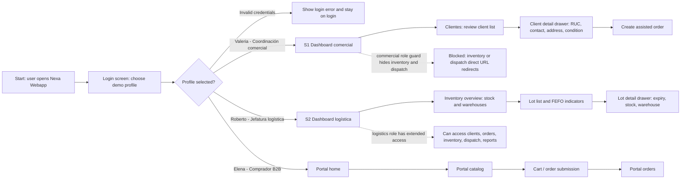
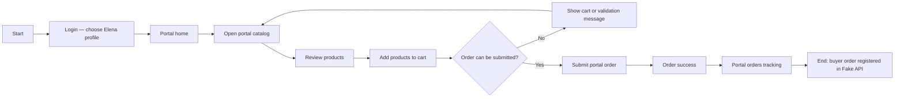

## 4.4. Web Applications UX/UI Design.

Esta sección documenta el diseño UX/UI de las superficies autenticadas del producto. La **webapp operativa interna (Ops)** para coordinación comercial (S1) y logística (S2) constituye la evidencia principal de diseño e implementación de esta entrega. El **portal B2B** para compradores comerciales (S3) se documenta a nivel de planificación en TB1: el flujo está definido mediante wireflow y user flow Mermaid, pero no cuenta con mockups implementados en esta iteración. S1 y S2 son la evidencia de validación principal. Las tres superficies comparten el sistema visual definido en 4.1, pero la prioridad de diseño en la webapp Ops es **claridad operativa, lectura rápida del estado del negocio y reducción de fricción en tareas repetitivas**.

Cada pantalla resuelve una pregunta concreta del dominio: qué pedido está en riesgo, qué producto necesita atención, qué validación bloquea la operación, qué unidad está en ruta y qué evidencia respalda el cierre. La documentación se organiza en wireframes, wireflows, mock-ups y user flows como artefactos de diseño UX/UI.

### 4.4.1. Web Applications Wireframes.

Los wireframes ordenan la estructura funcional antes de entrar en alta fidelidad. Su valor está en definir jerarquías, zonas de información y rutas de interacción por superficie y persona. La colección se organiza como recorrido operativo de diseño para S1 y S2, con pantallas suficientes para explicar dashboard, pedidos, inventario, despacho, POD mock y trazabilidad.

#### Sprint 1 — Wireframes de diseño

| Wireframe | Persona / Segmento | User goal que habilita |
|---|---|---|
| Dashboard Operativo Total Control | Valeria (S1), Roberto (S2) | Leer KPIs, alertas y accesos directos al iniciar sesión |
| B2B Orders Hub | Valeria (S1) | Revisar bandeja de pedidos y priorizar acción |
| Creación de Pedido Asistido | Valeria (S1) | Capturar un pedido con validación de cliente y stock |
| Inventory Management | Roberto (S2) | Revisar disponibilidad, riesgo FEFO y rotación |
| Confirmación de Despacho & Asignación de Flota | Roberto (S2) | Liberar salida y asignar unidad de transporte |
| FEFO Intelligence & Analytics | Roberto (S2) | Priorizar lotes por vencimiento y riesgo de merma |
| Active Shipments & Routes | Roberto (S2) | Monitorear unidades en tránsito y estado de ruta |
| Cierre de Entrega (POD) & Certificación | Roberto (S2) | Registrar evidencia y cerrar entrega formalmente |
| Inventory Detail | Roberto (S2) | Profundizar en estado de un SKU específico |
| Order Detail & Traceability | Valeria (S1), Roberto (S2) | Reconstruir historial completo de un pedido |

#### Dashboard Operativo Total Control

Este wireframe define la superficie de entrada para usuarios internos que necesitan leer rápidamente el estado del negocio. La composición concentra KPIs, alertas y accesos directos a módulos críticos, evitando que la supervisión tenga que saltar entre pantallas para detectar riesgos. Su función dentro del MVP es convertir una operación fragmentada en una vista centralizada de decisión.

#### B2B Orders Hub

La vista de órdenes organiza el flujo comercial en una bandeja operable, con estados visibles, filtros y acceso al detalle de cada pedido. Aquí la prioridad de diseño no es “mostrar una tabla”, sino permitir lectura rápida de cola de trabajo, excepciones y prioridades. Esto responde directamente al problema de desorden entre pedidos informales, confirmaciones tardías y seguimiento manual.

#### Creación de Pedido Asistido

Este wireframe estructura el momento más sensible del flujo: la captura del pedido por coordinación comercial. El layout reserva zonas claras para identificación del cliente, selección de productos, condiciones comerciales y validaciones visibles, reduciendo el riesgo de doble digitación o ambigüedad. Su aporte es demostrar que la captura puede nacer ordenada desde el origen.

#### Inventory Management

La gestión de inventario fue diseñada como una vista de control y no solo de registro. El wireframe prioriza disponibilidad, riesgo, clasificación y acceso a detalle, porque el inventario en Nexa debe sostener decisiones comerciales y no limitarse a listar cantidades. Por eso la navegación permite pasar de visión agregada a intervención puntual sin romper el contexto.

#### Confirmación de Despacho & Asignación de Flota

Esta pantalla modela la transición entre pedido confirmado y ejecución física. Su estructura visibiliza unidades listas para salir, asignación de transporte y condiciones necesarias para despachar, evitando que ese paso dependa de coordinación verbal dispersa. El wireframe muestra que despacho y planeamiento deben quedar dentro de la misma lógica operativa del sistema.

#### FEFO Intelligence & Analytics

El módulo FEFO fue planteado como una vista analítica especializada para convertir vencimientos y rotación en decisiones visibles. El wireframe ordena señales de riesgo, lotes prioritarios y lectura de tendencias, reforzando que Nexa no solo administra pedidos, sino que también ayuda a prevenir pérdida de producto. Esta pantalla conecta directamente con la necesidad de reducir merma y sostener trazabilidad de inventario perecedero.

#### Active Shipments & Routes

El seguimiento de rutas se diseñó como tablero de operación viva. Aquí la interfaz debe soportar lectura rápida de estado estimado, incidencias y entregas activas, porque el usuario en esta fase necesita reaccionar y no navegar sin rumbo. La estructura apunta a reducir llamadas y mejorar visibilidad compartida entre operación, coordinación y cliente.

#### Cierre de Entrega (POD) & Certificación

El cierre del pedido no se resolvió como un formulario aislado, sino como una interfaz de certificación de cumplimiento. Este wireframe hace visibles los campos de evidencia, conformidad y validación final, porque el objetivo es reducir reclamos posteriores y sostener un historial trazable. Su diseño responde al problema recurrente de cierres débiles, pruebas dispersas y documentación poco defendible.

#### Inventory Detail

El detalle de inventario baja al nivel de un SKU concreto para mostrar información que no cabe en la vista agregada: estado térmico, disponibilidad, riesgo y contexto del producto. Esta profundidad es importante porque muchos problemas de cadena de frío no se detectan en una vista general, sino al revisar condiciones específicas de un ítem. Por ello, el wireframe fue planteado como apoyo a decisiones finas y no solo como ficha informativa.

#### Order Detail & Traceability

El detalle del pedido organiza la historia completa de una orden en una sola superficie: datos comerciales, estados, eventos logísticos y evidencia asociada. Esta pantalla resulta crítica para reclamos, auditoría interna y seguimiento operativo porque traduce la promesa de trazabilidad en una vista concreta. Su función es evitar que la explicación de “qué pasó con el pedido” vuelva a depender de mensajes sueltos o reconstrucciones manuales.

### 4.4.2. Web Applications Wireflow Diagrams.

Un wireflow conecta pantallas, decisiones y estados de UI según un user goal concreto. En esta sección, los wireflows documentan cambios de pantalla, alternativas y restricciones de rol para las tres superficies principales: S1 comercial, S2 logística y S3 portal B2B.

#### Wireflow consolidado — S1, S2 y S3

El diagrama siguiente muestra la continuidad de pantallas por perfil de usuario desde el acceso inicial hasta el cierre del objetivo principal de cada segmento.

Elaboración propia. Este wireflow es de nivel pantalla. Separa los roles internos Ops del comprador del portal, incluye error de login y estados de protección por rol, y mantiene S1/S2 alineados al tablero FigJam de recorrido operativo. S3 se incorpora como flujo comprador de planificación para la superficie portal.

#### Tabla de wireflows por user goal

| Wireflow | Persona | User goal | Evidencia visual |
|---|---|---|---|
| S1 Commercial Assisted Order | Valeria / Coordinación comercial | Crear y rastrear un pedido asistido validando condición del cliente y disponibilidad de producto | Mermaid en Markdown + mockups S1 seleccionados |
| S2 Logistics Operations | Roberto / Jefatura logística | Monitorear stock y riesgo FEFO, coordinar despacho y cerrar POD mock | Mermaid en Markdown + mockups S2 seleccionados |
| S3 B2B Buyer Portal | Elena / Comprador B2B | Explorar catálogo, enviar pedido y consultar estado | Mermaid en Markdown como flujo portal de planificación |

La evidencia visual se documenta en Markdown mediante notación `flowchart` y se mantiene en el tablero FigJam como artefacto colaborativo de diseño. El reporte incluye la estructura completa del flujo y mockups representativos; no replica todas las pantallas del tablero como galería.

#### Evidencia visual Lucidchart — Userflows S1/S2

El user flow del Segmento 1 representa el recorrido de Valeria, responsable de coordinación comercial, desde el acceso al sistema hasta la creación y seguimiento de un pedido asistido. El flujo incluye validaciones de condición comercial, disponibilidad de productos y rutas alternativas para restricciones de cliente o cantidad insuficiente.

[Ver userflow S1 en Lucidchart](https://lucid.app/lucidchart/8f6d6af2-f229-47f8-ba02-86b27cdc6fed/edit?invitationId=inv_09391266-7e11-4614-8edf-12cf979cdabf)

Figura. User flow visual para el Segmento 1 — coordinación comercial.

El user flow del Segmento 2 representa el recorrido de Roberto, responsable logístico, desde la revisión de inventario y lotes con criterio FEFO hasta la gestión de despacho y cierre con POD simulado. El flujo incluye rutas alternativas para riesgo operativo, despacho no listo y evidencia incompleta.

[Ver userflow S2 en Lucidchart](https://lucid.app/lucidchart/b91c8e98-a38b-456a-92e5-f942be7e8439/edit?invitationId=inv_5c030713-67e5-4e84-90bf-661b26cef528)

Figura. User flow visual para el Segmento 2 — jefatura logística.

Para el Segmento 3, el flujo del comprador B2B se mantiene como alcance parcial de TB1. Se documenta a nivel de planificación para conectar catálogo, pedido y seguimiento, sin presentar evidencia completa de mockups finales en esta entrega.

### 4.4.3. Web Applications Mock-ups.

Los mockups representan pantallas seleccionadas de alta fidelidad para la dirección actual de la webapp. Se agrupan por segmento y user goal para mostrar evidencia visual sin convertir el capítulo en una galería extensa. El tablero completo contiene más pantallas; este reporte incluye solo vistas representativas que sostienen los recorridos S1 y S2, mientras que S3 permanece documentado como flujo portal de planificación en esta iteración.

| Mockup group | Segment | User goal | Included screens | Purpose |
|---|---|---|---|---|
| S1 Commercial assisted order | Valeria / S1 | Crear y seguir un pedido asistido | Login, dashboard, cliente, pedido, detalle, reportes | Evidenciar captura comercial guiada, validaciones y trazabilidad |
| S2 Logistics operations | Roberto / S2 | Controlar inventario, despacho y POD mock | Dashboard, inventario, lote, despacho, POD mock, reportes | Evidenciar monitoreo FEFO, operación logística y cierre simulado |
| S3 Portal buyer flow | Elena / S3 | Comprar desde portal B2B | Flujo Mermaid de portal | Documentar alcance comprador sin inventar capturas no disponibles |

#### S1 — Commercial assisted order mockups

Elaboración propia. Este grupo muestra el recorrido comercial desde la selección de perfil hasta la evidencia de pedido y reportes. Las pantallas se eligieron porque cubren los puntos decisivos del user goal: acceso por rol, lectura de estado, revisión de cliente, armado de pedido, trazabilidad por creador y análisis comercial.

#### S2 — Logistics operations mockups

Elaboración propia. Este grupo resume el recorrido logístico desde monitoreo hasta cierre simulado de entrega. Las pantallas seleccionadas cubren dashboard, inventario, lote, despacho, POD mock y reportes operativos, que son las evidencias visuales más representativas del flujo S2.

#### S3 — Portal buyer planning flow

El portal B2B se documenta como flujo comprador de planificación. En esta entrega no se agregan capturas S3 porque el ZIP de mockups recibido contiene material S1 y S2, no pantallas portal. Para evitar rutas inventadas, la evidencia visual del portal queda representada por el user flow Mermaid de Elena y por su separación explícita respecto a los roles internos Ops.

### 4.4.4. Web Applications User Flow Diagrams.

#### Criterios de resolución de flujo

El diseño UX/UI de aplicaciones web se construye en cuatro niveles de resolución creciente. Cada nivel responde a una pregunta concreta sobre el recorrido del usuario y sirve de base para el siguiente. La secuencia es: User Goal → Task Flow → Wireflow → User Flow.

*Tabla: Niveles de resolución de flujo aplicados en Nexa*

| Nivel | Propósito en el diseño | Evidencia en esta sección |
|:---|:---|:---|
| **User Goal** | Define qué objetivo concreto persigue cada persona antes de entrar al flujo. Responde a: ¿qué quiere lograr este usuario? | Objetivos de S1, S2 y S3 derivados del needfinding (sección 2.3.6) |
| **Task Flow** | Lista las acciones que el usuario necesita ejecutar para alcanzar el objetivo. Responde a: ¿qué pasos tiene que dar? | Secuencia de pasos por segmento en la tabla siguiente |
| **Wireflow** | Conecta las pantallas y estados de la interfaz recorridos durante la tarea. Responde a: ¿qué pantallas aparecen en ese recorrido? | Mermaid wireflow consolidado en 4.4.2 |
| **User Flow** | Agrega decisiones, caminos alternativos y estados finales al recorrido. Responde a: ¿qué ocurre si algo sale distinto? | Diagramas Mermaid por segmento en esta sección |

*Tabla: User Goals, Task Flows y referencias de flujo por segmento*

| Segmento | Persona | User Goal | Task Flow Summary | Wireflow | User Flow |
|:---|:---|:---|:---|:---|:---|
| S1 — Coordinación comercial | Valeria Sánchez | Registrar o asistir un pedido B2B validando cliente, condición comercial, disponibilidad de productos y seguimiento posterior | Login → dashboard comercial → clientes → detalle de cliente → pedido asistido → selección de productos → entrega → confirmación → seguimiento | S1 Commercial Assisted Order (4.4.2) | S1 Pedido asistido — más abajo en esta sección |
| S2 — Jefatura logística | Roberto García | Supervisar inventario, lotes, riesgos FEFO, despacho, cierre operativo y reportes | Login → dashboard logística → inventario → detalle de lote → revisión FEFO/stock → despacho → confirmación de cierre → reportes | S2 Logistics Operations (4.4.2) | S2 Inventario, despacho y cierre — más abajo en esta sección |
| S3 — Comprador B2B | Elena Litano | Consultar catálogo, seleccionar productos y revisar pedidos desde una experiencia de portal B2B | Login portal → catálogo → selección de productos → carrito/pedido → confirmación → seguimiento | S3 B2B Buyer Portal (4.4.2) | S3 Portal de compra — más abajo en esta sección *(flujo de planificación, primera iteración)* |

> *Nota:* Los user goals provienen de la sección 2.3.6. Los task flows resumen la secuencia de acciones sin entrar en decisiones específicas, que se detallan en los user flows. S3 se documenta como flujo de planificación en la primera iteración; los flujos S1 y S2 constituyen la evidencia de validación principal. Elaboración propia.

---

Un user flow se enfoca en las decisiones y caminos que sigue una persona para completar un user goal. Los diagramas siguientes usan notación `flowchart`, declaran persona y meta, e incluyen happy path y rutas alternativas.

#### User Flow S1 — Coordinación comercial: pedido asistido

**User Goal:** As Valeria, a commercial coordinator, the goal is to create and track an assisted B2B order while validating client condition and product availability.

**Persona:** Valeria / Coordinación comercial. Accede a Dashboard, Clientes, Catálogo, Pedidos y Reportes. La ruta guard bloquea el acceso directo a Inventario y Despacho.

```mermaid
flowchart LR
    A["Start"] --> B["Login — choose Valeria profile"]
    B --> C["S1 Commercial dashboard"]
    C --> D["Open clients screen"]
    D --> E["Review client list"]
    E --> F["Open client detail drawer<br/>RUC, contact, address, condition"]
    F --> G["Create assisted order"]
    G --> H["Select client"]
    H --> I{"Client condition valid?"}
    I -- "No" --> J["Show restriction or credit warning"]
    J --> H
    I -- "Yes" --> K["Select products from catalog"]
    K --> L{"Quantity available?"}
    L -- "No" --> M["Adjust quantity"]
    M --> K
    L -- "Yes" --> N["Enter delivery information"]
    N --> O["Confirm order"]
    O --> P["Order detail — createdBy Valeria"]
    P --> Q["Orders follow-up"]
    Q --> R["Commercial reports"]
    R --> S["End: order traceable through Fake API"]
    C -. "Commercial role guard" .-> T["Inventory or dispatch direct URL redirects"]
```

Elaboración propia. El happy path avanza desde cliente hasta pedido trazable. Las alternativas bloquean avance cuando la condición comercial o cantidad disponible no soportan el pedido.

#### User Flow S2 — Jefatura logística: inventario, despacho y cierre

**User Goal:** As Roberto, a logistics lead, the goal is to monitor stock and FEFO risks, coordinate dispatch, close a POD mock confirmation and review operational reports.

**Persona:** Roberto / Jefatura logística. Tiene acceso extendido: Dashboard, Inventario, Despacho, Pedidos, Clientes y Reportes.

Elaboración propia. El happy path recorre inventario, riesgo FEFO, despacho, POD mock y reportes. Las alternativas mantienen visible el riesgo operativo y la advertencia de evidencia incompleta sin afirmar integración logística real.

#### User Flow S3 — Comprador B2B: portal de compra

**User Goal:** As Elena, a B2B buyer, the goal is to browse the portal catalog, submit an order and review order status from the buyer-facing portal.

**Persona:** Elena / Comprador B2B. Accede a Portal home, catálogo, carrito y órdenes. El portal queda separado de las rutas internas Ops.

Elaboración propia. Este flujo se documenta como recorrido de planificación para la superficie del portal comprador. Los flujos internos S1/S2 se mantienen como foco principal de validación en esta iteración.

#### Tabla de consistencia: User Goals, wireflows y user flows

| User goal | Persona | Wireflow | User flow | Evidencia visual | Estado TB1 |
|:---|:---|:---|:---|:---|:---|
| Registrar pedido asistido validando cliente, condición comercial y disponibilidad de producto | Valeria (S1) | S1 Commercial Assisted Order | S1 Pedido asistido (4.4.4) | Mermaid + mockups S1 seleccionados | Documentado e implementado en webapp |
| Supervisar inventario FEFO, coordinar despacho y cerrar entrega con POD mock | Roberto (S2) | S2 Logistics Operations | S2 Inventario, despacho y cierre (4.4.4) | Mermaid + mockups S2 seleccionados | Documentado e implementado en webapp |
| Explorar catálogo, enviar pedido y consultar estado desde portal B2B | Elena (S3) | S3 B2B Buyer Portal | S3 Portal de compra (4.4.4) | Mermaid de planificación portal | Documentado como flujo de planificación para TB1 |

> *Nota:* Los user goals provienen de la sección 2.3.6. S1 y S2 están validados con mockups y evidencia de webapp; S3 se documenta como flujo de planificación y no se afirma implementación completa del portal en TB1. Elaboración propia.
