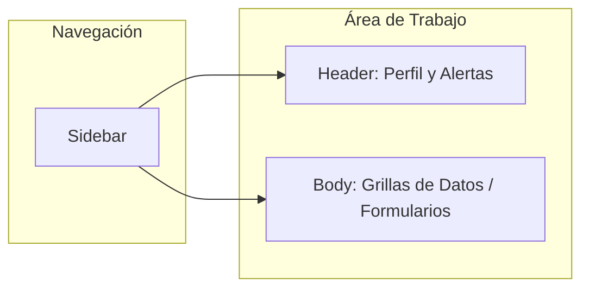
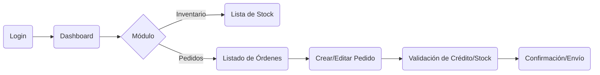
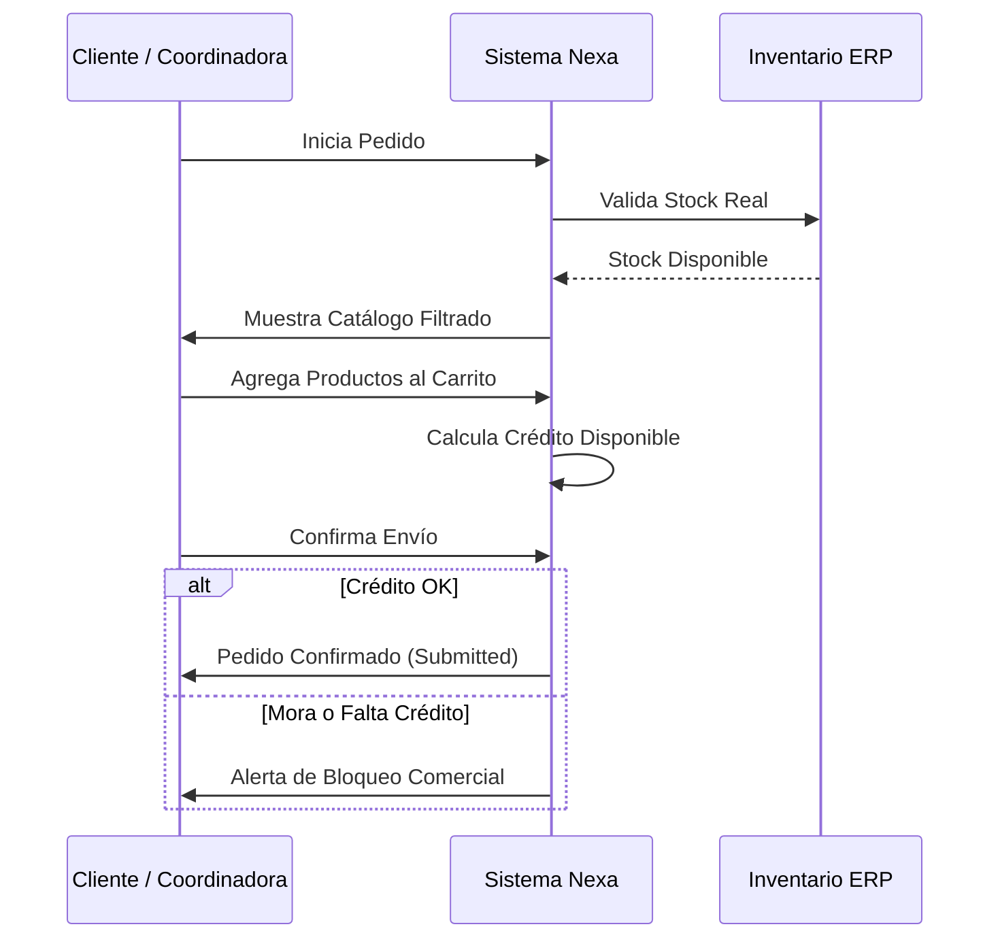

## 4.4. Web Applications UX/UI Design.

El diseño de la aplicación web de Nexa (Portal B2B y Dashboard Operativo) se rige por el principio de <strong>Minimalismo Operativo</strong>. A diferencia del sitio público, donde el objetivo es la persuasión y el marketing, la aplicación web busca maximizar la eficiencia del usuario mediante la reducción de la carga cognitiva. Se prioriza el contraste de datos críticos (stock, temperatura, crédito) y la velocidad de ejecución de tareas repetitivas.

### 4.4.1. Web Applications Wireframes.

Los wireframes de la aplicación web se diseñaron bajo una estructura de <strong>Layout de Panel Lateral</strong>, permitiendo una navegación persistente entre los módulos de Inventario, Pedidos y Trazabilidad. Esta disposición facilita que la supervisora logística mantenga el contexto global mientras profundiza en detalles específicos de una orden o lote.

**Ilustración 37**

*Diagrama de Bloques Funcionales — Dashboard B2B y Gestión Operativa*

*Nota. Elaboración propia. Esquema lógico de la disposición de componentes para asegurar una baja curva de aprendizaje y alta eficiencia operativa.*

### 4.4.2. Web Applications Wireflow Diagrams.

El Wireflow de la aplicación describe la secuencia de pantallas y estados por los que transita un pedido desde su captura hasta su despacho. Este flujo asegura que no existan callejones sin salida y que el usuario siempre reciba retroalimentación visual sobre el estado del sistema (visibilidad del estado del sistema, según las heurísticas de Nielsen).

**Ilustración 38**

*Wireflow del Proceso de Gestión de Pedidos — Secuencia de Pantallas*

*Nota. Elaboración propia. Mapa de navegación interna que garantiza la coherencia en la transición entre los módulos de venta y logística.*

### 4.4.3. Web Applications User Flow Diagrams.

El User Flow se centra en el camino crítico del usuario (Happy Path) para completar una tarea fundamental: el reabastecimiento B2B. El diagrama a continuación detalla las decisiones y acciones que toma el cliente comercial para asegurar el stock en su establecimiento, integrando validaciones automáticas de negocio definidas en el backlog.

**Ilustración 39**

*User Flow: Proceso de Compra B2B Asistida y Autónoma*

*Nota. Elaboración propia. Flujo de interacción que minimiza los pasos de captura y automatiza las validaciones de crédito y stock identificadas como puntos de dolor.*
