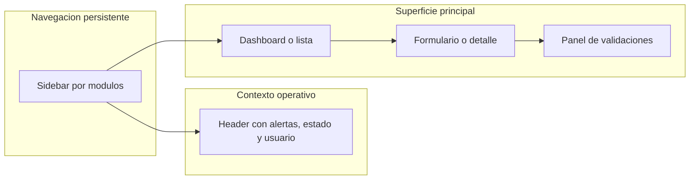
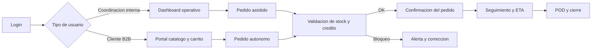
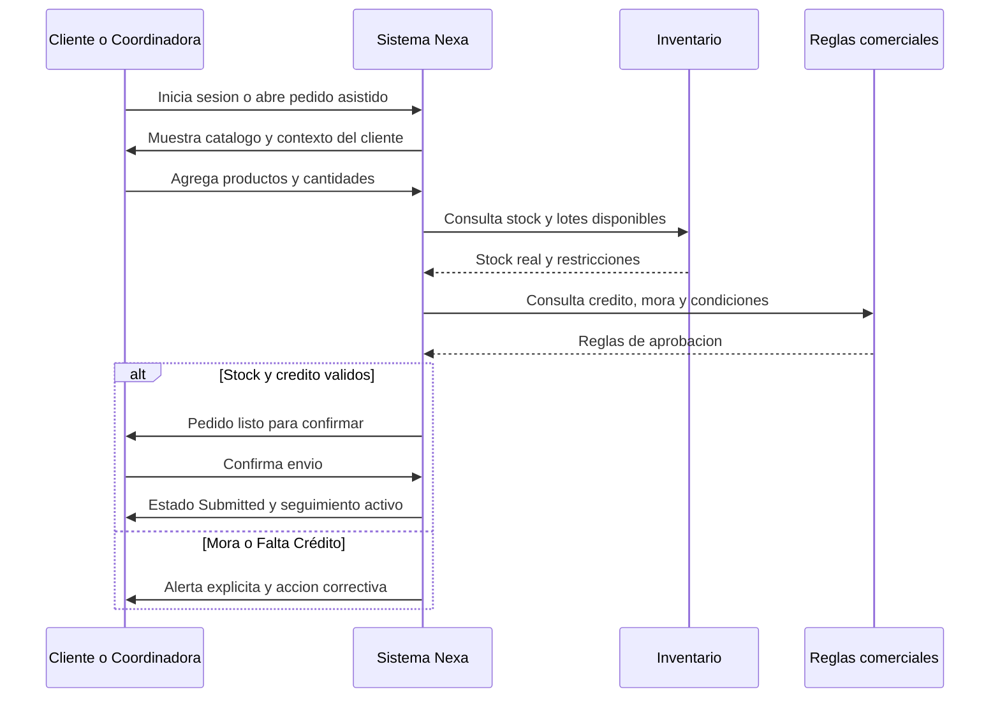

## 4.4. Web Applications UX/UI Design.

El diseño de la web application de Nexa debe leerse como la continuación natural de la landing page pública. Mientras el sitio público explica el problema y posiciona la propuesta de valor, la aplicación autenticada resuelve la operación diaria mediante flujos de pedido, inventario, trazabilidad y soporte comercial. Por ello, su UX/UI se rige por un principio distinto al marketing: <strong>claridad operativa con mínima fricción</strong>. La interfaz prioriza visibilidad de stock, alertas, validaciones comerciales y estados del pedido, reduciendo carga cognitiva y pasos manuales en tareas repetitivas.

### 4.4.1. Web Applications Wireframes.

Los wireframes de la aplicación web se organizan bajo una estructura de <strong>navegación persistente con panel lateral</strong>, encabezado de contexto y área central de trabajo. Esta disposición responde directamente a los hallazgos del capítulo 2: la operación no puede depender de saltos desordenados entre WhatsApp, Excel, llamadas y validaciones verbales. La interfaz debe permitir que cada actor vea, en una sola superficie, la información crítica para decidir si un pedido continúa, se bloquea o se reprograma.

**Tabla 31**

*Vistas priorizadas en el diseño de la Web Application*

| Vista priorizada | Usuario dominante | Información crítica visible | Decisión que habilita |
|---|---|---|---|
| Dashboard operativo | Supervisión logística y coordinación | stock comprometido, alertas FEFO, incidencias, temperatura, estado de pedidos | Priorizar acciones, corregir desvíos y reasignar atención |
| Pedido asistido | Coordinación comercial | cliente identificado, condiciones, crédito, catálogo, disponibilidad y validaciones | Confirmar o bloquear la creación del pedido antes del envío |
| Portal B2B de autoservicio | Cliente comercial | catálogo filtrado, precios, stock, borradores e historial | Realizar un pedido directo sin depender del canal informal |
| Seguimiento y POD | Operación, transporte y cliente | ETA, secuencia de estados, incidencias y evidencia de cierre | Confirmar trazabilidad y resolver reclamos con evidencia |

**Ilustración 44**

*Esqueleto funcional de la web application autenticada*

*Nota. Elaboración propia. La estructura privilegia continuidad visual y lectura rápida de alertas, formularios y estados sin perder el contexto del módulo activo.*

### 4.4.2. Web Applications Wireflow Diagrams.

El wireflow de la aplicación debe mostrar dos rutas principales que convergen en una misma lógica de negocio: la <strong>captura asistida interna</strong> y el <strong>autoservicio B2B</strong>. Aunque los puntos de entrada son distintos, ambos caminos desembocan en validaciones sobre stock, crédito, reglas comerciales y estados de entrega. Esta decisión de diseño evita duplicar procesos y mantiene una sola verdad operativa para el pedido.

**Ilustración 45**

*Wireflow del pedido Nexa desde acceso hasta cierre operativo*

*Nota. Elaboración propia. El flujo concentra la continuidad entre captura, validación, seguimiento y cierre, evitando que el pedido quede fragmentado en herramientas paralelas.*

### 4.4.3. Web Applications User Flow Diagrams.

El user flow crítico para la web application es el <strong>reabastecimiento B2B con validaciones automáticas</strong>. El valor de Nexa no reside solo en mostrar pantallas, sino en reducir el retrabajo que hoy ocurre cuando el pedido entra mal, el crédito no alcanza, el stock no coincide o la operación carece de trazabilidad. El flujo siguiente sintetiza la interacción esperada entre usuario, sistema e inventario.

**Ilustración 46**

*User Flow del reabastecimiento B2B con validación de negocio*

*Nota. Elaboración propia. El flujo refleja el happy path y la rama de bloqueo comercial, ambos indispensables para defender la lógica del MVP transaccional.*
