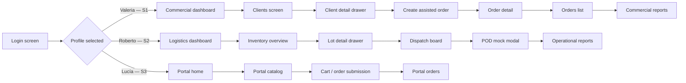
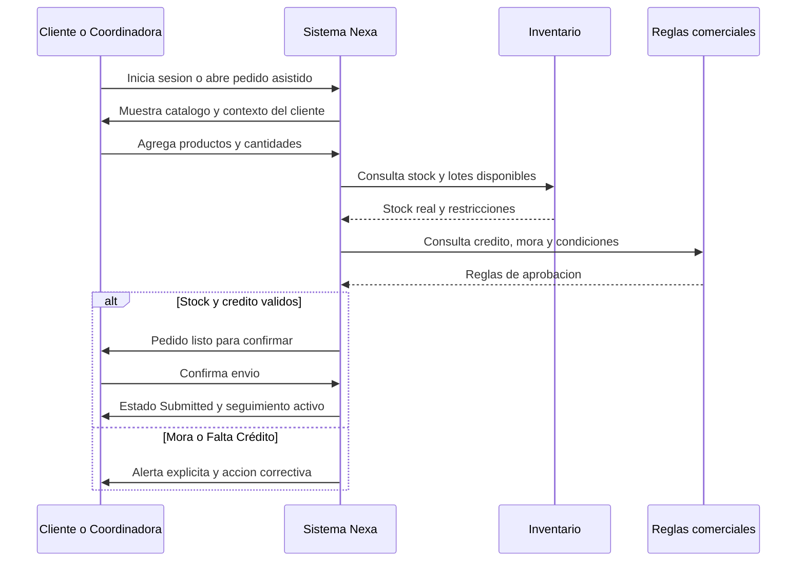
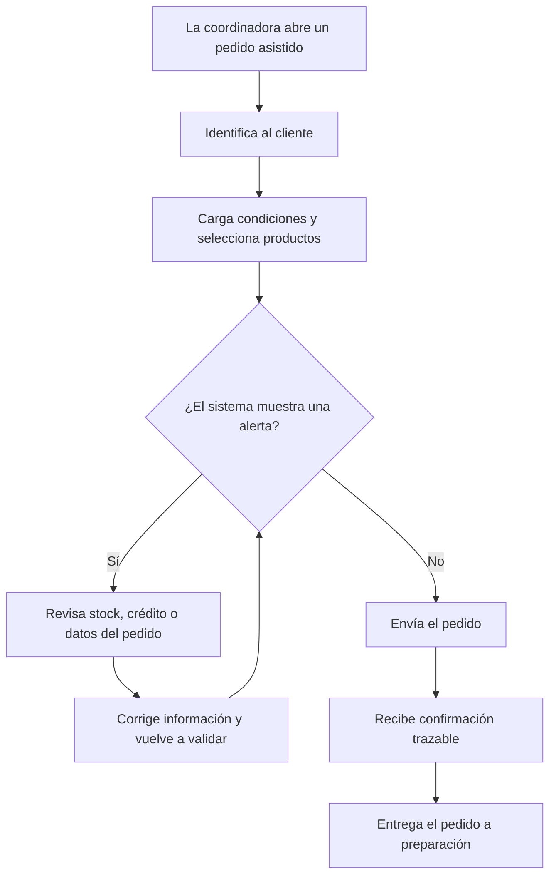
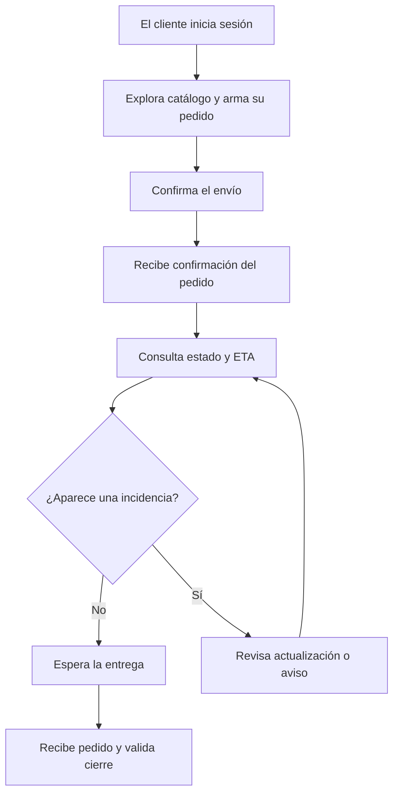

## 4.4. Web Applications UX/UI Design.

Esta sección documenta el diseño UX/UI de las dos superficies autenticadas del producto: la **webapp operativa interna (Ops)** para coordinación comercial (S1) y logística (S2), y el **portal B2B** para compradores comerciales (S3). Ambas superficies comparten el sistema visual definido en 4.1, pero operan con criterios de diseño distintos a la landing: aquí la prioridad es **claridad operativa, lectura rápida del estado del negocio y reducción de fricción en tareas repetitivas**.

Cada pantalla resuelve una pregunta concreta del dominio: qué pedido está en riesgo, qué producto necesita atención, qué validación bloquea la operación, qué unidad está en ruta y qué evidencia respalda el cierre. La documentación se organiza en wireframes, wireflows, mock-ups y user flows. Los artefactos se trabajaron colaborativamente en Figma y se complementan con evidencia de implementación del Sprint 2 (TB1).

### 4.4.1. Web Applications Wireframes.

Los wireframes ordenan la estructura funcional antes de entrar en alta fidelidad. Su valor está en definir jerarquías, zonas de información y rutas de interacción por superficie y persona. La colección se organiza en dos grupos: wireframes de diseño del Sprint 1 (recorrido operativo completo en Figma) y wireframes TB1 (alineados al alcance implementado en Sprint 2).

#### Sprint 1 — Wireframes de diseño

| Wireframe | Persona / Segmento | User goal que habilita |
|---|---|---|
| Dashboard Operativo Total Control | Valeria (S1), Roberto (S2) | Leer KPIs, alertas y accesos directos al iniciar sesión |
| B2B Orders Hub | Valeria (S1) | Revisar bandeja de pedidos y priorizar acción |
| Creación de Pedido Asistido | Valeria (S1) | Capturar un pedido con validación de cliente y stock |
| Inventory Management | Roberto (S2) | Revisar disponibilidad, riesgo FEFO y rotación |
| Confirmación de Despacho & Asignación de Flota | Roberto (S2) | Liberar salida y asignar unidad de transporte |
| FEFO Intelligence & Analytics | Roberto (S2) | Priorizar lotes por vencimiento y riesgo de merma |
| Active Shipments & Routes | Roberto (S2) | Monitorear unidades en tránsito y estado de ruta |
| Cierre de Entrega (POD) & Certificación | Roberto (S2) | Registrar evidencia y cerrar entrega formalmente |
| Inventory Detail | Roberto (S2) | Profundizar en estado de un SKU específico |
| Order Detail & Traceability | Valeria (S1), Roberto (S2) | Reconstruir historial completo de un pedido |

#### Dashboard Operativo Total Control

Este wireframe define la superficie de entrada para usuarios internos que necesitan leer rápidamente el estado del negocio. La composición concentra KPIs, alertas y accesos directos a módulos críticos, evitando que la supervisión tenga que saltar entre pantallas para detectar riesgos. Su función dentro del MVP es convertir una operación fragmentada en una vista centralizada de decisión.

#### B2B Orders Hub

La vista de órdenes organiza el flujo comercial en una bandeja operable, con estados visibles, filtros y acceso al detalle de cada pedido. Aquí la prioridad de diseño no es “mostrar una tabla”, sino permitir lectura rápida de cola de trabajo, excepciones y prioridades. Esto responde directamente al problema de desorden entre pedidos informales, confirmaciones tardías y seguimiento manual.

#### Creación de Pedido Asistido

Este wireframe estructura el momento más sensible del flujo: la captura del pedido por coordinación comercial. El layout reserva zonas claras para identificación del cliente, selección de productos, condiciones comerciales y validaciones visibles, reduciendo el riesgo de doble digitación o ambigüedad. Su aporte es demostrar que la captura puede nacer ordenada desde el origen.

#### Inventory Management

La gestión de inventario fue diseñada como una vista de control y no solo de registro. El wireframe prioriza disponibilidad, riesgo, clasificación y acceso a detalle, porque el inventario en Nexa debe sostener decisiones comerciales y no limitarse a listar cantidades. Por eso la navegación permite pasar de visión agregada a intervención puntual sin romper el contexto.

#### Confirmación de Despacho & Asignación de Flota

Esta pantalla modela la transición entre pedido confirmado y ejecución física. Su estructura visibiliza unidades listas para salir, asignación de transporte y condiciones necesarias para despachar, evitando que ese paso dependa de coordinación verbal dispersa. El wireframe muestra que despacho y planeamiento deben quedar dentro de la misma lógica operativa del sistema.

#### FEFO Intelligence & Analytics

El módulo FEFO fue planteado como una vista analítica especializada para convertir vencimientos y rotación en decisiones visibles. El wireframe ordena señales de riesgo, lotes prioritarios y lectura de tendencias, reforzando que Nexa no solo administra pedidos, sino que también ayuda a prevenir pérdida de producto. Esta pantalla conecta directamente con la necesidad de reducir merma y sostener trazabilidad de inventario perecedero.

#### Active Shipments & Routes

El seguimiento de rutas se diseñó como tablero de operación viva. Aquí la interfaz debe soportar lectura rápida de estado, ETA, incidencias y entregas activas, porque el usuario en esta fase necesita reaccionar y no navegar sin rumbo. La estructura apunta a reducir llamadas y mejorar visibilidad compartida entre operación, coordinación y cliente.

#### Cierre de Entrega (POD) & Certificación

El cierre del pedido no se resolvió como un formulario aislado, sino como una interfaz de certificación de cumplimiento. Este wireframe hace visibles los campos de evidencia, conformidad y validación final, porque el objetivo es reducir reclamos posteriores y sostener un historial trazable. Su diseño responde al problema recurrente de cierres débiles, pruebas dispersas y documentación poco defendible.

#### Inventory Detail

El detalle de inventario baja al nivel de un SKU concreto para mostrar información que no cabe en la vista agregada: estado térmico, disponibilidad, riesgo y contexto del producto. Esta profundidad es importante porque muchos problemas de cadena de frío no se detectan en una vista general, sino al revisar condiciones específicas de un ítem. Por ello, el wireframe fue planteado como apoyo a decisiones finas y no solo como ficha informativa.

#### Order Detail & Traceability

El detalle del pedido organiza la historia completa de una orden en una sola superficie: datos comerciales, estados, eventos logísticos y evidencia asociada. Esta pantalla resulta crítica para reclamos, auditoría interna y seguimiento operativo porque traduce la promesa de trazabilidad en una vista concreta. Su función es evitar que la explicación de “qué pasó con el pedido” vuelva a depender de mensajes sueltos o reconstrucciones manuales.

### 4.4.2. Web Applications Wireflow Diagrams.

Un wireflow conecta pantallas y estados de UI relevantes según un user goal concreto. Se diferencia del diagrama de secuencia porque no describe intercambio técnico de mensajes entre objetos: describe cómo el usuario se mueve entre pantallas y estados de decisión como resultado de su interacción.

#### Wireflow consolidado — tres superficies y personas

El diagrama siguiente muestra la continuidad de pantallas por perfil de usuario desde el login hasta el cierre del ciclo operativo de cada segmento.

Elaboración propia. El wireflow parte de la selección de perfil y ramifica en tres recorridos de pantallas según rol: coordinación comercial (S1), logística interna (S2) y comprador B2B (S3).

#### Tabla de wireflows por user goal

| Wireflow | User goal | Persona | Visual evidence |
|---|---|---|---|
| S1 Commercial Assisted Order | Crear y confirmar un pedido asistido validando cliente y stock | Valeria / Coordinación comercial | Pending: export from [FigJam board](https://www.figma.com/board/LjIjtyfoOpeYa5OCSJUYpD/Nexa-Ops-S1-S2-Userflow-Wireflow?node-id=0-1) |
| S2 Logistics Operations | Revisar inventario FEFO, coordinar despacho y cerrar entrega con evidencia | Roberto / Jefatura logística | Pending: export from [FigJam board](https://www.figma.com/board/LjIjtyfoOpeYa5OCSJUYpD/Nexa-Ops-S1-S2-Userflow-Wireflow?node-id=0-1) |
| S3 B2B Buyer Portal | Explorar catálogo, enviar pedido y consultar estado | Lucía / Comprador B2B | Pending: export from Figma portal prototype |

<!-- TODO: insert FigJam S1 wireflow export as image -->
<!-- TODO: insert FigJam S2 wireflow export as image -->
<!-- TODO: insert Figma S3 portal wireflow export as image -->

### 4.4.3. Web Applications Mock-ups.

Los mock-ups de la web application desarrollan en alta fidelidad la lógica ya probada en wireframes. Su función no es “decorar” el sistema, sino validar que la jerarquía visual, los componentes y la lectura operativa sigan siendo claros cuando se incorporan color, densidad informativa, estados y patrones definitivos de interfaz. En este proyecto, las diez capturas cubren el mismo recorrido funcional del MVP y permiten explicar cómo la solución se presentaría ante usuarios reales. También fueron consolidadas en Figma antes de documentarse en el informe.

#### Dashboard Operativo Total Control

La versión de alta fidelidad del dashboard confirma que la pantalla puede operar como centro de mando del sistema. KPIs, alertas y bloques operativos comparten una composición que privilegia lectura rápida, con énfasis en desviaciones críticas y accesos inmediatos. Visualmente, esta vista sostiene la promesa de centralización que en el proceso actual se pierde entre múltiples herramientas.

#### B2B Orders Hub

El mock-up del hub de órdenes transforma la bandeja de pedidos en una vista ejecutiva y accionable. El uso de estados, filtros y tarjetas permite identificar con rapidez qué pedidos requieren seguimiento, corrección o continuidad. Su principal aporte es hacer visible que el pedido deja de ser un mensaje informal y se convierte en un objeto gestionable.

#### Creación de Pedido Asistido

Esta pantalla demuestra cómo la captura asistida puede combinar contexto de cliente, catálogo y validación sin saturar al usuario. La alta fidelidad deja ver mejor la separación entre datos del cliente, líneas de pedido y retroalimentación del sistema, reduciendo el riesgo de error. El resultado esperado es una experiencia comercial guiada, pero todavía ágil.

#### Inventory Management

En alta fidelidad, la gestión de inventario se vuelve una vista de control operacional con mayor riqueza de lectura: disponibilidad, clasificación, indicadores y señales de riesgo. Esto es importante porque el inventario en Nexa no es un backoffice aislado, sino una pieza que alimenta la promesa comercial y la trazabilidad del pedido. El mock-up refuerza esa conexión entre stock visible y decisión de negocio.

#### Confirmación de Despacho & Asignación de Flota

La pantalla de despacho aterriza el momento donde la orden deja el estado interno y pasa a ejecución física. La composición hace visibles unidades, asignación y condiciones de salida en una misma vista, reduciendo dependencias externas para destrabar la operación. Así, el mock-up traduce una coordinación históricamente manual en una acción estructurada dentro del sistema.

#### FEFO Intelligence & Analytics

La analítica FEFO muestra cómo Nexa podría convertir vencimientos y rotación en una capa de inteligencia operativa. La alta fidelidad ayuda a leer prioridades, tendencias y alertas sin necesidad de interpretar datos dispersos. Su valor argumental es demostrar que la plataforma no solo registra inventario, sino que ayuda a protegerlo.

#### Active Shipments & Routes

El seguimiento en ruta mantiene el mismo principio del wireframe, pero ahora con mayor densidad visual y mejor señalización de estados. Esta vista está orientada a monitoreo vivo, por lo que la jerarquía de colores, incidentes y estados en tránsito cumple una función operativa clara. El mock-up respalda la idea de visibilidad compartida durante despacho.

#### Cierre de Entrega (POD) & Certificación

La captura final del cierre muestra cómo la evidencia de entrega se integra a una interfaz formal y defendible. Firma, conformidad y certificación aparecen como parte del flujo normal y no como anexos improvisados. Esto fortalece la propuesta de Nexa en un punto donde hoy suelen aparecer reclamos, debilidad documental y cierre inconsistente.

#### Inventory Detail Premium Artisan Organic Milk

Esta pantalla profundiza en un producto concreto para mostrar que el sistema puede bajar de la visión agregada a la condición específica del SKU. La alta fidelidad expone mejor variables como temperatura, capacidad, riesgo y vencimiento, todas relevantes para cadena de frío. Su inclusión es importante porque demuestra que el diseño no se queda en tableros generales.

#### Order Detail & Traceability

El detalle de trazabilidad en alta fidelidad reconstruye el historial del pedido como una narrativa operativa completa. La vista combina eventos, estado, evidencia y contexto de la orden, reforzando la idea de continuidad entre captura, despacho y cierre. En términos de valor, esta pantalla es una de las más importantes para sostener trazabilidad y respuesta ante incidencias.

### 4.4.4. Web Applications User Flow Diagrams.

<!-- TODO Tanda 2: replace with S1 Commercial Assisted Order User Flow diagram (flowchart-based, not sequence diagram). -->
<!-- TODO Tanda 2: replace with S2 Logistics Inventory and Dispatch User Flow diagram. -->
<!-- TODO Tanda 2: add screenshot-based wireflow from FigJam reference. -->

El user flow complementa wireframes y mock-ups porque modela la interacción secuencial entre usuario y sistema. En Nexa, el flujo crítico es el reabastecimiento B2B con validaciones de negocio, ya que ahí se expresa con más claridad la promesa central del producto: hacer visible lo que hoy se valida tarde o de forma dispersa.

#### User Flow 1 — Reabastecimiento B2B con validación de negocio

- **User Goal:** Como comprador B2B (Segmento 3) o coordinadora comercial (Segmento 1), quiero que la plataforma me deje confirmar el pedido solo cuando el sistema ya validó stock real, lote FEFO y crédito disponible.
- **Segmento:** Segmento 3 (autonomía del comprador) + Segmento 1 (captura asistida).
- **Problema atendido:** promesas comerciales inviables por falta de validación temprana.
- **Happy path:** login → catálogo con contexto → carrito → consulta de stock y lotes → consulta de crédito/mora → reglas OK → confirmación con seguimiento activo.
- **Unhappy path:** si mora o stock no dan, el sistema corta el flujo en la validación y devuelve un mensaje explícito con acción correctiva (ajustar cantidad, regularizar crédito o escalar a soporte).

*User Flow del reabastecimiento B2B con validación de negocio*

Elaboración propia. El flujo refleja tanto la ruta esperada como la rama de bloqueo comercial, ambas necesarias para defender la lógica del MVP transaccional.

#### User Flow 2 — Coordinadora comercial con rama de corrección

- **User Goal:** Como coordinación comercial (Segmento 1), quiero corregir un pedido cuando la validación detecta inconsistencias, sin perder la información ya capturada.
- **Segmento:** Segmento 1.
- **Problema atendido:** retrabajo manual y pérdida de datos cuando el pedido se rechaza.
- **Happy path:** pedido asistido → validación OK → confirmación.
- **Unhappy path:** validación detecta problema → rama de corrección (ajustar SKU, cantidad, condición comercial) → revalidación → confirmación o bloqueo registrado.

*User Flow de la coordinadora comercial con rama de corrección*

Elaboración propia. Este user flow enfatiza el punto de corrección temprana, que es donde Nexa busca reducir retrabajo y promesas inviables.

#### User Flow 3 — Cliente B2B con seguimiento e incidencia

- **User Goal:** Como comprador B2B (Segmento 3), quiero seguir mi pedido y reportar una incidencia sin tener que llamar ni escribir por WhatsApp.
- **Segmento:** Segmento 3 con soporte del Segmento 2 (logística y despacho).
- **Problema atendido:** falta de visibilidad del despacho y ausencia de canal formal para reportar incidencias.
- **Happy path:** historial → seguimiento → ETA → entrega → cierre con POD disponible.
- **Unhappy path:** si hay incidencia de ruta, el cliente recibe notificación automática, puede registrar reclamo formal y ver la bitácora del pedido con evidencia asociada.

*User Flow del cliente B2B con seguimiento e incidencia*

Elaboración propia. Este recorrido pone el foco en la necesidad de previsibilidad del cliente y en la forma en que una incidencia debe ser visible sin obligarlo a volver al canal informal.

### 4.4.5. Implemented Screen Evidence.

Esta subsección consolida la evidencia de pantallas implementadas en TB1. Las imágenes corresponden a vistas web responsivas del webapp desplegado en GitHub Pages con datos mock; no son aplicaciones móviles nativas. La evidencia responsive de la landing page permanece en 4.3 — las imágenes en `mobile-browser/` pertenecen al sitio público, no a la webapp.

#### Tabla de cobertura TB1

| Pantalla | Wireframe TB1 | Screenshot TB1 | Persona |
|---|---|---|---|
| Login / perfil | `web-app-wireframes/log-in-wireframe.png` | `web-app-screenshots/log-in.png` | Todos |
| Dashboard operativo | `web-app-wireframes/dashboard-wireframe.png` | `web-app-screenshots/dashboard.png` | S1, S2 |
| Catálogo de operación | `web-app-wireframes/catalog-wireframe.png` | `web-app-screenshots/catalog.png` | S1 |
| Inventario (FEFO + drawer) | `web-app-wireframes/inventory-wireframe.png` | `web-app-screenshots/inventory.png` | S2 |
| Clientes (drawer de ficha) | `web-app-wireframes/clients-wireframe.png` | `web-app-screenshots/clients.png` | S1 |
| Creación de pedido asistido | `web-app-wireframes/new-order-wireframe.png` | `web-app-screenshots/create-order.png` | S1 |
| Bandeja de órdenes | `web-app-wireframes/orders-wireframe.png` | `web-app-screenshots/orders.png` | S1, S2 |
| Despacho y POD mock | `web-app-wireframes/dispatch-wireframe.png` | `web-app-screenshots/dispatch.png` | S2 |
| Reportes operativos | `web-app-wireframes/reports-wireframe.png` | `web-app-screenshots/reports.png` | S1, S2 |
| Perfil y preferencias | `web-app-wireframes/profile-wireframe.png` | `web-app-screenshots/profile.png` | Todos |
| Configuración | `web-app-wireframes/settings-wireframe.png` | `web-app-screenshots/settings.png` | Todos |
| Portal home | — | Pendiente: `web-app-screenshots/portal-home.png` | S3 |
| Portal catálogo | — | Pendiente: `web-app-screenshots/portal-catalog.png` | S3 |
| Portal checkout | — | Pendiente: `web-app-screenshots/portal-checkout.png` | S3 |
| Portal órdenes | — | Pendiente: `web-app-screenshots/portal-orders.png` | S3 |

#### Screenshots representativos por flujo

*Login — selección de perfil de demostración*

Elaboración propia. Punto de entrada con selección de perfil que determina el rol y las rutas disponibles.

*Dashboard operativo — vista S1/S2*

Elaboración propia. Vista de entrada para usuarios internos con KPIs y accesos directos según rol.

*Clientes con drawer de ficha — S1*

Elaboración propia. Lista de clientes con drawer lateral que expone RUC, condición comercial y contacto.

*Creación de pedido asistido — S1*

Elaboración propia. Captura asistida con selección de cliente, productos y validación de condición.

*Inventario con indicadores FEFO — S2*

Elaboración propia. Vista de inventario con información de lote, vencimiento y drawer de detalle.

*Despacho y POD mock — S2*

Elaboración propia. Módulo de despacho con modal de confirmación de evidencia de entrega.

