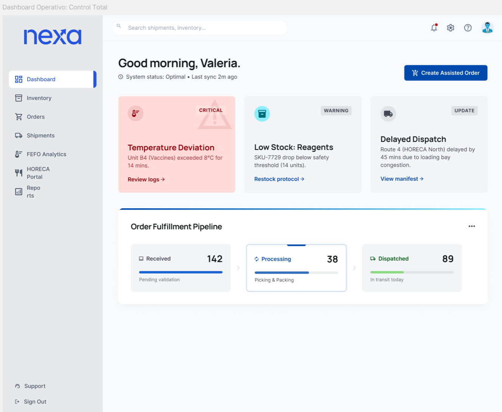

## 4.5. Web Applications Prototyping.

El prototipado de la web application en Nexa debe leerse como la consolidación navegable de los artefactos ya desarrollados en la sección 4.4. Si los wireframes definieron estructura, los mock-ups resolvieron jerarquía visual y los user flows explicaron la lógica de interacción, el prototipo integra esas capas en una experiencia continua que permite revisar coherencia entre módulos, transiciones y puntos de decisión.

En esta etapa, el equipo articuló el prototipo en **Figma** y dejó además un recorrido audiovisual que permite revisar la navegación sin depender todavía de una implementación autenticada en producción. Por eso esta subsección funciona como evidencia de diseño integrado y de preparación funcional del producto.

| Evidencia de prototipado | Propósito |
|---|---|
| [Proyecto Figma del equipo](https://www.figma.com/files/team/1586383034175281439/project/587167294) | Preservar el espacio maestro donde se organizan wireframes, mock-ups y decisiones de diseño |
| [Archivo Figma de la web application](https://www.figma.com/design/buDa5VZmYjPNokbl4FEJqx/Web-App?node-id=0-1) | Verificar la versión navegable y los frames conectados de la aplicación autenticada |
| [Recorrido del prototipo (Web)](https://upcedupe-my.sharepoint.com/:v:/g/personal/u202323040_upc_edu_pe/IQC3ykPGDqn4Sra12gTSQKf4ATYJUS89I621TTxwWaqo81k?nav=eyJyZWZlcnJhbEluZm8iOnsicmVmZXJyYWxBcHAiOiJPbmVEcml2ZUZvckJ1c2luZXNzIiwicmVmZXJyYWxBcHBQbGF0Zm9ybSI6IldlYiIsInJlZmVycmFsTW9kZSI6InZpZXciLCJyZWZlcnJhbFZpZXciOiJNeUZpbGVzTGlua0NvcHkifX0&e=1UDCU7) | Mostrar el recorrido principal del prototipo web como evidencia visual de navegación |
| [Mobile Application Prototype - Video Evidence](https://upcedupe-my.sharepoint.com/:v:/g/personal/u202323040_upc_edu_pe/IQDBP5iLNJedR6OhB8Sivc1rAaVCa4SDrxvranY5tTLbkPM?nav=eyJyZWZlcnJhbEluZm8iOnsicmVmZXJyYWxBcHAiOiJPbmVEcml2ZUZvckJ1c2luZXNzIiwicmVmZXJyYWxBcHBQbGF0Zm9ybSI6IldlYiIsInJlZmVycmFsTW9kZSI6InZpZXciLCJyZWZlcnJhbFZpZXciOiJNeUZpbGVzTGlua0NvcHkifX0&e=QD00j7) | Evidencia audiovisual del prototipo de la aplicación móvil (mobile-first), mostrando la navegación desde dispositivo móvil |

La utilidad metodológica del prototipo es doble. Primero, permite revisar continuidad entre módulos sin depender todavía de desarrollo productivo. Segundo, ofrece una base defendible para explicar cómo evolucionará Nexa desde su capa pública hacia su capa transaccional. En otras palabras, el prototipo no sustituye al desarrollo, pero sí reduce el riesgo de que la implementación futura contradiga lo ya investigado, priorizado y diseñado.

*Captura referencial del prototipo de la web application*

Elaboración propia. La captura corresponde a la pantalla principal del prototipo y resume la lógica de dashboard operativo utilizada como punto de entrada a la aplicación.

*Prueba de interacción del prototipo de la aplicación móvil*

Elaboración propia. Evidencia visual del prototipo ejecutado directamente en dispositivo móvil como validación del diseño responsive.

Bajo esta lectura, el prototipado debe presentarse con honestidad de alcance: constituye **evidencia de diseño integrado**, no evidencia de despliegue autenticado ni de operación real en producción. Su valor en el informe es mostrar que la web application ya fue pensada como un sistema consistente y recorrible antes de entrar en fases posteriores de implementación.

### 4.5.1. Sistema de navegación aplicado al prototipo

El prototipo aplica un **sistema de navegación jerárquico por rol** con un nivel global y dos niveles contextuales, consistente con la arquitectura de información definida en la sección 4.2. El nivel global se expresa en un *top bar* persistente con identidad de marca, selector de contexto (empresa activa) y acciones de cuenta; el primer nivel contextual se expresa en un *side navigation* por módulo del dominio (Catálogo, Pedidos, Inventario, Clientes, Despacho, Trazabilidad); el segundo nivel se expresa como *tabs* y *breadcrumbs* dentro de cada módulo para movimientos laterales sin perder contexto.

La navegación es **rol-consciente**: el Segmento 1 (coordinación comercial) ve por defecto Pedidos y Clientes; el Segmento 3 (compradores B2B) ve Catálogo, Mis pedidos y Seguimiento; el Segmento 2 (jefatura logística) ve Gestión operativa, Despachos y Evidencias. Los *call-to-actions* primarios (crear pedido, despachar, cerrar entrega) se mantienen siempre visibles como *floating action* en la parte inferior derecha del frame, respetando la lógica **mobile-first**. Las transiciones entre frames siguen el principio de *progressive disclosure*: el usuario avanza solo cuando el sistema ya puede confirmar stock, crédito o estado, evitando pantallas intermedias sin valor.

