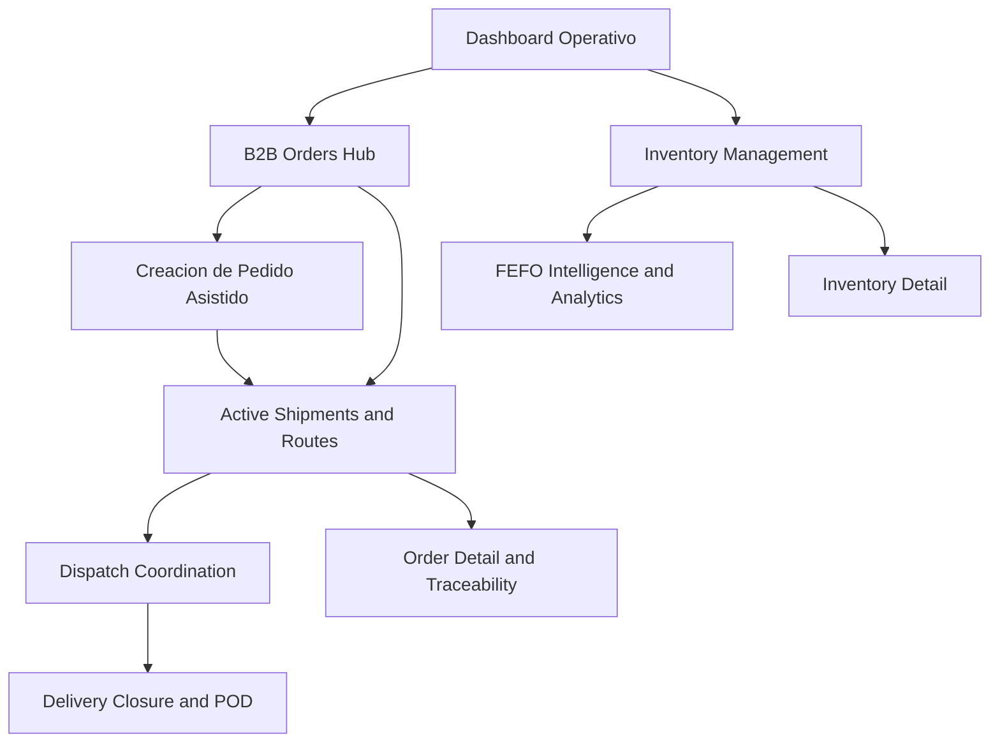

## 4.5. Web Applications Prototyping.

En AV1, el prototipado de la web application debe entenderse como una <strong>evidencia de diseño de alta fidelidad</strong> para una capa transaccional que todavía no se implementa públicamente. Su función no es demostrar despliegue, sino validar continuidad entre la investigación del dominio, los flujos definidos en el backlog y la futura experiencia autenticada de Nexa. Por ello, esta subsección se enfoca en <strong>qué módulos quedaron prototipados</strong>, <strong>cómo se conectan entre sí</strong> y <strong>qué evidencia verificable puede citarse desde el archivo Figma real del equipo</strong>.

El prototipo de alta fidelidad de la aplicación debía cubrir, como mínimo, las superficies críticas del MVP transaccional:

| Módulo del prototipo | Objetivo de validación | Elementos críticos que deben verse en alta fidelidad |
|---|---|---|
| Dashboard operativo | Centralizar el estado del negocio en una vista de decisión rápida | KPIs, alertas, stock comprometido, incidencias y accesos a módulos |
| Pedido asistido interno | Reducir la doble digitación y hacer explícitas las reglas comerciales | identificación de cliente, catálogo, validaciones, bloqueo por crédito o stock |
| Portal B2B de autoservicio | Permitir compra directa con contexto de cuenta | catálogo filtrado, carrito, borradores, historial y confirmación |
| Seguimiento y POD | Dar visibilidad y evidencia de cierre | ETA, secuencia de estados, incidencias, firma o prueba de entrega |

La inspección del archivo Figma autenticado del equipo confirmó que la página <strong>`Mockups`</strong> ya contiene una familia consistente de pantallas de alta fidelidad. Esta evidencia fue verificada en la sesión activa del navegador y permite citar un archivo maestro y varios enlaces directos por frame, en lugar de depender de una referencia genérica al proyecto.

| Evidencia maestra | Enlace verificado |
|---|---|
| Proyecto Figma del equipo | [Nexa Landing Page / Project](https://www.figma.com/files/team/1586383034175281439/project/587167294) |
| Archivo Figma de la web application | [Web App - Figma Design File](https://www.figma.com/design/buDa5VZmYjPNokbl4FEJqx/Web-App?node-id=0-1) |

Adicionalmente, el equipo ya exportó y archivó en el repositorio diez capturas PNG del prototipo, lo que fortalece la sustentación del capítulo: la evidencia ya no depende solo de un archivo autenticado en Figma, sino que queda preservada como activo visual trazable dentro de <code>report/assets/images/webapp-mockups</code>.

**Ilustración 46**

*Mapa funcional de los mockups de alta fidelidad verificados en Figma*

*Nota. Elaboración propia. El mapa resume la continuidad visual entre control operativo, captura del pedido, inventario, despacho, trazabilidad y cierre, tal como aparece organizada en el archivo Figma del equipo.*

**Ilustración 47**

*Pantallas de alta fidelidad verificadas en el prototipo autenticado*

| Pantalla prototipada | Propósito dentro del flujo | Respaldo verificable |
|---|---|---|
| Dashboard Operativo: Control Total | Consolidar alertas, KPIs y estado general de la operación | [Frame Figma](https://www.figma.com/design/buDa5VZmYjPNokbl4FEJqx/Web-App?node-id=1-2) + PNG exportado |
| B2B Orders Hub | Gestionar órdenes y revisar estados de procesamiento | [Frame Figma](https://www.figma.com/design/buDa5VZmYjPNokbl4FEJqx/Web-App?node-id=1-1885) + PNG exportado |
| Creación de Pedido Asistido | Capturar pedidos con validación comercial y operativa | [Frame Figma](https://www.figma.com/design/buDa5VZmYjPNokbl4FEJqx/Web-App?node-id=1-496) + PNG exportado |
| Inventory Management | Controlar stock, riesgo térmico y rotación visible | [Frame Figma](https://www.figma.com/design/buDa5VZmYjPNokbl4FEJqx/Web-App?node-id=1-2114) + PNG exportado |
| Confirmación de Despacho & Asignación de Flota | Asignar vehículos y coordinar despacho listo para salida | [Frame Figma](https://www.figma.com/design/buDa5VZmYjPNokbl4FEJqx/Web-App?node-id=1-1645) + PNG exportado |
| FEFO Intelligence & Analytics | Visualizar vencimientos, alertas y priorización FEFO | [Frame Figma](https://www.figma.com/design/buDa5VZmYjPNokbl4FEJqx/Web-App?node-id=1-2592) + PNG exportado |
| Active Shipments & Routes | Monitorear trayectos, excursiones térmicas e incidencias en ruta | [Frame Figma](https://www.figma.com/design/buDa5VZmYjPNokbl4FEJqx/Web-App?node-id=1-211) + PNG exportado |
| Cierre de Entrega (POD) & Certificación | Registrar evidencia de cierre, firma y prueba de entrega | [Frame Figma](https://www.figma.com/design/buDa5VZmYjPNokbl4FEJqx/Web-App?node-id=1-981) + PNG exportado |
| Inventory Detail: Premium Artisan Organic Milk | Profundizar en estabilidad térmica, stock disponible y alertas FEFO por producto | PNG exportado del archivo maestro |
| Order Detail & Traceability | Verificar ruta, manifiesto, cadena de custodia y prueba de entrega por orden | PNG exportado del archivo maestro |

La lectura correcta de estas pantallas no es estética sino operativa. Cada vista traduce una fricción levantada en los capítulos previos: alertas térmicas que antes eran tardías, validaciones comerciales que antes se hacían por llamada, asignación de flota antes manual, y cierre documental del pedido que antes dependía de mensajes dispersos. En conjunto, el prototipo deja ver una arquitectura visual consistente basada en navegación lateral persistente, encabezado transversal y módulos de decisión por contexto.

**Bloque A. Control operativo y captura comercial**

Este primer bloque valida la entrada al sistema y el corazón comercial del MVP. El <strong>dashboard operativo</strong> concentra alertas de desviación térmica, bajo stock y despacho demorado en una sola superficie de decisión; el <strong>orders hub</strong> convierte el pedido en una lista gestionable con estados y acciones visibles; y la pantalla de <strong>pedido asistido</strong> demuestra que la captura puede hacerse con búsqueda de cliente, selección de SKU y validación comercial previa a la confirmación. El resultado es una experiencia que reduce la dependencia del canal informal y vuelve explícitas las reglas del negocio antes de comprometer inventario.

**Bloque B. Inventario, analítica y control de riesgo**

Las tres vistas siguientes muestran que el prototipo no se limita a “listar stock”. <strong>Inventory Management</strong> prioriza visibilidad de activos, productos en riesgo y estados FEFO; el <strong>detalle de inventario</strong> baja al nivel de un ítem concreto para exponer temperatura actual, rango requerido, capacidad consumida y alerta de vencimiento; y <strong>FEFO Intelligence & Analytics</strong> convierte esos datos en señales de priorización, variación térmica y cumplimiento. Esta combinación respalda que Nexa fue pensada para prevenir pérdida de producto y no solo para registrar movimientos.

**Bloque C. Despacho, trazabilidad y cierre certificado**

El último bloque documenta la continuidad completa del pedido desde que queda listo para salir hasta que se certifica su entrega. <strong>Dispatch Coordination</strong> presenta cola de pedidos listos, requerimiento térmico y flota apta; <strong>Active Shipments & Routes</strong> expone incidentes y telemetría en tránsito; <strong>Order Detail & Traceability</strong> reconstruye la ruta, el manifiesto y la cadena de custodia de una orden concreta; y <strong>Delivery Closure</strong> demuestra que el cierre contempla integridad térmica, firma del receptor y evidencia visual. Por eso, estas capturas sostienen argumentalmente que la web application fue diseñada como una operación trazable de extremo a extremo.

La evidencia anterior permite defender el prototipado con mayor precisión: Nexa sí preserva un archivo real de mockups autenticados y, además, ya conserva sus exportaciones PNG dentro del repositorio para sustentar visualmente el capítulo. No obstante, la interpretación correcta para AV1 sigue siendo la misma: estas vistas constituyen <strong>evidencia visual de diseño y preparación funcional</strong>, no evidencia de implementación desplegada. Su valor en el informe es demostrar coherencia entre hallazgos, backlog y experiencia futura de la plataforma autenticada.

