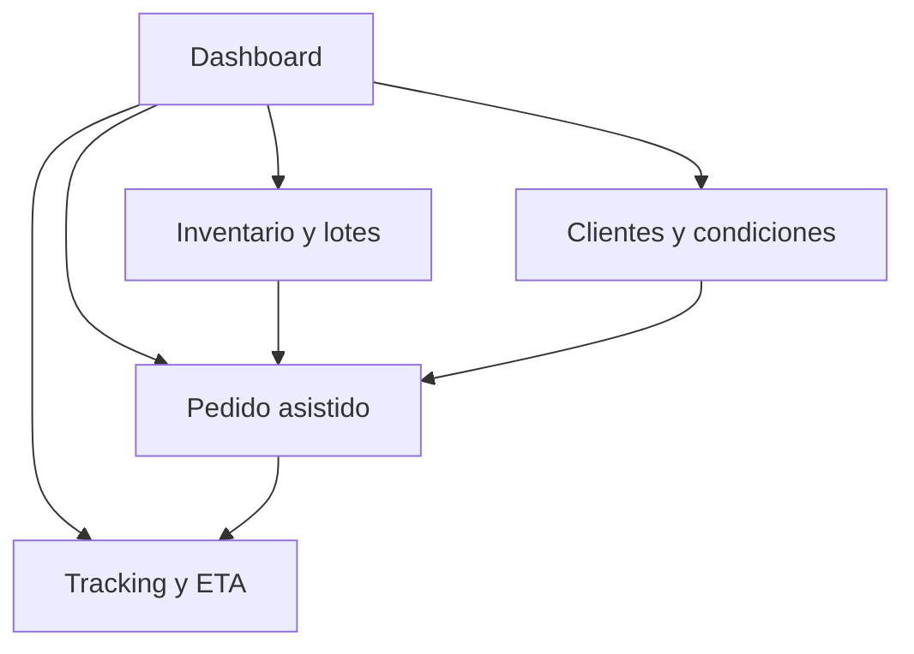

## 4.5. Web Applications Prototyping.

En AV1, el prototipado de la web application debe entenderse como una <strong>evidencia de diseño de alta fidelidad</strong> para una capa transaccional que todavía no se implementa públicamente. Su función no es demostrar despliegue, sino validar continuidad entre la investigación del dominio, los flujos definidos en el backlog y la futura experiencia autenticada de Nexa. Por ello, esta subsección se enfoca en <strong>qué módulos debían quedar prototipados</strong> y <strong>qué tipo de evidencia debe preservarse para sustentar esa afirmación</strong>.

El prototipo de alta fidelidad de la aplicación debía cubrir, como mínimo, las superficies críticas del MVP transaccional:

| Módulo del prototipo | Objetivo de validación | Elementos críticos que deben verse en alta fidelidad |
|---|---|---|
| Dashboard operativo | Centralizar el estado del negocio en una vista de decisión rápida | KPIs, alertas, stock comprometido, incidencias y accesos a módulos |
| Pedido asistido interno | Reducir la doble digitación y hacer explícitas las reglas comerciales | identificación de cliente, catálogo, validaciones, bloqueo por crédito o stock |
| Portal B2B de autoservicio | Permitir compra directa con contexto de cuenta | catálogo filtrado, carrito, borradores, historial y confirmación |
| Seguimiento y POD | Dar visibilidad y evidencia de cierre | ETA, secuencia de estados, incidencias, firma o prueba de entrega |

La navegación prototipada debía preservar una continuidad clara entre módulos, tal como se resume en el siguiente mapa:

Durante esta revisión del workspace no se localizó una URL Figma verificable ni exportaciones dedicadas del prototipo autenticado para insertar como evidencia cerrada en el informe. En consecuencia, la defensa académica más sólida para AV1 consiste en presentar el prototipado como una <strong>capacidad de diseño avanzada y parcialmente preservada</strong> mediante wireframes, wireflows y user flows. Para cerrar documentalmente esta subsección en la versión final, deberá anexarse el enlace real del archivo Figma y, de ser posible, tres capturas exportadas: dashboard, pedido asistido y seguimiento/POD.

