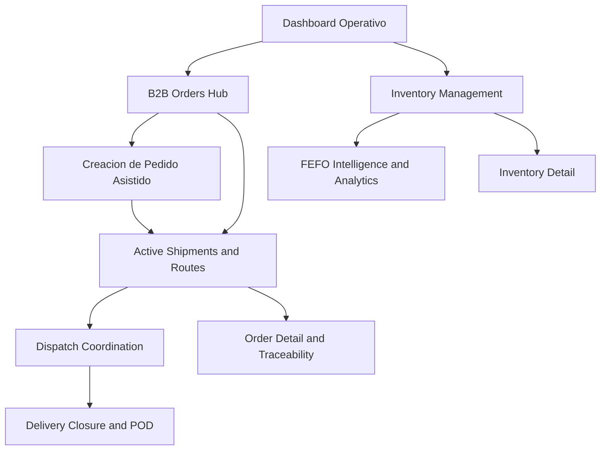

## 4.5. Web Applications Prototyping.

En AV1, el prototipado de la web application debe entenderse como una <strong>evidencia de diseño de alta fidelidad</strong> para una capa transaccional que todavía no se implementa públicamente. Su función no es demostrar despliegue, sino validar continuidad entre la investigación del dominio, los flujos definidos en el backlog y la futura experiencia autenticada de Nexa. Por ello, esta subsección se enfoca en <strong>qué módulos quedaron prototipados</strong>, <strong>cómo se conectan entre sí</strong> y <strong>qué evidencia verificable puede citarse desde el archivo Figma real del equipo</strong>.

El prototipo de alta fidelidad de la aplicación debía cubrir, como mínimo, las superficies críticas del MVP transaccional:

| Módulo del prototipo | Objetivo de validación | Elementos críticos que deben verse en alta fidelidad |
|---|---|---|
| Dashboard operativo | Centralizar el estado del negocio en una vista de decisión rápida | KPIs, alertas, stock comprometido, incidencias y accesos a módulos |
| Pedido asistido interno | Reducir la doble digitación y hacer explícitas las reglas comerciales | identificación de cliente, catálogo, validaciones, bloqueo por crédito o stock |
| Portal B2B de autoservicio | Permitir compra directa con contexto de cuenta | catálogo filtrado, carrito, borradores, historial y confirmación |
| Seguimiento y POD | Dar visibilidad y evidencia de cierre | ETA, secuencia de estados, incidencias, firma o prueba de entrega |

La inspección del archivo Figma autenticado del equipo confirmó que la página <strong>`Mockups`</strong> ya contiene una familia consistente de pantallas de alta fidelidad. Esta evidencia fue verificada en la sesión activa del navegador y permite citar un archivo maestro y varios enlaces directos por frame, en lugar de depender de una referencia genérica al proyecto.

| Evidencia maestra | Enlace verificado |
|---|---|
| Proyecto Figma del equipo | [Nexa Landing Page / Project](https://www.figma.com/files/team/1586383034175281439/project/587167294) |
| Archivo Figma de la web application | [Web App - Figma Design File](https://www.figma.com/design/buDa5VZmYjPNokbl4FEJqx/Web-App?node-id=0-1) |

**Ilustración 40**

*Mapa funcional de los mockups de alta fidelidad verificados en Figma*

*Nota. Elaboración propia. El mapa resume la continuidad visual entre control operativo, captura del pedido, inventario, despacho, trazabilidad y cierre, tal como aparece organizada en el archivo Figma del equipo.*

**Ilustración 41**

*Pantallas de alta fidelidad verificadas en el prototipo autenticado*

| Pantalla prototipada | Propósito dentro del flujo | Enlace directo |
|---|---|---|
| Dashboard Operativo: Control Total | Consolidar alertas, KPIs y estado general de la operación | [Abrir frame](https://www.figma.com/design/buDa5VZmYjPNokbl4FEJqx/Web-App?node-id=1-2) |
| B2B Orders Hub | Gestionar órdenes y revisar estados de procesamiento | [Abrir frame](https://www.figma.com/design/buDa5VZmYjPNokbl4FEJqx/Web-App?node-id=1-1885) |
| Creación de Pedido Asistido | Capturar pedidos con validación comercial y operativa | [Abrir frame](https://www.figma.com/design/buDa5VZmYjPNokbl4FEJqx/Web-App?node-id=1-496) |
| Inventory Management | Controlar stock, riesgo térmico y rotación visible | [Abrir frame](https://www.figma.com/design/buDa5VZmYjPNokbl4FEJqx/Web-App?node-id=1-2114) |
| Confirmación de Despacho & Asignación de Flota | Asignar vehículos y coordinar despacho listo para salida | [Abrir frame](https://www.figma.com/design/buDa5VZmYjPNokbl4FEJqx/Web-App?node-id=1-1645) |
| FEFO Intelligence & Analytics | Visualizar vencimientos, alertas y priorización FEFO | [Abrir frame](https://www.figma.com/design/buDa5VZmYjPNokbl4FEJqx/Web-App?node-id=1-2592) |
| Active Shipments & Routes | Monitorear trayectos y incidencias en ruta | [Abrir frame](https://www.figma.com/design/buDa5VZmYjPNokbl4FEJqx/Web-App?node-id=1-211) |
| Cierre de Entrega (POD) & Certificación | Registrar evidencia de cierre y prueba de entrega | [Abrir frame](https://www.figma.com/design/buDa5VZmYjPNokbl4FEJqx/Web-App?node-id=1-981) |

La evidencia anterior permite defender el prototipado con mayor precisión: Nexa sí preserva un archivo real de mockups autenticados con pantallas concretas para dashboard, órdenes, inventario, despacho, FEFO, tracking y POD. No obstante, la interpretación correcta para AV1 sigue siendo la misma: estas vistas constituyen <strong>evidencia visual de diseño y preparación funcional</strong>, no evidencia de implementación desplegada. Si el equipo desea elevar el cierre visual del informe antes de la entrega final, bastará con exportar desde esos mismos frames tres o cuatro capturas PNG y reemplazar esta tabla por las imágenes correspondientes, manteniendo exactamente los enlaces ya verificados como respaldo.

