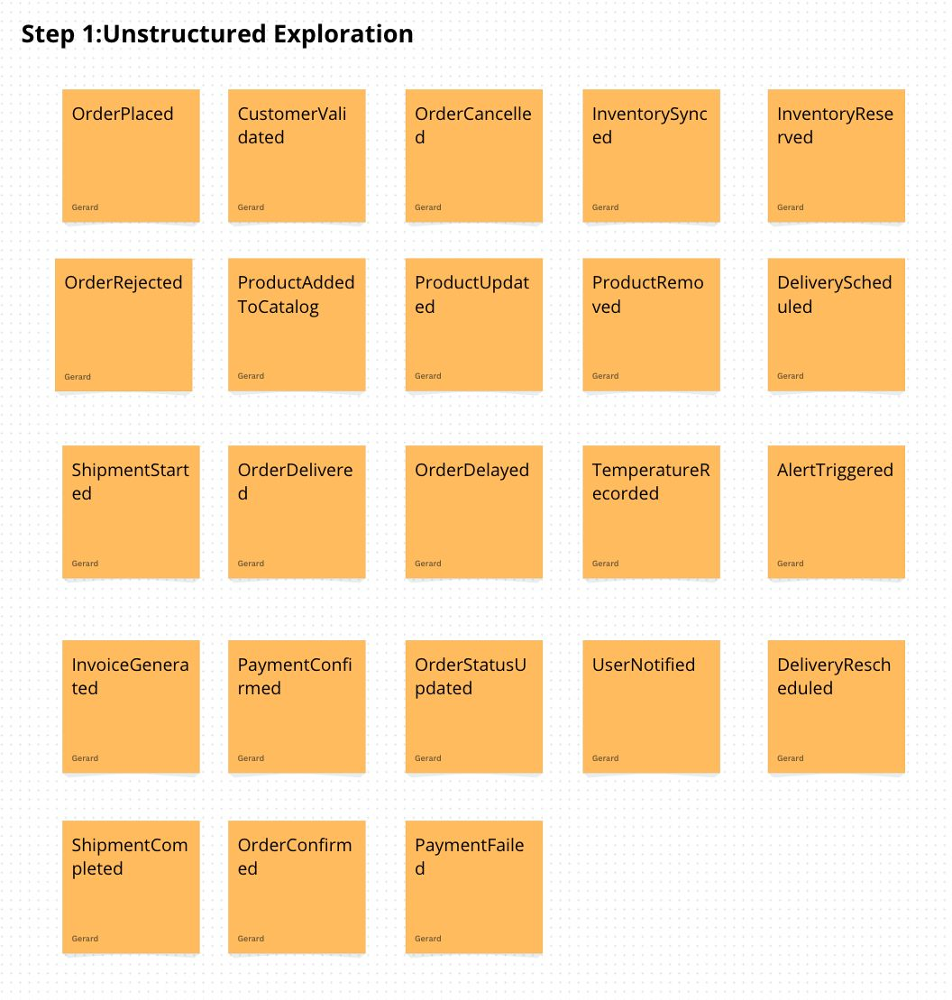
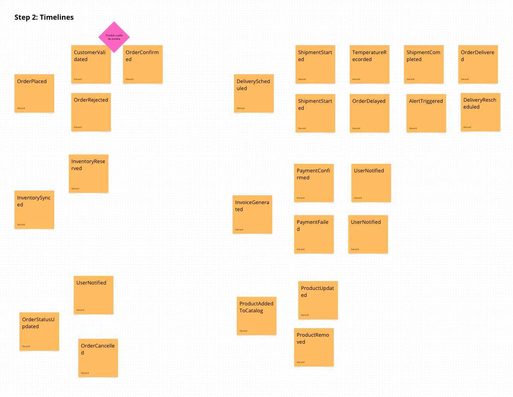
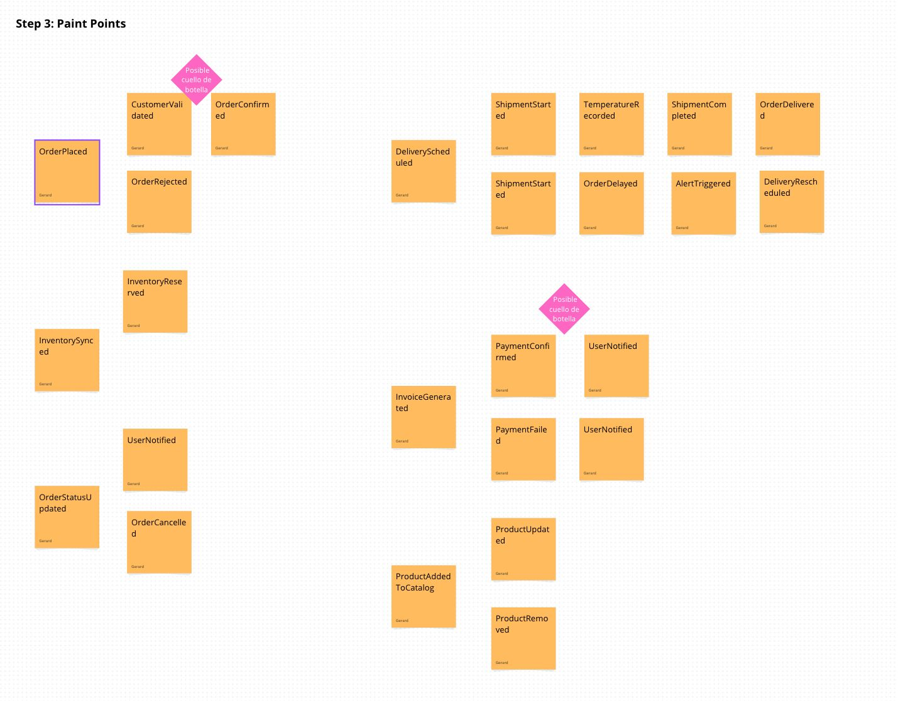
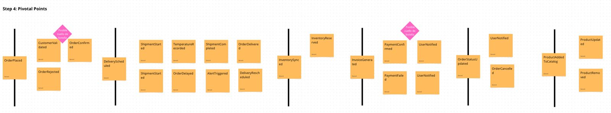
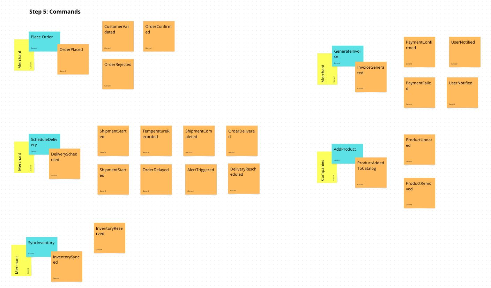
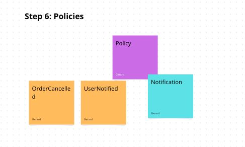
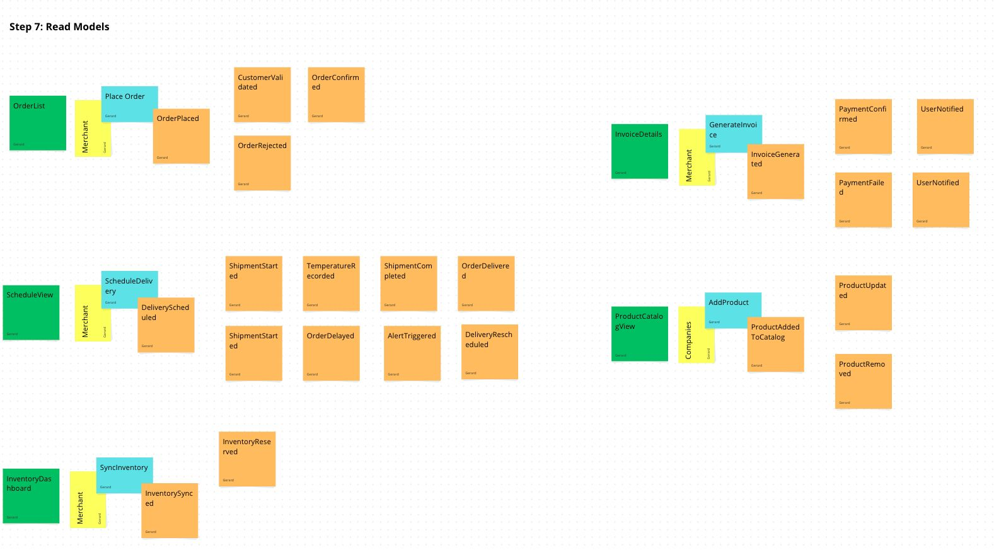
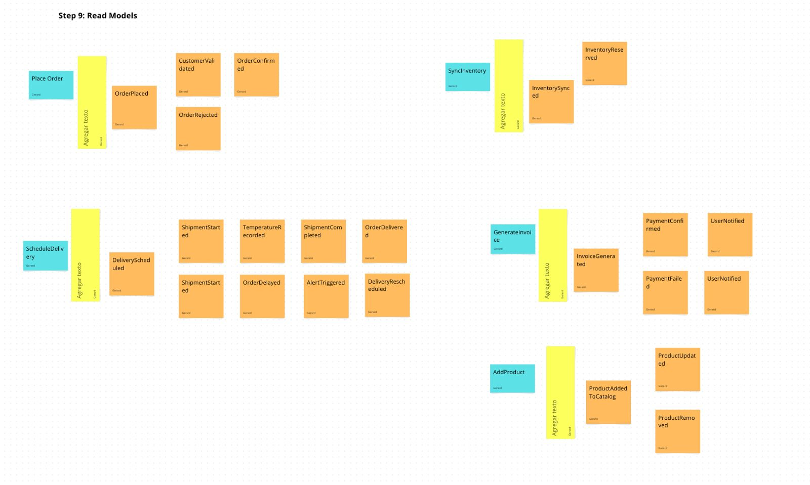
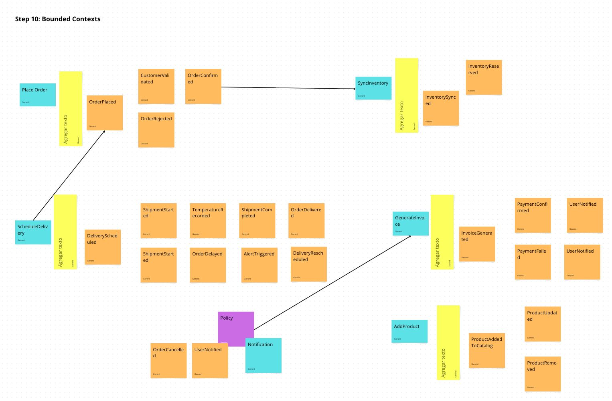

## 4.6. Domain-Driven Software Architecture

La arquitectura de software de Nexa sigue los principios del Domain-Driven Design (DDD), partiendo de los bounded contexts identificados en el Big Picture EventStorming y profundizando en su modelado mediante el Design-Level EventStorming. La representación arquitectónica emplea el modelo C4, que permite comunicar la estructura del sistema en cuatro niveles de abstracción progresiva: contexto, contenedores, componentes y código. Para Nexa, se presentan los tres primeros niveles, dado que el cuarto (código) corresponde a fases de implementación avanzada.

### 4.6.1. Design-Level EventStorming

El Design-Level EventStorming profundiza en los bounded contexts identificados durante el Big Picture EventStorming, permitiendo al equipo descomponer cada dominio en agregados, comandos, eventos, políticas, read models y responsabilidades técnicas con mayor nivel de detalle. Este proceso tuvo como objetivo principal delimitar las responsabilidades de cada contexto y establecer los contratos de comunicación entre ellos, sentando las bases para la arquitectura técnica de la plataforma.

**Ilustración 49**
*Design-Level EventStorming — Paso 1: Exploración de eventos detallados*

*Nota.* Identificación de eventos granulares dentro de los contextos de órdenes e inventario. Elaboración propia.

**Ilustración 50**
*Design-Level EventStorming — Paso 2: Definición de comandos y actores*

*Nota.* Asociación de acciones específicas con los roles responsables identified en el negocio. Elaboración propia.

**Ilustración 51**
*Design-Level EventStorming — Paso 3: Identificación de agregados*

*Nota.* Definición de los objetos de negocio que actúan como raíz de consistencia para el sistema. Elaboración propia.

**Ilustración 52**
*Design-Level EventStorming — Paso 4: Modelado de políticas y reglas*

*Nota.* Definición de triggers automáticos entre contextos, como la validación de crédito post-pedido. Elaboración propia.

**Ilustración 53**
*Design-Level EventStorming — Paso 5: Refinamiento de Bounded Contexts*

*Nota.* Ajuste de límites entre contextos comerciales y logísticos. Elaboración propia.

**Ilustración 54**
*Design-Level EventStorming — Paso 6: Definición de servicios externos*

*Nota.* Identificación de puntos de contacto con sistemas de terceros. Elaboración propia.

**Ilustración 55**
*Design-Level EventStorming — Paso 7: Diseño de UI Flows preliminares*

*Nota.* Conexión entre la lógica de dominio y la experiencia de usuario. Elaboración propia.

**Ilustración 56**
*Design-Level EventStorming — Paso 9: Validación de consistencia*

*Nota.* Revisión final de flujos transversales previo al diseño técnico. Elaboración propia.

**Ilustración 57**
*Design-Level EventStorming — Paso 10: Salida hacia arquitectura técnica*

*Nota.* Consolidación del modelo de dominio para su traducción a infraestructura. Elaboración propia.

La sesión de modelado se organizó en torno a los siete bounded contexts canónicos del sistema: <strong>Catalog</strong>, <strong>Orders</strong>, <strong>Inventory</strong>, <strong>Customer Management</strong>, <strong>Commercial Conditions</strong>, <strong>Traceability</strong> e <strong>Identity</strong>. Para cada contexto se identificaron los agregados principales, los comandos que los modifican, los eventos de dominio que producen y las vistas de lectura necesarias para exponer el estado correcto a cada actor. Las políticas de coordinación entre contextos —como la reserva de stock al confirmar un pedido o el bloqueo de operaciones ante saldo vencido— se capturaron como reglas de negocio explícitas, materializadas posteriormente en los criterios de aceptación de las user stories correspondientes.

El resultado del Design-Level EventStorming confirmó que el flujo central del pedido atraviesa de forma coherente los contextos de Orders, Inventory, Commercial Conditions y Traceability, y que el contexto Identity actúa como proveedor transversal de autorización. Esta estructura se refleja directamente en los diagramas C4 presentados a continuación.

### 4.6.2. Software Architecture Context Diagram

El diagrama de contexto representa el nivel más alto de abstracción del sistema C4. Muestra cómo el sistema Nexa interactúa con los actores externos y sistemas adyacentes, sin revelar detalles de su estructura interna. En este nivel se identifican tres tipos de actores: los usuarios humanos del sistema (coordinación comercial, cliente comercial B2B y personal de despacho), el sistema de software Nexa como caja negra, y los sistemas externos con los que se conecta o se prevé conectar en fases futuras.

**Ilustración 58**

*Diagrama de Contexto del Sistema Nexa (C4 — Nivel 1)*

*Nota.* El diagrama de contexto representa las relaciones del sistema Nexa con sus actores externos principales y los sistemas de software adyacentes. Los actores internos (Coordinación Comercial, Cliente Comercial B2B y Despacho) interactúan directamente con la plataforma web. Los sistemas externos representan integraciones previstas para fases posteriores al MVP. Elaboración propia, herramienta: Visual Paradigm.

Como se observa en el diagrama, Nexa opera como un sistema centralizado al que acceden los tres perfiles operativos primarios a través de la misma plataforma web, diferenciando sus capacidades mediante control de acceso por rol. El sistema se mantiene autónomo en el MVP, sin dependencias de integración externa que bloqueen su funcionamiento inicial, lo que reduce la complejidad de adopción para las pymes distribuidoras.

### 4.6.3. Software Architecture Container Diagrams

El diagrama de contenedores descompone el sistema Nexa en sus unidades desplegables principales, mostrando qué tecnologías conforman cada contenedor y cómo se comunican entre sí. Este nivel de abstracción permite al equipo establecer los límites tecnológicos del sistema y validar que la arquitectura propuesta es coherente con las convenciones de desarrollo definidas en la sección 5.1.

**Ilustración 59**

*Diagrama de Contenedores del Sistema Nexa (C4 — Nivel 2)*

*Nota.* El diagrama de contenedores muestra los cinco contenedores que componen la plataforma Nexa: el sitio público (Landing Page en HTML/CSS/JS), la aplicación web transaccional (Web Application), el API RESTful (Backend en C# / ASP.NET Core), la base de datos relacional y el sistema de autenticación. Las flechas representan el protocolo y el tipo de interacción entre contenedores. Elaboración propia, herramienta: Visual Paradigm.

El diagrama evidencia una arquitectura de tres capas alineada con el alcance del MVP: una capa de presentación separada para el sitio público y la aplicación transaccional, una capa de lógica de negocio concentrada en el API RESTful bajo convenciones REST, y una capa de persistencia relacional. Esta separación facilita el despliegue independiente de cada contenedor y la evolución futura del sistema hacia integraciones con sistemas logísticos externos.

### 4.6.4. Software Architecture Components Diagrams

El diagrama de componentes descompone el contenedor de mayor complejidad —el API RESTful— en sus módulos internos, mostrando cómo los bounded contexts se traducen en componentes de software discretos y cómo se relacionan entre sí dentro del backend. Este nivel permite validar que la estructura del código fuente respeta las delimitaciones del dominio identificadas durante el EventStorming.

**Ilustración 60**

*Diagrama de Componentes del Sistema Nexa (C4 — Nivel 3)*

*Nota.* El diagrama de componentes descompone el API RESTful de Nexa en sus módulos internos, correspondientes a los bounded contexts del dominio: Catalog, Orders, Inventory, Customer Management, Commercial Conditions, Traceability e Identity. Cada componente expone un conjunto de endpoints REST y se comunica con los demás a través de interfaces de dominio, evitando el acoplamiento directo entre contextos. Elaboración propia, herramienta: Visual Paradigm.

La estructura de componentes refleja directamente los bounded contexts modelados durante el EventStorming. Cada componente es responsable de su propio conjunto de agregados y eventos de dominio, siguiendo el principio de responsabilidad única. La separación entre el componente Identity y el resto garantiza que la autenticación y autorización sean transversales sin contaminar la lógica de negocio de cada contexto funcional. Esta arquitectura sienta las bases para una eventual transición hacia microservicios en fases posteriores del producto, cuando el volumen operativo lo justifique.

