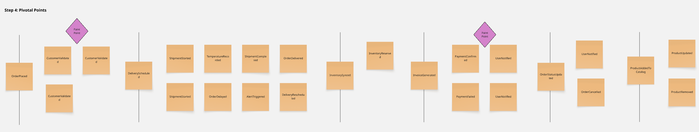
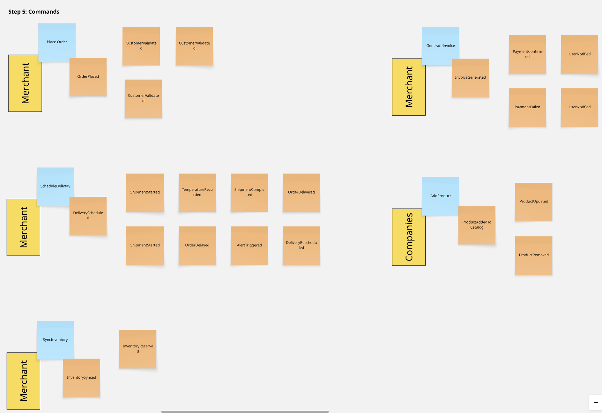
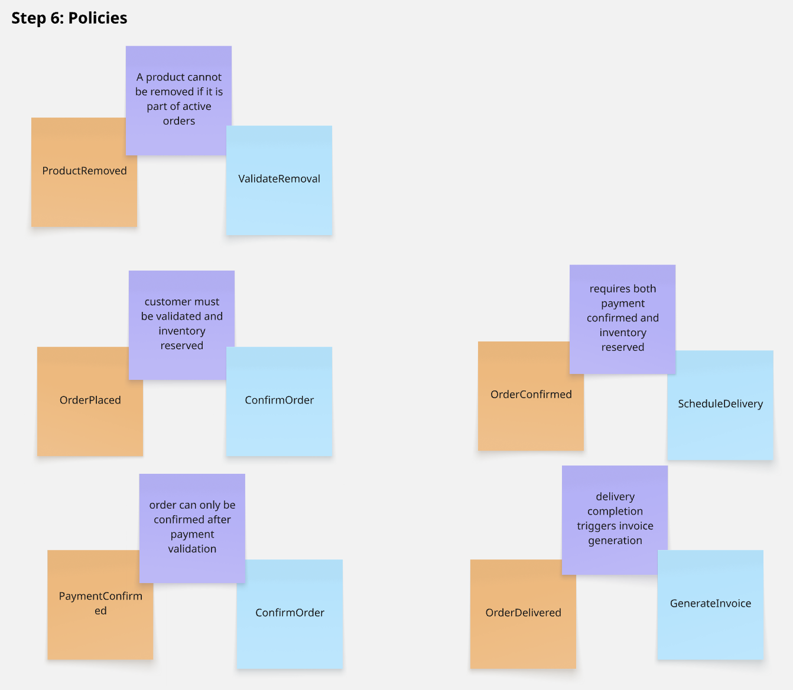
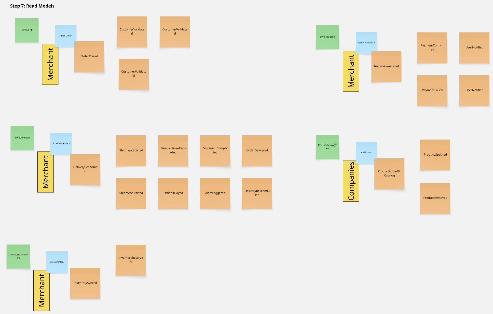
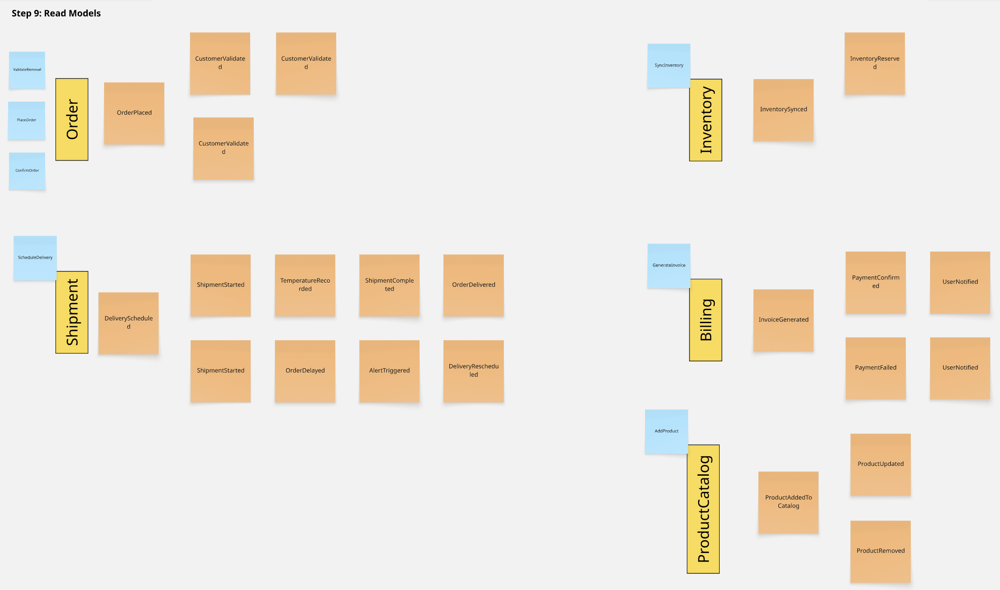
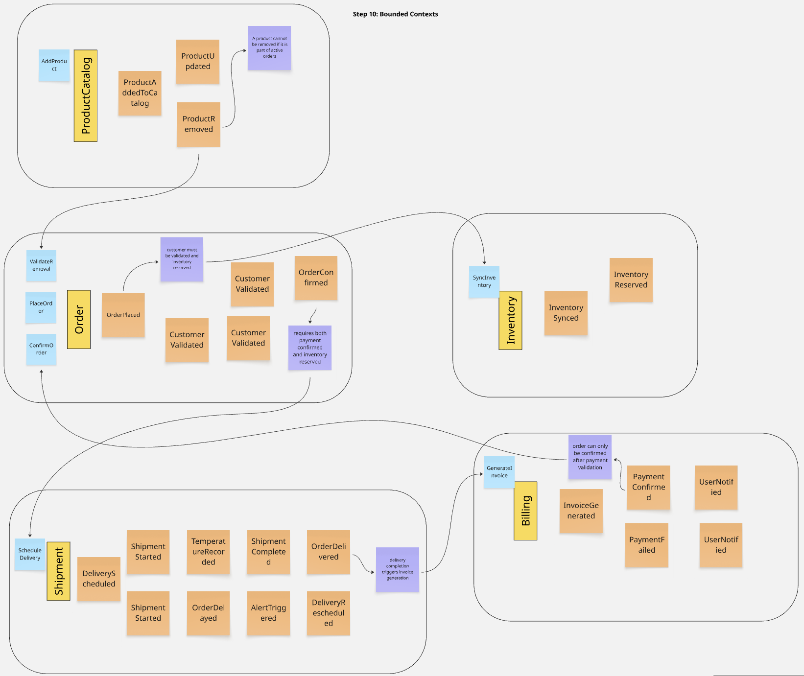

## 4.6. Domain-Driven Software Architecture

La arquitectura de software de Nexa sigue los principios del Domain-Driven Design (DDD), partiendo de los bounded contexts identificados en el Big Picture EventStorming y profundizando en su modelado mediante el Design-Level EventStorming. La representación arquitectónica emplea el modelo C4, que permite comunicar la estructura del sistema en cuatro niveles de abstracción progresiva: contexto, contenedores, componentes y código. Para Nexa, se presentan los tres primeros niveles, dado que el cuarto (código) corresponde a fases de implementación avanzada.

### 4.6.1. Design-Level EventStorming

El Design-Level EventStorming profundiza el trabajo iniciado en el Big Picture EventStorming. En esta fase, el objetivo ya no fue solo entender el problema, sino ordenar el dominio en piezas que luego pudieran traducirse a arquitectura: eventos, líneas temporales, pain points, comandos, políticas, read models y bounded contexts.

Las capturas incluidas a continuación corresponden al tablero de trabajo usado por el equipo durante la sesión. Como respaldo adicional del workshop, se mantiene el enlace al board de Miro: [Design-Level EventStorming en Miro](https://miro.com/welcomeonboard/OC95SW9ySW9zY3Q5QURlWWFpTlN4NmVuY2xHWVRYdTBkd3hZR2FHcEZ1cDRBYm5SY1NYMkpvNFdYSmc1T1hLZ2lsQko3Z2RKUDdlbWF6ZmRRU21EalNzSEZqc2NKT2l6MTc2TXBFbjFUTTM2L3phOTVDWktNeTVnY1hVZGVEZjZBd044SHFHaVlWYWk0d3NxeHNmeG9BPT0hdjE=?share_link_id=419986690457). La evidencia de coordinación grupal de esa sesión debe leerse de forma complementaria en la subsección <strong>5.2.1.8</strong> y en el <strong>Anexo A</strong>.

*Design-Level EventStorming — Step 1: Unstructured Exploration*

En esta primera vista se registraron los eventos del dominio sin imponer todavía un orden rígido. El resultado permitió abrir el espacio de discusión alrededor de pedidos, validación de clientes, sincronización de inventario, facturación, alertas y entrega.

*Design-Level EventStorming — Step 2: Timelines*

Luego los eventos se organizaron por secuencia temporal. Esto ayudó a distinguir qué ocurre antes de la confirmación del pedido, qué depende de la reserva de inventario y qué eventos aparecen ya en la fase de despacho, facturación o actualización del catálogo.

*Design-Level EventStorming — Step 3: Pain Points*

Sobre esa línea temporal se marcaron los puntos de fricción más notorios. En la sesión destacaron, sobre todo, la validación del cliente y la confirmación del pago, porque son tramos donde una mala coordinación puede bloquear el flujo completo.

*Design-Level EventStorming — Step 4: Pivotal Points*

Después se resaltaron los puntos de decisión que modifican el recorrido del proceso. Esta vista permitió identificar momentos donde una confirmación, un retraso o una alerta cambian el comportamiento esperado del sistema y de los actores operativos.

*Design-Level EventStorming — Step 5: Commands*

Con los eventos ya más claros, el workshop pasó a los comandos que los provocan. Aquí se hizo visible qué acciones ejecuta cada actor, como colocar un pedido, programar una entrega, sincronizar inventario, generar una factura o agregar productos al catálogo.

*Design-Level EventStorming — Step 6: Policies*

Las políticas ayudaron a capturar reglas que no dependen solo de una pantalla o un endpoint, sino del comportamiento del negocio. Por ejemplo, se explicitaron restricciones como no retirar productos con órdenes activas o exigir validaciones previas antes de confirmar un pedido.

*Design-Level EventStorming — Step 7: Read Models*

En esta etapa se definieron las vistas de lectura que cada actor necesita para operar sin fricción. El tablero ya empieza a mostrar salidas concretas como listas de pedidos, vistas de agenda, paneles de inventario, detalles de factura y vistas del catálogo.

*Design-Level EventStorming — Step 9: Consolidated Flow by Context*

La novena vista reorganiza el flujo en bloques más estables y deja más claro qué eventos y comandos permanecen juntos dentro de cada área operativa. Esto sirvió como transición entre el taller de eventos y la definición técnica de módulos.

*Design-Level EventStorming — Step 10: Bounded Contexts*

Finalmente, el modelo se consolidó en bounded contexts. En esta salida ya se distinguen bloques como Product Catalog, Order, Inventory, Shipment y Billing, junto con sus dependencias y reglas cruzadas, lo que sirvió como base directa para el diseño arquitectónico posterior.

La sesión permitió aterrizar el dominio en contextos reconocibles y separar responsabilidades que antes aparecían mezcladas en el flujo general. También ayudó a decidir qué reglas debían permanecer dentro de un mismo contexto y cuáles debían resolverse como coordinación entre contextos distintos.

El resultado fue especialmente útil para confirmar que el flujo central del pedido atraviesa de forma consistente los contextos de Order, Inventory, Billing y Shipment, mientras que Product Catalog mantiene un rol de soporte estructural y las validaciones operativas se concentran en puntos bien definidos del proceso. Esa lectura es la que luego se refleja en los diagramas C4 presentados a continuación.

### 4.6.2. Software Architecture Context Diagram

El diagrama de contexto representa el nivel más alto de abstracción del sistema C4. Muestra cómo el sistema Nexa interactúa con los actores externos y sistemas adyacentes, sin revelar detalles de su estructura interna. En este nivel se identifican tres tipos de actores: los usuarios humanos del sistema (coordinación comercial, cliente comercial B2B y personal de despacho), el sistema de software Nexa como caja negra, y los sistemas externos con los que se conecta o se prevé conectar en fases futuras.

*Diagrama de Contexto del Sistema Nexa (C4 — Nivel 1)*

El diagrama de contexto representa las relaciones del sistema Nexa con sus actores externos principales y los sistemas de software adyacentes. Los actores internos (Coordinación Comercial, Cliente Comercial B2B y Despacho) interactúan directamente con la plataforma web. Los sistemas externos representan integraciones previstas para fases posteriores al MVP. Elaboración propia, herramienta: Visual Paradigm.

Como se observa en el diagrama, Nexa opera como un sistema centralizado al que acceden los tres perfiles operativos primarios a través de la misma plataforma web, diferenciando sus capacidades mediante control de acceso por rol. El sistema se mantiene autónomo en el MVP, sin dependencias de integración externa que bloqueen su funcionamiento inicial, lo que reduce la complejidad de adopción para las pymes distribuidoras.

### 4.6.3. Software Architecture Container Diagrams

El diagrama de contenedores descompone el sistema Nexa en sus unidades desplegables principales, mostrando qué tecnologías conforman cada contenedor y cómo se comunican entre sí. Este nivel de abstracción permite al equipo establecer los límites tecnológicos del sistema y validar que la arquitectura propuesta es coherente con las convenciones de desarrollo definidas en la sección 5.1.

*Diagrama de Contenedores del Sistema Nexa (C4 — Nivel 2)*

El diagrama de contenedores muestra los cinco contenedores que componen la plataforma Nexa: el sitio público (Landing Page en HTML/CSS/JS), la aplicación web transaccional (Web Application), el API RESTful (Backend en C# / ASP.NET Core), la base de datos relacional y el sistema de autenticación. Las flechas representan el protocolo y el tipo de interacción entre contenedores. Elaboración propia, herramienta: Visual Paradigm.

El diagrama evidencia una arquitectura de tres capas alineada con el alcance del MVP: una capa de presentación separada para el sitio público y la aplicación transaccional, una capa de lógica de negocio concentrada en el API RESTful bajo convenciones REST, y una capa de persistencia relacional. Esta separación facilita el despliegue independiente de cada contenedor y la evolución futura del sistema hacia integraciones con sistemas logísticos externos.

### 4.6.4. Software Architecture Components Diagrams

El diagrama de componentes descompone el contenedor de mayor complejidad —el API RESTful— en sus módulos internos, mostrando cómo los bounded contexts se traducen en componentes de software discretos y cómo se relacionan entre sí dentro del backend. Este nivel permite validar que la estructura del código fuente respeta las delimitaciones del dominio identificadas durante el EventStorming.

*Diagrama de Componentes del Sistema Nexa (C4 — Nivel 3)*

El diagrama de componentes descompone el API RESTful de Nexa en sus módulos internos, correspondientes a los bounded contexts del dominio: Catalog, Orders, Inventory, Customer Management, Commercial Conditions, Traceability e Identity. Cada componente expone un conjunto de endpoints REST y se comunica con los demás a través de interfaces de dominio, evitando el acoplamiento directo entre contextos. Elaboración propia, herramienta: Visual Paradigm.

La estructura de componentes refleja directamente los bounded contexts modelados durante el EventStorming. Cada componente es responsable de su propio conjunto de agregados y eventos de dominio, siguiendo el principio de responsabilidad única. La separación entre el componente Identity y el resto garantiza que la autenticación y autorización sean transversales sin contaminar la lógica de negocio de cada contexto funcional. Esta arquitectura sienta las bases para una eventual transición hacia microservicios en fases posteriores del producto, cuando el volumen operativo lo justifique.

