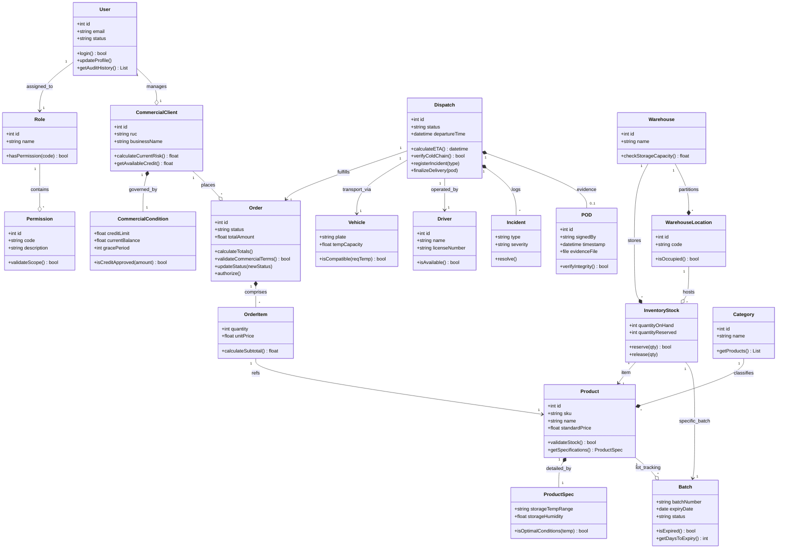

## 4.7. Software Object-Oriented Design

El diseño orientado a objetos de Nexa trasciende la mera representación de datos para convertirse en un <strong>modelo de dominio activo</strong>. Siguiendo los principios de <em>Clean Architecture</em> y <em>Domain-Driven Design (DDD)</em>, el sistema se estructura en contextos delimitados que encapsulan no solo el estado, sino el comportamiento crítico de la cadena de frío y la operatividad B2B. Cada clase ha sido diseñada para garantizar la alta cohesión y el bajo acoplamiento, facilitando la escalabilidad del SaaS.

---

  <h3 style="margin: 0; color: #0f172a;">4.7.1. Class Diagrams</h3>
  
"Modelando el comportamiento inteligente de la distribución primaria."

**Ilustración 22**

*Diagrama de Clases del Ecosistema Nexa (Enterprise Model)*

*Nota.* El diagrama de clases integra las reglas de negocio transaccionales con el modelo relacional. A diferencia del ERD, aquí se destacan los métodos de control (ej: <code>verifyColdChain</code>, <code>validateCredit</code>) que aseguran la integridad del proceso de distribución. Elaboración propia.

---

### 4.7.2. Metodología de Diseño y Correspondencia Lógica

El diseño orientado a objetos ha sido validado contra el esquema de base de datos (Capítulo 4.8) para garantizar una <strong>correspondencia biunívoca</strong> entre las entidades de persistencia y las clases de dominio. Esta simetría permite que la capa de aplicación (Services) interactúe con el modelo sin fricciones arquitectónicas.

  

    <h4 style="color: #2554df; margin-top: 0;">Lógica de Negocio Encapsulada</h4>
    <ul style="font-size: 13px; color: #475569;">
      <li><strong>Control de Riesgos:</strong> La clase <code>CommercialCondition</code> encapsula la validación de créditos, impidiendo la creación de pedidos si el cliente excede su saldo.</li>
      <li><strong>Seguridad Térmica:</strong> Los métodos en <code>ProductSpec</code> y <code>Vehicle</code> permiten pre-validar la compatibilidad de carga antes del despacho.</li>
    </ul>
  

  

    <h4 style="color: #2554df; margin-top: 0;">Trazabilidad y Auditoría</h4>
    <ul style="font-size: 13px; color: #475569;">
      <li><strong>Ciclo de Vida del Lote:</strong> Se implementa un seguimiento granular por <code>Batch</code> para gestionar alertas de caducidad automática.</li>
      <li><strong>Integridad Atómica:</strong> El objeto <code>Order</code> actúa como raíz del agregado, asegurando que los cambios en <code>Items</code> impacten en los totales y el stock de forma simultánea.</li>
    </ul>
  

---

### 4.7.3. Matriz de Trazabilidad: Requerimientos vs. Diseño OOD

Para asegurar la integridad del sistema, se presenta la siguiente matriz que vincula las historias de usuario críticas con los componentes del diseño orientado a objetos que las materializan.

**Tabla 23**

*Matriz de Coherencia Requerimiento-Objeto*

| User Story ID | Req. Title | Entidad/Clase Principal | Método/Lógica Vinculada |
| :--- | :--- | :--- | :--- |
| **US24** | Consultar catálogo | `Product` / `Category` | `validateStock()`, `getProducts()` |
| **US32** | Alertas de crédito | `CommercialCondition` | `isCreditApproved(amount)` |
| **US42** | Registro de POD | `POD` / `Dispatch` | `finalizeDelivery(pod)`, `verifyIntegrity()` |
| **US45** | Registro de Lotes | `Batch` / `ProductSpec` | `isExpired()`, `isOptimalConditions()` |
| **US47** | Reserva de Stock | `InventoryStock` | `reserve(qty)`, `release(qty)` |
| **US39** | Tracking & ETA | `Dispatch` | `calculateETA()` |
| **US41** | Estados de Pedido | `Order` | `updateStatus(newStatus)` |
| **US51** | Saldo y Morosidad | `CommercialCondition` | `currentBalance` |
| **US54** | Login Interno | `User` | `login()` |
| **US57** | Roles | `Role` / `Permission` | `hasPermission()`, `validateScope()` |
| **US48** | Bloqueo Producto | `Product` | `status`, `validateStock()` |
| **US44** | Monitor Inventario | `InventoryStock` | `quantityOnHand`, `quantityReserved` |
| **US61** | API Registro Pedido| `Order` / `OrderItem` | `calculateTotals()`, `authorize()` |
| **US46** | Alertas FEFO | `Batch` | `expiryDate`, `isExpired()` |
| **US63** | API POD/Eventos | `POD` / `Incident` | `verifyIntegrity()`, `resolve()` |

*Nota.* Se evidencia que cada funcionalidad crítica del negocio tiene un respaldo explícito en el diseño de clases, garantizando que el software sea una representación fiel de los requerimientos. Elaboración propia.
