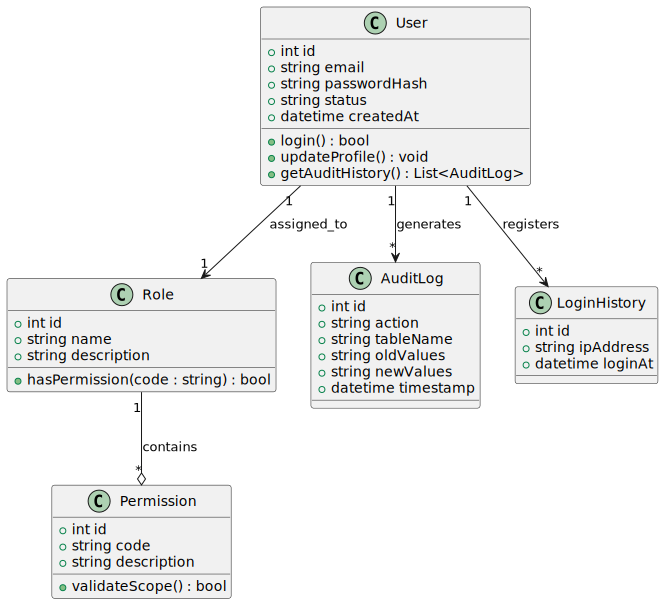
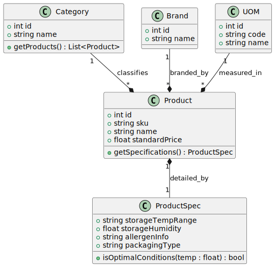
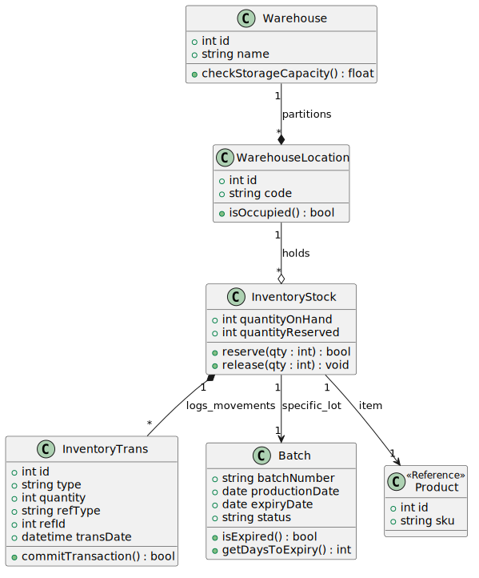
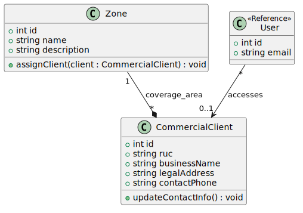
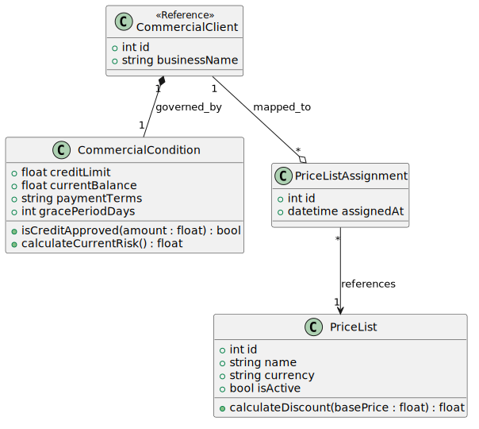
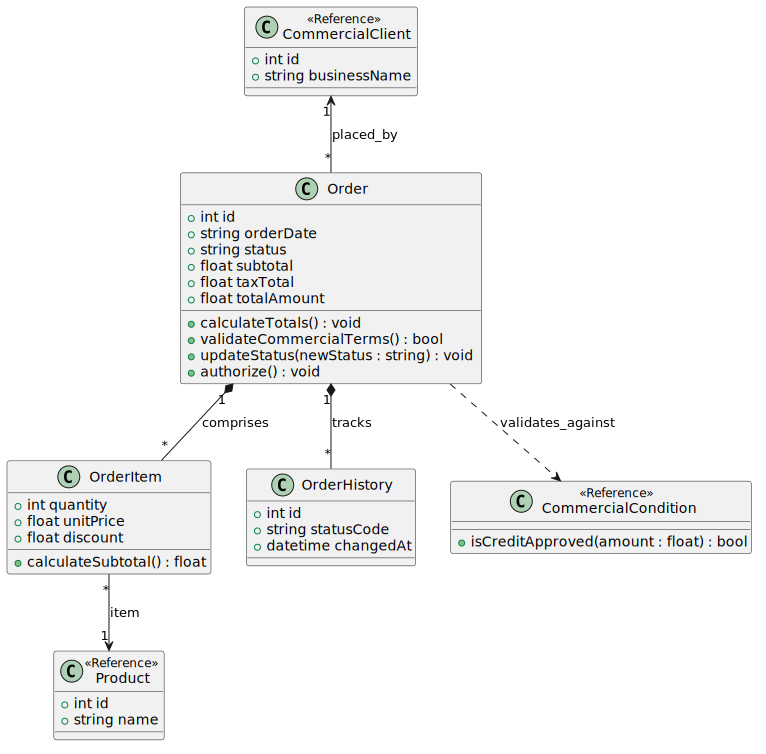
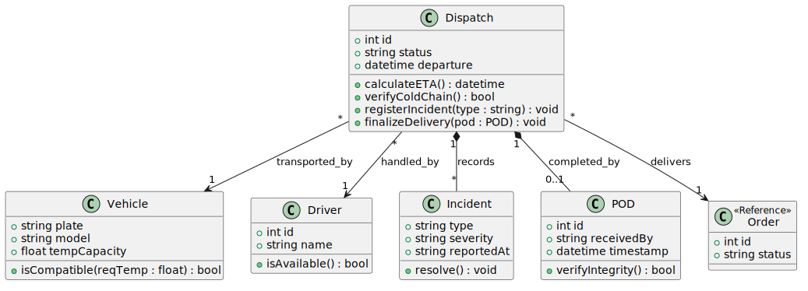

## 4.7. Software Object-Oriented Design

Esta sección presenta el diseño orientado a objetos de Nexa por bounded context, siguiendo la misma separación introducida en la arquitectura del capítulo 4.6. En lugar de concentrar todo el dominio en un único diagrama, se muestran bloques más acotados para que cada contexto conserve una responsabilidad clara.

El propósito de esta vista no es reemplazar el diseño de base de datos ni anticipar el código final de implementación, sino identificar las clases que concentran estado y comportamiento dentro de cada parte del sistema. Por eso algunos diagramas incluyen clases marcadas como <code>&lt;&lt;Reference&gt;&gt;</code>, usadas para representar dependencias con otros contextos sin absorber su modelo completo.

### 4.7.1. Class Diagrams

#### Identity

El contexto de identidad reúne las clases necesarias para autenticar usuarios, asignar roles y validar permisos. También incorpora los registros de auditoría y de inicio de sesión, ya que ambos dependen de la actividad del usuario autenticado y ayudan a sostener control operativo sobre accesos y cambios.

#### Catalog

El contexto de catálogo concentra la estructura maestra del producto: categoría, marca, unidad de medida, producto y especificación. Aquí el foco está en describir el producto y sus condiciones de conservación, no en resolver stock o movimientos de almacén.

#### Inventory

El contexto de inventario modela la disponibilidad física del producto mediante almacenes, ubicaciones, stock, lotes y movimientos. La inclusión de <code>InventoryTrans</code> permite representar que los cambios de stock no se tratan como un valor aislado, sino como movimientos registrados dentro del mismo contexto.

#### Customer Management

El contexto de gestión de clientes agrupa la información comercial básica del cliente y su pertenencia a una zona operativa. La referencia hacia usuario se mantiene ligera porque aquí importa la relación de acceso o vínculo comercial, no la administración completa de identidad.

#### Commercial Conditions

El contexto de condiciones comerciales contiene las reglas que afectan crédito, saldo, términos de pago y listas de precio. Este bloque se mantiene separado del contexto de pedidos para dejar claro que las reglas comerciales existen como una fuente de validación y no como un detalle embebido dentro de cada orden.

#### Orders

El contexto de pedidos modela la orden, sus ítems y su historial de estados. Las referencias hacia cliente, producto y condiciones comerciales se mantienen fuera de la propiedad central del agregado, pero siguen visibles para justificar cálculos, validaciones y cambios de estado dentro del flujo transaccional.

#### Traceability

El contexto de trazabilidad representa la ejecución posterior al pedido: despacho, vehículo, conductor, incidentes y evidencia de entrega. La referencia al pedido se conserva porque el despacho no se entiende como proceso aislado, sino como continuidad operativa de una orden ya confirmada.

### 4.7.2. Design Criteria

Los diagramas de esta sección siguen tres criterios. Primero, cada bounded context conserva sus clases propias y solo usa referencias hacia otros contextos cuando la relación es necesaria para explicar una validación o un flujo. Segundo, los métodos visibles responden a decisiones del dominio y no solo a almacenamiento de datos. Tercero, la separación entre catálogo, inventario, pedidos, clientes y trazabilidad evita que una misma entidad absorba responsabilidades que pertenecen a otro bloque.

Este criterio también mantiene coherencia con la vista C4 del capítulo anterior. Si en la arquitectura cada contexto tiene una responsabilidad diferenciada, esa separación debe seguir siendo visible en los diagramas de clases. Por eso no se fuerza un modelo empresarial único dentro de cada imagen, sino una lectura más acotada y útil para cada parte del sistema.

### 4.7.3. Traceability Matrix: Requirements and OOD

La siguiente matriz resume la relación entre requerimientos relevantes y las clases o métodos que los sostienen dentro del diseño orientado a objetos.

| User Story ID | Req. Title | Main Class | Related Method or Logic |
| :--- | :--- | :--- | :--- |
| **US54** | Login interno | `User` | `login()` |
| **US57** | Roles y permisos | `Role` / `Permission` | `hasPermission(code)`, `validateScope()` |
| **US24** | Consultar catálogo | `Category` / `Product` | `getProducts()`, `getSpecifications()` |
| **US45** | Registro de lotes | `Batch` | `isExpired()`, `getDaysToExpiry()` |
| **US44** | Monitor de inventario | `InventoryStock` | `quantityOnHand`, `quantityReserved` |
| **US47** | Reserva de stock | `InventoryStock` | `reserve(qty)`, `release(qty)` |
| **US32** | Validación de crédito | `CommercialCondition` | `isCreditApproved(amount)` |
| **US51** | Saldo y riesgo comercial | `CommercialCondition` | `currentBalance`, `calculateCurrentRisk()` |
| **US41** | Estados del pedido | `Order` / `OrderHistory` | `updateStatus(newStatus)` |
| **US61** | Registro de pedido | `Order` / `OrderItem` | `calculateTotals()`, `authorize()` |
| **US39** | Tracking y ETA | `Dispatch` | `calculateETA()`, `verifyColdChain()` |
| **US42** | Registro de POD | `Dispatch` / `POD` | `finalizeDelivery(pod)`, `verifyIntegrity()` |
| **US63** | Eventos de despacho y POD | `Dispatch` / `Incident` | `registerIncident(type)`, `resolve()` |

La matriz no reemplaza la especificación funcional del capítulo 3, pero sí muestra qué clases concentran la lógica necesaria para responder a los requerimientos más importantes del dominio. Elaboración propia.
