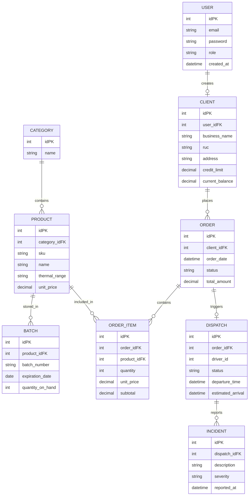

## 4.8. Database Design

El diseño de la base de datos de Nexa se fundamenta en un modelo relacional normalizado, diseñado para garantizar la integridad referencial y la consistencia de los datos en un entorno transaccional B2B. Dada la criticidad de la gestión de pedidos, el control de inventario por lotes y el seguimiento de la cadena de frío, se ha optado por una arquitectura de datos que soporte relaciones complejas entre clientes, catálogos especializados y el flujo operativo de despachos.

### 4.8.1. Database Diagrams

#### Entity-Relationship Diagram (ERD)

El siguiente diagrama representa las entidades núcleo del sistema y sus interconexiones. El modelo captura desde el aprovisionamiento de productos hasta la entrega final, integrando la lógica de negocio técnica de Nexa.

<strong>Justificación Técnica:</strong> Se ha seleccionado un motor SQL (como MySQL o PostgreSQL) para la persistencia de datos debido a su robustez en el manejo de transacciones ACID. Esto es vital para asegurar que la reserva de stock (<em>Committed Stock</em>) y el descuento de saldos (<em>Available Credit</em>) se ejecuten de forma atómica, evitando inconsistencias durante picos de operación comercial. Las relaciones se han estructurado para permitir una trazabilidad completa desde la orden de compra hasta la evidencia de entrega (POD), facilitando futuras integraciones con herramientas de analítica y reporte.

