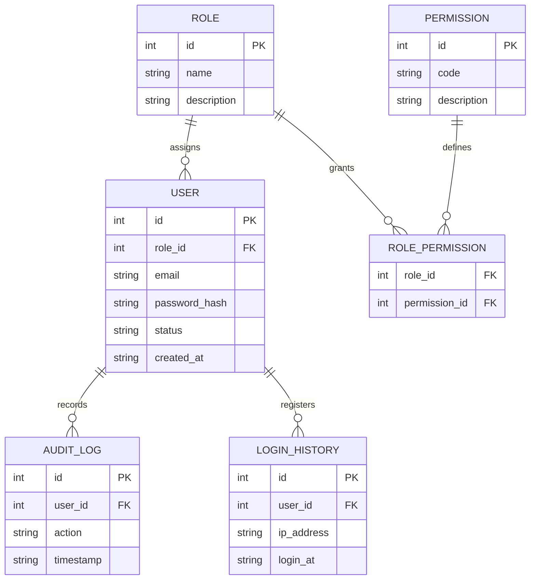
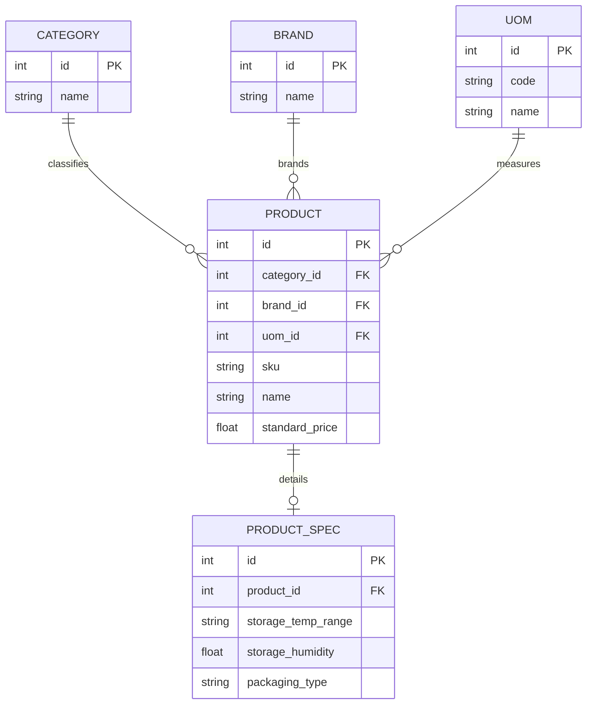
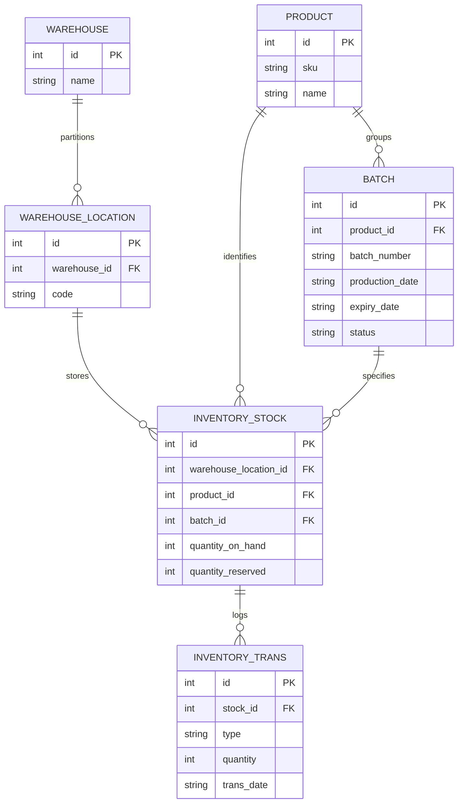
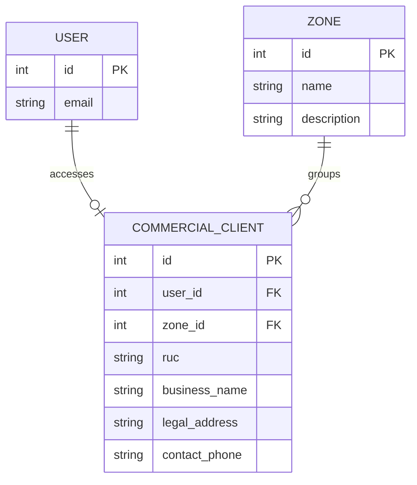
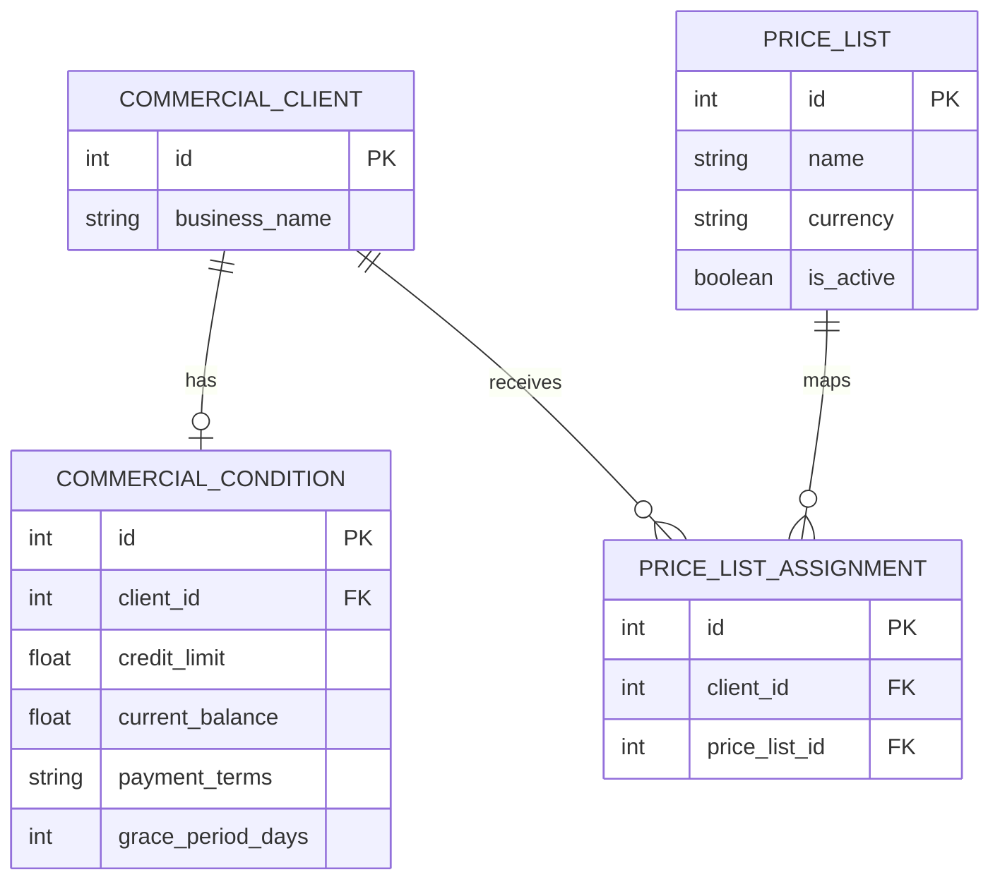
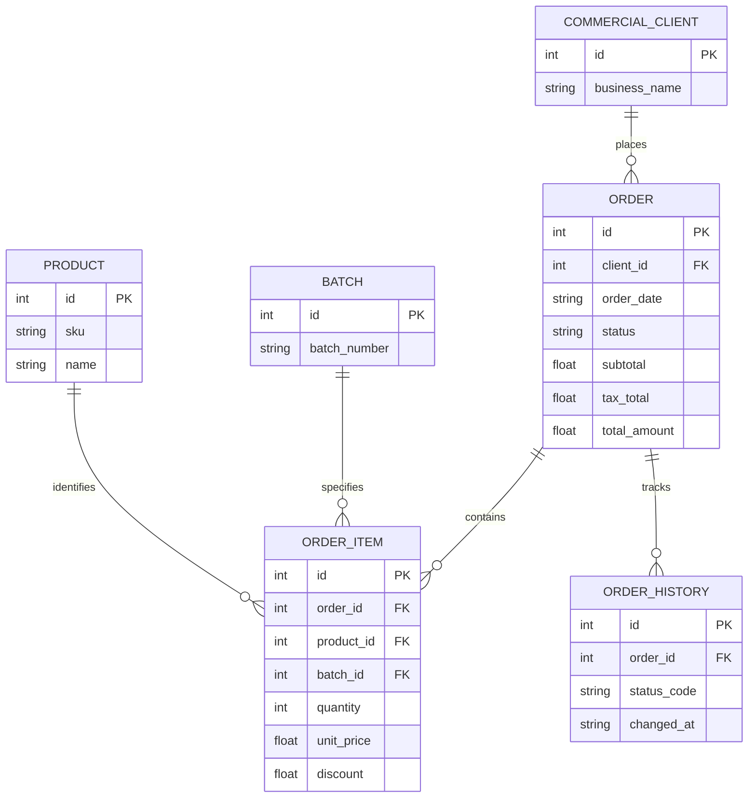
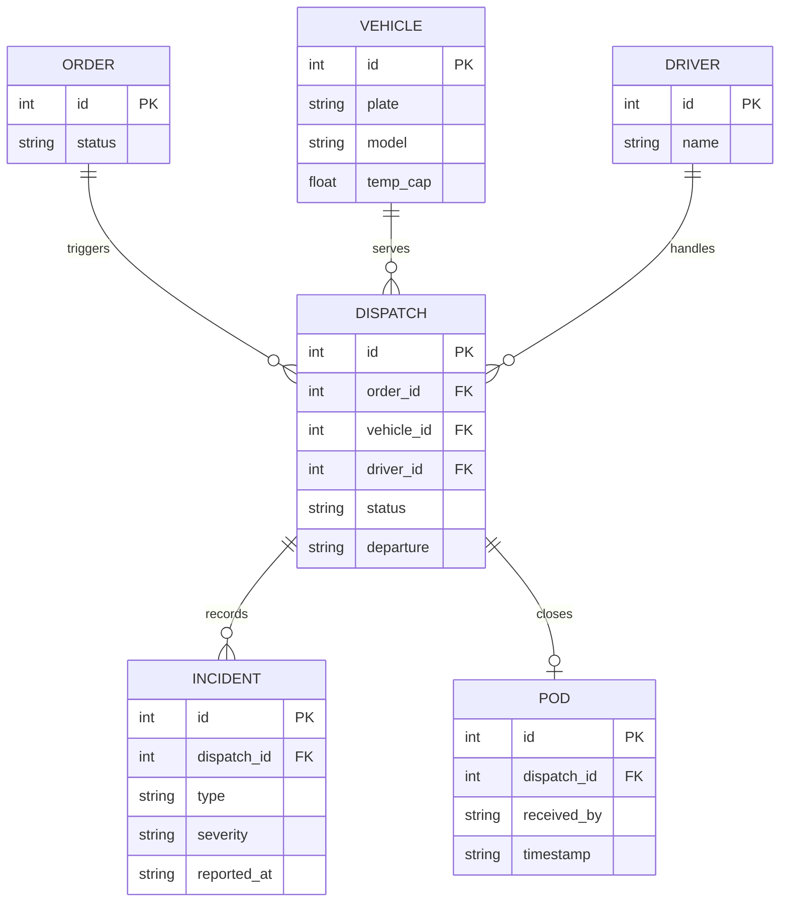

## 4.8. Database Design

La persistencia de Nexa se organiza por bounded context. En lugar de dejar todo el modelo en un único diagrama general, esta sección separa las tablas principales de cada bloque del dominio para que la relación con los class diagrams sea más clara. Los servicios de soporte como pagos y notificaciones no se modelan aquí como contextos propios, porque en esta etapa funcionan como integraciones auxiliares.

### 4.8.1. Database Diagrams

Los siguientes diagramas muestran la estructura relacional principal de cada contexto. Cuando una tabla depende de otra parte del sistema, esa referencia se incluye de forma mínima para no repetir el modelo completo en cada imagen.

#### 4.8.1.1. Identity

Este contexto concentra autenticación, roles, permisos y trazas de acceso. La relación entre usuario, auditoría e historial de inicio de sesión permite sostener control operativo sin mezclar estas tablas con la lógica comercial del pedido.

#### 4.8.1.2. Catalog

Catalog reúne la información maestra del producto. Aquí se describen categoría, marca, unidad y especificaciones de conservación, sin incorporar todavía stock, lotes o movimientos de almacén.

#### 4.8.1.3. Inventory

Inventory modela la disponibilidad física del producto. El stock se entiende como una combinación de ubicación, producto y lote, mientras que `INVENTORY_TRANS` deja constancia de los movimientos que alteran esa disponibilidad.

#### 4.8.1.4. Customer Management

Customer Management reúne la identidad comercial del cliente y su pertenencia a una zona operativa. La referencia al usuario se mantiene ligera, porque aquí importa el vínculo comercial del cliente, no la administración completa de identidad.

#### 4.8.1.5. Commercial Conditions

Este contexto concentra reglas comerciales que luego afectan validaciones del pedido: crédito, saldo, términos de pago y asignación de listas de precio. Separarlo del bloque de órdenes evita que esas reglas queden embebidas dentro de cada pedido.

#### 4.8.1.6. Orders

Orders modela la orden comercial, sus ítems y la evolución de estados. Las referencias a cliente, producto y lote se mantienen visibles porque son necesarias para validar condiciones, calcular totales y sostener la trazabilidad del flujo transaccional.

#### 4.8.1.7. Traceability

Traceability cubre la ejecución posterior al pedido: despacho, vehículo, conductor, incidentes y prueba de entrega. Este bloque existe para documentar el cierre operativo del pedido sin mezclarlo con la captura comercial o con el inventario.
