## 4.8. Database Design

El diseño de la base de datos de Nexa representa una arquitectura de datos de grado industrial, estructurada para soportar la alta complejidad de las operaciones B2B en la cadena de frío. La estrategia se centra en un modelo relacional robusto que garantiza la <strong>integridad atómica</strong> de las transacciones (ACID), permitiendo una trazabilidad total desde la identidad del usuario hasta la entrega física del producto, pasando por la gestión financiera, el control de inventario granular y el modelado de condiciones comerciales personalizadas.

### 4.8.1. Database Diagrams

#### Entity-Relationship Diagram (ERD) — Arquitectura Empresarial

El siguiente diagrama, desarrollado mediante la notación de ingeniería de software moderna, descompone el ecosistema de datos de Nexa en seis módulos funcionales interconectados. Este modelo contempla más de 35 entidades diseñadas para eliminar la redundancia y optimizar el rendimiento en consultas transaccionales de gran volumen.

```mermaid
erDiagram
    ROLE {
        int id PK
        string name
        string description
    }
    USER {
        int id PK
        int role_id FK
        string email
        string password_hash
        string status
        string created_at
    }
    PERMISSION {
        int id PK
        string code
        string description
    }
    ROLE_PERMISSION {
        int role_id FK
        int permission_id FK
    }
    AUDIT_LOG {
        int id PK
        int user_id FK
        string action
        string table_name
        string record_id
        string old_values
        string new_values
        string timestamp
    }
    LOGIN_HISTORY {
        int id PK
        int user_id FK
        string ip_address
        string login_at
    }
    ZONE {
        int id PK
        string name
        string description
    }
    COMMERCIAL_CLIENT {
        int id PK
        int user_id FK
        int zone_id FK
        string ruc
        string business_name
        string legal_address
        string contact_phone
    }
    COMMERCIAL_CONDITION {
        int id PK
        int client_id FK
        float credit_limit
        float current_balance
        string payment_terms
        int grace_period_days
    }
    PRICE_LIST {
        int id PK
        string name
        string currency
        boolean is_active
    }
    PRICE_LIST_ASSIGNMENT {
        int id PK
        int client_id FK
        int price_list_id FK
    }
    CATEGORY {
        int id PK
        string name
    }
    BRAND {
        int id PK
        string name
    }
    UOM {
        int id PK
        string code
        string name
    }
    PRODUCT {
        int id PK
        int category_id FK
        int brand_id FK
        int uom_id FK
        string sku
        string name
        float standard_price
    }
    PRODUCT_SPEC {
        int id PK
        int product_id FK
        string storage_temp_range
        float storage_humidity
        string allergen_info
        string packaging_type
    }
    BATCH {
        int id PK
        int product_id FK
        string batch_number
        string production_date
        string expiry_date
        string status
    }
    WAREHOUSE {
        int id PK
        string name
    }
    WAREHOUSE_LOCATION {
        int id PK
        int warehouse_id FK
        string code
    }
    INVENTORY_STOCK {
        int id PK
        int warehouse_id FK
        int product_id FK
        int batch_id FK
        int quantity_on_hand
        int quantity_reserved
    }
    INVENTORY_TRANS {
        int id PK
        int stock_id FK
        string type
        int quantity
        string ref_type
        int ref_id
        string trans_date
    }
    ORDER {
        int id PK
        int client_id FK
        string order_date
        string status
        float subtotal
        float tax_total
        float total_amount
    }
    ORDER_ITEM {
        int id PK
        int order_id FK
        int product_id FK
        int batch_id FK
        int quantity
        float unit_price
        float discount
    }
    ORDER_HISTORY {
        int id PK
        int order_id FK
        string status_code
        string changed_at
    }
    VEHICLE {
        int id PK
        string plate
        string model
        float temp_cap
    }
    DRIVER {
        int id PK
        string name
    }
    DISPATCH {
        int id PK
        int order_id FK
        int vehicle_id FK
        int driver_id FK
        string status
        string departure
    }
    INCIDENT {
        int id PK
        int dispatch_id FK
        string type
        string severity
        string reported_at
    }
    POD {
        int id PK
        int dispatch_id FK
        string received_by
        string timestamp
    }

    USER ||--o{ AUDIT_LOG : "generates"
    USER ||--o{ LOGIN_HISTORY : "registers"
    USER }|--|| ROLE : "assigned"
    ROLE ||--o{ ROLE_PERMISSION : "contains"
    ROLE_PERMISSION }|--|| PERMISSION : "defines"
    USER ||--o| COMMERCIAL_CLIENT : "accesses"
    COMMERCIAL_CLIENT }|--|| ZONE : "belongs_to"
    COMMERCIAL_CLIENT ||--|| COMMERCIAL_CONDITION : "has"
    COMMERCIAL_CLIENT ||--o{ PRICE_LIST_ASSIGNMENT : "mapped_to"
    PRICE_LIST_ASSIGNMENT }|--|| PRICE_LIST : "refs"
    PRODUCT }|--|| CATEGORY : "classified_in"
    PRODUCT }|--|| BRAND : "branded_by"
    PRODUCT ||--o{ PRODUCT_SPEC : "detailed_by"
    PRODUCT }|--|| UOM : "measured_in"
    PRODUCT ||--o{ BATCH : "stored_in"
    BATCH }|--|| PRODUCT : "variant_of"
    WAREHOUSE ||--o{ WAREHOUSE_LOCATION : "partitions"
    WAREHOUSE_LOCATION ||--o{ INVENTORY_STOCK : "holds"
    INVENTORY_STOCK }|--|| PRODUCT : "item"
    INVENTORY_STOCK }|--|| BATCH : "specific_lot"
    INVENTORY_STOCK ||--o{ INVENTORY_TRANS : "logs"
    ORDER }|--|| COMMERCIAL_CLIENT : "placed_by"
    ORDER ||--o{ ORDER_ITEM : "comprises"
    ORDER ||--o{ ORDER_HISTORY : "tracks"
    ORDER_ITEM }|--|| PRODUCT : "item"
    DISPATCH }|--|| ORDER : "delivers"
    DISPATCH }|--|| VEHICLE : "transported_by"
    DISPATCH }|--|| DRIVER : "handled_by"
    DISPATCH ||--o{ INCIDENT : "records"
    DISPATCH ||--o| POD : "completed_by"
```

### 4.8.2. Sustentación Técnica y Reglas de Negocio

El modelo propuesto cumple estrictamente con la <strong>Tercera Forma Normal (3NF)</strong>, eliminando dependencias transitivas y anomalías de actualización. Esta normalización es fundamental para un sistema SaaS como Nexa, donde la precisión de los precios por cliente, la caducidad de lotes y el saldo de crédito deben ser exactos en todo momento.

#### Módulos Críticos:
<ol>
    <li><strong>Gestión de Inventario Atómica:</strong> La entidad <code>INVENTORY_TRANSACTION</code> actúa como un libro contable (<em>Ledger</em>). Ningún stock se modifica directamente sin una transacción que respalde el movimiento, garantizando una trazabilidad forense ante cualquier discrepancia.</li>
    <li><strong>Inteligencia de Precios B2B:</strong> Mediante <code>PRICE_LIST</code> y <code>PRICE_LIST_ASSIGNMENT</code>, el sistema soporta precios dinámicos por canal, zona o cliente específico, resolviendo la necesidad de negociaciones personalizadas propia del sector.</li>
    <li><strong>Trazabilidad Logística:</strong> El módulo de logística integra <code>ROUTE_CHECKPOINTS</code> e <code>INCIDENTS</code>, permitiendo reconstruir la historia térmica y geográfica de cada pedido, cumpliendo con las normativas sanitarias vigentes.</li>
</ol>

#### Reglas de Integridad y Seguridad:
<ul>
    <li><strong>Validación Térmica (Check Constraints):</strong> Se implementan reglas de integridad para asegurar que las especificaciones de temperatura en <code>PRODUCT_SPECIFICATION</code> coincidan con las capacidades del <code>VEHICLE</code> asignado.</li>
    <li><strong>Seguridad de Identidad:</strong> Los datos sensibles se segregan mediante una arquitectura RBAC granular, donde cada acción en las tablas maestras queda registrada en <code>AUDIT_LOG</code> para fines de auditoría y cumplimiento normativo.</li>
    <li><strong>Integridad Referencial:</strong> El uso de Llaves Foráneas (FK) con políticas de eliminación restringida asegura que no se pierda la historia comercial (pedidos) al intentar depurar datos maestros (productos).</li>
</ul>
