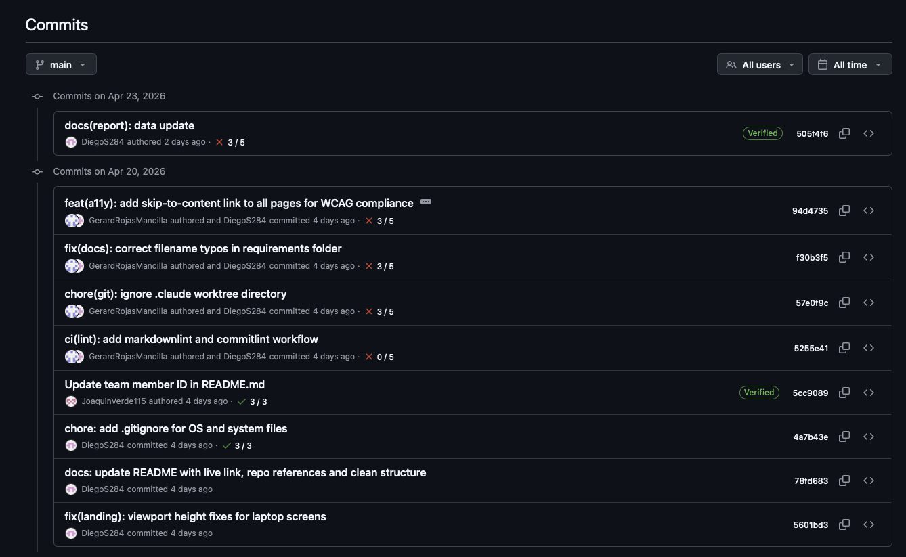
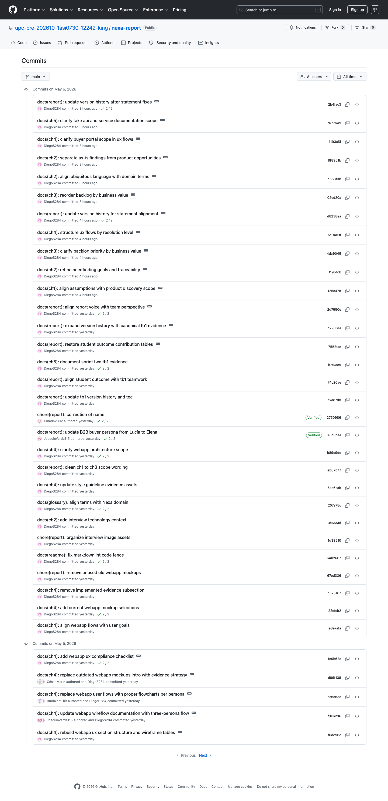
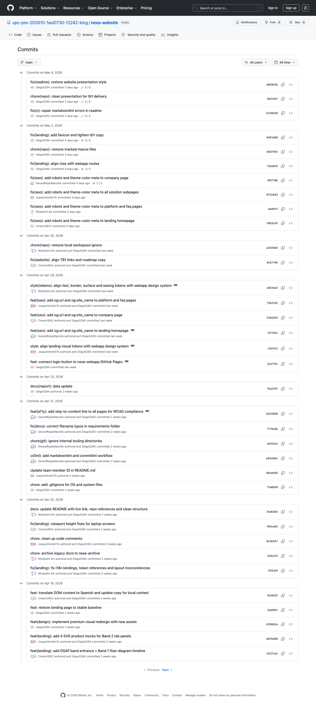
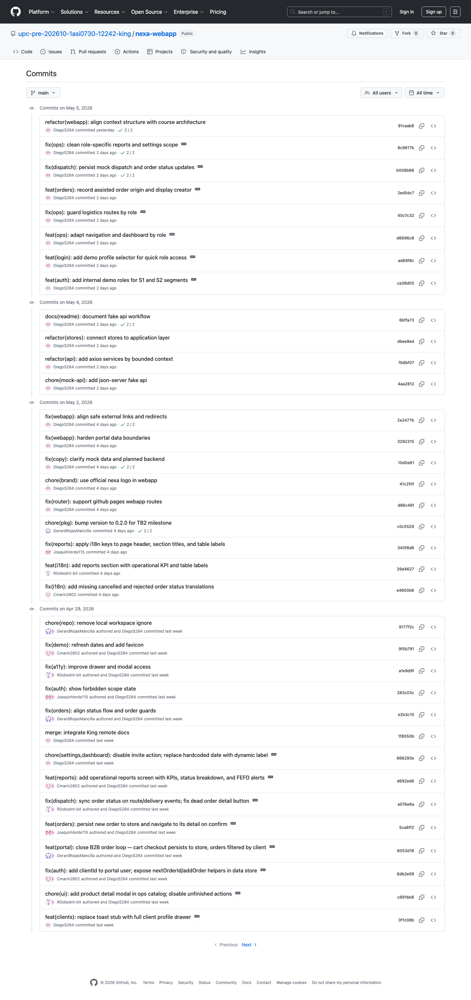

## 5.2. Landing Page, Services & Applications Implementation

Para AV1, la evidencia de implementación de Nexa debe concentrarse en el incremento que sí alcanzó un estado demostrable y defendible ante la rúbrica: **Sprint 1**. En esta iteración convergen la planificación en Jira, la consolidación del backlog, la producción de artefactos de diseño, la documentación arquitectónica y la construcción de la landing page pública desplegada. El tablero vivo de Jira registra **51 issues principales** dentro del sprint, distribuidos en **23 historias de usuario** y **28 tareas**, además de **16 subtareas reales** asociadas por parent. Por ello, este sprint no puede leerse como un simple esfuerzo de maquetación, sino como el primer incremento formal y visible del proyecto.

### 5.2.1. Sprint 1

El Sprint 1 concentra la entrega AV1 y constituye la base del incremento visible del proyecto. La salida funcional verificable es la landing page pública en GitHub Pages; sin embargo, la lectura ingenieril del sprint exige considerar también la coherencia entre backlog, diseño, arquitectura, trazabilidad documental y coordinación del equipo. Bajo esta lógica, la revisión del sprint no se limita a “qué página se publicó”, sino a **qué sistema de trabajo permitió llegar a esa publicación sin perder consistencia con el problema, los segmentos y la preparación técnica del producto**.

#### 5.2.1.1. Sprint Planning 1.

La planificación del Sprint 1 se orientó a producir un incremento AV1 que pudiera exponerse de forma pública sin sacrificar profundidad técnica. El objetivo no fue desplegar todavía el portal transaccional completo, sino articular una primera capa visible del producto respaldada por investigación, diseño y arquitectura. La captura de Jira muestra un sprint cargado con trabajo concurrente en varios frentes, lo cual confirma una planificación por capas y no por tareas aisladas.

*Resumen formal del Sprint Planning 1*

| Campo | Registro |
| :--- | :--- |
| **Sprint** | Sprint 1 |
| **Objetivo del sprint (SMART)** | Desplegar la primera versión pública de la Landing Page de Nexa y su arquitectura base (Outcome) para validar la propuesta de valor y atraer prospectos (Impact) enfocados en los segmentos S1 y S2 (Customer) al cierre de la entrega AV1 el 23 de abril de 2026 (Event). |
| **Fecha del sprint** | 01 de abril de 2026 - 23 de abril de 2026 |
| **Modalidad / Ubicación** | Sesiones remotas grabadas vía Microsoft Stream / Microsoft Teams |
| **Enlace de la sesión** | [Grabación del Sprint 1 (Stream)](https://upcedupe-my.sharepoint.com/:v:/g/personal/u202323040_upc_edu_pe/IQB8-qbGfc2ITIq6rlp5kvTuAWFIKesw8RDNiVv6OZDrAHE?nav=eyJyZWZlcnJhbEluZm8iOnsicmVmZXJyYWxBcHAiOiJPbmVEcml2ZUZvckJ1c2luZXNzIiwicmVmZXJyYWxBcHBQbGF0Zm9ybSI6IldlYiIsInJlZmVycmFsTW9kZSI6InZpZXciLCJyZWZlcnJhbFZpZXciOiJNeUZpbGVzTGlua0NvcHkifX0&e=3i1BUi) |
| **Preparado por** | Yucra Sandoval, Diego Sebastian |
| **Asistentes** | Diego Yucra, Joaquín Verde, César Marín, Gino Torrejón, Gerard Rojas |
| **Herramienta principal** | Jira Software |
| **Carga visible** | 51 issues principales en Sprint 1: 23 historias + 28 tareas; 16 subtareas reales asociadas por parent |

La carga anterior corresponde al corte normalizado de Jira verificado el 24 de abril de 2026. Las subtareas no aparecen como issues directas del sprint en la consulta principal porque Jira las administra bajo sus historias padre; por eso se documentan en una tabla separada, preservando la trazabilidad entre historia, tarea técnica y evidencia del incremento.

#### 5.2.1.2. Aspect Leaders and Collaborators.

La ejecución del sprint evidencia una distribución funcional del liderazgo. En lugar de concentrar toda la iteración en un único perfil, el equipo repartió la responsabilidad entre dominio, diseño, arquitectura, documentación y construcción visible del sitio. Esta organización es consistente con el Student Outcome ABET 5 y explica por qué el incremento AV1 combina trabajo público demostrable con profundidad ingenieril.

*Distribución de liderazgos y roles funcionales en el Sprint 1*

| Team Member | GitHub Username | Project Management | UX/UI Design | Software Architecture | Frontend Development | Documentation |
| :--- | :--- | :---: | :---: | :---: | :---: | :---: |
| Yucra Sandoval, Diego Sebastian | DiegoS284 | L | C | C | C | C |
| Verde Bueno, Joaquín Francisco | JoaquinVerde115 | C | L | C | C | C |
| Marín Cueva, César Fernando | Cmarin2802 | C | C | C | C | L |
| Torrejón De Los Santos, Gino Rodrigo | R0obxdnt-bit | C | C | C | C | L |
| Rojas Mancilla, Gerard Gianpier | GerardRojasMancilla | C | C | L | L | C |

#### 5.2.1.3. Sprint Backlog 1.

La forma más clara de leer el Sprint Backlog 1 no es como una lista plana de tickets, sino como un conjunto de frentes coordinados que alimentan un mismo incremento. La extracción de Jira confirma que el sprint no incluye el portal transaccional completo ni el backend productivo; concentra las historias públicas US01-US23, tareas transversales de investigación, UX/UI, arquitectura, despliegue y documentación, más subtareas específicas para las historias que necesitaban desglose operativo.

Además, el Sprint Backlog 1 no puede analizarse aislado del **Product Backlog documentado en la sección 3.3**. Las tablas siguientes conectan la priorización académica con el tablero operativo: las historias US01-US23 quedan dentro del Sprint 1, mientras que las historias transaccionales US24-US64 y las tareas técnicas de backend permanecen como backlog futuro. Esta separación permite defender AV1 sin declarar software que todavía no existe.

*Resumen cuantitativo del Sprint 1 en Jira*

| Bloque | Cantidad | Códigos Jira | Lectura dentro de AV1 |
| :--- | :---: | :--- | :--- |
| Historias de usuario | 23 | NX-224 a NX-246 | Corresponden a US01-US23 del Product Backlog y cubren el sitio público, bilingüismo, contacto, FAQ, soporte visible y acceso público al portal en preparación. |
| Tareas principales | 28 | NX-57, NX-59, NX-61 a NX-64, NX-67 a NX-71, NX-77, NX-81, NX-84, NX-88, NX-91, NX-106, NX-113, NX-142, NX-148, NX-153, NX-158, NX-161, NX-164, NX-167, NX-169, NX-254, NX-255 | Agrupan investigación, UX/UI, arquitectura, Docs-as-Code, despliegue, evidencia académica y dos tareas documentales finalizadas. |
| Subtareas reales | 16 | NX-269 a NX-284 | Desglosan trabajo operativo bajo US01, US03, US18, US19, US20, US21, US22 y US23. |
| Backlog futuro fuera del sprint | 44 historias sin sprint y tareas técnicas futuras | NX-247 a NX-251, NX-259, NX-260, NX-266 y tareas futuras como NX-94, NX-97, NX-100, NX-116, NX-122, NX-128, NX-133, NX-138 | Mantienen el alcance transaccional, dashboard, autenticación, API y backend fuera de AV1. |

*Sprint 1 Jira - Historias de Usuario*

| Key | US | Summary Jira | SP Backlog | Estado Jira | Evidencia / alcance |
| :--- | :--- | :--- | :---: | :--- | :--- |
| NX-224 | US01 | Navegar entre páginas | 2 | Finalizado | Navegación pública entre Home, Platform, Solutions, Company y FAQ. |
| NX-225 | US02 | Dropdown de Solutions | 2 | Finalizado | Acceso rápido a segmentos desde el menú Solutions. |
| NX-226 | US03 | Cambio de idioma | 3 | Finalizado | Selector EN/ES y persistencia del idioma en la experiencia pública. |
| NX-227 | US04 | Navegación en Footer | 1 | Finalizado | Enlaces de cierre hacia páginas públicas y puntos de contacto. |
| NX-228 | US05 | Propuesta en Hero | 2 | Finalizado | Propuesta de valor inicial del Home. |
| NX-229 | US06 | Problema operativo | 2 | Finalizado | Narrativa del problema de coordinación, inventario y pedidos. |
| NX-230 | US07 | Capacidades clave | 2 | Finalizado | Bloques de capacidades centrales del producto. |
| NX-231 | US08 | Solicitar demo | 2 | Finalizado | CTA comercial hacia contacto o conversación de demo. |
| NX-232 | US09 | Módulos en Platform | 2 | Finalizado | Presentación pública de módulos y alcance funcional. |
| NX-233 | US10 | Cambio operativo | 2 | Finalizado | Explicación del cambio esperado en la operación diaria. |
| NX-234 | US11 | MVP vs Expansión | 2 | Finalizado | Separación entre capacidades visibles del MVP y roadmap futuro. |
| NX-235 | US12 | Hub de Solutions | 2 | Finalizado | Página hub para elegir segmento comercial. |
| NX-236 | US13 | Propuesta Distribuidores | 2 | Finalizado | Landing específica para distribuidores. |
| NX-237 | US14 | Propuesta Importadores | 2 | Finalizado | Landing específica para importadores y mayoristas. |
| NX-238 | US15 | Propuesta Cámaras Frías | 2 | Finalizado | Landing específica para operadores de almacenamiento frío. |
| NX-239 | US16 | Narrativa Company | 2 | Finalizado | Historia, propósito y equipo detrás de Nexa. |
| NX-240 | US17 | Soporte Humano | 2 | Finalizado | Mensaje de soporte e implementación acompañada. |
| NX-241 | US18 | Envío de contacto | 3 | Finalizado | Formulario público como canal comercial inicial. |
| NX-242 | US19 | Validación Feedback | 3 | Finalizado | Validaciones visibles antes del envío del formulario. |
| NX-243 | US20 | FAQ por Categorías | 2 | Finalizado | Organización de preguntas frecuentes por tema. |
| NX-244 | US21 | Expandir FAQ | 2 | Finalizado | Interacción de acordeón para consultar respuestas. |
| NX-245 | US22 | Soporte Flotante | 2 | Finalizado | Launcher de soporte persistente en el sitio público. |
| NX-246 | US23 | Acceso público al portal en preparación | 1 | Finalizado | Estado visible del botón Log in sin prometer portal operativo. |

*Sprint 1 Jira - Tareas Transversales*

| Key | Tipo | Summary Jira | Estado Jira | Evidencia / salida |
| :--- | :--- | :--- | :--- | :--- |
| NX-57 | style | style: Definir guidelines visuales y design tokens | Finalizado | Lineamientos visuales del Capítulo 4 y tokens del sitio público. |
| NX-59 | docs | docs: Redactar Startup Profile y Solution Profile | Finalizado | Base de negocio del Capítulo 1. |
| NX-61 | docs | docs: Definir segmentos objetivo y análisis competitivo | Finalizado | Segmentos S1, S2, S3 y contexto competitivo. |
| NX-62 | docs | docs: Diseñar guía de entrevistas y registrar ejecución | Finalizado | Evidencia de entrevistas y guía de investigación. |
| NX-63 | docs | docs: Sintetizar User Personas y User Task Matrix | Finalizado | Personas, tareas y lectura de necesidad del Capítulo 2. |
| NX-64 | docs | docs: Diseñar arquitectura de información y taxonomía | Finalizado | Navegación, sitemap y estructura de contenido. |
| NX-67 | docs | docs: Elaborar Customer Journey Maps | Finalizado | Journey maps derivados de investigación. |
| NX-68 | docs | docs: Registrar Big Picture EventStorming | Finalizado | Eventos, comandos y políticas de dominio. |
| NX-69 | docs | docs: Consolidar glosario de Ubiquitous Language | Finalizado | Lenguaje ubicuo usado en historias y arquitectura. |
| NX-70 | style | style: Diseñar wireframes Lo-Fi/Hi-Fi de landing y portal futuro | Finalizado | Wireframes y mockups para landing y referencia futura. |
| NX-71 | docs | docs: Consolidar Impact Mapping | Finalizado | Trazabilidad entre objetivos, actores e impactos. |
| NX-77 | style | style: Documentar accesibilidad WCAG 2.1 y Motion Principles | Finalizado | Criterios visuales, accesibilidad y movimiento. |
| NX-81 | chore | chore: Scaffold repositorio website público | Finalizado | Estructura base del repositorio de landing. |
| NX-84 | feat | feat(i18n): Implementar motor de internacionalización vanilla JS | Finalizado | Motor bilingüe EN/ES del sitio público. |
| NX-88 | feat | feat(landing): Maquetar Hero y Features | Finalizado | Implementación visible del Home. |
| NX-91 | feat | feat(contact): Implementar formulario y validación JS | Finalizado | Formulario público y validación del frente comercial. |
| NX-106 | docs | docs: Diseñar modelo C4 del sistema | Finalizado | Contexto y contenedores del Capítulo 4. |
| NX-113 | docs | docs: Expandir EventStorming con comandos y políticas | Finalizado | Profundización del modelo de dominio. |
| NX-142 | docs | docs: Especificar 64 User Stories en BDD/Gherkin | Finalizado | User Stories completas del Capítulo 3. |
| NX-148 | docs | docs: Priorizar MVP desde las 64 User Stories | Finalizado | Ordenamiento y release map del Product Backlog. |
| NX-153 | docs | docs: Crear matriz de trazabilidad landing-backlog | Finalizado | Relación entre landing, backlog y alcance AV1. |
| NX-158 | docs | docs: Graficar estadísticas de madurez digital | Finalizado | Sustento cuantitativo y visual de contexto. |
| NX-161 | docs | docs: Completar cuadro Student Outcome ABET 5 | Finalizado | Evidencia de colaboración y roles. |
| NX-164 | deploy | deploy: Publicar website en Vercel/GitHub Pages | Finalizado | Publicación del sitio público. |
| NX-167 | docs | docs: Corregir APA 7, links rotos y compilación PDF | Finalizado | Cierre editorial y consistencia del informe. |
| NX-169 | docs | docs: Estructurar Product Backlog inicial | Finalizado | Backlog priorizado del Capítulo 3. |
| NX-254 | docs | docs: Redactar README principal del repositorio Nexa | Finalizado | README principal del repositorio como evidencia Docs-as-Code. |
| NX-255 | docs | docs: Documentar arquitectura del sistema con diagramas C4 | Finalizado | Diagramas C4 y documentación arquitectónica asociada. |

*Sprint 1 Jira - Subtasks por User Story*

| Parent | Subtask | Summary Jira | Estado Jira | Propósito |
| :--- | :--- | :--- | :--- | :--- |
| NX-224 / US01 | NX-269 | feat(nav): Integrar rutas públicas principales | Finalizado | Implementar rutas de navegación del sitio público. |
| NX-224 / US01 | NX-270 | test(nav): Verificar navegación desktop y mobile | Finalizado | Revisar navegación en vistas desktop y mobile. |
| NX-226 / US03 | NX-271 | feat(i18n): Configurar selector EN/ES en navegación | Finalizado | Habilitar cambio de idioma desde la navegación. |
| NX-226 / US03 | NX-272 | test(i18n): Verificar persistencia de idioma entre páginas públicas | Finalizado | Confirmar persistencia de idioma entre páginas. |
| NX-241 / US18 | NX-273 | feat(contact): Maquetar formulario de contacto público | Finalizado | Construir el formulario visible de contacto. |
| NX-241 / US18 | NX-274 | test(contact): Validar envío y mensaje de confirmación | Finalizado | Verificar respuesta tras intento de envío. |
| NX-242 / US19 | NX-275 | feat(contact): Agregar validación de campos obligatorios | Finalizado | Añadir validaciones de campos requeridos. |
| NX-242 / US19 | NX-276 | test(contact): Validar errores de nombre, correo y mensaje | Finalizado | Verificar mensajes de error del formulario. |
| NX-243 / US20 | NX-277 | feat(faq): Estructurar categorías de preguntas frecuentes | Finalizado | Organizar preguntas por tema dentro del FAQ. |
| NX-243 / US20 | NX-278 | test(faq): Verificar navegación por categorías del FAQ | Finalizado | Validar acceso a preguntas por categoría. |
| NX-244 / US21 | NX-279 | feat(faq): Implementar acordeón de preguntas | Finalizado | Habilitar expandir y colapsar respuestas. |
| NX-244 / US21 | NX-280 | test(faq): Verificar expandir y colapsar respuestas | Finalizado | Revisar comportamiento del acordeón. |
| NX-245 / US22 | NX-281 | feat(support): Implementar launcher flotante de soporte | Finalizado | Mostrar acceso rápido a soporte visible. |
| NX-245 / US22 | NX-282 | test(support): Verificar enlaces de soporte hacia contacto, plataforma y FAQ | Finalizado | Confirmar que los enlaces de soporte no rompen navegación. |
| NX-246 / US23 | NX-283 | feat(auth-preparation): Implementar estado visible de Log in | Finalizado | Mostrar el acceso al portal como preparación, no como feature completada. |
| NX-246 / US23 | NX-284 | test(auth-preparation): Verificar que Log in no dirige a una ruta rota | Finalizado | Evitar que el acceso en preparación genere una experiencia rota. |

*Backlog futuro fuera del Sprint 1*

| Jira | Resumen | Estado | Motivo de exclusión de AV1 |
| :--- | :--- | :--- | :--- |
| NX-247 | US24 - Catálogo personalizado | Por hacer | Requiere portal privado y reglas comerciales no entregadas en AV1. |
| NX-248 | US25 - Búsqueda SKU/Nombre | Por hacer | Depende del catálogo transaccional futuro. |
| NX-249 | US26 - Filtros de Categoría | Por hacer | Pertenece al catálogo B2B posterior. |
| NX-250 | US27 - Ficha Técnica | Por hacer | Requiere detalle de producto y datos operativos futuros. |
| NX-251 | US28 - Mantenimiento Catálogo | Por hacer | Corresponde a administración interna del catálogo. |
| NX-259 | US64 - API Auth & Recover | En curso | Es preparación técnica de autenticación y API, no incremento público AV1. |
| NX-260 | US34 - Compra B2B | En curso | Pertenece al flujo transaccional del portal B2B. |
| NX-266 | future: Dashboard de métricas comerciales | En curso | Dashboard interno futuro, fuera de la landing pública. |
| NX-94, NX-97, NX-100, NX-116, NX-122, NX-128, NX-133, NX-138 | Tareas técnicas future-dashboard, future-webapp, future-auth, future-backend, future-orders y future-api | Fuera de Sprint 1 | Preparan módulos posteriores, pero no deben contarse como entregables AV1. |

Las capturas siguientes deben leerse como soporte visual del tablero. La referencia normalizada para evaluación es la tabla anterior, porque separa explícitamente historias, tareas, subtareas y backlog futuro sin mezclar módulos no entregados dentro del Sprint 1.

*Vista general Sprint 0 + Sprint 1 cargado en Jira*

La vista general del tablero permite verificar el volumen de trabajo visible del incremento AV1 y su organización inicial antes de revisar los bloques específicos. Elaboración propia.

*Sprint 1 — bloque B de trabajo planificado en Jira*

Este bloque evidencia continuidad entre especificación de user stories, priorización del MVP, despliegue del website y cierre documental de la entrega. Elaboración propia.

*Sprint 1 — parte 3 de historias públicas dentro del sprint*

Este bloque agrupa historias del sitio público para Home, Platform, Solutions, Company y FAQ, todas asignadas al Sprint 1. Su presencia confirma que la experiencia pública forma parte directa del incremento AV1. Elaboración propia.

*Verificación del Product Backlog en Jira*

El backlog en Jira demuestra que las historias priorizadas para investigación, diseño y composición del MVP sí fueron registradas en la herramienta y no solo descritas en el informe. Permite contrastar la lógica de priorización del capítulo 3 con la evidencia viva de Jira, incluyendo historias orientadas a despliegue, trazabilidad académica y preparación técnica posterior. Elaboración propia.

#### 5.2.1.4. Development Evidence for Sprint Review.

La evidencia de desarrollo del Sprint 1 abarca cuatro repositorios activos dentro de la organización [upc-pre-202610-1asi0730-12242-king](https://github.com/upc-pre-202610-1asi0730-12242-king). El repositorio **nexa-report** concentra toda la documentación académica del proyecto, construida de forma incremental desde el 01/04/2026. El repositorio **nexa-website** contiene la implementación real del Landing Page desplegado en GitHub Pages. Los repositorios **[nexa-platform](https://github.com/upc-pre-202610-1asi0730-12242-king/nexa-platform)** y **[nexa-webapp](https://github.com/upc-pre-202610-1asi0730-12242-king/nexa-webapp)** fueron inicializados durante el sprint como base para la siguiente iteración. A continuación se presenta la tabla de commits relacionados con el incremento del Sprint 1, organizados por repositorio.

*Commits del repositorio `nexa-report`*

Documentación académica del proyecto, construida de forma incremental.

| Repository | Branch | Commit Id | Commit Message | Commit Message Body | Committed on (Date) |
| :--- | :--- | :--- | :--- | :--- | :--- |
| `upc-pre-202610-1asi0730-12242-king/nexa-report` | `main` | `e1826fd` | `chore(repo): initialize repository structure and base readme` | | 01/04/2026 |
| `upc-pre-202610-1asi0730-12242-king/nexa-report` | `main` | `4761937` | `docs(front-matter): add cover page` | | 02/04/2026 |
| `upc-pre-202610-1asi0730-12242-king/nexa-report` | `main` | `994c001` | `docs(front-matter): add version history table` | | 02/04/2026 |
| `upc-pre-202610-1asi0730-12242-king/nexa-report` | `main` | `9e85ce7` | `docs(front-matter): add table of contents` | | 02/04/2026 |
| `upc-pre-202610-1asi0730-12242-king/nexa-report` | `main` | `2cddd62` | `docs(ch1): add startup profile with team background and mission` | | 03/04/2026 |
| `upc-pre-202610-1asi0730-12242-king/nexa-report` | `main` | `263b6ec` | `docs(ch1): add solution profile and lean ux hypothesis` | | 04/04/2026 |
| `upc-pre-202610-1asi0730-12242-king/nexa-report` | `main` | `961015e` | `docs(ch1): add target segments S1, S2 and S3` | | 04/04/2026 |
| `upc-pre-202610-1asi0730-12242-king/nexa-report` | `main` | `8b34ceb` | `docs(ch2): add competitive analysis of Riqra, Drivin and OnTracking` | | 05/04/2026 |
| `upc-pre-202610-1asi0730-12242-king/nexa-report` | `main` | `26c59b0` | `docs(ch2): add interview guide and candidate registry` | | 05/04/2026 |
| `upc-pre-202610-1asi0730-12242-king/nexa-report` | `main` | `e7ea6a4` | `docs(ch2): add needfinding with user personas and journey maps` | | 06/04/2026 |
| `upc-pre-202610-1asi0730-12242-king/nexa-report` | `main` | `fb70e01` | `docs(ch2): add big picture event storming session notes` | | 06/04/2026 |
| `upc-pre-202610-1asi0730-12242-king/nexa-report` | `main` | `5474b8d` | `docs(ch2): add ubiquitous language glossary` | | 06/04/2026 |
| `upc-pre-202610-1asi0730-12242-king/nexa-report` | `main` | `7d19a13` | `docs(ch3): add user stories for S1, S2 and S3 with acceptance criteria` | | 07/04/2026 |
| `upc-pre-202610-1asi0730-12242-king/nexa-report` | `main` | `9012b5c` | `docs(ch3): add impact mapping for distributor and buyer goals` | | 07/04/2026 |
| `upc-pre-202610-1asi0730-12242-king/nexa-report` | `main` | `4e3d7b7` | `docs(ch3): add product backlog with epics and story points` | | 07/04/2026 |
| `upc-pre-202610-1asi0730-12242-king/nexa-report` | `main` | `17a9ab7` | `docs(ch4): add style guidelines with colors, typography and spacing tokens` | | 08/04/2026 |
| `upc-pre-202610-1asi0730-12242-king/nexa-report` | `main` | `c001482` | `docs(ch4): add information architecture and navigation systems` | | 09/04/2026 |
| `upc-pre-202610-1asi0730-12242-king/nexa-report` | `main` | `d38d6f1` | `docs(ch4): add landing page wireframes and mockups` | | 09/04/2026 |
| `upc-pre-202610-1asi0730-12242-king/nexa-report` | `main` | `55e7aa6` | `docs(ch4): add web application ux/ui design` | | 09/04/2026 |
| `upc-pre-202610-1asi0730-12242-king/nexa-report` | `main` | `bdb4291` | `docs(ch4): add web application prototyping flows` | | 10/04/2026 |
| `upc-pre-202610-1asi0730-12242-king/nexa-report` | `main` | `d05960d` | `docs(ch4): add domain-driven architecture with C4 context and container diagrams` | | 11/04/2026 |
| `upc-pre-202610-1asi0730-12242-king/nexa-report` | `main` | `c4712fd` | `docs(ch4): add object-oriented design and class diagrams` | | 11/04/2026 |
| `upc-pre-202610-1asi0730-12242-king/nexa-report` | `main` | `eb33a14` | `docs(ch4): add database design and entity-relationship model` | | 11/04/2026 |
| `upc-pre-202610-1asi0730-12242-king/nexa-report` | `main` | `9e01367` | `docs(ch5): add software configuration management and tooling` | | 11/04/2026 |
| `upc-pre-202610-1asi0730-12242-king/nexa-report` | `main` | `72e31c8` | `refactor(report): restructure repository to UPC docs-as-code standard` | | 16/04/2026 |
| `upc-pre-202610-1asi0730-12242-king/nexa-report` | `main` | `ae3a389` | `docs(ch2): complete interviews registry and expand event storming with policies` | | 20/04/2026 |
| `upc-pre-202610-1asi0730-12242-king/nexa-report` | `main` | `28b2252` | `docs(ch3): rewrite user stories with 14 epics and 64 stories and structured backlog` | | 20/04/2026 |
| `upc-pre-202610-1asi0730-12242-king/nexa-report` | `main` | `0baff96` | `docs(ch4): develop software architecture section with full C4 model` | | 20/04/2026 |
| `upc-pre-202610-1asi0730-12242-king/nexa-report` | `main` | `43a1178` | `docs(report): polish AV1 with re-indexed illustrations and synced TOC` | | 20/04/2026 |
| `upc-pre-202610-1asi0730-12242-king/nexa-report` | `main` | `d660ca8` | `docs(report): restructure AV1 evidence, clean assets and enforce rubric formats` | | 23/04/2026 |
| `upc-pre-202610-1asi0730-12242-king/nexa-report` | `main` | `9ab7067` | `fix(lint): resolve markdownlint heading increment and hard tab errors` | | 23/04/2026 |
| `upc-pre-202610-1asi0730-12242-king/nexa-report` | `main` | `bdd0ddc` | `docs(ch5): expand development evidence table with real commits from all four repositories` | | 23/04/2026 |
| `upc-pre-202610-1asi0730-12242-king/nexa-report` | `main` | `2996ede` | `docs(ch5): update sprint review evidence blocks and replace jira screenshots` | | 23/04/2026 |
| `upc-pre-202610-1asi0730-12242-king/nexa-report` | `main` | `910087f` | `docs(ch2): add interview percentage breakdown and as-is scenario map` | | 23/04/2026 |
| `upc-pre-202610-1asi0730-12242-king/nexa-report` | `main` | `21858a8` | `docs(ch2-ch4): complete DDD table and add user goal paths to wireflows` | | 23/04/2026 |
| `upc-pre-202610-1asi0730-12242-king/nexa-report` | `main` | `1ffed9c` | `docs(jira): document sprint 1 backlog evidence` | | 24/04/2026 |
| `upc-pre-202610-1asi0730-12242-king/nexa-report` | `main` | `9e7e0a3` | `assets(project-collaboration): add sprint evidence, github insights and commit screenshots` | | 24/04/2026 |
| `upc-pre-202610-1asi0730-12242-king/nexa-report` | `main` | `1133e54` | `docs(front-matter): add collaboration insights, update cover and complete annexes A.4` | | 24/04/2026 |
| `upc-pre-202610-1asi0730-12242-king/nexa-report` | `main` | `65cf019` | `assets(jira): update sprint and backlog screenshots` | | 24/04/2026 |
| `upc-pre-202610-1asi0730-12242-king/nexa-report` | `main` | `12a30a3` | `docs(front-matter): update jira image references in collaboration insights` | | 24/04/2026 |
| `upc-pre-202610-1asi0730-12242-king/nexa-report` | `main` | `880b191` | `docs(ch5): sync website commit table and fix heading lint in cover` | | 24/04/2026 |

*Commits del repositorio `nexa-website`*

Implementación real del Landing Page desplegado en GitHub Pages.

| Repository | Branch | Commit Id | Commit Message | Commit Message Body | Committed on (Date) |
| :--- | :--- | :--- | :--- | :--- | :--- |
| `upc-pre-202610-1asi0730-12242-king/nexa-website` | `main` | `3b97299` | `Initial commit` | | 14/04/2026 |
| `upc-pre-202610-1asi0730-12242-king/nexa-website` | `main` | `a175f4c` | `chore: set up initial repository structure and project documentation` | | 17/04/2026 |
| `upc-pre-202610-1asi0730-12242-king/nexa-website` | `main` | `53ef7e3` | `docs: add initial README with project overview and structure` | | 17/04/2026 |
| `upc-pre-202610-1asi0730-12242-king/nexa-website` | `main` | `215b125` | `style(tokens): define Nexa brand design tokens v1.1.0` | | 19/04/2026 |
| `upc-pre-202610-1asi0730-12242-king/nexa-website` | `main` | `05e01ce` | `docs: add project notes and planning decisions` | | 19/04/2026 |
| `upc-pre-202610-1asi0730-12242-king/nexa-website` | `main` | `1332ae2` | `feat(landing): scaffold semantic index.html for 4-band Flecto layout` | Bands 1–3 with [data-band] scopes: dark hero, white tabs, cream segments, dark trust+contact. | 19/04/2026 |
| `upc-pre-202610-1asi0730-12242-king/nexa-website` | `main` | `c0877ea` | `feat(landing): add styles/main.css + mirror tokens.css` | Layout grid system bound to tokens.css band scopes ([data-band]). Components and utility classes. | 19/04/2026 |
| `upc-pre-202610-1asi0730-12242-king/nexa-website` | `main` | `d37c0a3` | `feat(landing): add i18n toggle for es_419/en_US lang pairs` | | 19/04/2026 |
| `upc-pre-202610-1asi0730-12242-king/nexa-website` | `main` | `8efd41c` | `feat(landing): add ARIA tablist with manual activation + indicator animation` | | 19/04/2026 |
| `upc-pre-202610-1asi0730-12242-king/nexa-website` | `main` | `0327cdc` | `feat(landing): add GSAP band entrance + Band 1 flow-diagram timeline` | | 19/04/2026 |
| `upc-pre-202610-1asi0730-12242-king/nexa-website` | `main` | `da230eb` | `feat(landing): add 4 SVG product mocks for Band 2 tab panels` | | 19/04/2026 |
| `upc-pre-202610-1asi0730-12242-king/nexa-website` | `main` | `1d91315` | `feat(design): implement premium visual redesign with new assets` | | 19/04/2026 |
| `upc-pre-202610-1asi0730-12242-king/nexa-website` | `main` | `2d87251` | `feat: restore landing page to stable baseline` | | 19/04/2026 |
| `upc-pre-202610-1asi0730-12242-king/nexa-website` | `main` | `427f52b` | `feat: translate DOM content to Spanish and update copy for local context` | | 19/04/2026 |
| `upc-pre-202610-1asi0730-12242-king/nexa-website` | `main` | `525feac` | `fix(landing): fix i18n bindings, token references and layout inconsistencies` | | 19/04/2026 |
| `upc-pre-202610-1asi0730-12242-king/nexa-website` | `main` | `e89e497` | `chore: archive legacy docs to nexa-archive` | | 19/04/2026 |
| `upc-pre-202610-1asi0730-12242-king/nexa-website` | `main` | `f8d12a6` | `chore: clean up code comments` | | 19/04/2026 |
| `upc-pre-202610-1asi0730-12242-king/nexa-website` | `main` | `5601bd3` | `fix(landing): viewport height fixes for laptop screens` | | 20/04/2026 |
| `upc-pre-202610-1asi0730-12242-king/nexa-website` | `main` | `78fd683` | `docs: update README with live link, repo references and clean structure` | | 20/04/2026 |
| `upc-pre-202610-1asi0730-12242-king/nexa-website` | `main` | `4a7b43e` | `chore: add .gitignore for OS and system files` | | 20/04/2026 |
| `upc-pre-202610-1asi0730-12242-king/nexa-website` | `main` | `5cc9089` | `Update team member ID in README.md` | | 20/04/2026 |
| `upc-pre-202610-1asi0730-12242-king/nexa-website` | `main` | `5255e41` | `ci(lint): add markdownlint and commitlint workflow` | | 20/04/2026 |
| `upc-pre-202610-1asi0730-12242-king/nexa-website` | `main` | `57e0f9c` | `chore(repo): update local workspace ignore rules` | | 20/04/2026 |
| `upc-pre-202610-1asi0730-12242-king/nexa-website` | `main` | `f30b3f5` | `fix(docs): correct filename typos in requirements folder` | | 20/04/2026 |
| `upc-pre-202610-1asi0730-12242-king/nexa-website` | `main` | `94d4735` | `feat(a11y): add skip-to-content link to all pages for WCAG compliance` | | 20/04/2026 |
| `upc-pre-202610-1asi0730-12242-king/nexa-website` | `main` | `505f4f6` | `docs(report): data update` | | 23/04/2026 |

*Commits del repositorio `nexa-platform`*

Inicialización del repositorio base para el portal transaccional.

| Repository | Branch | Commit Id | Commit Message | Commit Message Body | Committed on (Date) |
| :--- | :--- | :--- | :--- | :--- | :--- |
| `upc-pre-202610-1asi0730-12242-king/nexa-platform` | `main` | `520138d` | `Initial commit` | | 15/04/2026 |

*Commits del repositorio `nexa-webapp`*

Inicialización del repositorio base para la Web Application.

| Repository | Branch | Commit Id | Commit Message | Commit Message Body | Committed on (Date) |
| :--- | :--- | :--- | :--- | :--- | :--- |
| `upc-pre-202610-1asi0730-12242-king/nexa-webapp` | `main` | `f374393` | `Initial commit` | | 15/04/2026 |

#### 5.2.1.5. Execution Evidence for Sprint Review.

La ejecución visible del sprint ya se materializa en una landing page pública operativa con navegación multipágina, selector bilingüe, CTA de demostración, páginas por segmento y un relato claro sobre inventario, pedidos, temperatura y entrega. Esta salida confirma que el equipo sí llevó una parte del producto hasta una instancia de exposición real, lo que permite validación comercial y revisión técnica de consistencia entre lo prometido y lo implementado.

*Ejecución observable del incremento Sprint 1*

| Elemento ejecutado | Evidencia observable | Estado |
|---|---|---|
| Home pública | `index.html` desplegado en GitHub Pages | Implementado |
| Página Platform | `pages/platform.html` | Implementado |
| Página Solutions y subpáginas por segmento | `pages/solutions/index.html`, `importers.html`, `distributors.html`, `cold-storage.html` | Implementado |
| Página Company | `pages/company.html` | Implementado |
| Página FAQ | `pages/faq.html` | Implementado |
| Sistema bilingüe | `assets/js/i18n.js` y selector EN/ES | Implementado |
| Interacciones del sitio | `assets/js/interactions.js` y `assets/js/animations.js` | Implementado |
| Portal B2B autenticado | Solo modelado en backlog y diseño | No forma parte de AV1 |
| API y servicios REST | Solo modelados en backlog y arquitectura | No forma parte de AV1 |

Al mismo tiempo, la ejecución debe leerse con honestidad de alcance: el portal B2B autenticado, la captura transaccional de pedidos, el catálogo privado, la autenticación y el seguimiento operativo aún no forman parte del incremento entregado. Su presencia en backlog y en arquitectura demuestra preparación, pero no debe confundirse con ejecución completada dentro de AV1.

#### 5.2.1.6. Services Documentation Evidence for Sprint Review.

La documentación de servicios en AV1 existe principalmente como **evidencia de diseño y preparación técnica**. El backlog ya incorpora historias de API y documentación (`NX-138`, además de las historias técnicas del bloque US58-US64), mientras que el capítulo 4 conserva la arquitectura DDD/C4, el diseño orientado a objetos y la base de datos que servirán de soporte a una fase posterior. Esta base es válida como sustento de ingeniería, porque muestra contratos previstos, separación de capas y reglas de negocio modeladas antes de implementar controladores productivos.

*Evidencia disponible de documentación de servicios en AV1*

| Tipo de evidencia | Fuente | Alcance defendible |
|---|---|---|
| Historias técnicas de API | Capítulo 3 y backlog priorizado | Define necesidades y operaciones previstas |
| Diseño DDD y bounded contexts | Sección 4.6 | Delimita responsabilidades del dominio |
| Diseño orientado a objetos | Sección 4.7 | Anticipa entidades y relaciones del backend |
| Diseño de base de datos | Sección 4.8 | Prepara persistencia para futuros servicios |
| Implementación ejecutable de servicios | **No corresponde en esta entrega** | Queda fuera del alcance observable de AV1 |

Por tanto, esta subsección debe defenderse como **documentación técnica preparada**, no como servicio implementado ni desplegado en producción. En AV1 basta con demostrar que el producto ya tiene una base de arquitectura y de contratos pensada para la siguiente fase, sin sobredeclarar software que todavía no corresponde a esta entrega.

#### 5.2.1.7. Software Deployment Evidence for Sprint Review.

La evidencia de despliegue de AV1 sí existe, pero está concentrada en el frente público. La siguiente tabla separa lo que ya es demostrable de lo que todavía permanece en fase preparatoria.

*Estado de despliegue y evidencia verificable de artefactos en AV1*

| Artefacto | Estado observable en AV1 | Evidencia |
|---|---|---|
| Landing page pública | **Desplegada y navegable** | [GitHub Pages](https://upc-pre-202610-1asi0730-12242-king.github.io/nexa-website/) |
| Repositorio documental | **Versionado y colaborativo** | [nexa-report](https://github.com/upc-pre-202610-1asi0730-12242-king/nexa-report) |
| Repositorio del sitio público | **Implementación visible del frontend público** | [nexa-website](https://github.com/upc-pre-202610-1asi0730-12242-king/nexa-website) |
| Web application autenticada | **Fase posterior del producto** | [nexa-webapp](https://github.com/upc-pre-202610-1asi0730-12242-king/nexa-webapp). Nombrada en diseño y backlog, no como evidencia de despliegue AV1 |
| Backend / servicios | **Fase posterior del producto** | [nexa-platform](https://github.com/upc-pre-202610-1asi0730-12242-king/nexa-platform). Nombrado en arquitectura y backlog, no como evidencia de despliegue AV1 |

Esta lectura permite defender el despliegue con precisión: Nexa ya tiene una capa pública activa y demostrable, pero la capa transaccional aún debe presentarse como roadmap técnico respaldado por backlog y arquitectura, no como despliegue concluido ni como parte del alcance observable de esta entrega.

#### 5.2.1.8. Team Collaboration Insights during Sprint.

El Sprint 1 revela un patrón de colaboración técnicamente sano: investigación y dominio por un lado, UX/UI e información por otro, implementación pública y despliegue por otro, y una capa transversal de arquitectura y documentación sosteniendo el conjunto. Esta organización permitió que el equipo avanzara en paralelo sin perder coherencia narrativa ni técnica, lo cual es especialmente valioso en AV1 porque el entregable combina secciones académicas, artefactos visuales y software visible.

La principal conclusión colaborativa del sprint es que Nexa no se construyó como un esfuerzo fragmentado entre “los que escriben” y “los que programan”. El incremento visible solo fue posible porque Jira, el reporte, el diseño y la landing page evolucionaron de manera sincronizada. Aun cuando persista backlog remanente para portal B2B, autenticación, inventario transaccional y servicios, el equipo deja en AV1 una base metodológica sólida, trazable y escalable para la siguiente iteración.

*Evidencias de colaboración y métricas del equipo*

El análisis de la colaboración durante el Sprint 1 se evidencia en tres canales principales:
1. **GitHub Insights & Commits:** La contribución al repositorio `nexa-website` muestra actividad distribuida entre la maquetación HTML, estilos CSS y la lógica de internacionalización. El equipo adoptó la convención Docs-as-Code para asegurar que los commits en `nexa-report` reflejaran incrementos documentales paralelos al desarrollo web, facilitando la revisión asíncrona.
2. **Jira Software:** El tablero refleja un *burndown* consistente donde las historias de usuario de la Landing Page pasaron ordenadamente por los estados de especificación, diseño en Figma y despliegue final.
3. **Coordinación Síncrona:** El equipo mantuvo sesiones semanales registradas, cuya evidencia principal es la grabación en Microsoft Stream enlazada al inicio del sprint. Las discusiones críticas (como la priorización del menú *Platform* vs *Solutions*) se resolvieron en estas llamadas antes de pasar a código.

Adicionalmente, el proceso de integración continua hacia GitHub Pages operó como el principal punto de validación. Cada *pull request* o actualización en la rama principal desencadenaba un despliegue que permitía a todo el equipo revisar la apariencia y funcionalidad del sitio público desde cualquier dispositivo, garantizando que el diseño *mobile-first* propuesto en los mockups se cumpliera en la implementación real.

  
  

  *Evidencia 1: Actividad y contribuciones en los repositorios durante el Sprint 1. Elaboración propia.*

  
  

  *Evidencia 2: Vista general Sprint 0 + Sprint 1 en el tablero Jira del equipo KING. Elaboración propia.*

  
  

  *Evidencia 3: Sprint 1 en Jira — parte 2. Elaboración propia.*

  
  

  *Evidencia 4: Sprint 1 en Jira — parte 3. Elaboración propia.*

  
  

  *Evidencia 5: Product Backlog completo en Jira. Elaboración propia.*

*Evidencia gráfica — Historial de commits en `nexa-report`*

  
  
*Figura: Primeros commits del repositorio `nexa-report`. Elaboración propia.*

  
  
*Figura: Bloque intermedio de commits del repositorio `nexa-report`. Elaboración propia.*

  
  
*Figura: Últimos commits del repositorio `nexa-report` al cierre de AV1. Elaboración propia.*

*Evidencia gráfica — Historial de commits en `nexa-website`*

  
  
*Figura: Primeros commits del repositorio `nexa-website`. Elaboración propia.*

  
  
*Figura: Bloque intermedio de commits del repositorio `nexa-website`. Elaboración propia.*

  
  
*Figura: Últimos commits del repositorio `nexa-website` al cierre de AV1. Elaboración propia.*

  
  

  *Evidencia 6: Reunión de coordinación síncrona del equipo KING (Microsoft Teams). Elaboración propia.*

  
  

  *Evidencia 7: Trabajo colaborativo del equipo durante el Sprint 1. Elaboración propia.*

  
  

  *Evidencia 8: Sesión de práctica de exposición y preparación de la sustentación AV1. Elaboración propia.*

### 5.2.2. Sprint 2 — Web Application Consolidation and Role-Aware Operations

El Sprint 2 corresponde al incremento TB1 donde Nexa pasa de una base pública inicial a una web application demostrable. Sprint 1 queda como antecedente de landing page, estructura del reporte, discovery, diseño inicial y setup de proyecto; no se presenta como la entrega principal de webapp.

La evidencia de Sprint 2 se documenta mediante commits reales, estructura de repositorios, mockups, rutas implementadas y coherencia con los flujos S1/S2/S3. No se declara Jira cerrado ni se inventan capturas de tablero. Servicios productivos, base de datos productiva, autenticación productiva, evidencia de entrega productiva y seguimiento en vivo quedan fuera del alcance TB1.

#### 5.2.2.1. Sprint Planning 2

| Campo | Registro TB1 |
|---|---|
| Sprint | Sprint 2 / TB1 |
| Rango de evidencia Git | 25 de abril de 2026 al 5 de mayo de 2026 |
| Objetivo | Consolidar una web application TB1 con flujos por segmento, datos simulados, navegación protegida por superficie/rol, dashboard, clientes, pedidos asistidos, inventario, despacho, POD mock y reportes. |
| Repositorios usados como evidencia | `nexa-report`, `nexa-website`, `nexa-webapp`, `nexa-platform` |
| Criterio de alcance | Frontend funcional y documentación consistente; servicios productivos y base de datos real no implementados en TB1. |
| Evidencia principal | Commits reales, rutas, mockups actuales, Mermaid userflows/wireflows, Fake API y documentación actualizada. |

#### 5.2.2.2. Aspect Leaders and Collaborators

| Integrante | Rol principal durante TB1 | Evidencia de contribución | Observación |
|---|---|---|---|
| Diego Y. Sandoval | Liderazgo principal, coordinación general, integración final | Commits de consolidación en reporte y webapp; limpieza de alcance; QA Docs-as-Code; fake API; role-aware flows | Líder principal de TB1 |
| César Marín | Documentación, continuidad visual y revisión de entregables | Commits de entrevistas, glosario, landing narrative, assets y ajustes de reporte | Apoyo significativo |
| Joaquín Verde | IA, rutas, flows, user stories/backlog e impact mapping | Commits de IA, needfinding, user task matrix, impact mapping y webapp i18n/inventory | Apoyo significativo |
| Gino Torrejón | UX webapp, mockups/evidencia y soporte documental | Commits de UX, webapp flows, assets y actualizaciones de capítulos | Apoyo significativo |
| Gerard Rojas | Arquitectura DDD/C4 y artefactos técnicos puntuales | Commits vinculados a C4, HTTP service layer y algunos módulos webapp | Aporte puntual frente al volumen global de integración TB1 |

#### 5.2.2.3. Sprint Backlog 2

La lectura del Sprint Backlog 2 se organiza por frentes reales de trabajo, no por promesas de Jira no verificadas.

| Frente Sprint 2 | Alcance TB1 | Evidencia |
|---|---|---|
| Webapp base | Vue 3, Vite, PrimeVue, Pinia, Axios y estructura por capas | `nexa-webapp` |
| Acceso demo y roles | perfiles internos S1/S2 y comprador B2B, navegación protegida y scope por superficie | commits de auth/login/role guard |
| Operación comercial S1 | dashboard, clientes, detalle, pedido asistido, origen del pedido y reportes comerciales | commits de clients/orders/reports |
| Operación logística S2 | inventario, lotes FEFO, despacho, estado de entrega, POD mock y reportes operativos | commits de inventory/dispatch/reports |
| Portal comprador S3 | home, catálogo, carrito, confirmación y órdenes con datos simulados | commits de portal/cart/orders |
| Fake API | JSON Server y `mock-api/db.json` como soporte simulado | commits `4aa2812`, `7b9bf07`, `dbee8ed`, `6bffa73` |
| Website continuity | CTAs, rutas hacia webapp, copy TB1, favicon y SEO | `nexa-website` |
| Report documentation | Ch1–Ch4 cleanup, Ch5 TB1, mockups actuales, Mermaid flows y version history | `nexa-report` |
| Platform/backend | alcance planificado, no incremento productivo TB1 | `nexa-platform` con reset a planned scope |

#### 5.2.2.4. Development Evidence for Sprint Review

La siguiente tabla resume una selección canónica de commits representativos del trabajo realizado durante TB1. La evidencia completa se mantiene en los historiales de GitHub de cada repositorio; el reporte incluye una selección para mantener legibilidad y trazabilidad con los productos de Sprint 2.

| Repository | Branch | Commit Id | Commit Message | Commit Message Body | Committed on (Date) |
|---|---|---|---|---|---|
| upc-pre-202610-1asi0730-12242-king/nexa-report | main | `f6de96c` | docs(ch4): rebuild webapp ux section structure and wireframe tables | - | 2026-05-05 |
| upc-pre-202610-1asi0730-12242-king/nexa-report | main | `e8e7afa` | docs(ch4): align webapp flows with user goals | - | 2026-05-05 |
| upc-pre-202610-1asi0730-12242-king/nexa-report | main | `f3e6296` | docs(ch4): update webapp wireflow documentation with three-persona flow | - | 2026-05-05 |
| upc-pre-202610-1asi0730-12242-king/nexa-report | main | `ec6c63c` | docs(ch4): replace webapp user flows with proper flowcharts per persona | - | 2026-05-05 |
| upc-pre-202610-1asi0730-12242-king/nexa-report | main | `22efcb2` | docs(ch4): add current webapp mockup selections | - | 2026-05-05 |
| upc-pre-202610-1asi0730-12242-king/nexa-report | main | `b7c7ac9` | docs(ch5): document sprint two tb1 evidence | - | 2026-05-05 |
| upc-pre-202610-1asi0730-12242-king/nexa-report | main | `1193a5f` | docs(ch4): clarify buyer portal scope in ux flows | Update 4.4 intro paragraph to explicitly distinguish webapp Ops S1/S2 from portal B2B S3. | 2026-05-06 |
| upc-pre-202610-1asi0730-12242-king/nexa-report | main | `7677b49` | docs(ch5): clarify fake api and service documentation scope | Add explicit note to 5.2.2.6: TB1 functional integration validated via Fake API with mock data. | 2026-05-06 |
| upc-pre-202610-1asi0730-12242-king/nexa-website | main | `22a715c` | feat: connect login button to nexa-webapp GitHub Pages | Commit body documents replacement of the previous toast state with navigation to the webapp GitHub Pages URL. | 2026-04-28 |
| upc-pre-202610-1asi0730-12242-king/nexa-website | main | `c301fc2` | style: align landing visual tokens with webapp design system | Typography and tokens aligned with webapp visual system. | 2026-04-28 |
| upc-pre-202610-1asi0730-12242-king/nexa-website | main | `13ea635` | fix(landing): align ctas with webapp routes | - | 2026-05-02 |
| upc-pre-202610-1asi0730-12242-king/nexa-website | main | `4951d66` | fix(landing): add favicon and tighten tb1 copy | - | 2026-05-02 |
| upc-pre-202610-1asi0730-12242-king/nexa-website | main | `a6b9e3b` | fix(readme): restore website presentation style | - | 2026-05-03 |
| upc-pre-202610-1asi0730-12242-king/nexa-webapp | main | `ca38d05` | feat(auth): add internal demo roles for S1 and S2 segments | Add role-aware users to Fake API and fix auth store to reject invalid credentials. | 2026-05-05 |
| upc-pre-202610-1asi0730-12242-king/nexa-webapp | main | `ad68f8c` | feat(login): add demo profile selector for quick role access | Show Valeria and Roberto as quick-access cards on the login view. | 2026-05-05 |
| upc-pre-202610-1asi0730-12242-king/nexa-webapp | main | `d6696c8` | feat(ops): adapt navigation and dashboard by role | Filter sidebar and mobile nav items by roleKey; reports vary by role. | 2026-05-05 |
| upc-pre-202610-1asi0730-12242-king/nexa-webapp | main | `0f1c08b` | feat(clients): replace toast stub with full client profile drawer | Clicking a client row opens a right drawer with contact info, conditions and recent orders. | 2026-04-29 |
| upc-pre-202610-1asi0730-12242-king/nexa-webapp | main | `dc80775` | feat(inventory): add lot detail drawer with movement history | Lot rows open detail with metadata, stock movements and FEFO context. | 2026-04-29 |
| upc-pre-202610-1asi0730-12242-king/nexa-webapp | main | `a076e6a` | fix(dispatch): sync order status on route/delivery events; fix dead order detail button | markInRoute sets order.status to dispatched; submitPod sets delivered. | 2026-04-29 |
| upc-pre-202610-1asi0730-12242-king/nexa-webapp | main | `d692ed6` | feat(reports): add operational reports screen with KPIs, status breakdown, and FEFO alerts | New ReportsView with KPI row, status table, category bars and expiring lots. | 2026-04-29 |
| upc-pre-202610-1asi0730-12242-king/nexa-webapp | main | `4aa2812` | chore(mock-api): add json-server fake api | - | 2026-05-04 |
| upc-pre-202610-1asi0730-12242-king/nexa-webapp | main | `7b9bf07` | refactor(api): add axios services by bounded context | - | 2026-05-04 |
| upc-pre-202610-1asi0730-12242-king/nexa-webapp | main | `dbee8ed` | refactor(stores): connect stores to application layer | - | 2026-05-04 |
| upc-pre-202610-1asi0730-12242-king/nexa-webapp | main | `b008b68` | fix(dispatch): persist mock dispatch and order status updates | Mark-in-route and POD closure PATCH the Fake API via application layer. | 2026-05-05 |
| upc-pre-202610-1asi0730-12242-king/nexa-webapp | main | `91caab8` | refactor(webapp): align context structure with course architecture | - | 2026-05-05 |
| upc-pre-202610-1asi0730-12242-king/nexa-platform | main | `53a8069` | chore(platform): reset repository to tb1 planned scope | - | 2026-05-03 |

Las siguientes capturas son evidencia visual complementaria. La tabla anterior conserva el formato solicitado por el statement; las capturas no sustituyen la tabla ni representan screenshots por cada commit.

Figura. Evidencia visual complementaria de commits registrados en `nexa-report` durante TB1.

Figura. Evidencia visual complementaria de commits registrados en `nexa-website` durante TB1.

Figura. Evidencia visual complementaria de commits registrados en `nexa-webapp` durante TB1.

Figura. Evidencia visual complementaria de actividad y contribución en GitHub durante TB1.

#### 5.2.2.5. Execution Evidence for Sprint Review

| Área ejecutada | Estado TB1 defendible | Evidencia de repositorio | Límite explícito |
|---|---|---|---|
| Landing → Webapp | CTAs y links alineados hacia GitHub Pages webapp | `nexa-website`: `22a715c`, `13ea635`, `4951d66` | No implica servicios productivos |
| Login demo | Selector de perfiles y acceso rápido para revisión académica | `nexa-webapp`: `ca38d05`, `ad68f8c` | No es autenticación productiva |
| Ops S1/S2 | Dashboard, navegación adaptada, clientes, pedidos, inventario, despacho y reportes | `nexa-webapp`: commits de dashboard/orders/inventory/dispatch/reports | Role-aware frontend, no IAM corporativo |
| Portal comprador | Catálogo, carrito, checkout simulado y órdenes del comprador | `nexa-webapp`: `6053d18`, `5b53e6e`, `6db2e58` | Portal parcial con datos simulados |
| Fake API | JSON Server y servicios por bounded context | `nexa-webapp`: `4aa2812`, `7b9bf07`, `dbee8ed`, `6bffa73` | No es API final |
| UX/UI reportada | Mermaid flows, mockups actuales y evidencia por user goal | `nexa-report`: commits Ch4 del 5 de mayo | No sustituye un export completo de FigJam |

#### 5.2.2.6. Services Documentation Evidence for Sprint Review

Para TB1, la integración funcional de la Web Application se validó mediante una Fake API con datos mock, lo que permitió comprobar consumo de datos, navegación y estados principales sin presentar aún el servicio RESTful definitivo. La documentación OpenAPI/Swagger corresponde al alcance de Web Services cuando se implemente el backend interno en ASP.NET Core.

En TB1, la evidencia de servicios es preparatoria y simulada. La webapp consume datos mediante Fake API/JSON Server y servicios cliente separados por contexto. Esta decisión permite validar flujos sin afirmar servicios productivos.

| Capa | Estado TB1 | Evidencia | Nota de alcance |
|---|---|---|---|
| Fake API | Implementada como soporte simulado | `mock-api/db.json`, JSON Server, commits de 04/05/2026 | Sirve para revisión académica y pruebas frontend |
| Axios services | Organizados por bounded context | commits `7b9bf07` y `dbee8ed` | Preparan reemplazo por API real |
| Backend ASP.NET Core | Planificado | `nexa-platform` y arquitectura objetivo | No implementado productivamente en TB1 |
| Base de datos relacional | Modelo objetivo | Capítulo 4.8 | No implementada productivamente en TB1 |
| POD | Mock confirmation | flujo de despacho TB1 | No hay evidencia de entrega productiva en TB1 |

#### 5.2.2.7. Software Deployment Evidence for Sprint Review

| Artefacto | Estado TB1 | URL / evidencia | Observación |
|---|---|---|---|
| Landing page `nexa-website` | Publicada como capa pública | [GitHub Pages – nexa-website](https://upc-pre-202610-1asi0730-12242-king.github.io/nexa-website/) | Punto de entrada comercial |
| Web application `nexa-webapp` | Publicada para revisión TB1 con hash routing | [GitHub Pages – nexa-webapp](https://upc-pre-202610-1asi0730-12242-king.github.io/nexa-webapp/) | Frontend con datos simulados |
| Reporte `nexa-report` | Fuente Docs-as-Code | repositorio GitHub + PDF generado localmente | Evidencia documental |
| Backend / plataforma | Planificado | `nexa-platform` | No se declara desplegado |

#### 5.2.2.8. Team Collaboration Insights during Sprint

La colaboración de Sprint 2 se sostiene en commits distribuidos, revisión documental y separación clara de responsabilidades. No se afirma que todos aportaron igual; se documenta el aporte según evidencia y alcance.

| Dimensión colaborativa | Evidencia TB1 | Resultado |
|---|---|---|
| Liderazgo | Diego coordinó integración de reporte, webapp scope, QA y cierre Docs-as-Code | Dirección clara para la entrega TB1 |
| Apoyo documental | César, Joaquín y Gino sostuvieron limpieza, estructura, UX/UI y revisión de secciones | Reporte más consistente con Capítulos 1–4 |
| Arquitectura | Gerard aportó principalmente DDD/C4 y piezas técnicas puntuales | Arquitectura presente sin sobredimensionar contribución |
| Coordinación por repositorio | Commits en report, website, webapp y platform | Evidencia verificable sin inventar Jira |
| Manejo de feedback | Correcciones de nombres, segmentos, style guidelines, assets, mockups y alcance Fake API | Reducción de contradicciones antes de entrega |

La lectura final de Sprint 2 es que TB1 consolida una web application frontend y una documentación técnica defendible, manteniendo límites explícitos sobre servicios productivos, autenticación productiva, base de datos real, evidencia de entrega productiva y seguimiento en vivo.
