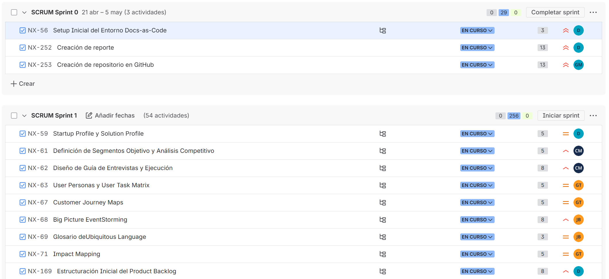
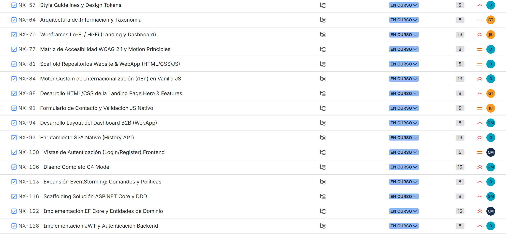
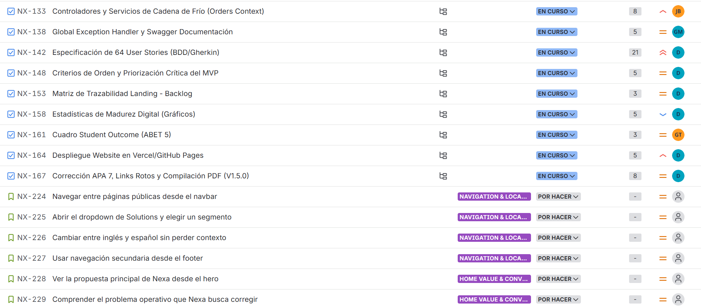
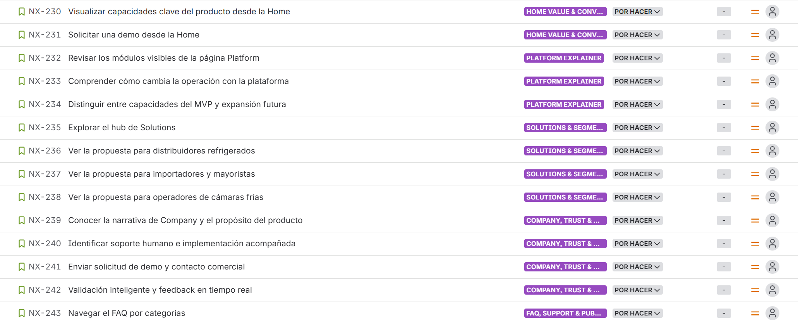
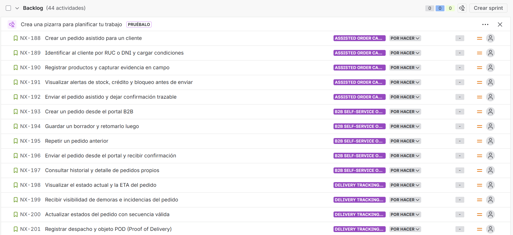
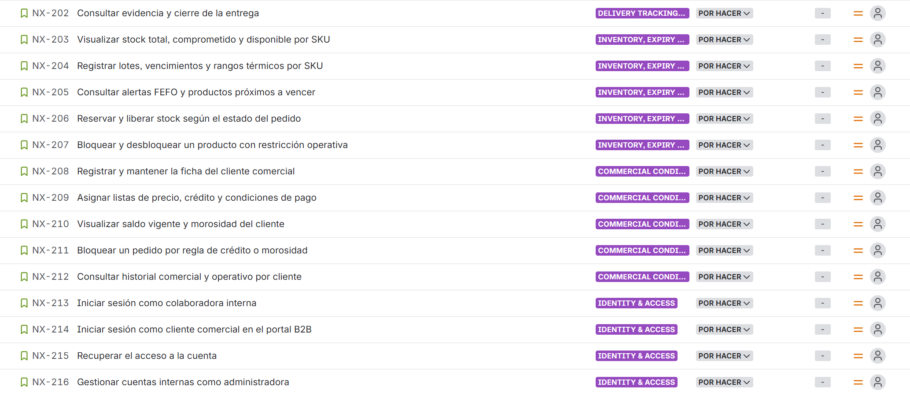
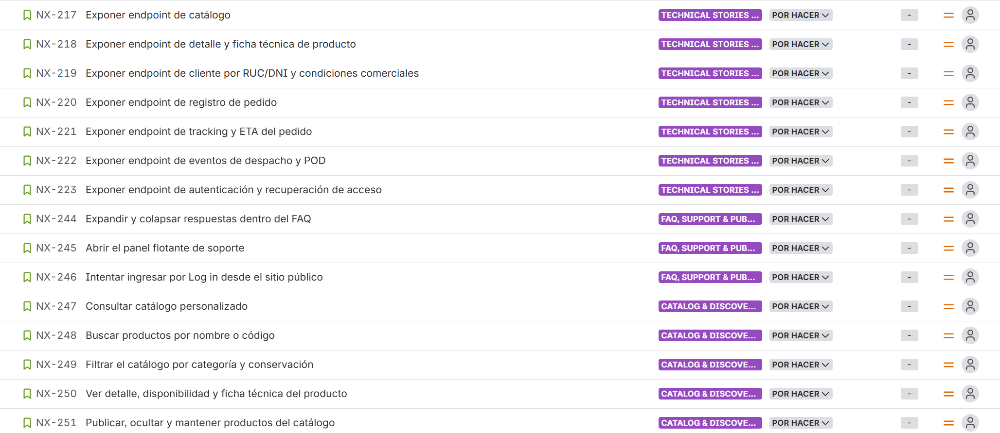

## 5.2. Landing Page, Services & Applications Implementation

Para AV1, la evidencia de implementación de Nexa debe concentrarse en el incremento que sí alcanzó un estado demostrable y defendible ante la rúbrica: <strong>Sprint 1</strong>. En esta iteración convergen la planificación en Jira, la consolidación del backlog, la producción de artefactos de diseño, la documentación arquitectónica y la construcción de la landing page pública desplegada. El tablero evidencia <strong>54 actividades</strong> y <strong>256 puntos visibles</strong>, distribuidos entre investigación, UX/UI, implementación pública, arquitectura y documentación; por ello, este sprint no puede leerse como un simple esfuerzo de maquetación, sino como el primer incremento formal del producto Nexa.

### 5.2.1. Sprint 1

El Sprint 1 concentra la entrega AV1 y constituye la base del incremento visible del proyecto. La salida funcional verificable es la landing page pública en GitHub Pages; sin embargo, la lectura ingenieril del sprint exige considerar también la coherencia entre backlog, diseño, arquitectura, trazabilidad documental y coordinación del equipo. Bajo esta lógica, la revisión del sprint no se limita a “qué página se publicó”, sino a <strong>qué sistema de trabajo permitió llegar a esa publicación sin perder consistencia con el problema, los segmentos y la evolución futura de la web application y los servicios</strong>.

#### 5.2.1.1. Sprint Planning 1.

La planificación del Sprint 1 se orientó a producir un incremento AV1 que pudiera exponerse de forma pública sin sacrificar profundidad técnica. El objetivo no fue desplegar todavía el portal transaccional completo, sino articular una primera capa visible del producto respaldada por investigación, diseño y arquitectura. La captura de Jira muestra un sprint cargado con trabajo concurrente en varios frentes, lo cual confirma una planificación por capas y no por tareas aisladas.

- **Sprint Goal:** Consolidar un incremento AV1 demostrable que conecte narrativa de negocio, backlog priorizado, artefactos de diseño, arquitectura de software y landing page pública desplegada.
- **Carga visible en Jira:** 54 actividades y 256 puntos visibles dentro del bloque planificado para la iteración.
- **Lectura del tablero:** coexistencia de ítems en `EN CURSO` y `POR HACER`, lo que evidencia trabajo asíncrono, reparto de frentes y seguimiento granular.
- **Resultado esperado del sprint:** dejar operativa la exposición pública del producto y, al mismo tiempo, preparar la base documental y técnica de la futura web application B2B y sus servicios REST.

#### 5.2.1.2. Aspect Leaders and Collaborators.

La ejecución del sprint evidencia una distribución funcional del liderazgo. En lugar de concentrar toda la iteración en un único perfil, el equipo repartió la responsabilidad entre dominio, diseño, arquitectura, documentación y construcción visible del sitio. Esta organización es consistente con el Student Outcome ABET 5 y explica por qué el incremento AV1 combina trabajo público demostrable con profundidad ingenieril.

| Aspecto del sprint | Liderazgo principal | Colaboradores clave | Resultado visible en AV1 |
|---|---|---|---|
| Orquestación del sprint, backlog y coherencia del incremento | **Yucra Sandoval, Diego Sebastian (Sprint Lead)** | César Marín, Gerard Rojas, Gino Torrejón | Priorización en Jira, consistencia del backlog y articulación entre alcance visible y trabajo técnico futuro |
| Consistencia editorial y narrativa del informe | **Marín Cueva, César Fernando** | Diego Yucra, Gino Torrejón | Capítulos alineados con la propuesta de valor, formato académico y trazabilidad documental |
| Arquitectura, configuración y convenciones de ingeniería | **Rojas Mancilla, Gerard Gianpier** | Diego Yucra | Gestión Docs-as-Code, convenciones de commits, modelo C4 y delimitación de la base técnica |
| Needfinding, síntesis del dominio e información estructural | **Torrejón De Los Santos, Gino Rodrigo** | Joaquín Verde, César Marín | Impact Mapping, EventStorming e Information Architecture conectados con dolores reales del dominio |
| Investigación de campo, UX/UI y artefactos de diseño centrados en el usuario | **Verde Bueno, Joaquín Francisco** | Gino Torrejón, Diego Yucra | Personas, journey maps, wireframes, mockups y soporte empírico para la priorización del MVP |

#### 5.2.1.3. Sprint Backlog 1.

La forma más clara de leer el Sprint Backlog 1 no es como una lista plana de tickets, sino como un conjunto de frentes coordinados que alimentan un mismo incremento. La agrupación siguiente resume la lógica real del sprint y explica por qué AV1 puede defenderse simultáneamente como entrega de producto, de diseño y de disciplina ingenieril.

Además, el Sprint Backlog 1 no puede analizarse aislado del <strong>Product Backlog documentado en la sección 3.3</strong>. Las capturas Jira verifican que la priorización descrita en el informe sí fue llevada a la herramienta de gestión: primero se ordenaron historias públicas y de validación comercial, luego se preservaron historias de arquitectura, documentación y preparación técnica futura. Por ello, la evidencia visual siguiente cumple una doble función: <strong>demuestra selección de trabajo para el sprint</strong> y <strong>verifica consistencia entre backlog académico y backlog operativo en Jira</strong>.

| Frente de trabajo | Issues visibles en las capturas Jira | Resultado esperado dentro del sprint |
|---|---|---|
| Fundamento de negocio e investigación | NX-59, NX-61, NX-62, NX-63, NX-67, NX-68, NX-69, NX-71, NX-169 | Consolidar startup profile, segmentos, entrevistas, personas, journeys, EventStorming y glosario para sostener el MVP con evidencia de dominio |
| Diseño visual e información | NX-57, NX-64, NX-70, NX-77 | Traducir la investigación en style guidelines, arquitectura de información, wireframes, mockups y criterios de accesibilidad |
| Sitio público y experiencia multipágina | NX-81, NX-84, NX-88, NX-91, NX-97, NX-100, NX-224 a NX-243 | Implementar Home, Platform, Solutions, Company y FAQ con narrativa coherente, CTA y soporte bilingüe EN/ES |
| Arquitectura y base técnica futura | NX-94, NX-106, NX-113, NX-116, NX-122, NX-128, NX-133, NX-138 | Dejar preparada la evolución hacia dashboard B2B, DDD, autenticación, servicios y documentación técnica |
| Trazabilidad académica y despliegue | NX-142, NX-148, NX-153, NX-158, NX-161, NX-164, NX-167 | Alinear user stories, priorización, Student Outcome, estadísticas, publicación del sitio y compilación del informe |

**Ilustración 42**

*Vista general del Sprint 1 cargado en Jira*

*Nota.* La vista general del tablero permite verificar el volumen de trabajo visible del incremento AV1 y su organización inicial antes de revisar los bloques específicos. Elaboración propia.

**Ilustración 43**

*Sprint 1 — bloque A de trabajo planificado en Jira*

*Nota.* El primer bloque del Sprint 1 muestra tareas de lineamientos visuales, arquitectura de información, wireframes, accesibilidad, scaffolding del sitio y componentes iniciales de frontend y backend. Elaboración propia.

**Ilustración 44**

*Sprint 1 — bloque B de trabajo planificado en Jira*

*Nota.* El segundo bloque evidencia continuidad entre especificación de user stories, priorización del MVP, despliegue del website y cierre documental de la entrega. Elaboración propia.

**Ilustración 45**

*Sprint 1 — bloque C de historias públicas dentro del sprint*

*Nota.* Este bloque agrupa historias del sitio público para Home, Platform, Solutions, Company y FAQ, todas asignadas al Sprint 1. Su presencia confirma que la experiencia pública forma parte directa del incremento AV1. Elaboración propia.

**Ilustración 46**

*Verificación del Product Backlog en Jira — bloque A*

*Nota.* Este primer bloque del backlog en Jira demuestra que las historias priorizadas para investigación, diseño y composición del MVP sí fueron registradas en la herramienta y no solo descritas en el informe. Elaboración propia.

**Ilustración 47**

*Verificación del Product Backlog en Jira — bloque B*

*Nota.* El segundo bloque confirma continuidad entre historias del sitio público, backlog técnico y evolución prevista hacia la web application autenticada. Elaboración propia.

**Ilustración 48**

*Verificación del Product Backlog en Jira — bloque C*

*Nota.* El tercer bloque permite contrastar la lógica de priorización del capítulo 3 con la evidencia viva de Jira, incluyendo historias orientadas a despliegue, trazabilidad académica y preparación de servicios futuros. Elaboración propia.

#### 5.2.1.4. Development Evidence for Sprint Review.

La evidencia de desarrollo del Sprint 1 se distribuye en cuatro capas verificables. La primera es el repositorio <strong>`nexa-report`</strong>, donde quedaron formalizados el problema, la especificación del backlog, la arquitectura y la narrativa académica del producto. La segunda es el repositorio <strong>`nexa-website`</strong>, que concentra la implementación real del sitio público. La tercera son los artefactos visuales preservados en el capítulo 4, donde se documentan lineamientos de estilo, arquitectura de información, wireframes y mockups. La cuarta es el tablero Jira, que da trazabilidad entre trabajo planificado, frentes de ejecución y alcance visible.

En conjunto, esta evidencia muestra que AV1 sí produjo desarrollo real: no solo existe una página publicada, sino un ecosistema de artefactos coherentes que conectan investigación, diseño, documentación y construcción. Esa articulación es importante porque reduce el riesgo de que la landing page sea una pieza aislada sin continuidad hacia la web application y los servicios futuros. En particular, el archivo Figma documentado en la sección 4.5 permite demostrar que el frente de <strong>Web Applications Design</strong> sí avanzó con mockups de dashboard, órdenes, inventario, despacho, FEFO, tracking y POD, aunque todavía no correspondan a software desplegado.

#### 5.2.1.5. Execution Evidence for Sprint Review.

La ejecución visible del sprint ya se materializa en una landing page pública operativa con navegación multipágina, selector bilingüe, CTA de demostración, páginas por segmento y un relato claro sobre inventario, pedidos, temperatura y entrega. Esta salida confirma que el equipo sí llevó una parte del producto hasta una instancia de exposición real, lo que permite validación comercial y revisión técnica de consistencia entre lo prometido y lo implementado.

Al mismo tiempo, la ejecución debe leerse con honestidad de alcance: el portal B2B autenticado, la captura transaccional de pedidos, el catálogo privado, la autenticación y el seguimiento operativo aún no forman parte del incremento desplegado. Su presencia en backlog y en arquitectura demuestra preparación, pero no debe confundirse con ejecución completada dentro de AV1.

#### 5.2.1.6. Services Documentation Evidence for Sprint Review.

La documentación de servicios en AV1 existe principalmente como <strong>evidencia de diseño y preparación técnica</strong>. El backlog ya incorpora historias de API y documentación (`NX-138`, además de las historias técnicas del bloque US58-US64), mientras que el capítulo 4 conserva la arquitectura DDD/C4, el diseño orientado a objetos y la base de datos que servirán de soporte a los futuros endpoints. Esta base es válida como sustento de ingeniería, porque muestra contratos previstos, separación de capas y reglas de negocio modeladas antes de implementar controladores productivos.

Sin embargo, la revisión del workspace y de los repositorios remotos declara una frontera clara: aunque ya existen los repositorios <strong>`nexa-webapp`</strong> y <strong>`nexa-platform`</strong> en GitHub, no se encontró en esta revisión evidencia verificable de Swagger/OpenAPI publicado, controladores expuestos ni endpoints en operación para presentar como prueba cerrada de servicios en AV1. Por tanto, esta subsección debe defenderse como <strong>documentación técnica preparada</strong>, no como servicio desplegado y documentado en producción.

#### 5.2.1.7. Software Deployment Evidence for Sprint Review.

La evidencia de despliegue de AV1 sí existe, pero está concentrada en el frente público. La siguiente tabla separa lo que ya es demostrable de lo que todavía permanece en fase preparatoria.

| Artefacto | Estado observable en AV1 | Evidencia |
|---|---|---|
| Landing page pública | **Desplegada y navegable** | [GitHub Pages](https://upc-pre-202610-1asi0730-12242-king.github.io/nexa-website/) |
| Repositorio documental | **Versionado y colaborativo** | [nexa-report](https://github.com/upc-pre-202610-1asi0730-12242-king/nexa-report) |
| Repositorio del sitio público | **Implementación visible del frontend público** | [nexa-website](https://github.com/upc-pre-202610-1asi0730-12242-king/nexa-website) |
| Web application autenticada | **Repositorio existente, sin evidencia de despliegue verificable en esta revisión** | [nexa-webapp](https://github.com/upc-pre-202610-1asi0730-12242-king/nexa-webapp) |
| Backend / servicios | **Repositorio existente, sin evidencia de API publicada o Swagger operativo en esta revisión** | [nexa-platform](https://github.com/upc-pre-202610-1asi0730-12242-king/nexa-platform) |

Esta lectura permite defender el despliegue con precisión: Nexa ya tiene una capa pública activa y demostrable, pero la capa transaccional aún debe presentarse como roadmap técnico respaldado por backlog y arquitectura, no como despliegue concluido.

#### 5.2.1.8. Team Collaboration Insights during Sprint.

El Sprint 1 revela un patrón de colaboración técnicamente sano: investigación y dominio por un lado, UX/UI e información por otro, implementación pública y despliegue por otro, y una capa transversal de arquitectura y documentación sosteniendo el conjunto. Esta organización permitió que el equipo avanzara en paralelo sin perder coherencia narrativa ni técnica, lo cual es especialmente valioso en AV1 porque el entregable combina secciones académicas, artefactos visuales y software visible.

La principal conclusión colaborativa del sprint es que Nexa no se construyó como un esfuerzo fragmentado entre “los que escriben” y “los que programan”. El incremento visible solo fue posible porque Jira, el reporte, el diseño y la landing page evolucionaron de manera sincronizada. Aun cuando persista backlog remanente para portal B2B, autenticación, inventario transaccional y servicios, el equipo deja en AV1 una base metodológica sólida, trazable y escalable para la siguiente iteración.

Esta subsección es, además, el lugar correcto para documentar <strong>llamadas grupales, revisiones internas del avance y coordinación síncrona del sprint</strong>. La narrativa breve debe quedar aquí, mientras que las capturas de Meet/Teams/Discord, conversaciones de coordinación, acuerdos de trabajo y evidencias cronológicas deben preservarse en el anexo del informe para no sobrecargar el cuerpo principal.

